# 内置数据类型

> **Section**: 6.2.2.6  
> **PDF Pages**: 879–890  

---

<!-- page 879 -->

```cpp
dataCopyParams.blockLen = m * n *sizeof(dstCO1_T) / ONE_BLK_SIZE;
        dataCopyParams.srcStride = 0;
        dataCopyParams.dstStride = 0;
        AscendC::DataCopy(cGM, ublocal, dataCopyParams);    }#else    __aicore__ inline void CopyOut()    {        AscendC::LocalTensor<AscendC::TensorTrait<dstCO1_T>> c1Local = outQueueCO1.DeQue<AscendC::TensorTrait<dstCO1_T>>();
        AscendC::FixpipeParamsV220 fixpipeParams;
        fixpipeParams.nSize = n;
        fixpipeParams.mSize = m;
        fixpipeParams.srcStride = m;
        fixpipeParams.dstStride = n;
        fixpipeParams.ndNum = 1;
        fixpipeParams.srcNdStride = 0;
        fixpipeParams.dstNdStride = 0;
        AscendC::Fixpipe(cGM, c1Local, fixpipeParams);
        outQueueCO1.FreeTensor(c1Local);    }#endifprivate:    AscendC::TPipe pipe;
    AscendC::TQue<AscendC::TPosition::A1, 1> inQueueA1;
    AscendC::TQue<AscendC::TPosition::A2, 1> inQueueA2;
    AscendC::TQue<AscendC::TPosition::B1, 1> inQueueB1;
    AscendC::TQue<AscendC::TPosition::B2, 1> inQueueB2;    // dst queue    AscendC::TQue<AscendC::TPosition::CO1, 1> outQueueCO1;
    AscendC::GlobalTensor<AscendC::TensorTrait<fmap_T>> aGM;
    AscendC::GlobalTensor<AscendC::TensorTrait<weight_T>> bGM;
    AscendC::GlobalTensor<AscendC::TensorTrait<dst_T>> cGM;
    uint16_t m, k, n;
    bool initl0, initl1;
    uint16_t aSize, bSize, cSize, b2Size;
    AscendC::MmadParams mmadParams;};extern "C" __global__ __aicore__ void cube_initconstvalue_simple_operator_half_16_32_16_true_false(    __gm__ uint8_t *a, __gm__ uint8_t *b, __gm__ uint8_t *c){    if ASCEND_IS_AIV {        return;    }    KernelMatmul<float, half, half, float, half> op(16, 32, 16, true, false);
    op.Init(a, b, c);
    op.Process();}
```

## 6.2.2.6 内置数据类型

数据类型列表

Ascend C提供b8~b64（8bit~64bit）四种不同位宽的数据类型，不同位宽对应的数据类型如下表所示。

表6-84不同位宽对应的数据类型

位宽数据类型

b8bool、int8_t、uint8_t、fp4x2_e2m1_t、fp4x2_e1m2_t、hifloat8_t、fp8_e5m2_t、fp8_e4m3fn_t、fp8_e8m0_t、int4x2_t。

b16int16_t、uint16_t、half、bfloat16_t。

<!-- page 880 -->

位宽数据类型

b32int32_t、uint32_t、float、complex32。

b64int64_t、uint64_t、double、complex64。

为了方便描述这些数据类型，提供如下的数据类型简写：

数据类型简写（位宽从低到高）对应数据类型

S4int4b_t

U8uint8_t

S8int8_t

U16uint16_t

S16int16_t

U32uint32_t

S32int32_t

U64uint64_t

S64int64_t

FP8_E4M3fp8_e4m3fn_t

HiF8hifloat8_t

FP16half

BF16bfloat16_t

FP32float

说明

其中，只有bool、int8_t、uint8_t、int16_t、uint16_t、half、int32_t、uint32_t、float、int64_t、uint64_t这些数据类型支持使用立即数进行赋值和初始化。

示例：

```cpp
int8_t scalar = 1;int32_t valueOut = AscendC::Cast<float, int32_t, AscendC::RoundMode::CAST_ROUND>((float)1);
```

<!-- page 881 -->

数据类型的产品支持情况

产品支持的数据类型

Atlas 350 加速卡bool、int8_t、uint8_t、fp4x2_e2m1_t、fp4x2_e1m2_t、hifloat8_t、fp8_e5m2_t、fp8_e4m3fn_t、fp8_e8m0_t、int4x2_t、int16_t、uint16_t、half、bfloat16_t、int32_t、uint32_t、float、complex32、int64_t、uint64_t、double、complex64。

Atlas A3 训练系列产品/Atlas A3 推理系列产品

int8_t、uint8_t、int16_t、uint16_t、int32_t、uint32_t、int64_t、uint64_t、half、bfloat16_t、float、double。

Atlas A2 训练系列产品/Atlas A2 推理系列产品

int8_t、uint8_t、int16_t、uint16_t、int32_t、uint32_t、int64_t、uint64_t、half、bfloat16_t、float、double。

Atlas 200I/500 A2 推理产品int8_t、uint8_t、int16_t、uint16_t、int32_t、uint32_t、int64_t、uint64_t、half、float、double。

Atlas 推理系列产品AI Coreint8_t、uint8_t、int16_t、uint16_t、int32_t、uint32_t、int64_t、uint64_t、half、float、double。

Atlas 推理系列产品Vector Coreint8_t、uint8_t、int16_t、uint16_t、int32_t、uint32_t、int64_t、uint64_t、half、float、double。

Atlas 训练系列产品int8_t、uint8_t、int16_t、uint16_t、int32_t、uint32_t、int64_t、uint64_t、half、float、double。

布尔型

bool类型占8比特，全0时代表false，否则代表true。

整数

整数由符号位（S）和数值部分（M）组成，不同类型的整数在符号位和数值部分的比特分配上有所不同。无符号整数没有符号位，所有比特均用于表示数值。

下图是一个int8_t类型的示例，其符号位占用1位，数值部分占用7位。Sv=1，Mv = 25

+ 26，表示的结果为96。下标v表示符号位和数值部分的具体数值。

<!-- page 882 -->

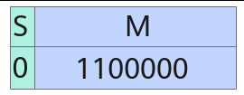

整数数据类型取值范围见下表。

表6-85整数数据类型取值范围

类型取值范围

int4x2_t（int4b_t）[-8, 7]

int8_t[-128, 127]

uint8_t[0, 255]

int16_t[-32768, 32767]

uint16_t[0, 65535]

int32_t[-2147483648, 2147483647]

uint32_t[0, 4294967295]

int64_t[-9223372036854775808, 9223372036854775807]

uint64_t[0,18446744073709551615]

说明

int4x2_t数据类型会将两个独立的四位整形数打包为一个8比特存储单元。

浮点数

浮点数数据类型的取值范围如下表所示。

表6-86浮点数据类型

类型符号位宽

指数位宽尾数位宽

取值范围

fp4x2_e2m1_t121[-6, 6]

fp4x2_e1m2_t112[-7 * 2-2, 7 * 2-2]

fp8_e8m0_t180[2-127, 2-127]

fp8_e5m2_t152[213 - 216, 216 - 213]

fp8_e4m3fn_t143[26 - 29, 29 - 26]

<!-- page 883 -->

类型符号位宽

指数位宽尾数位宽

取值范围

half1510[25 - 216, 216 - 25]

bfloat16_t187[2120 - 2128, 2128 - 2120]

float1823[2104 - 2128, 2128 - 2104]

double11152[2971 - 21024, 21024 - 2971]

说明

fp4x2_e2m1_t和fp4x2_e1m2_t数据类型会将两个独立的四位浮点数打包为一个8比特存储单元。

浮点数由符号位（S）、指数（E）、尾数（M）三个部分组成，不同类型的浮点数，三个部分所占的比特数可能不同。

●fp4x2_e2m1_t

下图是一个fp4x2_e2m1_t类型的示例，其符号位占用1位，指数位占用2位，尾数位占用1位。

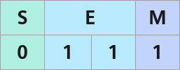

●fp4x2_e1m2_t

下图是一个fp4x2_e1m2_t类型的示例，其符号位占用1位，指数位占用1位，尾数位占用2位。

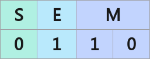

●fp8_e8m0_t（fp8_e8m0_t二进制由bfloat16类型舍弃符号位，小数位得到）

下图是一个fp8_e8m0_t类型的示例，其符号位占用1位，指数位占用8位，尾数位占用0位。


●fp8_e5m2_t

下图是一个fp8_e5m2_t类型的示例，其符号位占用1位，指数占用5位，尾数占用2位，表示的结果为 (-1)^0 × (2 - 0.25) × 2^(30 -15)=1.75 × 2^15。

<!-- page 884 -->

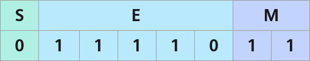

fp8_e5m2_t的特殊值bit位表示如下：

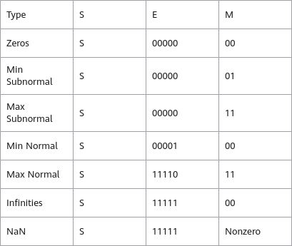

●fp8_e4m3fn_t

下图是一个fp8_e4m3fn_t类型的示例，其符号位占用1位，指数占用4位，尾数占用3位，表示的结果为 (-1)^1 × 2^-3 × 2^-6。

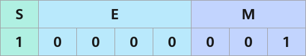

fp8_e4m3fn_t的特殊值bit位表示如下：

<!-- page 885 -->

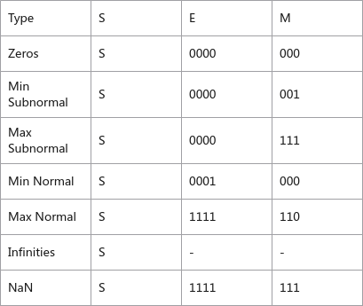

●hifloat8_t

hifloat8_t类型相对其他类型增加了指数位宽控制字段D，用于指示指数位和尾数位的编码方式。

hifloat8_t类型根据点域的不同，有不同的编码方式，下面一一列出。符号、指数和尾数分别缩写成‘S’，‘E’和‘M’。

<!-- page 886 -->

图6-2 S、E、M 在不同点域D 值下的bit 位分布

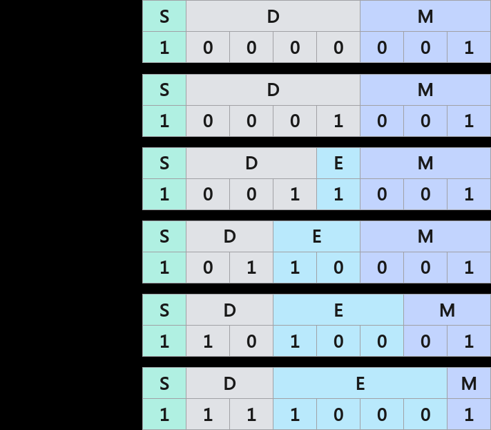

下图示例中，其符号位占用1位，指数占用2位，尾数占用3位，D字段为2比特b01，Sv=1，Ev=3，Mv = 2-1 + 2-2，表示的结果为14。下标v表示各部分的具体数值。

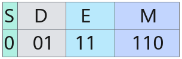

hifloat8_t类型的取值范围如下表所示：

<!-- page 887 -->

表6-87 hifloat8_t 类型取值范围

指数位宽控制字段位宽

尾数位宽

指数位宽控制字段取值

符号取值范围（Sv）

指数取值范围（Ev）

尾数取值范围（Mv）

取值范围计算公式

符号位宽

指数位宽

14034'b0000

±1-[0, 7]Sv * 2Mv -

23

14034'b0001

±10[0, 7 *2-3]

Sv * 2Ev *(1 + Mv)

13134'b001±1±1[0, 7 *2-3]

12232'b01±1±[2, 3][0, 7 *2-3]

12322'b10±1±[4, 7][0, 3 *2-2]

12412'b11±1±[8, 15][0, 2-1]

hifloat8_t特殊值bit位表示如下：

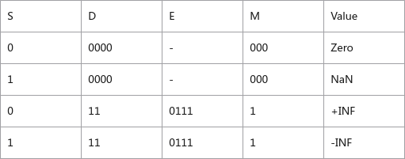

hifloat8_t数据类型计算公式如下：

–符号位Sv

s_bit_val为1表示负数，s_bit_val为0表示非负数。


–指数位Ev

由Es、Em组成。

<!-- page 888 -->

表6-88不同D 域值，Es，Em bit 大小不同

**D 值Es 值范围Em 值范围**

3b0010-1-

2b010-110~11

2b100-1100~111

2b110-11000~1111

es_bit_val值表示E的最高位，用于计算Ev的符号值，例如E为0b1100，则es_bit_val值为最高位1，例如E为0b011，则es_bit_val为最高位0。

Es计算公式：


Em计算公式如下，Emi表示Em每个bit位的值（0或1），D表示点域值，参考表6-88。


Ev计算公式：


Mv计算公式，M表示位数值，bitwidth of M表示M的bit宽度大小，参考表6-88。


–在Normal和Subnormal模式下，浮点数的取值计算公式不同：

Normal模式：由Sv、Ev、Mv组成。


Subnormal模式，由Sv、Mv组成。


●half

下图是一个half类型的示例，其符号位占用1位，指数占用5位，尾数占用10位。Sv=1，Ev=15，Mv = 2-1 + 2-2，表示的结果为1.75。下标v表示各部分的具体数值。

<!-- page 889 -->

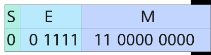

half特殊值bit位表示如下：

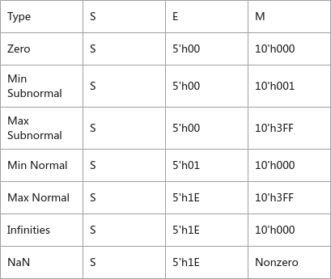

●bfloat16_t

下图是一个bfloat16_t数据类型的示例，其符号位占用1位，指数占用8位，尾数占用7位。

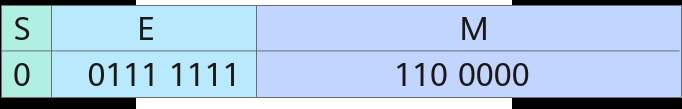

bfloat16_t特殊值bit位表示如下：

<!-- page 890 -->

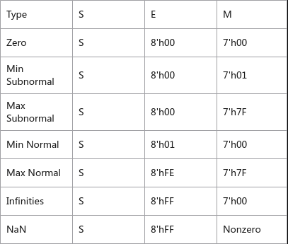

●float

下图是一个float类型的示例，其符号位占用1位，指数占用8位，尾数占用23位。

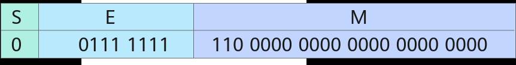

float特殊值bit位表示如下：

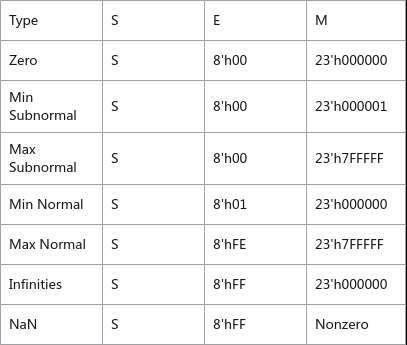

