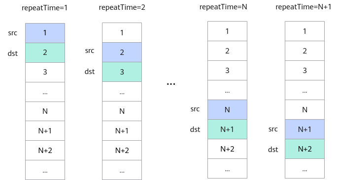

# 基础数据结构

> **Section**: 6.2.2  
> **PDF Pages**: 811–890  

---

<!-- page 811 -->

存储单元对齐要求

L0C Buffer64Byte对齐。

BiasTable Buffer64Byte对齐。

Fixpipe Buffer64Byte对齐。

通用地址重叠约束

使用基础API的Tensor高维切分计算接口时，为了节省地址空间，开发者可以定义一个Tensor，供源操作数与目的操作数同时使用（即地址重叠）。使用时需要注意以下约束：

●单次迭代内：源操作数与目的操作数必须100%完全重叠，不支持部分重叠。

●多次迭代间：不支持前序迭代的目的操作数与后序迭代的源操作数重叠。例如，第N次迭代的目的操作数是第N+1次的源操作数（如下图所示）。在这种情况下，第N次迭代可能会改写覆盖源操作数的数值，导致无法得到预期结果。特别地，对于部分双目计算类的API（Add、Sub、Mul、Max、Min、AddRelu、SubRelu），当数据类型为half、int32_t、float时，支持前序迭代的目的操作数与后序迭代的源操作数重叠：仅针对目的操作数和第二个源操作数重叠的情况，且src1RepStride或者dstRepStride必须为0。

图6-1地址重叠示例（不支持）

说明

本节所述地址重叠通用约束适用于一般情况，API参考中如有额外特殊说明的，则以具体API中的说明为准。

API中没有描述地址重叠约束的，视为不支持Tensor高维切分计算的地址重叠，地址重叠时计算结果可能不满足预期。

## 6.2.2 基础数据结构

