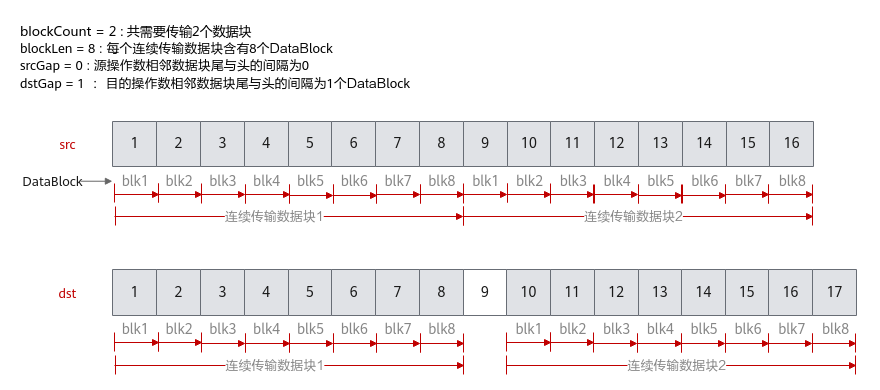
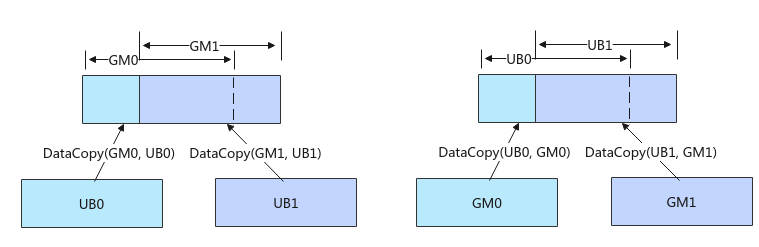

# 基础数据搬运

> **Section**: 6.2.3.1.1.2  
> **PDF Pages**: 892–901  

---

<!-- page 892 -->

**GlobalMemory -> LocalMemory**

**LocalMemory -> LocalMemory**

功能描述LocalMemory ->GlobalMemory

√√×

切片数据

支持数据的切片搬运，提取多维Tensor数据的子集进行搬运。

搬运

支持在数据搬运时进行ND到NZ格式的转换。

×√√

随路转换

**ND2NZ**

搬运

支持在数据搬运时进行NZ到ND格式的转换。

√××

随路转换

**NZ2ND**

搬运

支持在数据搬运时进行DN到NZ格式的转换。

×√×

随路转换

**DN2NZ**

搬运

√×√

随路量化激活搬运

支持在数据搬运过程中进行量化和Relu激活等操作，同时支持LocalMemory到Global Memory通路NZ到ND格式的转换。

×√×

多维数据

多维数据搬运接口，相比于基础数据搬运接口，可更加自由配置搬入的维度信息以及对应的Stride。

搬运

## 6.2.3.1.1.2 基础数据搬运

产品支持情况

产品是否支持

是否支持

源操作数和目的

源操作数和目的

操作数

操作数

数据类型一致的

数据类型不一致

原型

的原型

Atlas 350 加速卡√√

Atlas A3 训练系列产品/Atlas A3 推理系列产品

√√

Atlas A2 训练系列产品/Atlas A2 推理系列产品

√√

Atlas 200I/500 A2 推理产品√x

<!-- page 893 -->

是否支持

产品是否支持

源操作数和目的

源操作数和目的

操作数

操作数

数据类型不一致

数据类型一致的

原型

的原型

Atlas 推理系列产品AI Core√x

Atlas 推理系列产品Vector Core√x

Atlas 训练系列产品√x

功能说明

提供基础的数据搬运能力，数据在传输过程中保持原始格式和内容不变，支持连续和非连续的数据搬运。

函数原型

●Global Memory -> Local Memory// 连续搬运template <typename T>__aicore__ inline void DataCopy(const LocalTensor<T>& dst, const GlobalTensor<T>& src, const uint32_t count)

// 同时支持非连续搬运和连续搬运template <typename T>__aicore__ inline void DataCopy(const LocalTensor<T>& dst, const GlobalTensor<T>& src, const DataCopyParams& repeatParams)

●Local Memory -> Local Memory// 连续搬运template <typename T>__aicore__ inline void DataCopy(const LocalTensor<T>& dst, const LocalTensor<T>& src, const uint32_t count)

// 同时支持非连续搬运和连续搬运template <typename T>__aicore__ inline void DataCopy(const LocalTensor<T>& dst, const LocalTensor<T>& src, const DataCopyParams& repeatParams)

●Local Memory -> Global Memory// 连续搬运template <typename T>__aicore__ inline void DataCopy(const GlobalTensor<T>& dst, const LocalTensor<T>& src, const uint32_t count)

// 同时支持非连续搬运和连续搬运template <typename T>__aicore__ inline void DataCopy(const GlobalTensor<T>& dst, const LocalTensor<T>& src, const DataCopyParams& repeatParams)

●Local Memory -> Local Memory，支持源操作数和目的操作数数据类型不一致// 同时支持非连续搬运和连续搬运template <typename T, typename U>__aicore__ inline void DataCopy(const LocalTensor<T>& dst, const LocalTensor<U>& src, const DataCopyParams& repeatParams)

说明

各原型支持的具体数据通路和数据类型，请参考支持的通路和数据类型。

<!-- page 894 -->

参数说明

表6-89模板参数说明

参数名描述

T、U操作数的数据类型。支持的数据类型请参考支持的通路和数据类型。

表6-90参数说明

参数名输入/输出

含义

dst输出目的操作数，类型为LocalTensor或GlobalTensor。

LocalTensor位于C2时，起始地址要求64B对齐；LocalTensor位于C2PIPE2GM时，起始地址要求128B对齐；其他情况均要求32字节对齐。

GlobalTensor的起始地址要求按照对应数据类型所占字节数对齐。

src输入源操作数，类型为LocalTensor或GlobalTensor。

LocalTensor的起始地址要求32字节对齐。

GlobalTensor的起始地址要求按照对应数据类型所占字节数对齐。

repeatParams

输入搬运参数，DataCopyParams类型。通过该参数可配置搬运的数据块大小、个数、间隔等信息，同时支持非连续和连续搬运。

具体定义请参考${INSTALL_DIR}/include/ascendc/basic_api/interface/kernel_struct_data_copy.h，${INSTALL_DIR}请替换为CANN软件安装后文件存储路径。

count输入参与搬运的元素个数。

说明

count * sizeof(T)需要32字节对齐，若不对齐，搬运量将对32字节做向下取整。

表6-91 DataCopyParams 结构体参数定义

参数名称含义

blockCount

待搬运的连续传输数据块个数。uint16_t类型，取值范围：blockCount∈[1, 4095]。

<!-- page 895 -->

参数名称含义

blockLen待搬运的每个连续传输数据块长度，单位为DataBlock（32字节）。uint16_t类型，取值范围：blockLen∈[1, 65535]。

特殊情况：

●当dst位于C2PIPE2GM时，单位为128B。

●一般情况：当dst位于C2时，表示源操作数的连续传输数据块长度，单位为64B。针对Atlas 350 加速卡，当dst位于C2时，表示源操作数的连续传输数据长度，单位为32B。

srcGap源操作数相邻连续数据块的间隔（前面一个数据块的尾与后面数据块的头的间隔），单位为DataBlock（32字节）。uint16_t类型，srcGap不要超出该数据类型的取值范围。

在L1 Buffer -> Fixpipe Buffer场景中，srcGap特指源操作数相邻连续数据块的间隔（前面一个数据块的头与后面数据块的头的间隔），单位为DataBlock（32字节）。uint16_t类型，srcGap不要超出该数据类型的取值范围。

dstGap目的操作数相邻连续数据块间的间隔（前面一个数据块的尾与后面数据块的头的间隔），单位为DataBlock（32字节）。uint16_t类型，dstGap不要超出该数据类型的取值范围。

特殊情况：

●当dst位于C2PIPE2GM时，单位为128B。

●一般情况：当dst位于C2时，表示源操作数的连续传输数据块长度，单位为64B。针对Atlas 350 加速卡，当dst位于C2时，表示源操作数的连续传输数据长度，单位为32B。

在L1 Buffer -> Fixpipe Buffer场景中，dstGap特指源操作数相邻连续数据块的间隔（前面一个数据块的头与后面数据块的头的间隔），单位为DataBlock（32字节）。uint16_t类型，dstGap不要超出该数据类型的取值范围。

下面的样例呈现了DataCopyParams结构体参数的使用方法，样例中完成了2个连续传输数据块的搬运，每个数据块含有8个DataBlock，源操作数相邻数据块之间无间隔，目的操作数相邻数据块尾与头之间间隔1个DataBlock。

<!-- page 896 -->

返回值说明

无

约束说明

●如果需要执行多个DataCopy指令，且DataCopy的目的地址存在重叠，需要通过调用 PipeBarrier(ISASI)来插入同步指令，保证多个DataCopy指令的串行化，防止出现异常数据。如下图左侧示意图，执行两个DataCopy指令，搬运的目的GM地址存在重叠，两条搬运指令之间需要通过调用PipeBarrier<PIPE_MTE3>()添加MTE3搬出流水的同步；如下图右侧示意图所示，搬运的目的地址Unified Buffer存在重叠，两条搬运指令之间需要调用PipeBarrier<PIPE_MTE2>()添加MTE2搬入流水的同步。

●针对如下产品型号：

Atlas A2 训练系列产品/Atlas A2 推理系列产品

Atlas A3 训练系列产品/Atlas A3 推理系列产品

在跨卡通信算子开发场景，DataCopy类接口支持跨卡数据搬运，仅支持HCCS物理链路，不支持其他通路；开发者开发过程中，需要关注涉及卡间通信的物理通路，可通过npu-smi info -t topo命令查询HCCS物理链路。

●针对Atlas 350 加速卡，在UB -> L1 Buffer的数据搬运时，可以通过配置编译选项ENABLE_CV_COMM_VIA_SSBUF来选择两种搬运通路，当ENABLE_CV_COMM_VIA_SSBUF配置为true时，使用SSBuffer进行通信，数据通过UB->L1 Buffer之间的硬件通道进行搬运（推荐）；当ENABLE_CV_COMM_VIA_SSBUF为false时，数据搬运到L1 Buffer经过GM，该场景下需要借助Matmul高阶API进行注册操作。

支持的通路和数据类型

下文的数据通路均通过逻辑位置TPosition来表达，并注明了对应的物理通路。TPosition与物理内存的映射关系见表6-48。

<!-- page 897 -->

表6-92 Global Memory -> Local Memory 具体通路和支持的数据类型

产品型号数据通路源操作数和目的操作数的数据类型（两者保持一致）

int8_t、uint8_t、int16_t、uint16_t、int32_t、uint32_t、int64_t、 uint64_t、half、float、double

Atlas 训练系列产品

●GM -> VECIN（GM -> UB ）

●GM -> A1、B1（GM -> L1Buffer ）

Atlas 推理系列产品AI Core

int8_t、uint8_t、int16_t、uint16_t、int32_t、uint32_t、int64_t、 uint64_t、half、float、double

●GM -> VECIN（GM -> UB ）

●GM -> A1、B1（GM -> L1Buffer ）

Atlas 推理系列产品Vector Core

int8_t、uint8_t、int16_t、uint16_t、int32_t、uint32_t、int64_t、 uint64_t、half、float、double

●GM -> VECIN（GM -> UB ）

Atlas A2 训练系列产品/Atlas A2推理系列产品

int8_t、uint8_t、int16_t、uint16_t、int32_t、uint32_t、int64_t、 uint64_t、half、bfloat16_t、float、double

●GM -> VECIN（GM -> UB ）

●GM -> A1、B1、C1（GM -> L1Buffer ）

Atlas A3 训练系列产品/Atlas A3推理系列产品

int8_t、uint8_t、int16_t、uint16_t、int32_t、uint32_t、int64_t、 uint64_t、half、bfloat16_t、float、double

●GM -> VECIN（GM -> UB ）

●GM -> A1、B1、C1（GM -> L1Buffer ）

Atlas 200I/500A2 推理产品

int8_t、uint8_t、int16_t、uint16_t、int32_t、uint32_t、int64_t、 uint64_t、half、bfloat16_t、float、double

●GM -> VECIN（GM -> UB ）

Atlas 350 加速卡

b8、b16、b32、b64

●GM -> VECIN（GM -> UB ）

●GM -> A1、B1、C1（GM -> L1Buffer ）

<!-- page 898 -->

表6-93 Local Memory -> Local Memory 具体通路和支持的数据类型

产品型号数据通路源操作数和目的操作数的数据类型（两者保持一致）

Atlas 350 加速卡●VECIN ->VECCALC或VECCALC ->VECOUT（UB-> UB）

bool、int8_t、uint8_t、hifloat8_t、fp8_e5m2_t、fp8_e4m3fn_t、fp8_e8m0_t、int16_t、uint16_t、half、bfloat16_t、int32_t、uint32_t、float、complex32、int64_t、uint64_t、double、complex64

●VECIN、VECCALC、VECOUT ->TSCM（UB ->L1 Buffer）

●A1、B1、C1 ->C2PIPE2GM（L1 Buffer ->FixpipeBuffer）

half、bfloat16_t、int32_t、float

●C1 -> C2（L1Buffer ->BiasTableBuffer）

int8_t、uint8_t、int16_t、uint16_t、int32_t、uint32_t、int64_t、 uint64_t、half、float、double

Atlas 训练系列产品

●VECIN ->VECCALC或VECCALC ->VECOUT（UB-> UB）

Atlas 推理系列产品AI Core

int8_t、uint8_t、int16_t、uint16_t、int32_t、uint32_t、int64_t、 uint64_t、half、float、double

●VECIN ->VECCALC或VECCALC ->VECOUT（UB-> UB）

●VECIN、VECCALC、VECOUT ->A1、B1（UB -> L1 Buffer）

<!-- page 899 -->

产品型号数据通路源操作数和目的操作数的数据类型（两者保持一致）

Atlas A2 训练系列产品/Atlas A2 推理系列产品

int8_t、uint8_t、int16_t、uint16_t、int32_t、uint32_t、int64_t、 uint64_t、half、bfloat16_t、float、double

●VECIN ->VECCALC或VECCALC->VECOUT（UB-> UB）

●VECIN、VECCALC、VECOUT ->TSCM（UB ->L1 Buffer）

●A1、B1、C1->C2PIPE2GM（L1 Buffer ->FixpipeBuffer）

int32_t、float

●C1 -> C2（L1Buffer ->BiasTableBuffer）

Atlas A3 训练系列产品/Atlas A3 推理系列产品

int8_t、uint8_t、int16_t、uint16_t、int32_t、uint32_t、int64_t、 uint64_t、half、bfloat16_t、float、double

●VECIN ->VECCALC或VECCALC->VECOUT（UB-> UB）

●VECIN、VECCALC、VECOUT ->TSCM（UB ->L1 Buffer）

●A1、B1、C1->C2PIPE2GM（L1 Buffer ->FixpipeBuffer）

int32_t、float

●C1 -> C2（L1Buffer ->BiasTableBuffer）

<!-- page 900 -->

表6-94 Local Memory -> Global Memory 具体通路和支持的数据类型

产品型号数据通路源操作数和目的操作数的数据类型（两者保持一致）

int8_t、uint8_t、int16_t、uint16_t、int32_t、uint32_t、int64_t、 uint64_t、half、float、double

Atlas 训练系列产品

●VECOUT ->GM（UB ->GM）

Atlas 推理系列产品AI Core

int8_t、uint8_t、int16_t、uint16_t、int32_t、uint32_t、int64_t、 uint64_t、half、float、double

●VECOUT、CO2-> GM（UB ->GM）

Atlas 推理系列产品Vector Core

int8_t、uint8_t、int16_t、uint16_t、int32_t、uint32_t、int64_t、 uint64_t、half、float、double

●VECOUT ->GM（UB ->GM）

Atlas A2 训练系列产品/Atlas A2 推理系列产品

int8_t、uint8_t、int16_t、uint16_t、int32_t、uint32_t、int64_t、 uint64_t、half、bfloat16_t、float、double

●VECOUT ->GM（UB ->GM）

●A1、B1 -> GM（L1 Buffer ->GM）

Atlas A3 训练系列产品/Atlas A3 推理系列产品

int8_t、uint8_t、int16_t、uint16_t、int32_t、uint32_t、int64_t、 uint64_t、half、bfloat16_t、float、double

●VECOUT ->GM（UB ->GM）

●A1、B1 -> GM（L1 Buffer ->GM）

Atlas 200I/500 A2推理产品

int8_t、uint8_t、int16_t、uint16_t、int32_t、uint32_t、int64_t、 uint64_t、half、bfloat16_t、float、double

●VECOUT ->GM（UB ->GM）

Atlas 350 加速卡●VECOUT ->GM（UB ->GM）

b8、b16、b32、b64

表6-95 Local Memory -> Local Memory 具体通路和支持的数据类型（支持源操作数和目的操作数的数据类型不一致）

产品型号数据通路源操作数的数据类型

目的操作数的数据类型

Atlas 350 加速卡C1 -> C2（L1Buffer ->BiasTableBuffer）

bfloat16_t、half

float

<!-- page 901 -->

产品型号数据通路源操作数的数据类型

目的操作数的数据类型

C1 -> C2（L1Buffer ->BiasTableBuffer）

halffloat

Atlas A2 训练系列产品/Atlas A2 推理系列产品

C1 -> C2（L1Buffer ->BiasTableBuffer）

halffloat

Atlas A3 训练系列产品/Atlas A3 推理系列产品

调用示例

●Global Memory -> Local Memory// srcLocal为half类型的LocalTensor，srcGlobal为half类型的GlobalTensor// 使用传入count参数的搬运接口，完成连续搬运AscendC::DataCopy(srcLocal, srcGlobal, 512);// 使用传入DataCopyParams参数的搬运接口，支持连续和非连续搬运DataCopyParams intriParams;intriParams.blockCount = 1; // 连续数据块个数为1intriParams.blockLen = 512 * sizeof(half) / 32; // 连续数据块长度，单位为DataBlock，此处长度为512个half元素intriParams.srcGap = 0; // 源操作数做连续搬运intriParams.dstGap = 0; // 目的操作数连续排布AscendC::DataCopy(srcLocal, srcGlobal, intriParams);

●Local Memory -> Local Memory// srcLocal、dstLocal为half类型的LocalTensor// 使用传入count参数的搬运接口，完成连续搬运AscendC::DataCopy(dstLocal, srcLocal, 512);// 使用传入DataCopyParams参数的搬运接口，支持连续和非连续搬运DataCopyParams intriParams;intriParams.blockCount = 1; // 连续数据块个数为1intriParams.blockLen = 512 * sizeof(half) / 32; // 连续数据块长度，单位为DataBlock，此处长度为512个half元素intriParams.srcGap = 0; // 源操作数做连续搬运intriParams.dstGap = 0; // 目的操作数连续排布AscendC::DataCopy(dstLocal, srcLocal, intriParams);

●Local Memory -> Global Memory// dstLocal为half类型的LocalTensor，dstGlobal为half类型的GlobalTensor// 使用传入count参数的搬运接口，完成连续搬运AscendC::DataCopy(dstGlobal, dstLocal, 512);// 使用传入DataCopyParams参数的搬运接口，支持连续和非连续搬运DataCopyParams intriParams;intriParams.blockCount = 1; // 连续数据块个数为1intriParams.blockLen = 512 * sizeof(half) / 32; // 连续数据块长度，单位为DataBlock，此处长度为512个half元素intriParams.srcGap = 0; // 源操作数做连续搬运intriParams.dstGap = 0; // 目的操作数连续排布AscendC::DataCopy(dstGlobal, dstLocal, intriParams);

结果示例：输入数据srcGlobal：[1 2 3 ... 512]输出数据dstGlobal：[1 2 3 ... 512]
