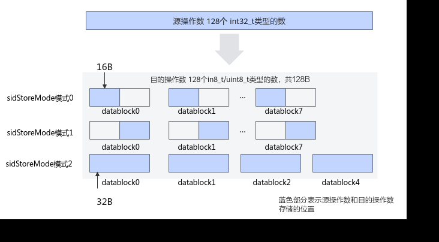

# 增强数据搬运

> **Section**: 6.2.3.1.1.3  
> **PDF Pages**: 902–911  

---

<!-- page 902 -->

## 6.2.3.1.1.3 增强数据搬运

产品支持情况

说明

增强数据搬运功能仅在Atlas 推理系列产品AI Core产品型号的CO1 -> CO2（L0C Buffer ->UB）通路支持。其他型号和其他通路写明支持的情况，是指支持接口调用但增强数据搬运不生效，功能等同于基础数据搬运。

是否支持

产品是否支持

源操作数和目的

源操作数和目的操

作数

操作数

类型不一致的原

类型一致的原型

型

Atlas 350 加速卡√x

Atlas A3 训练系列产品/Atlas A3 推理系列产品

√x

Atlas A2 训练系列产品/Atlas A2 推理系列产品

√x

Atlas 200I/500 A2 推理产品√x

Atlas 推理系列产品AI Core√√

Atlas 推理系列产品Vector Core√x

Atlas 训练系列产品√x

功能说明

对数据搬运能力进行增强，相比于基础数据搬运接口，增加了CO1->CO2通路的随路计算。

函数原型

●Global Memory -> Local Memorytemplate <typename T>__aicore__ inline void DataCopy(const LocalTensor<T>& dst, const GlobalTensor<T>& src, const DataCopyParams& intriParams, const DataCopyEnhancedParams& enhancedParams)

●Local Memory -> Local Memorytemplate <typename T>__aicore__ inline void DataCopy(const LocalTensor<T>& dst, const LocalTensor<T>& src, const DataCopyParams& intriParams, const DataCopyEnhancedParams& enhancedParams)

●Local Memory -> Global Memorytemplate <typename T>__aicore__ inline void DataCopy(const GlobalTensor<T>& dst, const LocalTensor<T>& src, const DataCopyParams& intriParams, const DataCopyEnhancedParams& enhancedParams)

●Local Memory -> Local Memory，支持源操作数和目的操作数类型不一致template <typename T, typename U>__aicore__ inline void DataCopy(const LocalTensor<T>& dst, const LocalTensor<U>& src, const DataCopyParams& intriParams, const DataCopyEnhancedParams& enhancedParams)

<!-- page 903 -->

说明

各原型支持的具体数据通路和数据类型，请参考支持的通路和数据类型。

参数说明

表6-96模板参数说明

参数名描述

T、U操作数的数据类型。支持的数据类型请参考支持的通路和数据类型。

表6-97参数说明

参数名称输入/输出

含义

dst输出目的操作数，类型为LocalTensor或GlobalTensor。

src输入源操作数，类型为LocalTensor或GlobalTensor。

intriParams

输入搬运参数。DataCopyParams类型。

enhancedParams

输入增强信息参数。DataCopyEnhancedParams类型。

具体定义请参考${INSTALL_DIR}/include/ascendc/basic_api/interface/kernel_struct_data_copy.h，${INSTALL_DIR}请替换为CANN软件安装后文件存储路径。

表6-98 DataCopyEnhancedParams 结构参数说明

参数名称含义

blockMode数据搬移基本分形，BlockMode枚举类型，支持以下配置：

●BLOCK_MODE_NORMAL：表示传输单位为32B。当前暂不支持。

●BLOCK_MODE_MATRIX：表示传输单位为一个16 * 16的cube分形。

●BLOCK_MODE_VECTOR：表示传输单位为一个1 * 16的cube分形。

●BLOCK_MODE_SMALL_CHANNEL：表示传输单位为一个16 * 4的cube分形。当前暂不支持。

●BLOCK_MODE_DEPTHWISE：表示传输单位为一个16 * 16的cube分形，提供随路channel-split功能。当前暂不支持。

每种模式下对应的blockLen等参数单位见表6-99。

<!-- page 904 -->

参数名称含义

deqScale随路精度转换辅助参数，即量化模式，支持的量化模式取值和对应的数据类型等信息请参考表6-100。其中DEQ、DEQ8、DEQ16模式，需要传入deqValue量化系数，设置deqValue的对应比特位；VDEQ、VDEQ8、VDEQ16模式，需要传入包含16个元素（deqValue）的量化参数向量，设置deqTensorAddr的对应比特位，同时保证DEQADDR中存储的反量化参数向量的每个元素（deqValue）都符合预期和使用限制。

VDEQ模式下，反量化参数向量长度为32Byte（16个half元素）；其他模式下，反量化参数向量长度为128Byte（16个64bit的反量化元素）。

deqValue量化系数。 deqValue的配置方式请参考deqValue配置方式。

deqTensorAddr

UB中存储反量化参数向量的起始地址。deqScale为VDEQ/VDEQ8/VDEQ16模式时，需要传入反量化运算时的参数向量的地址。该地址要满足32B对齐。

对于VDEQ模式，该地址指向32B大小的反量化参数向量，其中每个元素大小为16bit(half)。

对于VDEQ8、VDEQ16模式，反量化参数向量中的每个元素大小都为64bit。搬运时会搬运blockCount个连续传输数据块，每个数据块的长度为blockLen。每个数据块对应一个128Byte的反量化向量。对于同一个数据块，反量化参数向量中的16个元素会被连续复用。不同的数据块，对应不同的反量化参数向量，地址会相应的偏移128B。例如：假设对应起始地址为A，第一个数据块的128B反量化参数向量起始地址为A，第二个数据块的128B反量化参数向量起始地址为A +128B。

同一个反量化参数向量的每一个元素的MCB标志位必须一致。

sidStoreMode

用于deqScale为DEQ8/VDEQ8时配置存储模式，控制反量化结果如何存储在dst地址中。配置效果参考sidStoreMode配置示意图。

●0：dst的数据存储在每个DataBlock的前半段，即每32B的高16B

●1：dst的数据存储在每个DataBlock的后半段，即每32B的低16B

●2：dst的数据存储在完整的DataBlock中，即整个32B

isRelu配置是否可以随路做线性整流操作。配置deqValue的情况下，如果该参数被置为true，那么会刷新deqValue的Relu标志位为1；如果被置为false，则不会做修改。配置deqTensorAddr的情况下，反量化参数向量元素中的Relu标志位不生效，以isRelu为准。

仅配置isRelu，不配置量化参数，即deqValue配置为DEQ_NONE场景，支持src和dst的数据类型组合如下：{half，half}，{float，float}，{int32_t，int32_t}，{float，half}；同时配置isRelu和量化参数的场景，支持的数据类型组合参考表6-100。

padMode预留参数，当前暂不支持。

<!-- page 905 -->

表6-99不同blockMode 对应的参数单位

**blockModesrcdst数据类型blockLen单位**

**srcStride单位**

**dstStride单位**

BLOCK_MODE_NORMAL

GMA1int8_t、uint8_t、int16_t、uint16_t、int32_t、uint32_t、int64_t、uint64_t、half、bfloat16_t、float、double

32B32B32B

GMB1int8_t、uint8_t、int16_t、uint16_t、int32_t、uint32_t、int64_t、uint64_t、half、bfloat16_t、float、double

32B32B32B

GMVECIN

int8_t、uint8_t、int16_t、uint16_t、int32_t、uint32_t、int64_t、uint64_t、half、bfloat16_t、float、double

32B32B32B

VECOUT

GMint8_t、uint8_t、int16_t、uint16_t、int32_t、uint32_t、int64_t、uint64_t、half、bfloat16_t、float、double

32B32B32B

<!-- page 906 -->

**blockModesrcdst数据类型blockLen单位**

**srcStride单位**

**dstStride单位**

VECIN

VECOUT

int8_t、uint8_t、int16_t、uint16_t、int32_t、uint32_t、int64_t、uint64_t、half、bfloat16_t、float、double

32B32B32B

512B512B32B

BLOCK_MODE_MATRIX

CO1

CO2half、int16_t、uint16_t

1024B1024B32B

CO1

CO2float、int32_t、uint32_t

32B512B32B

BLOCK_MODE_VECTOR

CO1

CO2half、int16_t、uint16_t

64B1024B32B

CO1

CO2float、int32_t、uint32_t

表6-100 deqScale 参数列表

量化模式src.dtypedst.dtype配合使用的参数

DEQint32_thalfdeqValue中的变量MDEQhalfhalf

DEQ8int32_tint8_t●deqValue

–变量M

DEQ8int32_tuint8_t

–变量N

–MCB标志位

–Offset

–Sign标志位

–Relu标志位

●isRelu

<!-- page 907 -->

量化模式src.dtypedst.dtype配合使用的参数

DEQ16int32_thalf●deqValue

–变量M

–变量N

–MCB标志位

–Relu标志位

●isRelu

DEQ16int32_tint16_t●deqValue

–变量N

–Relu标志位

●isRelu

VDEQint32_thalfdeqTensorAddr地址存储的反量化参数向量中的元素deqValue支持配置的参数分别对应DEQ/DEQ8/DEQ16的说明。

VDEQ8int32_tint8_t

VDEQ8int32_tuint8_t

VDEQ16int32_thalf

VDEQ16int32_tint16_t

●deqTensorAddr–DEQADDR–Relu标志位

●isRelu

表6-101 deqValue 配置方式

模式比特位数

变量名

作用介绍

DEQ8、VDEQ8、DEQ16、VDEQ16

0~31M32位数视为float，作为反量化计算所需要乘的值。src为int32_t，dst为int16_t的场景下，变量M不生效。

32~35

N4位比特位，表示范围为[1, 16](b'0000对应表示1，b'1111对应表示16)。

当模式为DEQ8、VDEQ8时，MCB标志位置为1时，将输入的值进行右移N比特位。当模式为DEQ16、VDEQ16并且dst数据类型为int16_t时，直接进行N位的右移，不受MCB标志位控制。

<!-- page 908 -->

模式比特位数

变量名

作用介绍

Mode Control Bit。如果置为0，输入的int32_t会被直接转换为float。如果置为1，输入的int32_t会先右移N比特位，转变成int16_t，然后转换为float。

36MCB标志位

37~45

Offset

9bit的整形数据，在进行反量化src * M的计算结果后与Offset进行相加。仅在DEQ8、VDEQ8模式中会用到。如果不使用offset，请置为0。

46Sign标志位

如果置为1，表明反量化结果是signed(int8)；如果为置为0，表明反量化结果是unsigned(uint8)。仅在DEQ8、VDEQ8模式中会用到。

47Relu标志位

如果置为1，对最终结果进行RELU计算；如果置为0，不进行额外计算。

●对于int32_t->int8_t，配置RELU时，offset必须配置成-128；

●对于int32_t->uint8_t，配置RELU时，offset必须配置成0。

48~63

-预留

DEQ、VDEQ

0 ~ 15对应变量M，这16位数被视为half，作为反量化计算需要乘的值。

图6-3 sidStoreMode 配置示意图

返回值说明

无

<!-- page 909 -->

约束说明

●开发者需要保证DataCopyEnhancedParams中的isRelu参数配置和量化系数deqValue/量化参数向量deqTensorAddr的RELU标志位配置一致：都开启或都不开启。

●如果CO1->CO2有随路精度转换，通路为UB的操作数的blockLen单位需要减半。

支持的通路和数据类型

下文的数据通路均通过逻辑位置TPosition来表达，并注明了对应的物理通路。TPosition与物理内存的映射关系见表6-48。

表6-102 Local Memory -> Local Memory 具体通路和支持的数据类型

支持型号数据通路源操作数和目的操作数的数据类型 (两者保持一致)

Atlas 推理系列产品AI Core

CO1 -> CO2（L0CBuffer -> UB）

half、float、int32_t、uint32_t

表6-103 Local Memory -> Local Memory 具体通路和支持的数据类型（支持源操作数和目的操作数的数据类型不一致）

产品型号数据通路源操作数的数据类型

目的操作数的数据类型

Atlas 推理系列产品AI Core

CO1 -> CO2（L0CBuffer -> UB）

floathalf

int32_tint8_t、uint8_t、int16_t、half

表6-104 enhancedParams 不生效时支持的通路（此时支持接口调用但增强数据搬运不生效，功能等同于基础数据搬运）

支持型号数据通路

Atlas 训练系列产品GM -> VECIN

GM -> A1、B1

VECIN -> VECCALC或VECCALC ->VECOUT

VECOUT -> GM

<!-- page 910 -->

支持型号数据通路

Atlas 推理系列产品AI CoreGM -> VECIN

GM -> A1、B1

VECIN -> VECCALC或VECCALC ->VECOUT

VECIN、VECCALC、VECOUT -> A1、B1

VECOUT、CO2 -> GM

Atlas 推理系列产品Vector CoreGM -> VECIN

VECOUT -> GM

Atlas A2 训练系列产品/Atlas A2 推理系列产品

GM -> VECIN

GM -> A1、B1

VECIN -> VECCALC或VECCALC ->VECOUT

VECIN、VECCALC、VECOUT -> TSCM

VECOUT -> GM

A1、B1 -> GM

Atlas A3 训练系列产品/Atlas A3 推理系列产品

GM -> VECIN

GM -> A1、B1

VECIN -> VECCALC或VECCALC ->VECOUT

VECIN、VECCALC、VECOUT -> TSCM

VECOUT -> GM

A1、B1 -> GM

Atlas 200I/500 A2 推理产品GM -> VECIN

VECOUT -> GM

Atlas 350 加速卡GM -> VECIN

GM -> A1、B1

VECIN -> VECCALC或VECCALC ->VECOUT或VECIN -> VECOUT

VECIN、VECCALC、VECOUT -> TSCM

VECOUT -> GM

调用示例

●Global Memory -> Local Memory// srcLocal为half类型的LocalTensor，srcGlobal为half类型的GlobalTensor// 使用传入DataCopyParams参数的搬运接口，支持连续和非连续搬运DataCopyParams intriParams;intriParams.blockCount = 1; // 连续数据块个数为1intriParams.blockLen = 512 * sizeof(half) / 32; // 连续数据块长度，单位为DataBlock，此处长度为512个half元素intriParams.srcGap = 0; // 源操作数做连续搬运intriParams.dstGap = 0; // 目的操作数连续排布

<!-- page 911 -->

DataCopyEnhancedParams enhancedParams;enhancedParams.blockMode = BlockMode::BLOCK_MODE_MATRIX; // 传输单位为16*16的cube分形enhancedParams.deqScale = DeqScale::DEQ_NONE; // 不做量化enhancedParams.deqValue = 0;enhancedParams.deqTensorAddr = 0;enhancedParams.sidStoreMode = 0; // 仅deqScale为DEQ8/VDEQ8时生效enhancedParams.isRelu = false; // 不支持ReluenhancedParams.padMode = pad_t::PAD_NONE; // 预留参数// 功能等同基础数据搬运AscendC::DataCopy(srcLocal, srcGlobal, intriParams, enhancedParams);

●Local Memory -> Local Memory// srcLocal、dstLocal为half类型的LocalTensor// 使用传入DataCopyParams参数的搬运接口，支持连续和非连续搬运DataCopyParams intriParams;intriParams.blockCount = 1; // 连续数据块个数为1intriParams.blockLen = 512 * sizeof(half) / 32; // 连续数据块长度，单位为DataBlock，此处长度为512个half元素intriParams.srcGap = 0; // 源操作数做连续搬运intriParams.dstGap = 0; // 目的操作数连续排布DataCopyEnhancedParams enhancedParams;enhancedParams.blockMode = BlockMode::BLOCK_MODE_MATRIX; // 传输单位为16*16的cube分形enhancedParams.deqScale = DeqScale::DEQ_NONE; // 不做量化enhancedParams.deqValue = 0;enhancedParams.deqTensorAddr = 0;enhancedParams.sidStoreMode = 0; // 仅deqScale为DEQ8/VDEQ8时生效enhancedParams.isRelu = false; // 不支持ReluenhancedParams.padMode = pad_t::PAD_NONE; // 预留参数// 功能等同基础数据搬运AscendC::DataCopy(dstLocal, srcLocal, intriParams, enhancedParams);

●Local Memory -> Global Memory// dstLocal为half类型的LocalTensor，dstGlobal为half类型的GlobalTensor// 使用传入DataCopyParams参数的搬运接口，支持连续和非连续搬运DataCopyParams intriParams;intriParams.blockCount = 1; // 连续数据块个数为1intriParams.blockLen = 512 * sizeof(half) / 32; // 连续数据块长度，单位为DataBlock，此处长度为512个half元素intriParams.srcGap = 0; // 源操作数做连续搬运intriParams.dstGap = 0; // 目的操作数连续排布DataCopyEnhancedParams enhancedParams;enhancedParams.blockMode = BlockMode::BLOCK_MODE_MATRIX; // 传输单位为16*16的cube分形enhancedParams.deqScale = DeqScale::DEQ_NONE; // 不做量化enhancedParams.deqValue = 0;enhancedParams.deqTensorAddr = 0;enhancedParams.sidStoreMode = 0; // 仅deqScale为DEQ8/VDEQ8时生效enhancedParams.isRelu = false; // 不支持ReluenhancedParams.padMode = pad_t::PAD_NONE; // 预留参数// 功能等同基础数据搬运AscendC::DataCopy(dstGlobal, dstLocal, intriParams, enhancedParams);

●Local Memory -> Local Memory，源操作数与目的操作数类型不一致// 以下示例为L0C Buffer -> UB通路的数据搬运，仅在Atlas 推理系列产品AI Core场景下支持。srcLocal为int32_t类型的L0C Buffer上的LocalTensor，dstLocal为int8_t类型的UB上的LocalTensor// 使用传入DataCopyParams参数的搬运接口，支持连续和非连续搬运DataCopyParams intriParams;intriParams.blockCount = 1; // 连续数据块个数为1intriParams.blockLen = 512 * sizeof(half) / 32; // 连续数据块长度，单位为DataBlock，此处长度为512个half元素intriParams.srcGap = 0; // 源操作数做连续搬运intriParams.dstGap = 0; // 目的操作数连续排布DataCopyEnhancedParams enhancedParams;enhancedParams.blockMode = BlockMode::BLOCK_MODE_MATRIX; // 传输单位为16*16的cube分形enhancedParams.deqScale = DeqScale::DEQ8; // int32_t -> int8_t量化模式，配合deqValues使用enhancedParams.deqValue = 70369809530880; // float 1 = uint64_t 1065353216, when s322s8 use 1065353216 | (1 << 46)enhancedParams.deqTensorAddr = 0; // 仅VDEQ模式下使用enhancedParams.sidStoreMode = 2; // dstLocal的数据存储在完整的DataBlock中enhancedParams.isRelu = false; // 不支持ReluenhancedParams.padMode = pad_t::PAD_NONE; // 预留参数
