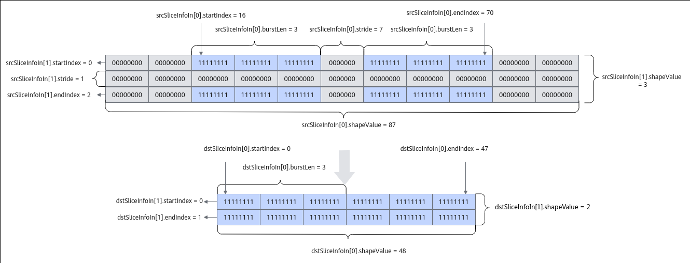

# 切片数据搬运

> **Section**: 6.2.3.1.1.4  
> **PDF Pages**: 912–916  

---

<!-- page 912 -->

// 此时dstLocal = srcLocalAscendC::DataCopy(dstLocal, srcLocal, intriParams, enhancedParams);

结果示例：输入数据srcLocal ：[1 2 3 ... 512]输出数据dstLocal ：[1 2 3 ... 512]

## 6.2.3.1.1.4 切片数据搬运

产品支持情况

产品是否支持

Atlas 350 加速卡√

Atlas A3 训练系列产品/Atlas A3 推理系列产品√

Atlas A2 训练系列产品/Atlas A2 推理系列产品√

Atlas 200I/500 A2 推理产品x

Atlas 推理系列产品AI Core√

Atlas 推理系列产品Vector Corex

Atlas 训练系列产品x

功能说明

支持数据的切片搬运，提取多维Tensor数据的子集进行搬运。

函数原型

●Global Memory -> Local Memorytemplate <typename T>__aicore__ inline void DataCopy(const LocalTensor<T>& dst, const GlobalTensor<T>& src, const SliceInfo dstSliceInfo[], const SliceInfo srcSliceInfo[], const uint32_t dimValue = 1)

●Local Memory -> Global Memorytemplate <typename T>__aicore__ inline void DataCopy(const GlobalTensor<T> &dst, const LocalTensor<T> &src, const SliceInfo dstSliceInfo[], const SliceInfo srcSliceInfo[], const uint32_t dimValue = 1)

说明

各原型支持的具体数据通路和数据类型，请参考支持的通路和数据类型。

参数说明

表6-105模板参数说明

参数名描述

T源操作数和目的操作数的数据类型。支持的数据类型请参考支持的通路和数据类型。

<!-- page 913 -->

表6-106切片数据搬运接口参数说明

参数名称输入/输出

含义

dst输出目的操作数，类型为LocalTensor或GlobalTensor。

src输入源操作数，类型为LocalTensor或GlobalTensor。

srcSliceInfo/dstSliceInfo

输入目的操作数/源操作数切片信息，SliceInfo类型。

具体定义请参考${INSTALL_DIR}/include/ascendc/basic_api/interface/kernel_struct_data_copy.h，${INSTALL_DIR}请替换为CANN软件安装后文件存储路径。

dimValue输入操作数维度信息，默认值为1。

表6-107 SliceInfo 结构参数说明

参数名称含义

startIndex

切片的起始元素位置。

endIndex切片的终止元素位置。

stride切片的间隔元素个数。

burstLen横向切片，每一片数据的长度，仅在维度为1时生效，超出1维的情况下，必须配置为1，不支持配置成其他值。单位为datablock（32B）。比如，srcSliceInfo的List为 {{16, 70, 7, 3, 87}, {0, 2, 1, 1, 3}}，{16, 70,7, 3, 87}表示第一维的切片信息，burstLen设置为3，表示一个切片数据段大小为3个datablock； {0, 2, 1, 1, 3}为第二维的切片信息，burstLen仅能设置为1。

shapeValue

当前维度的原始长度。单位为元素个数。

通过具体的示例对上述参数进行解析，示意图如下：

图6-4参数解析示意图

<!-- page 914 -->

●dimValue为2，表示操作数有2维。

●srcSliceInfo为 {{16, 70, 7, 3, 87}, {0, 2, 1, 1, 3}}

–{16, 70, 7, 3, 87}是针对单独一行，即从一维的角度来配置，每个元素代表一个数：

**startIndex = 16，表示有效数据段从第16个数开始；**

**endIndex = 70，表示有效数据段到第70个数结束；**

**stride = 7，单位为元素个数，表示相邻的2个切片数据段间隔的元素个数，为7个0的间距；**

**burstLen = 3，单位为32B，表示在这一个有效数据段中，一个切片数据段大小为3个datablock；**

**shapeValue = 87，表示单独一行的长度，单位为元素个数，即 8 * 10 + 7 =87个元素。**

–{0, 2, 1, 1, 3}是针对多行，即从二维的角度来配置，每个元素代表一行：

**startIndex = 0，表示有效数据段从第0行开始；**

**endIndex = 2，表示有效数据段到第2行结束；**

**stride = 1，表示相邻的2个切片数据段中间隔元素为1行；**

**burstLen = 1，在dimValue > 1时必须填为1；**

**shapeValue = 3，表明一共有3行。**

●dstSliceInfo为{{0, 47, 0, 3, 48}, {0, 1, 0, 1, 2}}

–{0, 47, 0, 3, 48}是针对单独一行，即从一维的角度来配置，每个元素代表一个数：

**startIndex = 0，表示有效数据段从第0个数开始；**

**endIndex = 47，表示有效数据段到第47个数结束；**

**stride = 0，单位为元素个数，表示相邻的2个切片数据段间隔的元素个数，为0表示两个切片数据段没有间距；**

**burstLen = 3，单位为32B，表示在这一个有效数据段中，一个切片数据段大小为3个datablock；**

**shapeValue = 48，表示单独一行的长度，单位为元素个数，即8 * 6 = 48个元素。**

–{0, 1, 0, 1, 2} 是针对多行，即从二维的角度来配置，每个元素代表1行：

**startIndex = 0，表示有效数据段从第0行开始；**

**endIndex = 1，表示有效数据段到第1行结束；**

**stride = 0，表示相邻的2个切片数据段没有间隔；**

**burstLen = 1，在dimValue > 1时必须填为1；**

**shapeValue = 2，表示一共有2行。**

返回值说明

无

约束说明

●切片数据搬运中的横向burstLen大小设置，需要用户自己通过计算：横向切片元素个数* sizeof(T)/32byte。横向切片元素个数* sizeof(T)的大小必须是32byte的倍数。

<!-- page 915 -->

●切片数据搬运中的SliceInfo结构体数组大小和dimValue需要保持一致，并且不超过8。

●切片数据搬运中的srcSliceInfo数组大小的和dstSliceInfo的大小需要保持一致，两者的结构体中的burstLen需要相等（srcSliceInfo[i].burstLen =dstSliceInfo[i].burstLen）。

●切片数据搬运对参数有一定要求，建议使用者参考调用示例，并在CPU上仿真结果无误后，再到NPU侧执行。

支持的通路和数据类型

下文的数据通路均通过逻辑位置TPosition来表达，并注明了对应的物理通路。TPosition与物理内存的映射关系见表6-48。

表6-108 Global Memory -> Local Memory 具体通路和支持的数据类型

产品型号

数据通路源操作数和目的操作数的数据类型（两者保持一致）

GM -> VECIN（GM -> UB）

Atlas350 加速卡

bool、int8_t、uint8_t、hifloat8_t、fp8_e5m2_t、fp8_e4m3fn_t、fp8_e8m0_t、int16_t、uint16_t、half、bfloat16_t、int32_t、uint32_t、float、complex32、int64_t、uint64_t、double、complex64

Atlas推理系列产品AICore

GM -> VECIN（GM -> UB）

int8_t、uint8_t、int16_t、uint16_t、int32_t、uint32_t、half、float

AtlasA2 训练系列产品/AtlasA2 推理系列产品

GM -> VECIN（GM -> UB）

int8_t、uint8_t、int16_t、uint16_t、int32_t、uint32_t、half、bfloat16_t、float

AtlasA3 训练系列产品/AtlasA3 推理系列产品

GM -> VECIN（GM -> UB）

int8_t、uint8_t、int16_t、uint16_t、int32_t、uint32_t、half、bfloat16_t、float

<!-- page 916 -->

表6-109 Local Memory -> Global Memory 具体通路和支持的数据类型

产品型号

数据通路源操作数和目的操作数的数据类型（两者保持一致）

VECOUT -> GM（UB -> GM）

Atlas350 加速卡

bool、int8_t、uint8_t、hifloat8_t、fp8_e5m2_t、fp8_e4m3fn_t、fp8_e8m0_t、int16_t、uint16_t、half、bfloat16_t、int32_t、uint32_t、float、complex32、int64_t、uint64_t、double、complex64

Atlas推理系列产品AICore

VECOUT、CO2 -> GM（UB ->GM）

int8_t、uint8_t、int16_t、uint16_t、int32_t、uint32_t、half、float

AtlasA2 训练系列产品/AtlasA2 推理系列产品

VECOUT -> GM（UB -> GM）

int8_t、uint8_t、int16_t、uint16_t、int32_t、uint32_t、half、bfloat16_t、float

AtlasA3 训练系列产品/AtlasA3 推理系列产品

VECOUT -> GM（UB -> GM）

int8_t、uint8_t、int16_t、uint16_t、int32_t、uint32_t、half、bfloat16_t、float

调用示例

srcSliceInfo、dstSliceInfo参数解析与结果示例请参考图6-4。

// srcLocal、dstLocal为int32_t类型的LocalTensor，srcGlobal、dstGlobal为int32_t类型的GlobalTensoruint32_t dimValue = 2; // 操作数维度为2AscendC::SliceInfo srcSliceInfo[] = {{16, 70, 7, 3, 87}, {0, 2, 1, 1, 3}};AscendC::SliceInfo dstSliceInfo[] = {{0, 47, 0, 3, 48}, {0, 1, 0, 1, 2}};// Global Memory -> Local MemoryAscendC::DataCopy(srcLocal, srcGlobal,  dstSliceInfo, srcSliceInfo, dimValue);// Local Memory -> Global MemoryAscendC::DataCopy(dstGlobal, dstLocal, dstSliceInfo, dstSliceInfo, dimValue);
