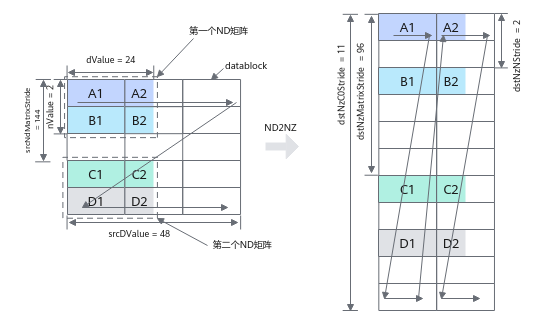
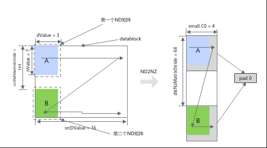

# 随路转换ND2NZ搬运

> **Section**: 6.2.3.1.1.5  
> **PDF Pages**: 917–921  

---

<!-- page 917 -->

## 6.2.3.1.1.5 随路转换ND2NZ 搬运

产品支持情况

产品是否支持

是否支持

**Local Memory-> LocalMemory**

**Global Memory -> Local Memory**

Atlas 350 加速卡√√

Atlas A3 训练系列产品/Atlas A3 推理系列产品

√√

Atlas A2 训练系列产品/Atlas A2 推理系列产品

√√

Atlas 200I/500 A2 推理产品xx

Atlas 推理系列产品AI Core√x

Atlas 推理系列产品Vector Corexx

Atlas 训练系列产品xx

功能说明

支持在数据搬运时进行ND到NZ格式的转换。

函数原型

●Global Memory -> Local Memorytemplate <typename T>__aicore__ inline void DataCopy(const LocalTensor<T>& dst, const GlobalTensor<T>& src, const Nd2NzParams& intriParams)// 该函数原型仅支持Atlas 350 加速卡template <typename T, bool enableSmallC0 = false>__aicore__ inline void DataCopy(const LocalTensor<T>& dst, const GlobalTensor<T>& src, const Nd2NzParams& intriParams)

●Local Memory -> Local Memorytemplate <typename T>   __aicore__ inline void DataCopy(const LocalTensor<T>& dst, const LocalTensor<T>& src, const Nd2NzParams& intriParams)

说明

各原型支持的具体数据通路和数据类型，请参考支持的通路和数据类型。

<!-- page 918 -->

参数说明

表6-110模板参数说明

参数名描述

T源操作数或者目的操作数的数据类型。支持的数据类型请参考支持的通路和数据类型。

enableSmallC0

SmallC0模式开关：当dValue小于等于4的时候，C0_SIZE会补齐到4 *sizeof(T) Bytes。

默认不开启。

表6-111参数说明

参数名称输入/输出

含义

dst输出目的操作数，类型为LocalTensor。

src输入源操作数，类型为LocalTensor或GlobalTensor。

intriParams

输入搬运参数，类型为Nd2NzParams。

具体定义请参考${INSTALL_DIR}/include/ascendc/basic_api/interface/kernel_struct_data_copy.h，${INSTALL_DIR}请替换为CANN软件安装后文件存储路径。

表6-112 Nd2NzParams 结构体参数定义

参数名称含义

ndNum传输ND矩阵的数目，取值范围：ndNum∈[0, 4095]。

nValueND矩阵的行数，取值范围：nValue∈[0, 16384]。

dValueND矩阵的列数，取值范围：dValue∈[0, 65535]。

srcNdMatrixStride

源操作数相邻ND矩阵起始地址间的偏移，取值范围：srcNdMatrixStride∈[0, 65535]，单位为元素。

srcDValue源操作数同一ND矩阵的相邻行起始地址间的偏移，取值范围：srcDValue∈[1, 65535]，单位为元素。

dstNzC0Stride

ND转换到NZ格式后，源操作数中的一行会转换为目的操作数的多行。dstNzC0Stride表示，目的NZ矩阵中，来自源操作数同一行的多行数据相邻行起始地址间的偏移，取值范围：dstNzC0Stride∈[1,16384]，单位：C0_SIZE（32B）。

dstNzNStride

目的NZ矩阵中，Z型矩阵相邻行起始地址之间的偏移。取值范围：dstNzNStride∈[1, 16384]，单位：C0_SIZE（32B）。

<!-- page 919 -->

参数名称含义

dstNzMatrixStride

目的NZ矩阵中，相邻NZ矩阵起始地址间的偏移，取值范围：dstNzMatrixStride∈[1, 65535]，单位为元素。

ND2NZ转换示意图如下，样例中参数设置值和解释说明如下：

●ndNum = 2，表示传输ND矩阵的数目为2 (ND矩阵1为A1~A2 + B1~B2，ND矩阵2为C1~C2 + D1~D2)。

●nValue = 2，ND矩阵的行数，也就是矩阵的高度为2。

●dValue = 24，ND矩阵的列数，也就是矩阵的宽度为24个元素。当dValue不满足32B对齐时，在目的操作数中不足的部分会被补齐为0，例如图示中A2所在DataBlock的空白部分会被补齐为0。

●srcNdMatrixStride = 144，表达相邻ND矩阵起始地址间的偏移，即为A1~C1的距离，即为9个DataBlock，9 * 16 = 144个元素。

●srcDValue = 48，表示一行的所含元素个数，即为A1到B1的距离，即为3个DataBlock，3 * 16 = 48个元素

●dstNzC0Stride = 11。ND转换到NZ格式后，源操作数中的一行会转换为目的操作数的多行，例如src中A1和A2为1行，dst中A1和A2被分为2行。多行数据起始地址之间的偏移就是A1和A2在dst中的偏移，偏移为11个DataBlock。

●dstNzNStride = 2，表示src中一个ND矩阵的第x行和第x+1行转换为NZ格式后在dst中的偏移，即A1和B1在dst之间的偏移为2个DataBlock。

●dstNzMatrixStride = 96，表达dst中第x个ND矩阵的起点和第x+1个ND矩阵的起点的偏移，即A1和C1之间的距离，即为6个DataBlock，6 * 16 = 96个元素。

图6-5 ND2NZ 转换示意图（half 数据类型）

enableSmallC0开启模式下的ND2NZ转换示意图如下：

<!-- page 920 -->

图6-6 enableSmallC0 开启模式下的ND2NZ 转换示意图（half 数据类型）

返回值说明

无

约束说明

针对Atlas 推理系列产品AI Core，使用Global Memory -> Local Memory通路的ND2NZ搬运接口时，需要预留8K的UB空间，作为接口的临时数据存放区。

支持的通路和数据类型

下文的数据通路均通过逻辑位置TPosition来表达，并注明了对应的物理通路。TPosition与物理内存的映射关系见表6-48。

表6-113 Global Memory -> Local Memory 具体通路和支持的数据类型

数据通路源操作数和目的操作数的数据类型 (两者保持一致)

产品型号

Atlas350 加速卡

bool、int8_t、uint8_t、hifloat8_t、fp8_e5m2_t、fp8_e4m3fn_t、fp8_e8m0_t、int16_t、uint16_t、half、bfloat16_t、int32_t、uint32_t、float、complex32

●GM -> VECIN（GM -> UB）

bool、int8_t、uint8_t、fp4x2_e2m1_t、fp4x2_e1m2_t、hifloat8_t、fp8_e5m2_t、fp8_e4m3fn_t、fp8_e8m0_t、int16_t、uint16_t、half、bfloat16_t、int32_t、uint32_t、float、complex32

●GM -> A1、B1（GM -> L1Buffer）

<!-- page 921 -->

数据通路源操作数和目的操作数的数据类型 (两者保持一致)

产品型号

Atlas推理系列产品AICore

int8_t、uint8_t、int16_t、uint16_t、int32_t、uint32_t、half、float

●GM -> VECIN（GM -> UB）

int16_t、uint16_t、int32_t、uint32_t、half、float

●GM -> A1、B1（GM -> L1Buffer）

int8_t、uint8_t、int16_t、uint16_t、int32_t、uint32_t、half、bfloat16_t、float

AtlasA2 训练系列产品/AtlasA2 推理系列产品

●GM -> VECIN（GM -> UB）

●GM -> A1、B1（GM -> L1Buffer）

int8_t、uint8_t、int16_t、uint16_t、int32_t、uint32_t、half、bfloat16_t、float

AtlasA3 训练系列产品/AtlasA3 推理系列产品

●GM -> VECIN（GM -> UB）

●GM -> A1、B1（GM -> L1Buffer）

表6-114 Local Memory -> Local Memory 具体通路和支持的数据类型

数据通路源操作数和目的操作数的数据类型 (两者保持一致)

产品型号

Atlas350 加速卡

VECIN、VECCALC、VECOUT ->TSCM（UB -> L1Buffer）

bool、int8_t、uint8_t、hifloat8_t、fp8_e5m2_t、fp8_e4m3fn_t、fp8_e8m0_t、int16_t、uint16_t、half、bfloat16_t、int32_t、uint32_t、float、complex32

AtlasA2 训练系列产品/AtlasA2 推理系列产品

VECIN、VECCALC、VECOUT ->TSCM（UB -> L1Buffer）

int8_t、uint8_t、int16_t、uint16_t、int32_t、uint32_t、half、bfloat16_t、float
