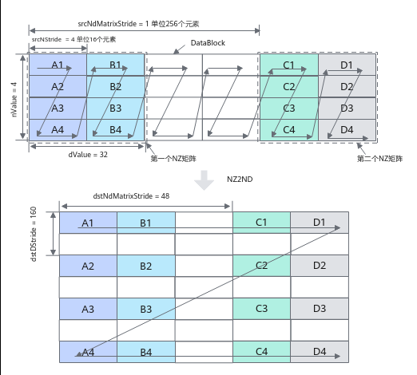
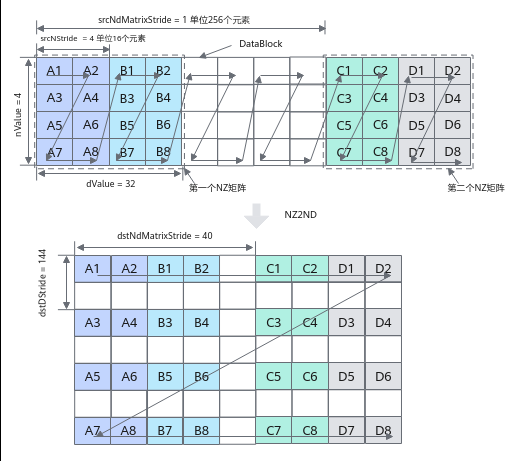

# 随路转换NZ2ND搬运

> **Section**: 6.2.3.1.1.6  
> **PDF Pages**: 922–926  

---

<!-- page 922 -->

数据通路源操作数和目的操作数的数据类型 (两者保持一致)

产品型号

int8_t、uint8_t、int16_t、uint16_t、int32_t、uint32_t、half、bfloat16_t、float

AtlasA3 训练系列产品/AtlasA3 推理系列产品

VECIN、VECCALC、VECOUT ->TSCM（UB -> L1Buffer）

调用示例

intriParams参数解析请参考图6-5。

// srcLocal为half类型的L1 Buffer空间上的LocalTensor，workLocal为half类型的UB空间上的LocalTensor，srcGlobal为half类型的GlobalTensorAscendC::Nd2NzParams intriParams{1, 32, 32, 0, 32, 32, 1, 0};// Global Memory -> Local MemoryAscendC::DataCopy(srcLocal, srcGlobal, intriParams);// Local Memory -> Local MemoryAscendC::DataCopy(srcLocal, workLocal, intriParams);

结果示例：

输入数据(srcGlobal): [1 2 3 ... 1024]输出数据(dstGlobal):[1 2 ... 15 16 33 34 ... 47 48 65 66 ... 79 80 97 98 ... 111 112 ... 1009 1010... 1023 1024]

## 6.2.3.1.1.6 随路转换NZ2ND 搬运

产品支持情况

产品是否支持

Atlas 350 加速卡√

Atlas A3 训练系列产品/Atlas A3 推理系列产品√

Atlas A2 训练系列产品/Atlas A2 推理系列产品√

Atlas 200I/500 A2 推理产品x

Atlas 推理系列产品AI Core√

Atlas 推理系列产品Vector Corex

Atlas 训练系列产品x

功能说明

支持在数据搬运时进行NZ到ND格式的转换。

<!-- page 923 -->

函数原型

```cpp
template <typename T>__aicore__ inline void DataCopy(const GlobalTensor<T>& dst, const LocalTensor<T>& src, const Nz2NdParamsFull& intriParams)
```

说明

各原型支持的具体数据通路和数据类型，请参考支持的通路和数据类型。

参数说明

表6-115模板参数说明

参数名描述

T源操作数或者目的操作数的数据类型。支持的数据类型请参考支持的通路和数据类型。

表6-116接口参数说明

参数名称输入/输出

含义

dst输出目的操作数，类型为GlobalTensor。

src输入源操作数，类型为LocalTensor。

intriParams

输入搬运参数，类型为Nz2NdParamsFull。

具体定义请参考${INSTALL_DIR}/include/ascendc/basic_api/interface/kernel_struct_data_copy.h，${INSTALL_DIR}请替换为CANN软件安装后文件存储路径。

表6-117 Nz2NdParamsFull 结构体内参数定义

参数名称含义

ndNum传输NZ矩阵的数目，取值范围：ndNum∈[0, 4095]。

nValueNZ矩阵的行数，取值范围：nValue∈[1, 8192]。

dValueNZ矩阵的列数，取值范围：dValue∈[1, 8192]。dValue必须为16的倍数。

srcNdMatrixStride

源相邻NZ矩阵的偏移（头与头），取值范围：srcNdMatrixStride∈[1, 512]，单位256 (16 * 16) 个元素。

srcNStride源同一NZ矩阵的相邻Z排布的偏移（头与头），取值范围：srcNStride∈[0, 4096]，单位16个元素。

dstDStride目的ND矩阵的相邻行的偏移（头与头），取值范围：dstDStride∈[1, 65535]，单位为元素。

<!-- page 924 -->

参数名称含义

dstNdMatrixStride

目的ND矩阵中，来自源相邻NZ矩阵的偏移（头与头），取值范围：dstNdMatrixStride∈[1, 65535]，单位为元素。

以half数据类型为例，NZ2ND转换示意图如下，样例中参数设置值和解释说明如下：

●ndNum = 2，表示源NZ矩阵的数目为2 (NZ矩阵1为A1~A4 + B1~B4，NZ矩阵2为C1~C4 + D1~D4)。

●nValue = 4，NZ矩阵的行数，也就是矩阵的高度为4。

●dValue = 32，NZ矩阵的列数，也就是矩阵的宽度为32个元素。

●srcNdMatrixStride = 1，表达相邻NZ矩阵起始地址间的偏移，即为A1~C1的距离，即为256个元素(16个DataBlock * 16个元素)。

●srcNStride = 4, 表示同一个源NZ矩阵的相邻Z排布的偏移，即为A1到B1的距离，即为64个元素(4个DataBlock* 16个元素)。

●dstDStride = 160，表达一个目的ND矩阵的相邻行之间的偏移，即A1和A2之间的距离，即为10个DataBlock，即10 * 16 = 160个元素。

●dstNdMatrixStride = 48，表达dst中第x个目的ND矩阵的起点和第x+1个目的ND矩阵的起点的偏移，即A1和C1之间的距离，即为3个DataBlock，3 * 16 = 48个元素。

图6-7 NZ2ND 转换示意图（half 数据类型）



<!-- page 925 -->

以float数据类型为例，NZ2ND转换示意图如下，样例中参数设置值和解释说明如下：

●ndNum = 2，表示源NZ矩阵的数目为2 (NZ矩阵1为A1~A8 + B1~B8，NZ矩阵2为C1~C8 + D1~D8)。

●nValue = 4，NZ矩阵的行数，也就是矩阵的高度为4。

●dValue = 32，NZ矩阵的列数，也就是矩阵的宽度为32个元素。

●srcNdMatrixStride = 1，表达相邻NZ矩阵起始地址间的偏移，即A1到C1的距离，为256个元素(32个DataBlock * 8个元素)

●srcNStride = 4, 表示同一个源NZ矩阵的相邻Z排布的偏移，即A1到B1的距离，为64个元素 (8个DataBlock * 8个元素)。

●dstDStride = 144，表示一个目的ND矩阵的相邻行之间的偏移，即A1和A3之间的距离，为18个DataBlock，即18 * 8 = 144个元素。

●dstNdMatrixStride = 40，表示dst中第x个目的ND矩阵的起点和第x+1个目的ND矩阵的起点的偏移，即A1和C1之间的距离，为5个DataBlock，5 * 8 = 40个元素。

图6-8 NZ2ND 转换示意图（float 数据类型）



返回值说明

无

<!-- page 926 -->

约束说明

无

支持的通路和数据类型

下文的数据通路均通过逻辑位置TPosition来表达，并注明了对应的物理通路。TPosition与物理内存的映射关系见表6-48。

表6-118 Local Memory -> Global Memory 具体通路和支持的数据类型

数据通路源操作数和目的操作数的数据类型 (两者保持一致)

产品型号

Atlas350 加速卡

VECOUT -> GM（UB -> GM）

bool、int8_t、uint8_t、hifloat8_t、fp8_e5m2_t、fp8_e4m3fn_t、fp8_e8m0_t、int16_t、uint16_t、half、bfloat16_t、int32_t、uint32_t、float、complex32、int64_t、uint64_t、double、complex64

Atlas推理系列产品AICore

VECOUT、CO2 -> GM（UB ->GM）

int16_t、uint16_t、int32_t、uint32_t、half、float

AtlasA2 训练系列产品/AtlasA2 推理系列产品

VECOUT -> GM（UB -> GM）

int16_t、uint16_t、int32_t、uint32_t、half、bfloat16_t、float

AtlasA3 训练系列产品/AtlasA3 推理系列产品

VECOUT -> GM（UB -> GM）

int16_t、uint16_t、int32_t、uint32_t、half、bfloat16_t、float

调用示例

intriParams参数解析请参考图6-7。

// dstLocal为half类型的LocalTensor，dstGlobal为half类型的GlobalTensorAscendC::Nz2NdParamsFull intriParams{1, 32, 32, 1, 32, 32, 1};// Local Memory -> Global MemoryAscendC::DataCopy(dstGlobal, dstLocal, intriParams);

结果示例：
