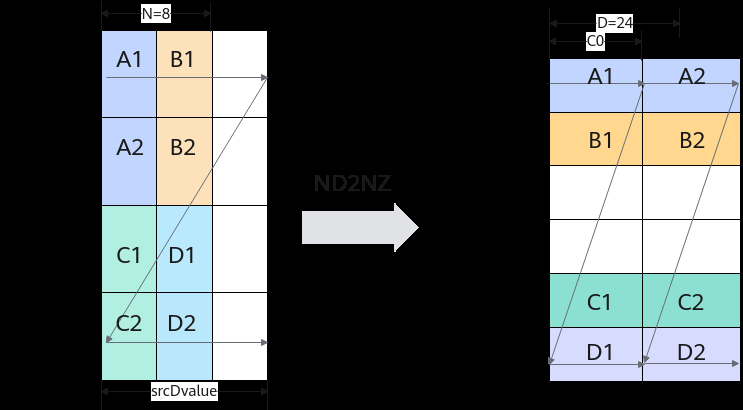

# 随路转换DN2NZ搬运（ISASI）

> **Section**: 6.2.3.1.1.7  
> **PDF Pages**: 927–929  

---

<!-- page 927 -->

输入数据(srcGlobal): [1 2 3 ... 1024]输出数据(dstGlobal):[1 2 ... 15 16 513 514 ... 527 528 17 18 ... 31 32 529 530 ... 543 544 ...497 498 ...  511 512  1009 1010... 1023 1024]

## 6.2.3.1.1.7 随路转换DN2NZ 搬运（ISASI）

产品支持情况

产品是否支持

Atlas 350 加速卡√

Atlas A3 训练系列产品/Atlas A3 推理系列产品x

Atlas A2 训练系列产品/Atlas A2 推理系列产品x

Atlas 200I/500 A2 推理产品x

Atlas 推理系列产品AI Corex

Atlas 推理系列产品Vector Corex

Atlas 训练系列产品x

功能说明

随路格式转换数据搬运，适用于在搬运时进行格式转换。

函数原型

```cpp
template <typename T, bool enableSmallC0 = false>__aicore__ inline void DataCopy(const LocalTensor<T>& dst, const GlobalTensor<T>& src, const Dn2NzParams& intriParams);
```

参数说明

表6-119模板参数说明

参数名描述

T源操作数或者目的操作数的数据类型。

enableSmallC0

SmallC0模式开关：当dValue小于等于4的时候，C0_SIZE会补齐到4 *sizeof(T) Bytes，默认不开启。

表6-120参数说明

参数名称输入/输出

含义

dst输出目的操作数，类型为LocalTensor。

src输入源操作数，类型为GlobalTensor。

<!-- page 928 -->

参数名称输入/输出

含义

intriParams

输入搬运参数，Dn2NzParams类型，具体参数说明请参考表Dn2NzParams结构体参数定义；具体定义请参考${INSTALL_DIR}/include/ascendc/basic_api/interface/kernel_struct_data_copy.h，${INSTALL_DIR}请替换为CANN软件安装后文件存储路径。

表6-121 Dn2NzParams 结构体参数定义

参数名称含义

dnNum传输DN矩阵的数目，取值范围：ndNum∈[0, 4095]。

nValueDN矩阵的行数，取值范围：nValue∈[0, 16384]。

dValueDN矩阵的列数，取值范围：dValue∈[0, 2^32-1]。

srcDnMatrixStride

源操作数相邻DN矩阵起始地址间的偏移，取值范围：srcDNMatrixStride∈[0, 2^64-1]，单位为元素。

srcDValue源操作数同一DN矩阵的相邻行起始地址间的偏移，取值范围：srcDValue∈[1, 2^64-1]，单位为元素。

dstNzC0Stride

DN转换到NZ格式后，源操作数中的一列会转换为目的操作数的多行。dstNzC0Stride表示，目的NZ矩阵中，来自源操作数同一列的多行数据相邻行起始地址间的偏移，取值范围：dstNzC0Stride∈[1, 65535]，单位：C0_SIZE（32B）。

dstNzNStride

目的NZ矩阵中，Z型矩阵相邻行起始地址之间的偏移。取值范围：dstNzNStride∈[1, 65535]，单位：C0_SIZE（32B）。

dstNzMatrixStride

目的NZ矩阵中，相邻NZ矩阵起始地址间的偏移，取值范围：dstNzMatrixStride∈[1, 2^32-1]，单位为元素。

DN2NZ转换示意图如下，样例中参数设置值和解释说明如下（以half数据类型为例）：

●dnNum = 2，表示传输DN矩阵的数目为2。

●nValue = 8，DN矩阵的列数，也就是矩阵的宽度为8。

●dValue = 24，DN矩阵的行数，也就是矩阵的高度为24个元素。

●srcDnMatrixStride = 96，表达相邻DN矩阵起始地址间的偏移，即：A1与C1之间的间隔，为6个DataBlock，6 * 16 = 96个元素。

●srcDValue = 48, 表示一行的所含元素个数，即为3个DataBlock, 3 * 16 = 48个元素。

●dstNzC0Stride = 6。DN转换到NZ格式后，源操作数中的一列会转换为目的操作数的多列，例如src中A1和A2为1列，dst中A1和A2被分为2列。多列数据起始地址之间的偏移就是A1和A2在dst中的偏移，偏移为6个datablock。

<!-- page 929 -->

●dstNzNStride = 2，表达dst中第x个目的DN矩阵和第x+1个目的DN矩阵的起点的偏移，即A1与B1之间的间隔，即为2个DataBlock。

●dstNzMatrixStride = 64，表达dst中第x个目的ND矩阵和第x+1个目的ND矩阵的起点的偏移，即A1和C1之间的距离，即为4个DataBlock，4 * 16 = 64个元素。



通路说明

表6-122数据通路和数据类型

源操作数和目的操作数的数据类型 (两者保持一致)

支持型号

数据通路（通过TPosition表达）

GM -> A1/B1int8_t、uint8_t、fp4x2_e2m1_t、fp4x2_e1m2_t、int16_t、uint16_t、int32_t、uint32_t、half、bfloat16_t、float

Atlas350 加速卡

返回值说明

无

约束说明

无

调用示例

// dstLocal: 存放DataCopy的输出Tensor，仅支持A1/B1// srcGlobal：存放DataCopy的输入Tensor，仅支持GM

```cpp
AscendC::Dn2NzParams dn2nzParams(    /* dnNum             */ 1,    /* nValue            */ 32,    /* dValue            */ 32,    /* srcDnMatrixStride */ 0,
```
