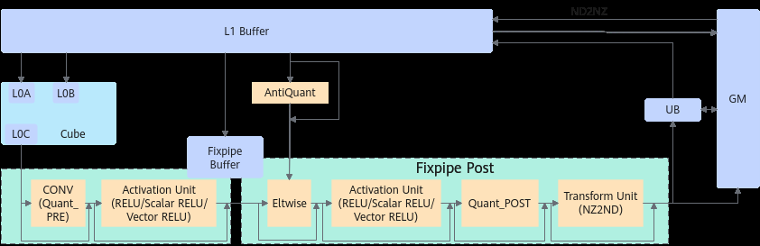

# 随路量化激活搬运

> **Section**: 6.2.3.1.1.8  
> **PDF Pages**: 930–939  

---

<!-- page 930 -->

/* srcDValue         */ 32,    /* dstNzC0Stride     */ 32,    /* dstNzNStride      */ 1,    /* dstNzMatrixStride */ 0);// 将GM中DN的格式的数据，按照 dn2nzParams 定义的规则，转换为NZ并拷贝到A1/B1中AscendC::DataCopy(dstLocal, srcGlobal, dn2nzParams);

## 6.2.3.1.1.8 随路量化激活搬运

产品支持情况

产品是否支持

Atlas 350 加速卡√

Atlas A3 训练系列产品/Atlas A3 推理系列产品√

Atlas A2 训练系列产品/Atlas A2 推理系列产品√

Atlas 200I/500 A2 推理产品√

Atlas 推理系列产品AI Corex

Atlas 推理系列产品Vector Corex

Atlas 训练系列产品x

功能说明

支持在数据搬运过程中进行量化和Relu激活等操作，同时支持Local Memory到GlobalMemory通路NZ到ND格式的转换。



函数原型

●Local Memory -> Global Memory，支持量化和Relu激活等操作，同时支持NZ到ND格式的转换template <typename T, typename U>__aicore__ inline void DataCopy(const GlobalTensor<T>& dst, const LocalTensor<U>& src, const DataCopyCO12DstParams& intriParams)

●Local Memory -> Local Memory，支持量化和Relu激活等操作template <typename T, typename U>__aicore__ inline void DataCopy(const LocalTensor<T>& dst, const LocalTensor<U>& src, const DataCopyCO12DstParams& intriParams)

<!-- page 931 -->

说明

各原型支持的具体数据通路和数据类型，请参考支持的通路和数据类型。

参数说明

表6-123模板参数说明

参数名描述

T目的操作数的数据类型。支持的数据类型请参考支持的通路和数据类型。

U源操作数的数据类型。支持的数据类型请参考支持的通路和数据类型。

表6-124参数说明

参数名称输入/输出

含义

dst输出目的操作数，类型为LocalTensor或GlobalTensor。

src输入源操作数，类型为LocalTensor。

intriParams

输入搬运参数，类型为DataCopyCO12DstParams。

具体定义请参考${INSTALL_DIR}/include/ascendc/basic_api/interface/kernel_struct_data_copy.h，${INSTALL_DIR}请替换为CANN软件安装后文件存储路径。

表6-125 DataCopyCO12DstParams 结构体参数定义（C0 取值：一般情况下，C0 =16；使能channelSplit（channel 切分）时，C0 = 8）

参数名称含义

nSizesrc横向方向的size大小。

●不使能NZ2ND功能，必须为C0的倍数，此时连续传输数据块的个数为nSize / C0。

●使能NZ2ND功能，不受限制。

mSizesrc纵向方向的size大小。

●不使能NZ2ND功能，连续传输数据块的大小为mSize * C0个元素的长度。

●使能NZ2ND功能，NZ/ND矩阵的大小为mSize * nSize。

<!-- page 932 -->

参数名称含义

dstStride●不使能NZ2ND功能dst相邻连续数据片段间隔（前面一个数据块的头与后面数据块的头的间隔），取值不为0。单位为DataBlock（32字节）。

●使能NZ2ND功能dst同一ND矩阵的相邻行的偏移（头与头），取值不为0，单位为元素。

srcStride●不使能NZ2ND功能src相邻连续数据片段间隔（前面一个数据块的头与后面数据块的头的间隔），必须为16的倍数。取值范围：srcStride∈[0,65535]，单位：C0_Size(C0 * sizeof(U)，U为src的数据类型)。

●使能NZ2ND功能src同一NZ矩阵的相邻Z排布的偏移（头与头），必须为16的倍数，取值范围：srcStride∈[0, 65535]，单位C0_size。

quantPre用于控制量化模式，QuantMode_t类型，具体定义如下。默认值为QuantMode_t::NoQuant，即不使能量化功能。

配置为scalar量化时，需要调用SetFixpipePreQuantFlag接口来设置scalar量化参数；配置为tensor量化时，需要调用SetFixPipeConfig来设置tensor量化参数。enum QuantMode_t{    NoQuant,      // 不使能量化功能    F322F16,      // float cast成half，cast mode为CAST_RINT模式    F322BF16,     // float cast成bfloat16_t，cast mode为CAST_RINT模式    DEQF16,       // int32_t量化成half, scalar量化    VDEQF16,      // int32_t量化成half，tensor量化    QF322B8_PRE,  // float量化成int8_t/uint8_t，scalar量化    VQF322B8_PRE, // float量化成int8_t/uint8_t，tensor量化    REQ8,         // int32_t量化成int8_t/uint8_t，scalar量化    VREQ8,        // int32_t量化成int8_t/uint8_t，tensor量化};

reluPre用于配置relu操作的模式，类型为uint8_t，取值如下：

●0：不使能relu

●1：Normal relu

channelSplit类型为bool，配置是否使能channel切分，对于float类型的dst生效。

●false：不使能

●true：使能

nz2ndEn类型为bool，配置是否使能NZ2ND的格式转换，仅在CO1 -> GM通路生效。

如果要使能NZ2ND的功能需要同步调用SetFixpipeNz2ndFlag来设置格式转换的相关配置信息。

●false：不使能

●true：使能

<!-- page 933 -->

参数名称含义

clipReluPre用于配置是否使能ClipRelu操作，参数类型为uint8_t，取值如下：0，不使能ClipRelu；1，使能ClipRelu，此时需要调用SetFixPipeClipRelu来设置clipRelu的最大值。

●该操作在随路量化后进行，quantPre配置后才能使用，当前支持的量化模式有F322F16/DEQF16/VDEQF16/QF322B8_PRE/VQF322B8_PRE/REQ8/VREQ8。

●该参数仅在Atlas 200I/500 A2 推理产品支持。

eltWiseOp用于配置是否使能Elementwise操作及操作模式。Elementwise操作是指进行随路量化后，可以逐个元素加/减一个LocalTensor，大小为mSize * nSize，具体LocalTensor地址相关参数需要调用SetFixPipeAddr来设置。

eltWiseOp参数类型为uint8_t，取值如下：

●0：不使能Elementwise

●1：Elementwise Addition

●2：Elementwise Subtraction

该参数仅在Atlas 200I/500 A2 推理产品支持。

sid预留参数，为后续的功能做保留，开发者暂时无需关注。

返回值说明

无

约束说明

无

支持的通路和数据类型

下文的数据通路均通过逻辑位置TPosition来表达，并注明了对应的物理通路。TPosition与物理内存的映射关系见表6-48。

表6-126 Local Memory -> Global Memory 具体通路和支持的数据类型

支持型号数据通路源操作数的数据类型

目的操作数的数据类型

Atlas A2 训练系列产品/Atlas A2 推理系列产品

CO1 ->GM（L0CBuffer ->GM）

floatuint8_t、int8_t、half、bfloat16_t、float

int32_tuint8_t、int8_t、half、int16_t、int32_t

<!-- page 934 -->

支持型号数据通路源操作数的数据类型

目的操作数的数据类型

CO1 ->GM（L0CBuffer ->GM）

floatuint8_t、int8_t、half、bfloat16_t、float

Atlas A3 训练系列产品/Atlas A3 推理系列产品

int32_tuint8_t、int8_t、half、int16_t、int32_t

floatuint8_t、int8_t、half、bfloat16_t、float

Atlas 200I/500 A2推理产品

CO1 ->GM（L0CBuffer ->GM）

int32_tuint8_t、int8_t、half、int16_t、int32_t

floatuint8_t、int8_t、half、bfloat16_t、float

Atlas 350 加速卡CO1 ->GM（L0CBuffer ->GM）

int32_tuint8_t、int8_t、half、int16_t、int32_t

表6-127 Local Memory -> Local Memory 具体通路和支持的数据类型

支持型号数据通路源操作数的数据类型

目的操作数的数据类型

CO1 ->A1（L0CBuffer ->L1Buffer）

floatuint8_t、int8_t、half、bfloat16_t

Atlas A2 训练系列产品/Atlas A2 推理系列产品

int32_tuint8_t、int8_t、half、int16_t

CO1 ->A1（L0CBuffer ->L1Buffer）

floatuint8_t、int8_t、half、bfloat16_t

Atlas A3 训练系列产品/Atlas A3 推理系列产品

int32_tuint8_t、int8_t、half、int16_t

Atlas 350 加速卡CO1 ->A1（L0CBuffer ->L1Buffer）

floatuint8_t、int8_t、half、bfloat16_t、float

int32_tuint8_t、int8_t、half、int16_t、int32_t

调用示例

●随路格式转换数据搬运，通路：CO1->A1、CO1->GM

示例：Mmad含有矩阵乘偏置，左矩阵和右矩阵的数据类型为int8_t，结果矩阵的数据类型为int32_t。量化模式DEQF16，Scalar量化参数为0.5，将Mmad计算出的结果由int32_t量化成half并搬出。// Scalar量化，量化参数为0.5float deqfloat = 0.5f;

<!-- page 935 -->

uint64_t deqScalar = static_cast<uint64_t>(*reinterpret_cast<int32_t*>(&deqfloat));// 将量化参数的标量写入寄存器，供后续DataCopy指令使用AscendC::SetFixpipePreQuantFlag(deqScalar);// 设置同步，确保量化参数配置完成后，DataCopy指令才能开始执行AscendC::PipeBarrier<PIPE_FIX>();// 创建DataCopy的参数, AscendC::DataCopyCO12DstParams intriParams(    nSize, mSize, dstStride, srcStride,    /* 量化模式: DEQF16        */ static_cast<QuantMode_t>(11),     /* 是否使能ReLU            */ static_cast<uint8_t>(true),     /* 是否使能channel切分     */ false,     /* 是否使能NZ2ND的格式转换 */ true);// 根据intriParams中的参数，执行最终的数据搬运AscendC::DataCopy(dtsGm, dstL0c, intriParams);结果示例如下：

输入数据（Fm，shape为[1, 4, 4, 32]，数据类型为int8_t）：[[[[ 1  1  1  1  1  1  1  1  1  2  2  2  2  2  2  2  2  3  3  3  3  3  3  3  3  4  4  4  4  4  4  4]    ...   [12 12 13 13 13 13 13 13 13 13 14 14 14 14 14 14 14 14 15 15 15 15 15 15 15 15 16 16 16 16 16 16]]  [[16 16 17 17 17 17 17 17 17 17 18 18 18 18 18 18 18 18 19 19 19 19 19 19 19 19 19 20 20 20 20 20]    ...   [28 28 28 28 29 29 29 29 29 29 29 29 30 30 30 30 30 30 30 30 31 31 31 31 31 31 31 31 32 32 32 32]]  [[32 32 32 32 33 33 33 33 33 33 33 33 34 34 34 34 34 34 34 34 35 35 35 35 35 35 35 35 36 36 36 36]    ...   [44 44 44 44 44 45 45 45 45 45 45 45 45 46 46 46 46 46 46 46 46 46 47 47 47 47 47 47 47 47 48 48]]  [[48 48 48 48 48 48 49 49 49 49 49 49 49 49 50 50 50 50 50 50 50 50 51 51 51 51 51 51 51 51 52 52]    ...   [60 60 60 60 60 60 60 61 61 61 61 61 61 61 61 62 62 62 62 62 62 62 62 63 63 63 63 63 63 63 63 64]]]]输入数据（Weight，shape为[1, 2, 2, 128, 32]，数据类型为int8_t）：[[[[[1 1 1 1 1 1 1 1 1 1 1 1 1 1 1 1 1 1 1 1 1 1 1 1 1 1 1 1 1 1 1 1]    ...    [1 1 1 1 1 1 1 1 1 1 1 1 1 1 1 1 1 1 1 1 1 1 1 1 1 1 1 1 1 1 1 1]]]]]输出数据（DstL0c，shape为[8, 16, 32]，数据类型为int32_t）：[[[1572,1572,1572,1572,1572,1572,1572,1572,1572,1572,1572,1572,1572,1572,1572,1572],  [2078,2078,2078,2078,2078,2078,2078,2078,2078,2078,2078,2078,2078,2078,2078,2078],  [2582,2582,2582,2582,2582,2582,2582,2582,2582,2582,2582,2582,2582,2582,2582,2582],  [3592,3592,3592,3592,3592,3592,3592,3592,3592,3592,3592,3592,3592,3592,3592,3592],  [4097,4097,4097,4097,4097,4097,4097,4097,4097,4097,4097,4097,4097,4097,4097,4097],  [4602,4602,4602,4602,4602,4602,4602,4602,4602,4602,4602,4602,4602,4602,4602,4602],  [5612,5612,5612,5612,5612,5612,5612,5612,5612,5612,5612,5612,5612,5612,5612,5612],  [6116,6116,6116,6116,6116,6116,6116,6116,6116,6116,6116,6116,6116,6116,6116,6116],  [6622,6622,6622,6622,6622,6622,6622,6622,6622,6622,6622,6622,6622,6622,6622,6622],  [0,   0,   0,   0,   0,   0,   0,   0,   0,   0,   0,   0,   0,   0,   0,   0],  [0,   0,   0,   0,   0,   0,   0,   0,   0,   0,   0,   0,   0,   0,   0,   0],  [0,   0,   0,   0,   0,   0,   0,   0,   0,   0,   0,   0,   0,   0,   0,   0],  [0,   0,   0,   0,   0,   0,   0,   0,   0,   0,   0,   0,   0,   0,   0,   0],  [0,   0,   0,   0,   0,   0,   0,   0,   0,   0,   0,   0,   0,   0,   0,   0],  [0,   0,   0,   0,   0,   0,   0,   0,   0,   0,   0,   0,   0,   0,   0,   0],  [0,   0,   0,   0,   0,   0,   0,   0,   0,   0,   0,   0,   0,   0,   0,   0]],  ...输出数据（DstGm，shape为[8, 9, 32]，数据类型为half）：[[[ 786.  786.  786.  786.  786.  786.  786.  786.  786.  786.  786.  786.  786.  786.  786.  786.]   ...  [1039. 1039. 1039. 1039. 1039. 1039. 1039. 1039. 1039. 1039. 1039. 1039. 1039. 1039. 1039. 1039.]   ...  [1291. 1291. 1291. 1291. 1291. 1291. 1291. 1291. 1291. 1291. 1291. 1291. 1291. 1291. 1291. 1291.]   ...  [1796. 1796. 1796. 1796. 1796. 1796. 1796. 1796. 1796. 1796. 1796. 1796. 1796. 1796. 1796. 1796.]   ...  [2048. 2048. 2048. 2048. 2048. 2048. 2048. 2048. 2048. 2048. 2048. 2048. 2048. 2048. 2048. 2048.]   ...

<!-- page 936 -->

```cpp
[2300. 2300. 2300. 2300. 2300. 2300. 2300. 2300. 2300. 2300. 2300. 2300. 2300. 2300. 2300. 2300.]   ...  [2806. 2806. 2806. 2806. 2806. 2806. 2806. 2806. 2806. 2806. 2806. 2806. 2806. 2806. 2806. 2806.]   ...  [3058. 3058. 3058. 3058. 3058. 3058. 3058. 3058. 3058. 3058. 3058. 3058. 3058. 3058. 3058. 3058.]   ...  [3312. 3312. 3312. 3312. 3312. 3312. 3312. 3312. 3312. 3312. 3312. 3312. 3312. 3312. 3312. 3312.]   ...
```

示例：Mmad含有矩阵乘偏置，左矩阵和右矩阵的数据类型为int8_t，结果矩阵的数据类型为int32_t。量化模式VDEQF16，Tensor量化，将Mmad计算出的结果由int32_t量化成half并搬出。

// 将GM中的量化数据 (mDeqTensorGm) 拷贝到C1（cbufWorkspace）AscendC::DataCopy(cbufWorkspace, mDeqTensorGm,  {1, static_cast<uint16_t>(deqDataSize / AscendC::ONE_BLK_SIZE), 0, 0});// 设置同步，确保量化数据拷贝到C1后，执行后续DataCopy指令set_flag(PIPE_MTE2, PIPE_FIX, EVENT_ID3);wait_flag(PIPE_MTE2, PIPE_FIX, EVENT_ID3);// 将C1中的量化数据（cbufWorkspace）拷贝到C2PIPE2GM（deqTensorTempBuf）uint16_t fbufBurstLen = deqDataSize / 128;AscendC::DataCopyParams dataCopyParams(1, fbufBurstLen, 0, 0);AscendC::DataCopy(deqTensorTempBuf, cbufWorkspace, dataCopyParams);// 将量化参数数据写入寄存器，供后续DataCopy指令使用AscendC::SetFixPipeConfig(deqTensorTempBuf);// 设置同步，确保量化参数配置完成后，DataCopy指令才能开始执行AscendC::PipeBarrier<PIPE_FIX>();// 根据intriParams中的参数，执行最终的数据搬运AscendC::DataCopy(dtsGm, dstL0c, intriParams);

结果示例如下：

输入数据（Fm，shape为[1, 4, 4, 32]，数据类型为int8_t）：[[[[ 1  1  1  1  1  1  1  1  1  2  2  2  2  2  2  2  2  3  3  3  3  3  3  3  3  4  4  4  4  4  4  4]    ...   [12 12 13 13 13 13 13 13 13 13 14 14 14 14 14 14 14 14 15 15 15 15 15 15 15 15 16 16 16 16 16 16]]  [[16 16 17 17 17 17 17 17 17 17 18 18 18 18 18 18 18 18 19 19 19 19 19 19 19 19 19 20 20 20 20 20]    ...   [28 28 28 28 29 29 29 29 29 29 29 29 30 30 30 30 30 30 30 30 31 31 31 31 31 31 31 31 32 32 32 32]]  [[32 32 32 32 33 33 33 33 33 33 33 33 34 34 34 34 34 34 34 34 35 35 35 35 35 35 35 35 36 36 36 36]    ...   [44 44 44 44 44 45 45 45 45 45 45 45 45 46 46 46 46 46 46 46 46 46 47 47 47 47 47 47 47 47 48 48]]  [[48 48 48 48 48 48 49 49 49 49 49 49 49 49 50 50 50 50 50 50 50 50 51 51 51 51 51 51 51 51 52 52]    ...   [60 60 60 60 60 60 60 61 61 61 61 61 61 61 61 62 62 62 62 62 62 62 62 63 63 63 63 63 63 63 63 64]]]]输入数据（Weight，shape为[1, 2, 2, 128, 32]，数据类型为int8_t）：[[[[[1 1 1 1 1 1 1 1 1 1 1 1 1 1 1 1 1 1 1 1 1 1 1 1 1 1 1 1 1 1 1 1]    ...    [1 1 1 1 1 1 1 1 1 1 1 1 1 1 1 1 1 1 1 1 1 1 1 1 1 1 1 1 1 1 1 1]]]]]输入数据（Quant，shape为[128]，数据类型为float）：[0.1 0.01 0.1 0.01 ... 0.1 0.01 0.1 0.01]输出数据（DstL0c，shape为[8, 16, 32]，数据类型为int32_t）：[[[1572,1572,1572,1572,1572,1572,1572,1572,1572,1572,1572,1572,1572,1572,1572,1572],  [2078,2078,2078,2078,2078,2078,2078,2078,2078,2078,2078,2078,2078,2078,2078,2078],  [2582,2582,2582,2582,2582,2582,2582,2582,2582,2582,2582,2582,2582,2582,2582,2582],  [3592,3592,3592,3592,3592,3592,3592,3592,3592,3592,3592,3592,3592,3592,3592,3592],  [4097,4097,4097,4097,4097,4097,4097,4097,4097,4097,4097,4097,4097,4097,4097,4097],  [4602,4602,4602,4602,4602,4602,4602,4602,4602,4602,4602,4602,4602,4602,4602,4602],  [5612,5612,5612,5612,5612,5612,5612,5612,5612,5612,5612,5612,5612,5612,5612,5612],  [6116,6116,6116,6116,6116,6116,6116,6116,6116,6116,6116,6116,6116,6116,6116,6116],  [6622,6622,6622,6622,6622,6622,6622,6622,6622,6622,6622,6622,6622,6622,6622,6622],  [0,   0,   0,   0,   0,   0,   0,   0,   0,   0,   0,   0,   0,   0,   0,   0],  [0,   0,   0,   0,   0,   0,   0,   0,   0,   0,   0,   0,   0,   0,   0,   0],  [0,   0,   0,   0,   0,   0,   0,   0,   0,   0,   0,   0,   0,   0,   0,   0],

<!-- page 937 -->

[0,   0,   0,   0,   0,   0,   0,   0,   0,   0,   0,   0,   0,   0,   0,   0],  [0,   0,   0,   0,   0,   0,   0,   0,   0,   0,   0,   0,   0,   0,   0,   0],  [0,   0,   0,   0,   0,   0,   0,   0,   0,   0,   0,   0,   0,   0,   0,   0],  [0,   0,   0,   0,   0,   0,   0,   0,   0,   0,   0,   0,   0,   0,   0,   0]],  ...输出数据（DstGm，shape为[8, 9, 32]，数据类型为half）：[[157.1   15.71 157.1   15.71 157.1   15.71 157.1   15.71 157.1   15.71 157.1   15.71 157.1   15.71 157.1   15.71]  ... [207.8   20.77 207.8   20.77 207.8   20.77 207.8   20.77 207.8   20.77 207.8   20.77 207.8   20.77 207.8   20.77]  ... [258.2   25.81 258.2   25.81 258.2   25.81 258.2   25.81 258.2   25.81 258.2   25.81 258.2   25.81 258.2   25.81]  ... [359.    35.9  359.    35.9  359.    35.9  359.    35.9  359.    35.9  359.    35.9  359.    35.9  359.    35.9 ]  ... [409.5   40.94 409.5   40.94 409.5   40.94 409.5   40.94 409.5   40.94 409.5   40.94 409.5   40.94 409.5   40.94]  ... [460.    46.   460.    46.   460.    46.   460.    46.   460.    46.   460.    46.   460.    46.   460.    46.  ]  ... [561.    56.1  561.    56.1  561.    56.1  561.    56.1  561.    56.1  561.    56.1  561.    56.1  561.    56.1 ]  ... [611.5   61.12 611.5   61.12 611.5   61.12 611.5   61.12 611.5   61.12 611.5   61.12 611.5   61.12 611.5   61.12]  ...

●针对Atlas 200I/500 A2 推理产品，随路格式转换数据搬运，通路：CO1->GM。示例：Mmad含有矩阵乘偏置，左矩阵和右矩阵的数据类型为int8_t，结果矩阵的数据类型为int32_t。量化模式DEQF16，scalar量化参数为0.5，将Mmad计算出的结果由int32_t量化成half并搬出。#ifdef ASCENDC_CPU_DEBUG#include "tikicpulib.h"#endif#include "kernel_operator.h"#include "../../instrs/common_utils/register_utils.h"template <typename dst_T, typename fmap_T, typename weight_T, typename dstCO1_T> class KernelCubeDataCopy{public:    __aicore__ inline KernelCubeDataCopy(uint16_t CoutIn, uint8_t dilationHIn, uint8_t dilationWIn, QuantMode_t deqModeIn)    {        // ceiling of 16        Cout = CoutIn;        dilationH = dilationHIn;        dilationW = dilationWIn;        C0 = 32 / sizeof(fmap_T);        C1 = channelSize / C0;        coutBlocks = (Cout + 16 - 1) / 16;        ho = H - dilationH * (Kh - 1);        wo = W - dilationW * (Kw - 1);        howo = ho * wo;        howoRound = ((howo + 16 - 1) / 16) * 16;        featureMapA1Size = C1 * H * W * C0;      // shape: [C1, H, W, C0]        weightA1Size = C1 * Kh * Kw * Cout * C0; // shape: [C1, Kh, Kw, Cout, C0]        featureMapA2Size = howoRound * (C1 * Kh * Kw * C0);        weightB2Size = (C1 * Kh * Kw * C0) * coutBlocks * 16;        m = howo;        k = C1 * Kh * Kw * C0;        n = Cout;        biasSize = Cout;                  // shape: [Cout]        dstSize = coutBlocks * howo * 16; // shape: [coutBlocks, howo, 16]        dstCO1Size = coutBlocks * howoRound * 16;        fmRepeat = featureMapA2Size / (16 * C0);        weRepeat = weightB2Size / (16 * C0);        deqMode = deqModeIn;    }    __aicore__ inline void Init(__gm__ uint8_t* fmGm, __gm__ uint8_t* weGm, __gm__ uint8_t* biasGm,

<!-- page 938 -->

__gm__ uint8_t* deqGm, __gm__ uint8_t* eleWiseGm, __gm__ uint8_t* dstGm)    {        fmGlobal.SetGlobalBuffer((__gm__ fmap_T*)fmGm);        weGlobal.SetGlobalBuffer((__gm__ weight_T*)weGm);        biasGlobal.SetGlobalBuffer((__gm__ dstCO1_T*)biasGm);        deqGlobal.SetGlobalBuffer((__gm__ uint64_t*)deqGm);        dstGlobal.SetGlobalBuffer((__gm__ dst_T*)dstGm);        eleWiseGlobal.SetGlobalBuffer((__gm__ half*)eleWiseGm);        pipe.InitBuffer(inQueueFmA1, 1, featureMapA1Size * sizeof(fmap_T));        pipe.InitBuffer(inQueueFmA2, 1, featureMapA2Size * sizeof(fmap_T));        pipe.InitBuffer(inQueueWeB1, 1, weightA1Size * sizeof(weight_T));        pipe.InitBuffer(inQueueWeB2, 1, weightB2Size * sizeof(weight_T));        pipe.InitBuffer(inQueueBiasA1, 1, biasSize * sizeof(dstCO1_T));        pipe.InitBuffer(inQueueDeqA1, 1, dstCO1Size * sizeof(uint64_t));        pipe.InitBuffer(inQueueDeqFB, 1, dstCO1Size * sizeof(uint64_t));        pipe.InitBuffer(outQueueCO1, 1, dstCO1Size * sizeof(dstCO1_T));        pipe.InitBuffer(inQueueC1, 1, dstSize * sizeof(half));    }    __aicore__ inline void Process()    {        CopyIn();        Split();        Compute();        CopyOut();    }private:    __aicore__ inline void CopyIn()    {        AscendC::LocalTensor<fmap_T> featureMapA1 = inQueueFmA1.AllocTensor<fmap_T>();        AscendC::LocalTensor<weight_T> weightB1 = inQueueWeB1.AllocTensor<weight_T>();        AscendC::LocalTensor<dstCO1_T> biasA1 = inQueueBiasA1.AllocTensor<dstCO1_T>();        AscendC::DataCopy(featureMapA1, fmGlobal, { 1, static_cast<uint16_t>(featureMapA1Size * sizeof(fmap_T) / 32), 0, 0 });        AscendC::DataCopy(weightB1, weGlobal, { 1, static_cast<uint16_t>(weightA1Size * sizeof(weight_T) / 32), 0, 0 });        AscendC::DataCopy(biasA1, biasGlobal, { 1, static_cast<uint16_t>(biasSize * sizeof(dstCO1_T) / 32), 0, 0 });        inQueueFmA1.EnQue(featureMapA1);        inQueueWeB1.EnQue(weightB1);        inQueueBiasA1.EnQue(biasA1);    }    __aicore__ inline void Split()    {        AscendC::LocalTensor<fmap_T> featureMapA1 = inQueueFmA1.DeQue<fmap_T>();        AscendC::LocalTensor<weight_T> weightB1 = inQueueWeB1.DeQue<weight_T>();        AscendC::LocalTensor<fmap_T> featureMapA2 = inQueueFmA2.AllocTensor<fmap_T>();        AscendC::LocalTensor<weight_T> weightB2 = inQueueWeB2.AllocTensor<weight_T>();        uint8_t padList[] = {0, 0, 0, 0};        // load3dv2        AscendC::LoadData(featureMapA2, featureMapA1, { padList, H, W, channelSize, k, howoRound, 0, 0, 1, 1, Kw, Kh, dilationW, dilationH, false, false, 0 });        // load2d        AscendC::LoadData(weightB2, weightB1, { 0, weRepeat, 1, 0, 0, false, 0 });        inQueueFmA2.EnQue<fmap_T>(featureMapA2);        inQueueWeB2.EnQue<weight_T>(weightB2);        inQueueFmA1.FreeTensor(featureMapA1);        inQueueWeB1.FreeTensor(weightB1);    }    __aicore__ inline void Compute()    {        AscendC::LocalTensor<fmap_T> featureMapA2 = inQueueFmA2.DeQue<fmap_T>();        AscendC::LocalTensor<weight_T> weightB2 = inQueueWeB2.DeQue<weight_T>();        AscendC::LocalTensor<dstCO1_T> dstCO1 = outQueueCO1.AllocTensor<dstCO1_T>();        AscendC::LocalTensor<dstCO1_T> biasA1 = inQueueBiasA1.DeQue<dstCO1_T>();        // C = A * B + bias        // m: 左矩阵Height, k: 左矩阵Width, n: 右矩阵Width        AscendC::Mmad(dstCO1, featureMapA2, weightB2, biasA1, { m, n, k, true, 0, false, false, false });        outQueueCO1.EnQue<dstCO1_T>(dstCO1);        inQueueFmA2.FreeTensor(featureMapA2);

<!-- page 939 -->

inQueueWeB2.FreeTensor(weightB2);    }    __aicore__ inline void CopyOut()    {        AscendC::LocalTensor<dstCO1_T> dstCO1 = outQueueCO1.DeQue<dstCO1_T>();        // 使能DEQF16量化，量化参数设置为0.5        float tmp = (float)0.5;        // 将float的tmp转换成uint64_t的deqScalar        uint64_t deqScalar = static_cast<uint64_t>(*reinterpret_cast<int32_t*>(&tmp));        bool nz2ndEn = false;        // nz2nd不使能时，nSize必须为16的倍数        uint16_t nSize = coutBlocks * 16;        uint16_t mSize = m;        // srcStride必须为16的倍数        uint16_t srcStride = (m + 16 - 1) / 16 * 16;        // nz2nd不使能时，dstStride为burst头到头的距离，且为32B对齐        uint32_t dstStride = m * sizeof(dst_T) * 16 / 32;        if (nz2ndEn) {            // nd矩阵的数量为1，src_nd_stride与dst_nd_stride填1            AscendC::SetFixpipeNz2ndFlag(1, 1, 1);            // nz2nd使能时，nSize可以不为16的倍数，与Mmad的n保持一致            nSize = n;            // nz2nd使能时，dstStride表示同一nd矩阵的相邻连续行的间隔，与n保持一致            dstStride = nSize;        };        // 不使能relu与channelSplit        AscendC::DataCopyCO12DstParams intriParams(nSize, mSize, dstStride, srcStride, deqMode, 0, false, nz2ndEn);        // mov l0c to gm, deq scalar quant        AscendC::SetFixpipePreQuantFlag(deqScalar);  // 设置量化参数        AscendC::PipeBarrier<PIPE_FIX>();        AscendC::DataCopy(dstGlobal, dstCO1, intriParams);        // // mov l0c to gm, deq tensor quant        // // 需要额外申请deq tensor的gm空间，将值搬运到workA1        // AscendC::LocalTensor<uint64_t> workA1 = inQueueDeqA1.AllocTensor<uint64_t>();        // // deq tensor的size        // uint16_t deqSize = 128;        // AscendC::DataCopy(workA1, deqGlobal, deqSize);        // // deq tensor在fix上的地址        // AscendC::LocalTensor<uint64_t> deqFB = inQueueDeqFB.AllocTensor<uint64_t>();        // // l1->fix, burst_len unit is 128Bytes        // uint16_t fbufBurstLen = deqSize / 128;        // AscendC::DataCopyParams dataCopyParams(1, fbufBurstLen, 0, 0);        // AscendC::DataCopy(deqFB, workA1, dataCopyParams);        // // 设置量化tensor        // AscendC::SetFixPipeConfig(deqFB);        // AscendC::PipeBarrier<PIPE_FIX>();        // // mov l0c to gm, 量化操作后使能ClipRelu操作        // intriParams.clipReluPre = 1;         // // 设置clip relu的值到寄存器        // uint64_t clipReluVal = 0x3c00; // value 1, half        // SetFixPipeClipRelu(clipReluVal);        // //mov l0c to gm, 量化操作后，设置 element-wise 操作，Add        // intriParams.eltWiseOp = 1;        // // 需要额外申请 element-wise tensor的gm空间，将值搬到eleWiseTensor        // AscendC::LocalTensor<half> eleWiseTensor = inQueueC1.AllocTensor<half>();        // DataCopy(eleWiseTensor, eleWiseGlobal, { 1, static_cast<uint16_t>(sizeof(half) * dst_size / 32), 0, 0 });        // AscendC::PipeBarrier<PIPE_ALL>();        // // 将存放element-wise tensor的地址设置到寄存器里        // SetFixPipeAddr(eleWiseTensor, 1);

```cpp
// AscendC::DataCopy(dstGlobal, dstCO1, intriParams);        // inQueueDeqA1.FreeTensor(workA1);        // inQueueDeqFB.FreeTensor(deqFB);        // outQueueCO1.FreeTensor(dstCO1);        // inQueueC1.FreeTensor(eleWiseTensor);     }
```
