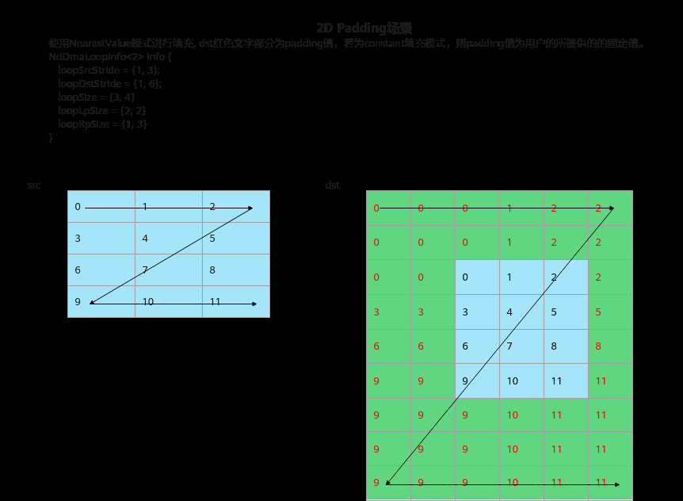
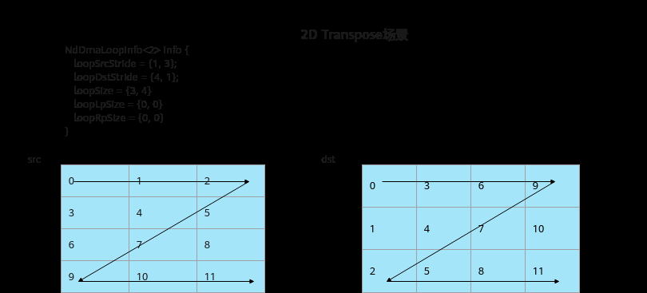
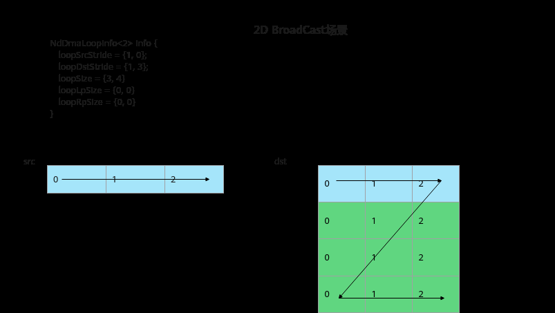
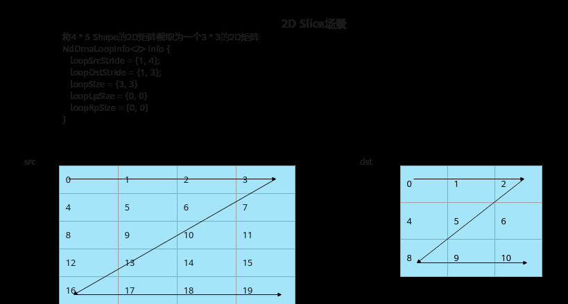
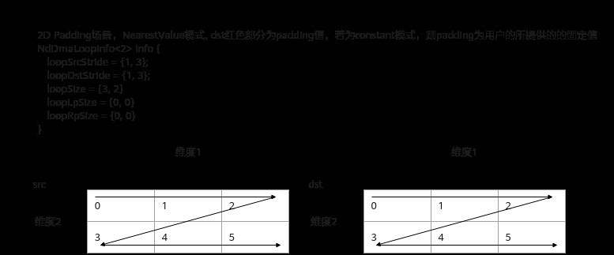

# 多维数据搬运（ISASI）

> **Section**: 6.2.3.1.1.9  
> **PDF Pages**: 940–946  

---

<!-- page 940 -->

```cpp
private:    AscendC::TPipe pipe;    // feature map queue    AscendC::TQue<AscendC::TPosition::A1, 1> inQueueFmA1;
    AscendC::TQue<AscendC::TPosition::A2, 1> inQueueFmA2;    // weight queue    AscendC::TQue<AscendC::TPosition::B1, 1> inQueueWeB1;
    AscendC::TQue<AscendC::TPosition::B2, 1> inQueueWeB2;    // bias queue    AscendC::TQue<AscendC::TPosition::A1, 1> inQueueBiasA1;    // deq tensor queue    AscendC::TQue<AscendC::TPosition::A1, 1> inQueueDeqA1;    // fb dst of deq tensor    AscendC::TQue<AscendC::TPosition::C2PIPE2GM, 1> inQueueDeqFB;    // dst queue    AscendC::TQue<AscendC::TPosition::CO1, 1> outQueueCO1;    // element-wise tensor    AscendC::TQue<AscendC::TPosition::C1, 1> inQueueC1;
    AscendC::GlobalTensor<fmap_T> fmGlobal;
    AscendC::GlobalTensor<weight_T> weGlobal;
    AscendC::GlobalTensor<dst_T> dstGlobal;
    AscendC::GlobalTensor<uint64_t> deqGlobal;
    AscendC::GlobalTensor<dstCO1_T> biasGlobal;
    AscendC::GlobalTensor<half> eleWiseGlobal;
    uint16_t channelSize = 32;
    uint16_t H = 4, W = 4;
    uint8_t Kh = 2, Kw = 2;
    uint16_t Cout;
    uint16_t C0, C1;
    uint8_t dilationH, dilationW;
    uint16_t coutBlocks, ho, wo, howo, howoRound;
    uint32_t featureMapA1Size, weightA1Size, featureMapA2Size, weightB2Size, biasSize, dstSize, dstCO1Size;
    uint16_t m, k, n;
    uint8_t fmRepeat, weRepeat;
    QuantMode_t deqMode = QuantMode_t::NoQuant;};#define KERNEL_CUBE_DATACOPY(dst_type, fmap_type, weight_type, dstCO1_type, CoutIn, dilationHIn, dilationWIn, deqModeIn)  \    extern "C" __global__ __aicore__ void cube_datacopy_kernel_##fmap_type(__gm__ uint8_t* fmGm, __gm__ uint8_t* weGm,    \        __gm__ uint8_t* biasGm, __gm__ uint8_t* deqGm, __gm__ uint8_t* eleWiseGm, __gm__ uint8_t* dstGm)                                             \    {                                                                                                                     \        if (g_coreType == AscendC::AIV) {                                                                                 \            return;                                                                                                       \        }                                                                                                                 \        KernelCubeDataCopy<dst_type, fmap_type, weight_type, dstCO1_type> op(CoutIn, dilationHIn, dilationWIn,            \            deqModeIn);                                                                                                   \        op.Init(fmGm, weGm, biasGm, deqGm, eleWiseGm, dstGm);                                                                        \        op.Process();                                                                                                     \    }KERNEL_CUBE_DATACOPY(half, int8_t, int8_t, int32_t, 128, 1, 1, QuantMode_t::DEQF16);
```

## 6.2.3.1.1.9 多维数据搬运（ISASI）

产品支持情况

产品是否支持

Atlas 350 加速卡√

Atlas A3 训练系列产品/Atlas A3 推理系列产品x

<!-- page 941 -->

产品是否支持

Atlas A2 训练系列产品/Atlas A2 推理系列产品x

Atlas 200I/500 A2 推理产品x

Atlas 推理系列产品AI Corex

Atlas 推理系列产品Vector Corex

Atlas 训练系列产品x

功能说明

多维数据搬运接口，相比于基础数据搬运接口，可更加自由配置搬入的维度信息以及对应的Stride。

函数原型

●Global Memory-> Local Memory ，支持多维度搬运template <typename T, uint8_t dim, const NdDmaConfig& config = kDefaultNdDmaConfig>__aicore__ inline void DataCopy(const LocalTensor<T>& dst, const GlobalTensor<T>& src, const NdDmaParams<T, dim>& params)

●NdDma DataCache刷新，在使用DataCopy接口进行数据搬运前，需要使用NdDmaDci接口刷新缓存保证DataCache为最新状态。__aicore__ inline void NdDmaDci()

参数说明

表6-128模板参数说明

参数名描述

T源操作数或者目的操作数的数据类型。

dim搬运的数据维度, 数据类型为uint8_t，支持的维度为[1, 5]。

config搬运配置选项，NdDmaConfig类型，定义如下，具体参数说明请参考表 NdDmaConfig结构体参数定义。struct NdDmaConfig {    static constexpr uint16_t unsetPad = 0xffff;    bool isNearestValueMode = false;    uint16_t loopLpSize = unsetPad; // Left padding size of all dimensions, must be less than 256.    uint16_t loopRpSize = unsetPad; // Right padding size of all dimensions, must be less than 256.    bool ascOptimize = false;       // used for Ascend C optimization on special senario.};

<!-- page 942 -->

表6-129参数说明

参数名称输入/输出

含义

dst输出目的操作数，类型为LocalTensor。

src输入源操作数，类型为GlobalTensor。

params输入搬运参数 NdDmaParams类型，定义如下，具体参数说明请参考表 NdDmaParams结构体参数定义。template <typename T, uint8_t dim>struct NdDmaParams  {    NdDmaLoopInfo<dim> loopInfo;    T constantValue;  // 若有左右Padding，且不使能NearestValueMode时，该值将作为Padding值填充。};

NdDmaLoopInfo类型，定义如下，具体参数说明请参考表NdDmaLoopInfo结构体参数定义。template <uint8_t dim>struct NdDmaLoopInfo  {    uint64_t loopSrcStride[dim] = {0}; // src stride info per loop.    uint32_t loopDstStride[dim] = {0}; // dst stride info per loop.    uint32_t loopSize[dim] = {0}; // Loop size per loop.    uint8_t loopLpSize[dim] = {0}; // Left padding size per loop.    uint8_t loopRpSize[dim] = {0}; // Right padding size per loop.};// 注意: dim的有效范围为[1,5]

表6-130 NdDmaConfig 结构体参数定义

参数名称含义

unsetPad表示不设置PaddingSize，固定为0xFFFF。

表示Padding值填取方式，类型为bool。

isNearestValueMode

True：使能最近值填充方式，即左右Padding值会选取当前维度最左或最右的值进行填充，可参考图6-9。

False：使能常数填充方式，即所有Padding值填充为固定值NdDmaParams::constantValue。

当数据类型为b64时，参数isNearestValueMode的值应为False。

loopLpSize

表示每个维度内的PaddingSize，当该值不为unsetPad时，则表示所有循环里的左PaddingSize为该值，且会使NdDmaLoopInfo::loopLpSize不生效。默认值为unsetPad，开发者可填的范围为默认值或[0,255]。

loopRpSize

表示每个维度内的PaddingSize，当该值不为unsetPad时，则表示所有循环里的右PaddingSize为该值，且会使NdDmaLoopInfo::loopRpSize不生效。默认值为unsetPad，开发者可填的范围为默认值或[0,255]。

ascOptimize

预留参数，暂不支持。

<!-- page 943 -->

表6-131 NdDmaParams 结构体参数定义

参数名称含义

loopInfo每维进行搬运的信息，类型为NdDmaLoopInfo<dim>。

NdDmaLoopInfo结构中数组类型的参数，其数组索引值对应实际维度信息，索引0 - 4对应1 - 5维。具体参数介绍可参考表NdDmaLoopInfo结构体参数定义。

constantValue

数据类型为T的数值，当存在维度左右Padding，且不使能NearestValueMode时，该值将作为Padding值填充。

当数据类型为b64时，参数constantValue的值应为0。

表6-132 NdDmaLoopInfo 结构体参数定义

参数名称含义

loopSrcStride

表示每个维度内，该源操作数元素与下一个元素间的间隔。

单位为元素个数。数据类型为uint64_t，srcStride需在[0, 240)。

loopDstStride

表示每个维度内，该目的操作数元素与下一个元素间的间隔。

单位为元素个数。数据类型为uint32_t，dstStride需在[0, 220)。

loopSize表示每个维度内，处理的元素个数（不包含Padding元素）。

单位为元素个数。数据类型为uint32_t，dstStride需在[0, 220)。

loopLpSize

表示每个维度内，左侧需要补齐的元素个数。

单位为元素个数。数据类型为uint8_t，srcStride不要超出该数据类型的取值范围。

loopRpSize

表示每个维度内，右侧需要补齐的元素个数。

单位为元素个数。数据类型为uint8_t，srcStride不要超出该数据类型的取值范围。

以下以2维的例子介绍几个典型使用场景。

<!-- page 944 -->

图6-9 2D Padding 场景



图6-10 2D Transpose 场景



<!-- page 945 -->

图6-11 2D BroadCast 场景



图6-12 2D Slice 场景



通路说明

表6-133数据通路和数据类型

源操作数和目的操作数的数据类型 (两者保持一致)

支持型号

数据通路（通过TPosition表达）

Atlas350 加速卡

GM -> VECINb8、b16、b32、b64

<!-- page 946 -->

返回值说明

无

约束说明

●一条指令所能获取的所有数据的地址范围宽度不能超过40位（1TB），即：

源操作数的每一次循环的大小为：(loopLpSize + loopSize + loopRpSize -1 ) *loopSrcSize，目的操作数的每一次循环的大小为：(loopLpSize + loopSize +loopRpSize -1 ) * loopDstSize，所有的循环的大小加起来不超过2的40次方位。

●当每层循环的dstStride为升序序列，则不同循环间的地址空间不能交织或者重叠。以一个2D Padding场景为例，loopSrcStride、loopDstStride第二个维度的stride值最小是3，数据3不能落在维度1的循环中。



●该接口通过NDDMA进行数据搬运，对应的NDDMA Cache大小为32KB，在使用DataCopy接口进行数据搬运前，需要使用NdDmaDci接口刷新缓存，否则多核场景下读写同一块GM地址可能会导致部分核读取数据错误。

调用示例

// T：搬运数据的类型// xGm：保存DataCopy搬入数据// xLocal：保存DataCopy搬出数据

// 2D Padding场景// xGmShape：[2, 8]，搬运8列2行数据，左Padding 3，上Padding 1，右Padding 5，下Padding 1，xLocalShape：[4, 16]AscendC::NdDmaLoopInfo<2> loopInfo{{1, 8}, {1, 16}, {8, 2}, {3, 1}, {5, 1}};AscendC::NdDmaParams<T, 2> params{loopInfo, 0};  // padding的值为0AscendC::NdDmaDci();  // 刷新cachestatic constexpr AscendC::NdDmaConfig dmaConfig;  // 使用默认参数，也可以不传AscendC::DataCopy<T, 2, dmaConfig>(xLocal, xGm, params);

结果示例如下：输入数据（xGm）:[[ 1.  2.  3.  4.  5.  6.  7.  8.] [ 9. 10. 11. 12. 13. 14. 15. 16.]]搬运至Local的数据（xLocal）:[[ 0.  0.  0.  0.  0.  0.  0.  0.  0.  0.  0.  0.  0.  0.  0.  0.] [ 0.  0.  0.  1.  2.  3.  4.  5.  6.  7.  8.  0.  0.  0.  0.  0.] [ 0.  0.  0.  9. 10. 11. 12. 13. 14. 15. 16.  0.  0.  0.  0.  0.] [ 0.  0.  0.  0.  0.  0.  0.  0.  0.  0.  0.  0.  0.  0.  0.  0.]]
