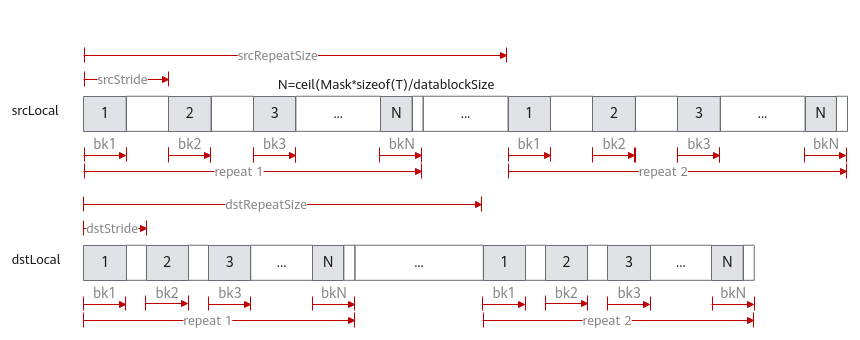

# Copy

> **Section**: 6.2.3.1.3  
> **PDF Pages**: 958–961  

---

<!-- page 958 -->

结果示例：输入数据src0Global: [1 2 3 ... 32]输出数据dstGlobal:[1 2 3 ... 20]

## 6.2.3.1.3 Copy

产品支持情况

产品是否支持

Atlas 350 加速卡√

Atlas A3 训练系列产品/Atlas A3 推理系列产品√

Atlas A2 训练系列产品/Atlas A2 推理系列产品√

Atlas 200I/500 A2 推理产品√

Atlas 推理系列产品AI Corex

Atlas 推理系列产品Vector Corex

Atlas 训练系列产品x

功能说明

VECIN，VECCALC，VECOUT之间的搬运指令，支持mask操作和DataBlock间隔操作。

函数原型

●tensor前n个数据计算// 该函数原型仅支持Atlas 350 加速卡template <typename T, bool isSetMask = true>__aicore__ inline void Copy(const LocalTensor<T>& dst, const LocalTensor<T>& src, const uint32_t count)

●tensor高维切分计算

–mask逐bit模式template <typename T, bool isSetMask = true>__aicore__ inline void Copy(const LocalTensor<T>& dst, const LocalTensor<T>& src, const uint64_t mask[], const uint8_t repeatTime, const CopyRepeatParams& repeatParams)

–mask连续模式template <typename T, bool isSetMask = true>__aicore__ inline void Copy(const LocalTensor<T>& dst, const LocalTensor<T>& src, const uint64_t mask, const uint8_t repeatTime, const CopyRepeatParams& repeatParams)

<!-- page 959 -->

参数说明

表6-141模板参数说明

参数名描述

T操作数数据类型。

Atlas 350 加速卡，支持的数据类型为：uint8_t/int8_t/hifloat8_t/fp8_e4m3fn_t/fp8_e5m2_t/fp4x2_e2m1_t/fp4x2_e1m2_t/fp8_e8m0_t/uint16_t/int16_t/half/bfloat16_t/float/uint32_t/int32_t/uint64_t/int64_t

Atlas A3 训练系列产品/Atlas A3 推理系列产品，支持的数据类型为：uint16_t/int16_t/half/bfloat16_t/uint32_t/int32_t/float

Atlas A2 训练系列产品/Atlas A2 推理系列产品，支持的数据类型为：uint16_t/int16_t/half/bfloat16_t/uint32_t/int32_t/float

Atlas 200I/500 A2 推理产品，支持的数据类型为：uint16_t/int16_t/half/bfloat16_t/uint32_t/int32_t/float

isSetMask是否在接口内部设置mask。

●true，表示在接口内部设置mask。

●false，表示在接口外部设置mask，开发者需要使用SetVectorMask接口设置mask值。这种模式下，本接口入参中的mask值必须设置为占位符MASK_PLACEHOLDER。

表6-142参数说明

参数名输入/输出

描述

dst输出目的操作数。

类型为LocalTensor，支持的TPosition为VECIN/VECCALC/VECOUT。起始地址需要保证32字节对齐。

src输入源操作数。

类型为LocalTensor，支持的TPosition为VECIN/VECCALC/VECOUT。起始地址需要保证32字节对齐。

源操作数的数据类型需要与目的操作数保持一致。

count输入参与搬运的元素个数。

<!-- page 960 -->

参数名输入/输出

描述

mask/mask[]

输入mask用于控制每次迭代内参与计算的元素。

●逐bit模式：可以按位控制哪些元素参与计算，bit位的值为1表示参与计算，0表示不参与。mask为数组形式，数组长度和数组元素的取值范围和操作数的数据类型有关。当操作数为16位时，数组长度为2，mask[0]、mask[1]∈[0, 264-1]并且不同时为0；当操作数为32位时，数组长度为1，mask[0]∈(0,264-1]；当操作数为64位时，数组长度为1，mask[0]∈(0, 232-1]。

例如，mask=[8, 0]，8=0b1000，表示仅第4个元素参与计算。

●连续模式：表示前面连续的多少个元素参与计算。取值范围和操作数的数据类型有关，数据类型不同，每次迭代内能够处理的元素个数最大值不同。当操作数为16位时，mask∈[1, 128]；当操作数为32位时，mask∈[1,64]；当操作数为64位时，mask∈[1, 32]。

repeatTime输入重复迭代次数。矢量计算单元，每次读取连续的256Bytes数据进行计算，为完成对输入数据的处理，必须通过多次迭代（repeat）才能完成所有数据的读取与计算。repeatTime表示迭代的次数。

关于该参数的具体描述请参考2.5.2.2.2 高维切分API。

repeatParams

输入控制操作数地址步长的数据结构。CopyRepeatParams类型。

具体定义请参考${INSTALL_DIR}/include/ascendc/basic_api/interface/kernel_struct_data_copy.h，${INSTALL_DIR}请替换为CANN软件安装后文件存储路径。

参数说明请参考表6-143。

表6-143 CopyRepeatParams 结构体参数说明

参数名称含义

dstStride、srcStride

用于设置同一迭代内datablock的地址步长，取值范围为[0,65535]。

同一迭代内datablock的地址步长参数说明请参考dataBlockStride。

dstRepeatSize、srcRepeatSize

用于设置相邻迭代间的地址步长，取值范围为[0,4095]。

相邻迭代间的地址步长参数说明请参考repeatStride。

返回值说明

无

<!-- page 961 -->

约束说明

●源操作数和目的操作数的起始地址需要保证32字节对齐。

●tensor前n个数据计算接口仅支持Atlas 350 加速卡。

●针对Atlas 350 加速卡，uint8_t/int8_t/hifloat8_t/fp8_e4m3fn_t/fp8_e5m2_t/fp4x2_e2m1_t/fp4x2_e1m2_t/fp8_e8m0_t/uint64_t/int64_t数据类型仅支持tensor前n个数据计算接口。

●针对Atlas 350 加速卡，tensor前n个数据计算接口中的isSetMask参数不生效，保持默认值即可。

●Copy和矢量计算API一样，支持和掩码操作API配合使用。但Counter模式配合高维切分计算API时，和通用的Counter模式有一定差异。具体差异如下：

–通用的Counter模式：Mask代表整个矢量计算参与计算的元素个数，迭代次数不生效。

–Counter模式配合Copy高维切分计算API，Mask代表每次Repeat中处理的元素个数，迭代次数生效。示意图如下：

调用示例

本示例仅展示Compute流程中的部分代码。

本示例中操作数数据类型为int16_t。

●tensor前n个数据计算AscendC::Copy(dstLocal, srcLocal, 512);

结果示例如下：输入数据srcLocal：[9 -2 8 ... 9]输出数据dstLocal:[9 -2 8 ... 9]

●mask连续模式uint64_t mask = 128;// repeatTime = 4, 128 elements one repeat, 512 elements total// dstStride, srcStride = 1, no gap between blocks in one repeat// dstRepStride, srcRepStride = 8, no gap between repeatsAscendC::Copy(dstLocal, srcLocal, mask, 4, { 1, 1, 8, 8 });

结果示例如下：

输入数据srcLocal:[9 -2 8 ... 9]输出数据dstLocal:[9 -2 8 ... 9]

●mask逐bit模式uint64_t mask[2] = { UINT64_MAX, UINT64_MAX };// repeatTime = 4, 128 elements one repeat, 512 elements total// dstStride, srcStride = 1, no gap between blocks in one repeat
