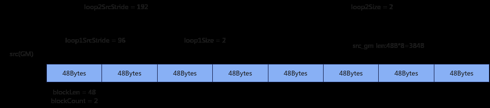
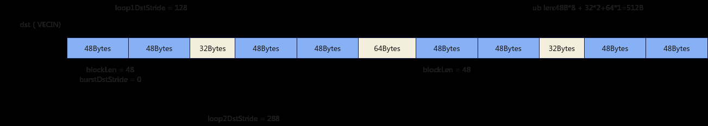

# SetLoopModePara

> **Section**: 6.2.3.1.5  
> **PDF Pages**: 964–966  

---

<!-- page 964 -->

## 6.2.3.1.5 SetLoopModePara

产品支持情况

产品是否支持

Atlas 350 加速卡√

Atlas A3 训练系列产品/Atlas A3 推理系列产品x

Atlas A2 训练系列产品/Atlas A2 推理系列产品x

Atlas 200I/500 A2 推理产品x

Atlas 推理系列产品AI Corex

Atlas 推理系列产品Vector Corex

Atlas 训练系列产品x

功能说明

DataCopy、DataCopyPad过程中通过该接口使能loop mode并且设置loop mode的参数，需要和ResetLoopModePara搭配使用，在数据搬运结束后通过ResetLoopModePara重置loop mode的参数。支持的通路如下：

●GM->VECIN

●VECOUT->GM

函数原型

```cpp
__aicore__ inline void SetLoopModePara(const LoopModeParams& loopParams, DataCopyMVType type)
```

参数说明

表6-146参数说明

参数名输入/输出

描述

loopParams

输入循环模式参数 LoopModeParams类型，定义如下，具体参数说明请参考表6-147。struct LoopModeParams {        loop1Size = 0;        loop2Size = 0;        loop1SrcStride = 0;        loop1DstStride = 0;        loop2SrcStride = 0;        loop2DstStride = 0 ;};

<!-- page 965 -->

参数名输入/输出

描述

type输入数据搬运模式。DataCopyMVType为枚举类型，定义如下，具体参数说明请参考表6-148。enum class DataCopyMVType : uint8_t {    UB_TO_OUT = 0,    OUT_TO_UB = 1,};

表6-147 LoopModeParams 结构体参数说明

参数名称含义

loop1Size用于设置内层循环的循环次数，数据类型为uint32_t，取值范围为[0,2^21)。

loop2Size用于设置外层循环的循环次数，数据类型为uint32_t，取值范围为[0,2^21)。

loop1SrcStride

用于设置内层循环中相邻迭代源操作数的数据块间的间隔，单位为Byte，数据类型为uint64_t。

●当数据搬运模式是UB_TO_OUT的时候取值范围为[0, 2^21)，并且loop1SrcStride必须32B对齐。

●当数据搬运模式是OUT_TO_UB的时候取值范围为[0, 2^40)。

loop1DstStride

用于设置内层循环中相邻迭代目的操作数的数据块间的间隔，单位为Byte，数据类型为uint64_t。

●当数据搬运模式是UB_TO_OUT的时候取值范围为[0, 2^40)。

●当数据搬运模式是OUT_TO_UB的时候取值范围为[0, 2^21)，并且loop1DstStride必须32B对齐。

loop2SrcStride

用于设置外层循环中相邻迭代源操作数的数据块间的间隔，单位为Byte，数据类型为uint64_t。

●当数据搬运模式是UB_TO_OUT的时候取值范围为[0, 2^21)，并且loop2SrcStride必须32B对齐。

●当数据搬运模式是OUT_TO_UB的时候取值范围为[0, 2^40)。

loop2DstStride

用于设置外层循环中相邻迭代目的操作数的数据块间的间隔，单位为Byte，数据类型为uint64_t。

●当数据搬运模式是UB_TO_OUT的时候取值范围为[0, 2^40)。

●当数据搬运模式是OUT_TO_UB的时候取值范围为[0, 2^21)，并且loop2DstStride必须32B对齐。

<!-- page 966 -->

表6-148 DataCopyMVType 结构体参数说明

参数名称含义

UB_TO_OUT

从UB搬运到GM的通路。

OUT_TO_UB

从GM搬运到UB的通路。

下面的样例呈现了SetLoopModePara的使用方法。

●样例中在数据类型为int8_t的场景下，数据块大小为384，配置DataCopyPad的数据搬运模式为Compact模式，blockLen = 48，blockCount = 2，表明每个连续传输数据块包含48Bytes，且连续传输数据块有两个，srcStride = 0, dstStride = 0，isPad = false，表明源操作数相邻数据块之间没有间隔且不需要填充用户自定义的数据；

●再设置SetLoopModePara中LoopModeParams的参数：loop1Size = 2，loop2Size = 2，loop1SrcStride = 96，loop2SrcStride =192，loop1DstStride =128，loop2DstStride = 288，DataCopyMVType为OUT_TO_UB，表明内层循环和外层循坏的次数分别为2次，内层循环和外层循环中相邻迭代源操作数的数据块间隔分别为96Bytes和192Bytes，内层循环和外层循环中相邻迭代目的操作数的数据块间隔分别为128Bytes和288Bytes，通路是从GM搬运到UB；

●使用以上配置，调用SetLoopModePara再调用DataCopyPad就可以开启DataCopyPad的loop模式完成数据类型为int8_t的数据块大小为384的数据搬运。详细图解如下：

图6-14源操作数搬运场景示例



图6-15目的操作数搬运场景示例



返回值说明

无
