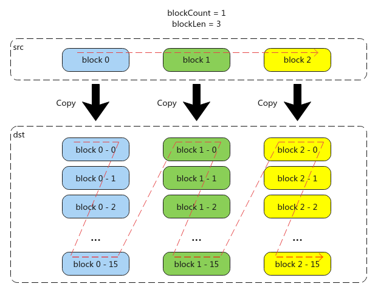

# BroadCastVecToMM(ISASI)

> **Section**: 6.2.3.1.7  
> **PDF Pages**: 968–970  

---

<!-- page 968 -->

函数原型

```cpp
__aicore__ inline void ResetLoopModePara(DataCopyMVType type)
```

参数说明

表6-149参数说明

参数名输入/输出

描述

type输入数据搬运模式。DataCopyMVType为枚举类型，定义如下，具体参数说明请参考表6-148。enum class DataCopyMVType : uint8_t {    UB_TO_OUT = 0,    OUT_TO_UB = 1,};

返回值说明

无

约束说明

无

调用示例

本示例中操作数数据类型为int8_t。

AscendC::LocalTensor<int8_t> srcLocal = inQueueSrc.AllocTensor<int8_t>();AscendC::DataCopyExtParams copyParams{2, 48 * sizeof(int8_t), 0, 0, 0}; // 结构体DataCopyExtParams最后一个参数是rsv保留位AscendC::DataCopyPadExtParams<half> padParams{false, 0, 0, 0};AscendC::LoopModeParams loopParam2Ub {2, 2, 96, 128, 192, 288};AscendC::SetLoopModePara(loopParam2Ub, DataCopyMVType::OUT_TO_UB);AscendC::DataCopyPad<int8_t, PaddingMode::Compact>(srcLocal, srcGlobal, copyParams, padParams); // 从GM->VECIN搬运 48 * 2 * 2 * 2 = 384BytesAscendC::ResetLoopModePara(DataCopyMVType::OUT_TO_UB);AscendC::LoopModeParams loopParam2Gm {2, 2, 128, 96, 288, 192};AscendC::SetLoopModePara(loopParams2Gm, DataCopyMVType::UB_TO_OUT);DataCopyPad<T, PaddingMode::Compact>(dstGlobal, srcLocal, copyParams);AscendC::ResetLoopModePara(DataCopyMVType::UB_TO_OUT);

## 6.2.3.1.7 BroadCastVecToMM(ISASI)

产品支持情况

产品是否支持

Atlas 350 加速卡x

Atlas A3 训练系列产品/Atlas A3 推理系列产品x

Atlas A2 训练系列产品/Atlas A2 推理系列产品x

<!-- page 969 -->

产品是否支持

Atlas 200I/500 A2 推理产品x

Atlas 推理系列产品AI Core√

Atlas 推理系列产品Vector Corex

Atlas 训练系列产品x

功能说明

将矢量数据广播到矩阵中，每个数据块中的每16个elements会被连续复制16次；当前支持的数据传输通路：VECIN/VECCALC/VECOUT->CO1。

图6-16功能示例



函数原型

```cpp
template <typename T, typename U>__aicore__ inline void BroadCastVecToMM(const LocalTensor<T> &dst, const LocalTensor<U> &src, const int32_t blockCount, const uint8_t blockLen, const uint8_t srcGap, const uint8_t dstGap)
```

<!-- page 970 -->

参数说明

表6-150模板参数说明

参数名描述

Tdst的数据类型。

Atlas 推理系列产品AI Core，支持的数据类型为：half/int16_t/uint16_t

Usrc的数据类型。

Atlas 推理系列产品AI Core，支持的数据类型为：half/int16_t/uint16_t

表6-151参数说明

参数名称类型说明

dst输出目的操作数，结果矩阵，类型为LocalTensor，支持的TPosition为CO1。

LocalTensor的起始地址需要256个元素对齐。

支持的数据类型为：half/float/int32_t。

src输入源操作数，输入矢量，类型为LocalTensor，支持的TPosition为VECIN/VECCALC/VECOUT。

支持的数据类型需要与dst一致。

blockCount输入指定该指令包含的连续广播数据块个数，取值范围：blockCount∈[1, 255]。

blockLen输入指定该指令每个连续广播数据块长度，单位为16个elements。取值范围：blockLen∈[1, 255]。

srcGap输入源操作数，相邻连续数据块的间隔（前面一个数据块的尾与后面数据块的头的间隔），单位为datablock(32Bytes)。

dstGap输入目的操作数，相邻连续数据块间的间隔（前面一个数据块的尾与后面数据块的头的间隔），单位为256个elements。

约束说明

●操作数地址对齐要求请参见通用地址对齐约束。

调用示例

本示例中，输入bias形状为[1, 32]，输出c的形状为[32, 32]，格式为Nz。
