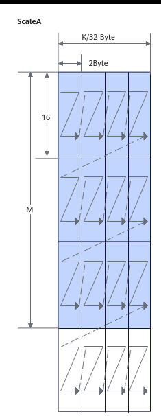

# Load2DMX

> **Section**: 2  
> **PDF Pages**: 980–983  

---

<!-- page 980 -->

```cpp
featureMapA2Size = howoRound * (C1 * Kh * Kw * C0);fmRepeat = featureMapA2Size / (16 * C0);
AscendC::LocalTensor<half> featureMapA1 = inQueueFmA1.DeQue<half>();AscendC::LocalTensor<half> featureMapA2 = inQueueFmA2.AllocTensor<half>();
AscendC::LoadData<A2, A1, half>(featureMapA2, featureMapA1, { padList, H, W, 0, 0, 0, -1, -1, strideW, strideH, Kw, Kh, dilationW, dilationH, 1, 0, fmRepeat, 0, (half)(0)});
LoadData2DParamsV2 param = { padList, H, W, 0, 0, 0, -1, -1, strideW, strideH, Kw, Kh, dilationW, dilationH, 1, 0, fmRepeat, 0, (half)(0)};Load2DBitModeParam paramBitMode(param);
 AscendC::LoadData<A2, A1, half>(featureMapA2, featureMapA1, paramBitMode);
```

## ?.2. Load2DMX

产品支持情况

产品是否支持

Atlas 350 加速卡√

Atlas A3 训练系列产品/Atlas A3 推理系列产品x

Atlas A2 训练系列产品/Atlas A2 推理系列产品x

Atlas 200I/500 A2 推理产品x

Atlas 推理系列产品AI Corex

Atlas 推理系列产品Vector Corex

Atlas 训练系列产品x

功能说明

Load2D支持如下数据通路的搬运：

GM->A1; GM->B1; GM->A2; GM->B2;

A1->A2; B1->B2。

函数原型

●Load2DMX接口template <typename T, typename U = T>__aicore__ inline void LoadData(const LocalTensor<U>& dst, const LocalTensor<T>& src, const LocalTensor<fp8_e8m0_t>& srcMx, const LoadData2DParamsV2& loadDataParams, const LoadData2DMxParams& loadMxDataParams)

●Load2Dv2MX接口，支持源操作数和目的操作数数据类型不一致template <typename T, typename U>__aicore__ inline void LoadData(const LocalTensor<U>& dst, const LocalTensor<T>& src0, const LocalTensor<fp8_e8m0_t>& srcMx, const LoadData2DParamsV2& loadDataParams, const LoadData2DMxParams& loadMxDataParams)

<!-- page 981 -->

参数说明

表6-159模板参数说明

参数名称含义

T源操作数和目的操作数的数据类型。

●Load2DMX接口Atlas 350 加速卡，支持数据类型为：fp4x2_e2m1_t/fp4x2_e1m2_t/fp8_e4m3fn_t/fp8_e5m2_t

U●针对Load2DMX接口，U用来表示dst的数据类型，当src为fp8_e4m3fn_t、fp8_e5m2_t时，U需为T对应的MX数据类型，即AscendC::mx_fp8_e4m3_t和AscendC::mx_fp8_e5m2_t，否则编译失败。除此之外的数据类型要求T和U一致。

表6-160通用参数说明

参数名称输入/输出

含义

dst输出目的操作数，类型为LocalTensor。

数据连续排列顺序由目的操作数所在TPosition决定，具体约束如下：

●A2：ZZ格式/NZ格式；对应的分形大小为16 * (32B /sizeof(T))。

●B2：ZN格式；对应的分形大小为 (32B / sizeof(T)) *16。

●A1/B1：无格式要求，一般情况下为NZ格式。NZ格式下，对应的分形大小为16 * (32B / sizeof(T))。

src输入源操作数，类型为LocalTensor或GlobalTensor。

数据类型需要与dst保持一致。

srcMx输入源操作数，类型为LocalTensor，仅支持fp8_e8m0_t类型。

loadDataParams

输入LoadData参数结构体，类型为：

●LoadData2DMxParams，具体参考表6-161。

上述结构体参数定义请参考${INSTALL_DIR}/include/ascendc/basic_api/interface/kernel_struct_mm.h，${INSTALL_DIR}请替换为CANN软件安装后文件存储路径。

表6-161 LoadData2DMxParams 结构体参数说明

参数名称含义

xStartPosition

源矩阵X轴方向的起始位置，即M维度方向，单位为1个分形（1个单位代表一个32B的分形）。

<!-- page 982 -->

参数名称含义

yStartPosition

源矩阵Y轴方向的起始位置，即K维度方向，单位为32B。

xStep源矩阵X轴方向搬运长度，即M维度方向，单位为1个分形（1个单位代表一个32B的分形）。取值范围：xStep∈[0, 255]。

yStep源矩阵Y轴方向搬运长度，即K维度方向，单位为32B。取值范围：yStep∈[0, 255]。

srcStride源矩阵X方向前一个分形起始地址与后一个分形起始地址的间隔，单位为32B。

dstStride目标矩阵X方向前一个分形起始地址与后一个分形起始地址的间隔，单位为32B。

下面通过一个具体的示例来解释LoadData2DMX结构体参数。假设A矩阵shape为（M，K），则ScaleA矩阵shape为（M，K/32），ScaleA数据类型为fp8_e8m0_t，ScaleA矩阵分形排布见图6-19。

<!-- page 983 -->

图6-19 ScaleA 在L0A 的分形排布



下图为ScaleA从L1搬运至L0A过程中的配置参数示意。每一行为32Byte，对应着图6-19中的一个分形。xStep为M维度分形的个数，如图中的xStep = M / 16 = 3，yStep为K维度32Byte的个数，如图中的yStep = K / 32 / 2 = 21，srcStride和dstStride同理，表示在K维度上32Byte的个数。
