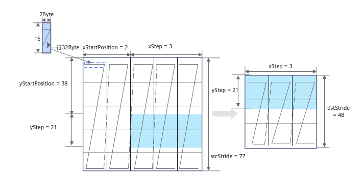

# Load2DBitMode

> **Section**: 3  
> **PDF Pages**: 984–989  

---

<!-- page 984 -->



约束说明

●操作数地址对齐要求请参见通用地址对齐约束。

返回值说明

无

## ?.3. Load2DBitMode

产品支持情况

产品是否支持

Atlas 350 加速卡√

Atlas A3 训练系列产品/Atlas A3 推理系列产品x

Atlas A2 训练系列产品/Atlas A2 推理系列产品x

Atlas 200I/500 A2 推理产品x

Atlas 推理系列产品AI Corex

Atlas 推理系列产品Vector Corex

Atlas 训练系列产品x

功能说明

Load2D支持如下数据通路的搬运：

GM->A1; GM->B1; GM->A2; GM->B2;

A1->A2; B1->B2。

<!-- page 985 -->

函数原型

```cpp
template <TPosition Dst, TPosition Src, typename T>__aicore__ inline void LoadData(const LocalTensor<T>& dst, const LocalTensor<T>& src,const Load2DBitModeParam& loadDataParam)
```

参数说明

表6-162模板参数说明

参数名称含义

T源操作数和目的操作数的数据类型。

Atlas 350 加速卡，仅支持A1->A2、B1->B2，支持数据类型为：half/bfloat16_t/uint32_t/int32_t/float/uint8_t/int8_t/fp8_e4m3fn_t/fp8_e5m2_t/hifloat8_t/fp4x2_e2m1_t/fp4x2_e1m2_t

Src源操作数存储的逻辑位置（TPosition），仅Load2DBitMode接口使用。

Dst目的操作数存储的逻辑位置（TPosition），仅Load2DBitMode接口使用。

表6-163通用参数说明

参数名称输入/输出

含义

dst输出目的操作数，类型为LocalTensor。

数据连续排列顺序由目的操作数所在TPosition决定，具体约束如下：

●A2：ZZ格式/NZ格式；对应的分形大小为16 * (32B /sizeof(T))。

●B2：ZN格式；对应的分形大小为 (32B / sizeof(T)) *16。

●A1/B1：无格式要求，一般情况下为NZ格式。NZ格式下，对应的分形大小为16 * (32B / sizeof(T))。

src输入源操作数，类型为LocalTensor或GlobalTensor。

数据类型需要与dst保持一致。

loadDataParams

输入LoadData参数结构体，类型为：

●Load2DBitModeParam，具体参考表6-164。

上述结构体参数定义请参考${INSTALL_DIR}/include/ascendc/basic_api/interface/kernel_struct_mm.h，${INSTALL_DIR}请替换为CANN软件安装后文件存储路径。

<!-- page 986 -->

表6-164 Load2DBitModeParam 类参数说明

参数名称含义

config0uint64_t类型，与Load2DBitModeConfig0位域（bit-field）结构体类型参数config0BitMode组成联合体（union），初始化为0，可以使用类对象的GetConfig0()函数获取其值。

config0BitMode

Load2DBitModeConfig0位域（bit-field）结构体类型，参数参考表6-165，与config0组成联合体（union）。

config1uint64_t类型，与Load2DBitModeConfig1位域（bit-field）结构体类型参数config1BitMode组成联合体（union），初始化为0，可以使用类对象的GetConfig1()函数获取其值。

config1BitMode

Load2DBitModeConfig1位域（bit-field）结构体类型，参数参考表6-166，与config1组成联合体（union）。

ifTranspose是否启用转置功能，对每个分形矩阵进行转置，默认为false。含义与LoadData2DParamsV2结构体中的同名参数含义相同，具体参考表6-158。

●true：启用

●false：不启用

注意：只有A1->A2和B1->B2通路才能使能转置。使能转置功能时，支持的数据类型约束如下：

源操作数、目的操作数支持b4、b8、b16、b32数据类型。

Load2DBitModeParam类参数设计思想说明：

联合体（union）是一种特殊的数据结构，允许在相同的内存位置存储不同的数据类型。union的所有成员共享同一块内存空间，大小由最大成员决定，同一时间只能使用一个成员。

位域（bit-field）是一种特殊的类成员，允许精确控制结构体中成员变量所占用的内存位数。结构体中成员变量从上到下对应内存中从低位到高位。

Load2DBitModeParam类使用union与bit-field方法，采用bit位表达参数类型，使用bit-field结构体自动处理入参的bit位数，并利用union的特性实现多参数融合传递，仅需传递一个入参即可包含全部所需信息，对应底层接口仅需要接收一个参数。同时，当需要修改参数中某一bit位的值时，仅需要通过循环和位运算即可实现，不需要重新传入参数，减少了scalar计算，实现性能提升。

Load2DBitModeParam类可以直接使用LoadData2DParamsV2结构体类型对象初始化：

LoadData2DParamsV2 loadDataParams;loadDataParams.mStartPosition = 0;loadDataParams.kStartPosition = 0;loadDataParams.mStep = xxx;loadDataParams.kStep = xxx;loadDataParams.srcStride = xxx;loadDataParams.dstStride = xxx;loadDataParams.sid = 0;loadDataParams.ifTranspose = false;Load2DBitModeParam params(loadDataParams);  // 直接使用LoadData2DParamsV2结构体类型对象初始化

<!-- page 987 -->

也可以使用各参数的Set函数修改参数值，并且由于使用了联合体，还可以对congfig0和config1直接进行逐bit位修改来修改参数。

表6-165 Load2DBitModeConfig0 结构体参数说明

参数名称含义

mStartPosition

以M*K矩阵为例，源矩阵M轴方向的起始位置，单位为16个元素。

该参数是位域结构体的最低位参数，占用16bit，可以使用Load2DBitModeParam类对象的SetMStartPosition()函数设置其值，使用GetMStartPosition()函数获取其值，具体参考表6-167。

kStartPosition

以M*K矩阵为例，源矩阵K轴方向的起始位置，单位为32B。

该参数是位域结构体的第二低位参数，占用16bit，可以使用Load2DBitModeParam类对象的SetKStartPosition()函数设置其值，使用GetKStartPosition()函数获取其值，具体参考表6-167。

mStep以M*K矩阵为例，源矩阵M轴方向搬运长度，单位为16 element。取值范围：mStep∈[0, 255]。

通过ifTranspose参数启用转置功能时，mStep除需满足 [0, 255]的取值范围外，还需满足以下额外约束：

●当数据类型为b4时，mStep必须是4的倍数；

●当数据类型为b8时，mStep必须是2的倍数；

●当数据类型为b16时，mStep必须是1的倍数；

●当数据类型为b32时，mStep无额外约束。

该参数是位域结构体的第三低位参数，占用8bit，可以使用Load2DBitModeParam类对象的SetMStep()函数设置其值，使用GetMStep()函数获取其值，具体参考表6-167。

kStep以M*K矩阵为例，源矩阵K轴方向搬运长度，单位为32B。取值范围：kStep∈[0, 255]。

通过ifTranspose参数启用转置功能时，kStep除需满足[0,255]的取值范围外，还需满足以下额外约束：

●当数据类型为b4、b8或b16时，kStep没有额外约束；

●当数据类型为b32时，kStep必须是2的倍数。

该参数是位域结构体的最高位参数，占用8bit，可以使用Load2DBitModeParam类对象的SetKStep()函数设置其值，使用GetKStep()函数获取其值，具体参考表6-167。

Load2DBitModeConfig0结构体参数的含义与LoadData2DParamsV2结构体中的同名参数含义相同，具体参考表6-158。

<!-- page 988 -->

表6-166 Load2DBitModeConfig1 结构体参数说明

参数名称含义

srcStride以M*K矩阵为例，源矩阵K方向前一个分形起始地址与后一个分形起始地址的间隔，单位：512B。

该参数是位域结构体的最低位参数，占用16bit，可以使用Load2DBitModeParam类对象的SetSrcStride()函数设置其值，使用GetSrcStride()函数获取其值，具体参考表6-167。

dstStride以M*K矩阵为例，目标矩阵K方向前一个分形起始地址与后一个分形起始地址的间隔，单位：512B。

该参数是位域结构体的最高位参数，占用16bit，可以使用Load2DBitModeParam类对象的SetDstStride()函数设置其值，使用GetDstStride()函数获取其值，具体参考表6-167。

Load2DBitModeConfig1结构体参数的含义与LoadData2DParamsV2结构体中的同名参数含义相同，具体参考表6-158。

表6-167 Load2DBitModeParam 类成员函数说明

函数名称功能

将Load2DBitModeConfig0结构体参数mStartPosition的值设置为mStartPosition_。

voidSetMStartPosition(uint32_tmStartPosition_)

将Load2DBitModeConfig0结构体参数kStartPosition的值设置为kStartPosition_。

voidSetKStartPosition(uint32_tkStartPosition_)

voidSetMStep(uint16_tmStep_)

将Load2DBitModeConfig0结构体参数mStep的值设置为mStep_。

voidSetKStep(uint16_tkStep_)

将Load2DBitModeConfig0结构体参数kStep的值设置为kStep_。

voidSetSrcStride(int32_tsrcStride_)

将Load2DBitModeConfig1结构体参数srcStride的值设置为srcStride_。

<!-- page 989 -->

函数名称功能

将Load2DBitModeConfig1结构体参数dstStride的值设置为dstStride_。

voidSetDstStride(uint16_tdstStride_)

获取Load2DBitModeConfig0结构体参数mStartPosition的值。

uint32_tGetMStartPosition()const

获取Load2DBitModeConfig0结构体参数kStartPosition的值。

uint32_tGetKStartPosition()const

获取Load2DBitModeConfig0结构体参数mStep的值。

uint16_tGetMStep()const

获取Load2DBitModeConfig0结构体参数kStep的值。

uint16_tGetKStep()const

获取Load2DBitModeConfig1结构体参数srcStride的值。

int32_tGetSrcStride() const

获取Load2DBitModeConfig1结构体参数dstStride的值。

uint16_tGetDstStride() const

约束说明

●操作数地址对齐要求请参见通用地址对齐约束。

返回值说明

无

调用示例

```cpp
#include "kernel_operator.h"uint16_t C1 = 2;uint16_t H = 4, W = 4;uint8_t Kh = 2, Kw = 2;uint16_t Cout = 16;uint16_t C0 = 16;uint8_t dilationH = 2, dilationW = 2;uint8_t padTop = 1, padBottom = 1, padLeft = 1, padRight = 1;uint8_t strideH = 1, strideW = 1;uint16_t coutBlocks, ho, wo, howo, howoRound;uint32_t featureMapA1Size, weightA1Size, featureMapA2Size, weightB2Size, dstSize, dstCO1Size;uint8_t padList[4] = {padLeft, padRight, padTop, padBottom};featureMapA2Size = howoRound * (C1 * Kh * Kw * C0);
```
