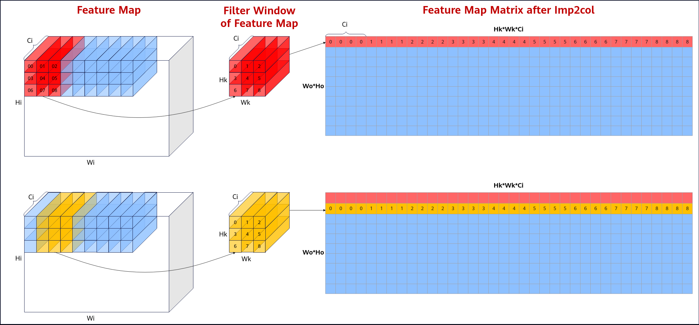
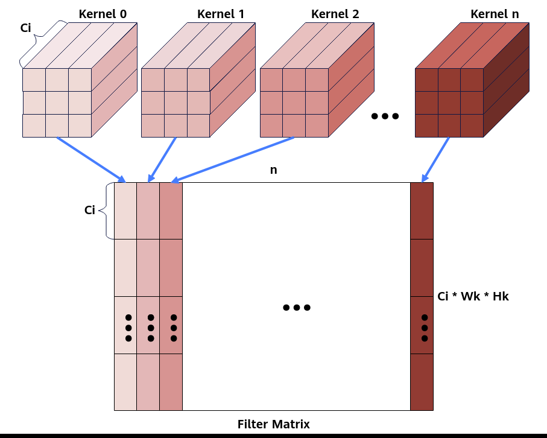
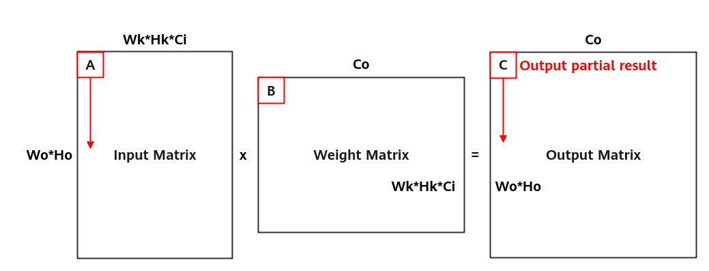
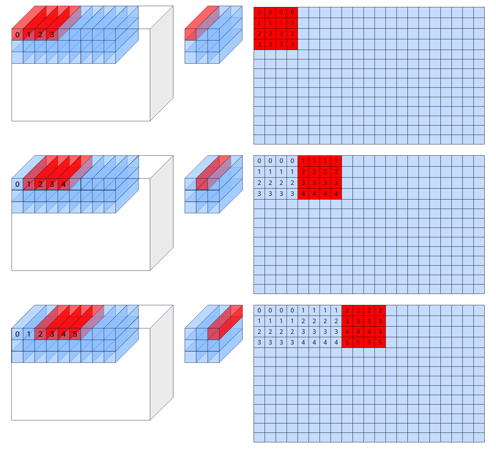
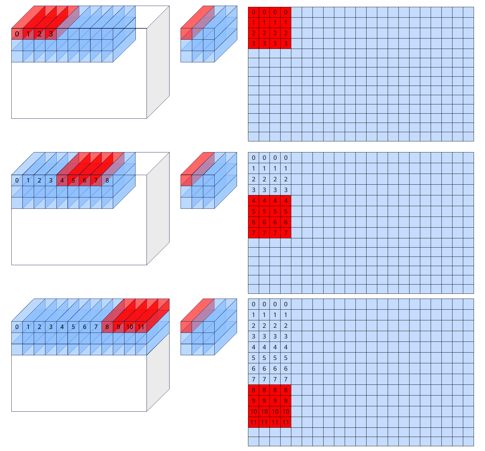

# Load3D

> **Section**: 4  
> **PDF Pages**: 990–1001  

---

<!-- page 990 -->

```cpp
fmRepeat = featureMapA2Size / (16 * C0);
LoadData2DParamsV2 param = { padList, H, W, 0, 0, 0, -1, -1, strideW, strideH, Kw, Kh, dilationW, dilationH, 1, 0, fmRepeat, 0, (half)(0)};Load2DBitModeParam paramBitMode(param);
AscendC::LocalTensor<half> featureMapA1 = inQueueFmA1.DeQue<half>();AscendC::LocalTensor<half> featureMapA2 = inQueueFmA2.AllocTensor<half>();AscendC::LoadData<A2, A1, half>(featureMapA2, featureMapA1, paramBitMode);inQueueFmA2.EnQue<half>(featureMapA2);inQueueFmA1.FreeTensor(featureMapA1);
```

## ?.4. Load3D

产品支持情况

产品是否支持

Atlas 350 加速卡√

Atlas A3 训练系列产品/Atlas A3 推理系列产品√

Atlas A2 训练系列产品/Atlas A2 推理系列产品√

Atlas 200I/500 A2 推理产品√

Atlas 推理系列产品AI Core√

Atlas 推理系列产品Vector Corex

Atlas 训练系列产品√

功能说明

Load3D用于完成image to column操作，将多维feature map转为二维矩阵。支持如下数据通路：A1->A2; B1->B2。

函数原型

●Load3Dv1接口template <typename T, const IsResetLoad3dConfig &defaultConfig = IS_RESER_LOAD3D_DEFAULT_CONFIG, typename U = PrimT<T>, typename Std::enable_if<Std::is_same<PrimT<T>, U>::value, bool>::type = true>__aicore__ inline void LoadData(const LocalTensor<T>& dst, const LocalTensor<T>& src, const LoadData3DParamsV1<U>& loadDataParams)

●Load3Dv2接口template <typename T, const IsResetLoad3dConfig &defaultConfig = IS_RESER_LOAD3D_DEFAULT_CONFIG, typename U = PrimT<T>, typename Std::enable_if<Std::is_same<PrimT<T>, U>::value, bool>::type = true>__aicore__ inline void LoadData(const LocalTensor<T>& dst, const LocalTensor<T>& src, const LoadData3DParamsV2<U>& loadDataParams)

●Load3Dv2Pro接口template <typename T>__aicore__ inline void LoadData(const LocalTensor<T>& dst, const LocalTensor<T>& src, const LoadData3DParamsV2Pro& loadDataParams)

<!-- page 991 -->

参数说明

表6-168模板参数说明

参数名称含义

T源操作数和目的操作数的数据类型。

●Load3Dv1接口：Atlas 训练系列产品，支持的数据类型为：uint8_t/int8_t/half

Atlas 推理系列产品AI Core，支持的数据类型为：uint8_t/int8_t/half

●Load3Dv2接口：Atlas 推理系列产品AI Core，支持的数据类型为：uint8_t/int8_t/half/int4b_t

Atlas A2 训练系列产品/Atlas A2 推理系列产品，

–TPosition为A1/A2时，支持数据类型为：uint8_t/int8_t/half/bfloat16_t/uint32_t/int32_t/float/int4b_t

–TPosition为B1/B2时，支持数据类型为：half/bfloat16_t/uint32_t/int32_t/float

Atlas A3 训练系列产品/Atlas A3 推理系列产品，

–TPosition为A1/A2时，支持数据类型为：uint8_t/int8_t/half/bfloat16_t/uint32_t/int32_t/float/int4b_t

–TPosition为B1/B2时，支持数据类型为：half/bfloat16_t/uint32_t/int32_t/float

Atlas 200I/500 A2 推理产品，

–TPosition为A1/A2时，支持数据类型为：uint8_t/int8_t/half/bfloat16/uint32_t/int32_t/float/int4b_t

–TPosition为B1/B2时，支持数据类型为：half/bfloat16_t/uint32_t/int32_t/float

Atlas 350 加速卡，支持数据类型为：uint8_t/int8_t/fp8_e4m3fn_t/fp8_e5m2_t/hifloat8_t/half/bfloat16_t/uint32_t/int32_t/float

●Load3Dv2Pro接口：Atlas 350 加速卡，uint8_t/int8_t/fp8_e4m3fn_t/fp8_e5m2_t/hifloat8_t/half/bfloat16_t/uint32_t/int32_t/float。

<!-- page 992 -->

参数名称含义

defaultConfig

控制是否在Load3Dv1/Load3Dv2接口内部设置相关属性。IsResetLoad3dConfig类型。IsResetLoad3dConfig结构定义如下：struct IsResetLoad3dConfig {   bool isSetFMatrix = true;   bool isSetPadding = true;};

isSetFMatrix配置为true，表示在接口内部设置FeatureMap的属性描述（包括l1H、l1W、padList，参数介绍参考表6-170、表6-171）；设置为false，表示该接口传入的FeatureMap的属性描述不生效，开发者需要通过 SetFmatrix进行设置。

isSetPadding配置为true，表示在接口内部设置Pad属性描述（即padValue参数，参数介绍参考表6-170、表6-171）；设置为false，表示该接口传入的Pad属性不生效，开发者需要通过SetLoadDataPaddingValue进行设置。可参考样例调用示例。

该参数的默认值如下：constexpr IsResetLoad3dConfig IS_RESER_LOAD3D_DEFAULT_CONFIG = {true, true};

ULoadData3DParamsV1/LoadData3DParamsV2中padValue的数据类型。

●当dst、src使用基础数据类型时， U和dst、src的数据类型T需保持一致，否则编译失败。

●当dst 、src使用TensorTrait类型时，U和dst、src的数据类型T的LiteType需保持一致，否则编译失败。

最后一个模板参数仅用于上述数据类型检查，用户无需关注。

表6-169通用参数说明

参数名称输入/输出

含义

dst输出目的操作数，类型为LocalTensor。

数据连续排列顺序由目的操作数所在TPosition决定，具体约束如下：

●A2：ZZ格式/NZ格式；

●B2：ZN格式；

●A1/B1：无格式要求，一般情况下为NZ格式。

src输入源操作数，类型为LocalTensor或GlobalTensor。

数据类型需要与dst保持一致。

<!-- page 993 -->

参数名称输入/输出

含义

loadDataParams

输入LoadData参数结构体，类型为：

●LoadData3DParamsV1，具体参考表6-170。

●LoadData3DParamsV2，具体参考表6-171。

●LoadData3DParamsV2Pro，具体参考。表6-172

上述结构体参数定义请参考${INSTALL_DIR}/include/ascendc/basic_api/interface/kernel_struct_mm.h，${INSTALL_DIR}请替换为CANN软件安装后文件存储路径。

表6-170 LoadData3DParamsV1 结构体内参数说明

参数名称含义

padListpadding列表 [padding_left, padding_right, padding_top,padding_bottom]，每个元素取值范围：[0,255]。默认为{0, 0, 0,0}。

l1H源操作数 height，取值范围：l1H∈[1, 32767]。

l1W源操作数 width，取值范围：l1W∈[1, 32767] 。

c1Index该指令在源tensor C1维度的起点，取值范围：c1Index∈[0,4095] 。默认为0。

fetchFilterW该指令在卷积核上w维度的起始位置，取值范围：fetchFilterW∈[0,254] 。默认为0。

fetchFilterH该指令在filter上h维度的起始位置，取值范围：fetchFilterH∈[0,254] 。默认为0。

leftTopW该指令在源操作数上w维度的起点，取值范围：leftTopW∈[-255,32767] 。默认为0。如果padding_left = a，leftTopW配置为-a。

leftTopH该指令在源操作数上h维度的起点，取值范围：leftTopH∈[-255,32767] 。默认为0。如果padding_top = a，leftTopH配置为-a。

strideW卷积核在源操作数w维度滑动的步长，取值范围：strideW∈[1,63] 。

strideH卷积核在源操作数h维度滑动的步长，取值范围：strideH∈[1,63] 。

filterW卷积核width，取值范围：filterW∈[1, 255] 。

filterH卷积核height，取值范围：filterH∈[1, 255] 。

dilationFilterW

卷积核width膨胀系数，取值范围：dilationFilterW∈[1, 255] 。

dilationFilterH

卷积核height膨胀系数，取值范围：dilationFilterH∈[1, 255] 。

<!-- page 994 -->

参数名称含义

jumpStride迭代之间，目的操作数首地址步长，取值范围：jumpStride∈[1,127] 。

repeatMode迭代模式。

●模式0：每次迭代，增加卷积核窗口中的点，对应在目的矩阵上往w维度方向增长。

●模式1：每次迭代，增加滑动窗口左上坐标，对应在目的矩阵上往h维度方向增长。

取值范围：repeatMode∈[0, 1] 。默认为0。

repeatTime迭代次数，每一次源操作数和目的操作数的地址都会改变。取值范围：repeatTime∈[1，255] 。

cSize配置是否开启cSize = 4(b16) / cSize = 8(b8)优化，取值范围：cSize∈[0, 1] 。默认为0。

padValuePad填充值的数值，数据类型需要与src保持一致。默认为0。若不想使能padding，可将padList设为全0。

表6-171 LoadData3DParamsV2 结构体内参数说明

参数名称含义

padListpadding 列表 [padding_left, padding_right, padding_top,padding_bottom]，每个元素取值范围：[0,255]。默认为{0, 0, 0,0}。

l1H源操作数height，取值范围：l1H∈[1, 32767]。

l1W源操作数weight，取值范围：l1W∈[1, 32767] 。

<!-- page 995 -->

参数名称含义

channelSize源操作数的通道数，取值范围：channelSize∈[1, 63] 。

针对以下型号，channelSize的取值要求为：对于half，channelSize可取值为4，8，16，N * 16 + 4，N * 16 + 8；对于int8_t/uint8_t，channelSize可取值为4，8，16，32，N * 32 + 4，N * 32 + 8，N *32 + 16；对于int4b_t，ChannelSize可取值为8，16，32，N * 64，N * 64 + 8，N * 64 + 16，N * 64 + 32。N为正整数。

Atlas 推理系列产品AI Core

针对以下型号，channelSize的取值要求为：对于uint32_t/int32_t/float，channelSize可取值为4，N * 8，N * 8 + 4；对于half/bfloat16，channelSize可取值为4，8，N * 16，N * 16 + 4，N * 16+ 8；对于int8_t/uint8_t，channelSize可取值为4，8，16， 32 *N，N * 32 + 4，N * 32 + 8，N * 32 + 16；对于int4b_t，ChannelSize可取值为8，16，32，N * 64，N * 64 + 8，N * 64 +16，N * 64 + 32。N为正整数。

Atlas A2 训练系列产品/Atlas A2 推理系列产品

Atlas A3 训练系列产品/Atlas A3 推理系列产品

Atlas 200I/500 A2 推理产品

Atlas 350 加速卡

kExtension该指令在目的操作数width维度的传输长度，如果不覆盖最右侧的分形，对于half类型，应为16的倍数，对于int8_t/uint8_t应为32的倍数；覆盖的情况则无倍数要求。取值范围: kExtension∈[1,65535] 。

mExtension该指令在目的操作数height维度的传输长度，如果不覆盖最下侧的分形，对于half/int8_t/uint8_t，应为16的倍数；覆盖的情况则无倍数要求。取值范围：mExtension∈[1, 65535] 。

kStartPt该指令在目的操作数width维度的起点，对于half类型，应为16的倍数，对于int8_t/uint8_t应为32的倍数。取值范围[0, 65535] 。默认为0。

mStartPt该指令在目的操作数height维度的起点，如果不覆盖最下侧的分形，对于half/int8_t/uint8_t，应为16的倍数；覆盖的情况则无倍数要求。取值范围[0, 65535] 。默认为0。

strideW卷积核在源操作数width维度滑动的步长，取值范围：strideW∈[1,63] 。

strideH卷积核在源操作数height 维度滑动的步长，取值范围：strideH∈[1,63] 。

filterW卷积核width，取值范围：filterW∈[1, 255] 。

filterH卷积核height，取值范围：filterH∈[1, 255] 。

dilationFilterW

卷积核width膨胀系数，取值范围：dilationFilterW∈[1, 255] 。

dilationFilterH

卷积核height膨胀系数，取值范围：dilationFilterH∈[1, 255] 。

<!-- page 996 -->

参数名称含义

enTranspose是否启用转置功能，对整个目标矩阵进行转置，支持数据类型为bool，仅在目的TPosition为A2，且源操作数为half类型时有效。默认为false。

●true：启用

●false：不启用

enSmallK是否使能small k特性，每个分形矩阵大小为16*4，支持数据类型为bool，默认为false。当前产品形态，该特性已不再支持。

●true：使能

●false：不使能

padValuePad填充值的数值，数据类型需要与src保持一致。默认为0。若不想使能padding，可将padList设为全0。

filterSizeW是否在filterW的基础上将卷积核width增加256 个元素。true，增加；false，不增加。

filterSizeH是否在filterH的基础上将卷积核height增加256个元素。true，增加；false，不增加。

fMatrixCtrl表示LoadData3DV2指令从左矩阵还是右矩阵获取FeatureMap的属性描述，与 SetFmatrix配合使用，当前只支持设置为false，默认值为false。

●true：从右矩阵中获取FeatureMap的属性描述；

●false：从左矩阵中获取FeatureMap的属性描述。

表6-172 LoadData3DParamsV2Pro 结构体内参数说明

参数名称含义

channelSize源操作数的通道数，取值范围：channelSize∈[1, 63] 。

对于half，channelSize除16的余数应当为0，4或8。

对于int8_t和uint8_t，channelSize除32的余数应当为0，4，8或16。

对于int4b_t，ChannelSize为8，16，32，N*64，N*64+8，N*64+16，N*64+32，N为正整数。

enTranspose是否启用转置功能，对整个目标矩阵进行转置，支持数据类型为bool，仅在目的TPosition为A2，且源操作数为half类型时有效。默认为false。

●true：启用

●false：不启用

<!-- page 997 -->

参数名称含义

enSmallK是否使能small k特性，每个分形矩阵大小为16*4，支持数据类型为bool，默认为false。当前产品形态，该特性已不再支持。

●true：使能

●false：不使能

filterSizeW是否在filterW的基础上将卷积核width增加256个元素。true，增加；false，不增加。

filterSizeH是否在filterH的基础上将卷积核height增加256个元素。true，增加；false，不增加。

fMatrixCtrl表示LoadData3DV2指令从左矩阵还是右矩阵获取FeatureMap的属性描述，与 SetFmatrix配合使用，当前只支持设置为false，默认值为false。

●true：从右矩阵中获取FeatureMap的属性描述；

●false：从左矩阵中获取FeatureMap的属性描述。

extConfig组合参数(uint64_t类型)，默认值为0；

extConfig= ((uint64_t)mStartPt << 48) | ((uint64_t)kStartPt <<32) | ((uint64_t)mExtension << 16) | (uint64_t)kExtension。

filterConfig组合参数(uint64_t类型)，默认值为0X10101010101；

filterConfig= ((uint64_t)dilationFilterH << 40) |((uint64_t)dilationFilterW << 32) | ((uint64_t)filterH << 24) |((uint64_t)filterW << 16) | ((uint64_t)strideH << 8) |(uint64_t)strideW。

约束说明

●操作数地址对齐要求请参见通用地址对齐约束。

●LoadData3DParamsV1 cSize特性的开启，需要保证A1/B1中的feature map为 4channel对齐。

●调用Load3Dv2/Load3Dv2Pro指令需要通过 SetLoadDataRepeat接口配置dstStride，若不使能repeat模式，接口内repeat相关参数使用默认构造值。

## Load3d 数据格式说明

要求输入的feature map和filter的格式是NC1HWC0，其中C0是最低维度而且C0是固定值为16（对于u8/s8类型为32），C1=C/C0。

为了简化场景，以下场景假设输入的feature map的channel 为4，即Ci=4。输入feature maps在A1中的形状为 (Hi,Wi,Ci)，经过load3dv1处理后在A2的数据形状为(Wo*Ho, Hk*Wk*Ci)。其中Wo 和Ho是卷积后输出的shape，Hk和Wk是filter的shape。

直观的来看，img2col的过程就是filter在feature map上扫过，将对应feature map的数据展开成输出数据的每一行的过程。filter首先在W方向上滑动Wo步，然后在H方向上走一步然后重复以上过程，最终输出Wo*Ho行数据。下图中红色和黄色的数据分别

<!-- page 998 -->

代表第一行和第二行。数字表示原始输入数据，filter和输出数据三者之间的关联关系。可以看到，load3dv1首先在输入数据的Ci维度搬运对应于00的4个数，然后搬运对应于01的四个数，最终这一行的大小为Hk*Wk*Ci即3*3*4=36个数。

对应的feature map格式如下图：

图6-20 feature map 格式



对应的filter的格式如下图：

其中n为filter的个数，可以看出维度排布为 (Hk,Wk,Ci,n)，但是需要注意的是下图的格式还需要根据Mmad中B矩阵的格式转换。

<!-- page 999 -->

图6-21 filter 的格式



实际操作中，由于存储空间或者计算能力限制，我们通常会将整个卷积计算分块，一次只搬运并计算一小块数据。

图6-22卷积计算分块



对于A2的feature map来说有两种方案，水平分块和垂直分块。分别对应参数中repeatMode的0和1。

注：下图中的分型矩阵大小为4x4，实际应该为16x16 (对于u8/s8类型为16x32)

repeatMode =0时，每次repeat会改变在filter窗口中读取数据点的位置，然后跳到下一个C0的位置。

<!-- page 1000 -->

图6-23 repeatMode = 0 时的filter 窗口



repeatMode =1的时候filter窗口中读取数据的位置保持不变，每个repeat在featuremap中前进C0个元素。

<!-- page 1001 -->

图6-24 repeatMode = 1 时的filter 窗口



返回值说明

无

调用示例

该调用示例支持的运行平台为Atlas 推理系列产品AI Core。

```cpp
uint16_t C1 = 2;uint16_t H = 4, W = 4;uint8_t Kh = 2, Kw = 2;uint16_t Cout = 16;uint16_t C0 = 16;uint8_t dilationH = 2, dilationW = 2;uint8_t padTop = 1, padBottom = 1, padLeft = 1, padRight = 1;uint8_t strideH = 1, strideW = 1;uint8_t padList[4] = {padLeft, padRight, padTop, padBottom};AscendC::LoadData(featureMapA2, featureMapA1,    { padList, H, W, 0, 0, 0, -1, -1, strideW, strideH, Kw, Kh, dilationW, dilationH, 1, 0, fmRepeat, 0, (half)(0)});
```
