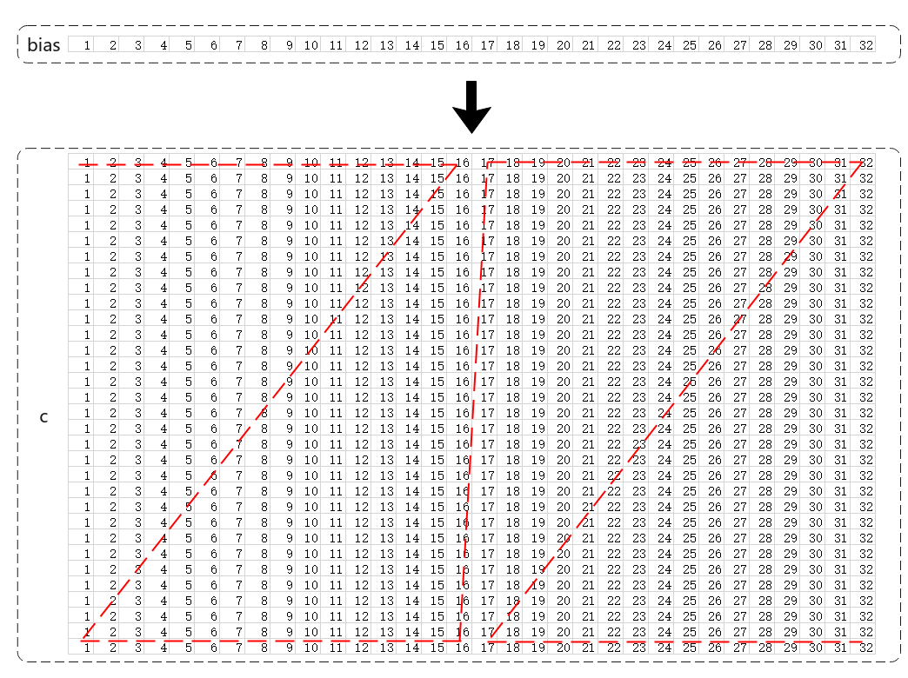

# Fill

> **Section**: 6.2.3.2.1.1  
> **PDF Pages**: 971–973  

---

<!-- page 971 -->

图6-17调用示例图



本示例仅展示样例中的部分代码。

// brcLocal为TPosition::CO1上的float类型的LocalTensor，biasLocal为TPosition::VECOUT上的float类型的LocalTensor// blockCount = 1, blockLen = 1. 连续广播的数据块个数为1，每个数据块包含16个elements，共输出256个elements// srcGap = 0, dstGap = 1. 源操作数与目的操作数之间连续AscendC::BroadCastVecToMM(brcLocal, biasLocal, 1, 1, 0, 1)

## 6.2.3.2 矩阵计算（ISASI）

## 6.2.3.2.1 数据搬运

## 6.2.3.2.1.1 Fill

产品支持情况

产品是否支持

Atlas 350 加速卡√

Atlas A3 训练系列产品/Atlas A3 推理系列产品√

Atlas A2 训练系列产品/Atlas A2 推理系列产品√

Atlas 200I/500 A2 推理产品√

Atlas 推理系列产品AI Core√

<!-- page 972 -->

产品是否支持

Atlas 推理系列产品Vector Corex

Atlas 训练系列产品√

功能说明

将特定TPosition的LocalTensor初始化为某一具体数值。

函数原型

```cpp
template <typename T, typename U = PrimT<T>, typename Std::enable_if<Std::is_same<PrimT<T>, U>::value, bool>::type = true>__aicore__ inline void Fill(const LocalTensor<T>& dst, const InitConstValueParams<U>& initConstValueParams)
```

参数说明

表6-152模板参数说明

参数名描述

Tdst的数据类型。

Atlas 训练系列产品，支持的数据类型为：half

Atlas 推理系列产品AI Core，支持的数据类型为：half/int16_t/uint16_t

Atlas A2 训练系列产品/Atlas A2 推理系列产品，支持的数据类型为：half/int16_t/uint16_t/bfloat16_t/float/int32_t/uint32_t

Atlas A3 训练系列产品/Atlas A3 推理系列产品，支持的数据类型为：half/int16_t/uint16_t/bfloat16_t/float/int32_t/uint32_t

Atlas 200I/500 A2 推理产品，支持的数据类型为：half/int16_t/uint16_t/bfloat16_t/float/int32_t/uint32_t

Atlas 350 加速卡，支持的数据类型为：half/int16_t/uint16_t/bfloat16_t/float/int32_t/uint32_t

U初始化值的数据类型。

●当dst使用基础数据类型时， U和dst的数据类型T需保持一致，否则编译失败。

●当dst使用TensorTrait类型时，U和dst的数据类型T的LiteType需保持一致，否则编译失败。

最后一个模板参数仅用于上述数据类型检查，用户无需关注。

<!-- page 973 -->

表6-153参数说明

含义

参数名称输入/输出

dst输出目的操作数，结果矩阵，类型为LocalTensor。

Atlas 训练系列产品，支持的TPosition为A1/A2/B1/B2。

Atlas 推理系列产品AI Core，支持的TPosition为A1/A2/B1/B2。

Atlas A2 训练系列产品/Atlas A2 推理系列产品，支持的TPosition为A1/A2/B1/B2。

Atlas A3 训练系列产品/Atlas A3 推理系列产品，支持的TPosition为A1/A2/B1/B2。

Atlas 200I/500 A2 推理产品，支持的TPosition为A1/A2/B1/B2。

Atlas 350 加速卡，支持的TPosition为A1/B1。

如果TPosition为A1/B1，起始地址需要满足32B对齐；如果TPosition为A2/B2，起始地址需要满足512B对齐。

InitConstValueParams

输入初始化相关参数，类型为InitConstValueParams。

具体定义请参考${INSTALL_DIR}/include/ascendc/basic_api/interface/kernel_struct_mm.h，${INSTALL_DIR}请替换为CANN软件安装后文件存储路径。

参数说明请参考表6-154。

Atlas 训练系列产品，仅支持配置迭代次数（repeatTimes）和初始化值（initValue）。

Atlas 推理系列产品AI Core，仅支持配置迭代次数（repeatTimes）和初始化值（initValue）。

Atlas A2 训练系列产品/Atlas A2 推理系列产品，支持配置所有参数。

Atlas A3 训练系列产品/Atlas A3 推理系列产品，支持配置所有参数。

Atlas 200I/500 A2 推理产品，支持配置所有参数。

Atlas 350 加速卡，支持配置所有参数。

●仅支持配置迭代次数（repeatTimes）和初始化值（initValue）场景下，其他参数配置无效。每次迭代处理固定数据量（512字节），迭代间无间隔。

●支持配置所有参数场景下，支持配置迭代次数（repeatTimes）、初始化值（initValue）、每个迭代处理的数据块个数（blockNum）和迭代间间隔（dstGap）。
