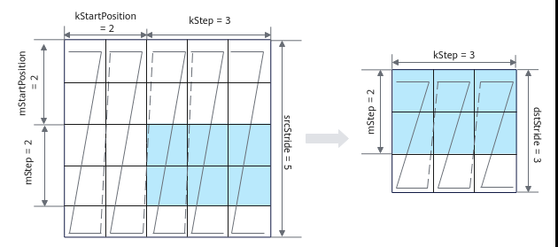

# LoadData

> **Section**: 6.2.3.2.1.2  
> **PDF Pages**: 974–979  

---

<!-- page 974 -->

表6-154 InitConstValueParams 结构体参数说明

参数名称含义

repeatTimes

迭代次数。默认值为0。

●仅支持配置迭代次数（repeatTimes）和初始化值（initValue）场景下，repeatTimes∈[0, 255]。

●支持配置所有参数场景下，repeatTimes∈[0, 32767] 。

blockNum每次迭代初始化的数据块个数，取值范围：blockNum∈[0, 32767] 。默认值为0。

●dst的位置为A1/B1时，每一个block（数据块）大小是32B；

●dst的位置为A2/B2时，每一个block（数据块）大小是512B。

dstGap目的操作数前一个迭代结束地址到后一个迭代起始地址之间的距离。

●dst的位置为A1/B1时，单位是32B；

●dst的位置为A2/B2时，单位是512B。

取值范围：dstGap∈[0, 32767] 。默认值为0。

initValue初始化的value值，支持的数据类型与dst保持一致。

约束说明

●操作数地址对齐要求请参见通用地址对齐约束。

调用示例

uint32 mLength = 16;uint32 kLength = 16;Fill(leftMatrix, {1, static_cast<uint16_t>(mLength * kLength * sizeof(float) / 32), 0, 1}); // 给leftMatrix填充mLength * kLength长度的数据为1，按32B的颗粒进行填充

## 6.2.3.2.1.2 LoadData

## ?.1. Load2D

产品支持情况

产品是否支持

Atlas 350 加速卡√

Atlas A3 训练系列产品/Atlas A3 推理系列产品√

Atlas A2 训练系列产品/Atlas A2 推理系列产品√

Atlas 200I/500 A2 推理产品√

Atlas 推理系列产品AI Core√

Atlas 推理系列产品Vector Corex

<!-- page 975 -->

产品是否支持

Atlas 训练系列产品√

功能说明

Load2D支持如下数据通路的搬运：

GM->A1; GM->B1; GM->A2; GM->B2;

A1->A2; B1->B2。

函数原型

●Load2D接口template <typename T>__aicore__ inline void LoadData(const LocalTensor<T>& dst, const LocalTensor<T>& src, const LoadData2DParams& loadDataParams)template <typename T> __aicore__ inline void LoadData(const LocalTensor<T>& dst, const GlobalTensor<T>& src, const LoadData2DParams& loadDataParams)

●Load2Dv2接口template <typename T>__aicore__ inline void LoadData(const LocalTensor<T>& dst, const LocalTensor<T>& src,const LoadData2DParamsV2& loadDataParam)template <typename T>__aicore__ inline void LoadData(const LocalTensor<T>& dst, const GlobalTensor<T>& src,const LoadData2DParamsV2& loadDataParam)

<!-- page 976 -->

参数说明

表6-155模板参数说明

参数名称含义

T源操作数和目的操作数的数据类型。

●Load2D接口Atlas 训练系列产品，支持的数据类型为：uint8_t/int8_t/uint16_t/int16_t/half

Atlas 推理系列产品AI Core，支持的数据类型为：int4b_t/uint8_t/int8_t/uint16_t/int16_t/half，int4b_t仅支持A1->A2，B1->B2通路

Atlas A2 训练系列产品/Atlas A2 推理系列产品，支持数据类型为：int4b_t/uint8_t/int8_t/uint16_t/int16_t/half/bfloat16_t/uint32_t/int32_t/float，int4b_t仅支持A1->A2，B1->B2通路

Atlas A3 训练系列产品/Atlas A3 推理系列产品，支持数据类型为：int4b_t/uint8_t/int8_t/uint16_t/int16_t/half/bfloat16_t/uint32_t/int32_t/float，int4b_t仅支持A1->A2，B1->B2通路

Atlas 200I/500 A2 推理产品，支持数据类型为：uint8_t/int8_t/uint16_t/int16_t/half/bfloat16_t/uint32_t/int32_t/float

Atlas 350 加速卡，支持数据类型为：uint8_t/int8_t/uint16_t/int16_t/half/bfloat16_t/uint32_t/int32_t/float，仅支持如下数据通路: GM->A1; GM->B1; A1->A2; B1->B2。

●Load2Dv2接口Atlas 350 加速卡，

–GM->A1、GM->B1时，支持数据类型为：int8_t/uint8_t/fp4x2_e2m1_t/fp4x2_e1m2_t/hifloat8_t/fp8_e5m2_t/fp8_e4m3fn_t/half/bfloat16_t/int32_t/uint32_t/float

–A1->A2、B1->B2时，支持数据类型为：int8_t/uint8_t/fp4x2_e2m1_t/fp4x2_e1m2_t/hifloat8_t/fp8_e5m2_t/fp8_e4m3fn_t/half/bfloat16_t/int32_t/uint32_t/float

<!-- page 977 -->

表6-156通用参数说明

参数名称输入/输出

含义

dst输出目的操作数，类型为LocalTensor。

数据连续排列顺序由目的操作数所在TPosition决定，具体约束如下：

●A2：ZZ格式/NZ格式；对应的分形大小为16 * (32B /sizeof(T))。

●B2：ZN格式；对应的分形大小为 (32B / sizeof(T)) *16。

●A1/B1：无格式要求，一般情况下为NZ格式。NZ格式下，对应的分形大小为16 * (32B / sizeof(T))。

src输入源操作数，类型为LocalTensor或GlobalTensor。

数据类型需要与dst保持一致。

loadDataParams

输入LoadData参数结构体，类型为：

●LoadData2DParams，具体参考表6-157。

●LoadData2DParamsV2，具体参考表6-158。

上述结构体参数定义请参考${INSTALL_DIR}/include/ascendc/basic_api/interface/kernel_struct_mm.h，${INSTALL_DIR}请替换为CANN软件安装后文件存储路径。

表6-157 LoadData2DParams 结构体内参数说明

参数名称含义

startIndex分形矩阵ID，说明搬运起始位置为源操作数中第几个分形（0为源操作数中第1个分形矩阵）。取值范围：startIndex∈[0, 65535] 。单位：512B。默认为0。

repeatTimes迭代次数，每个迭代可以处理512B数据。取值范围：repeatTimes∈[1, 255]。

srcStride相邻迭代间，源操作数前一个分形与后一个分形起始地址的间隔，单位：512B。取值范围：src_stride∈[0, 65535]。默认为0。

sid预留参数，配置为0即可。

dstGap相邻迭代间，目的操作数前一个分形结束地址与后一个分形起始地址的间隔，单位：512B。取值范围：dstGap∈[0, 65535]。默认为0。

注：Atlas 训练系列产品此参数不使能。

<!-- page 978 -->

参数名称含义

ifTranspose是否启用转置功能，对每个分形矩阵进行转置，默认为false:

●true：启用

●false：不启用

注意：只有A1->A2和B1->B2通路才能使能转置，使能转置功能时，源操作数、目的操作数仅支持b16数据类型。

addrMode控制地址更新方式，默认为false：

●true：递减，每次迭代在前一个地址的基础上减去srcStride。

●false：递增，每次迭代在前一个地址的基础上加上srcStride。

表6-158 LoadData2DParamsV2 结构体内参数说明

参数名称含义

mStartPosition

以M*K矩阵为例，源矩阵M轴方向的起始位置，单位为16个元素。

kStartPosition

以M*K矩阵为例，源矩阵K轴方向的起始位置，单位为32B。

mStep以M*K矩阵为例，源矩阵M轴方向搬运长度，单位为16 element。取值范围：mStep∈[0, 255]。

通过ifTranspose参数启用转置功能时，mStep除需满足 [0, 255]的取值范围外，还需满足以下额外约束：

●当数据类型为b4时，mStep必须是4的倍数；

●当数据类型为b8时，mStep必须是2的倍数；

●当数据类型为b16时，mStep必须是1的倍数；

●当数据类型为b32时，mStep无额外约束。

kStep以M*K矩阵为例，源矩阵K轴方向搬运长度，单位为32B。取值范围：kStep∈[0, 255]。

通过ifTranspose参数启用转置功能时，kStep除需满足[0,255]的取值范围外，还需满足以下额外约束：

●当数据类型为b4、b8或b16时，kStep没有额外约束；

●当数据类型为b32时，kStep必须是2的倍数。

srcStride以M*K矩阵为例，源矩阵K方向前一个分形起始地址与后一个分形起始地址的间隔，单位：512B。

dstStride以M*K矩阵为例，目标矩阵K方向前一个分形起始地址与后一个分形起始地址的间隔，单位：512B。

<!-- page 979 -->

参数名称含义

ifTranspose是否启用转置功能，对每个分形矩阵进行转置，默认为false。

●true：启用

●false：不启用

注意：只有A1->A2和B1->B2通路才能使能转置。使能转置功能时，支持的数据类型约束如下：

对于Atlas 350 加速卡，源操作数、目的操作数支持b4、b8、b16、b32数据类型。

sid预留参数，配置为0即可。

图6-18 LoadData2DParamsV2 结构体参数示例



约束说明

●操作数地址对齐要求请参见通用地址对齐约束。

●对于Atlas 推理系列产品AI Core，在配合Mmad接口使用、B矩阵数据类型为S4场景下，如果通过ifTranspose参数启用转置，只支持64*64的分形。

返回值说明

无

调用示例

```cpp
uint16_t C1 = 2;uint16_t H = 4, W = 4;uint8_t Kh = 2, Kw = 2;uint16_t Cout = 16;uint16_t C0 = 16;uint8_t dilationH = 2, dilationW = 2;uint8_t padTop = 1, padBottom = 1, padLeft = 1, padRight = 1;uint8_t strideH = 1, strideW = 1;uint16_t coutBlocks, ho, wo, howo, howoRound;uint32_t featureMapA1Size, weightA1Size, featureMapA2Size, weightB2Size, dstSize, dstCO1Size;uint8_t padList[4] = {padLeft, padRight, padTop, padBottom};
```
