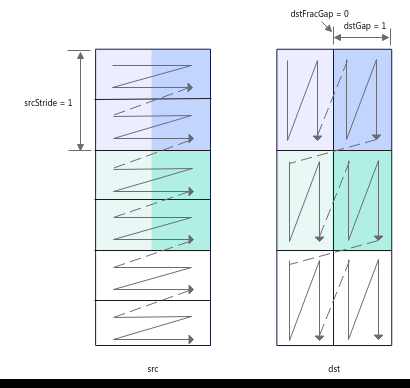
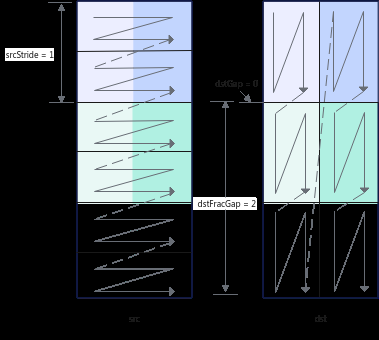
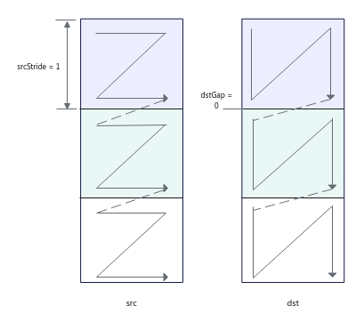
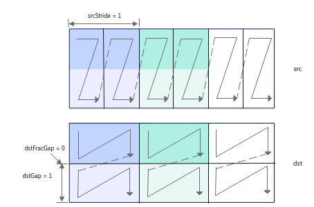
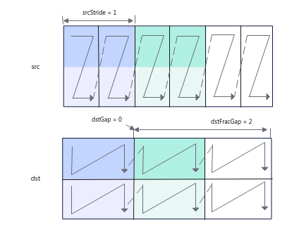
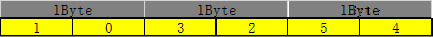
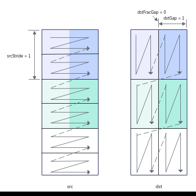
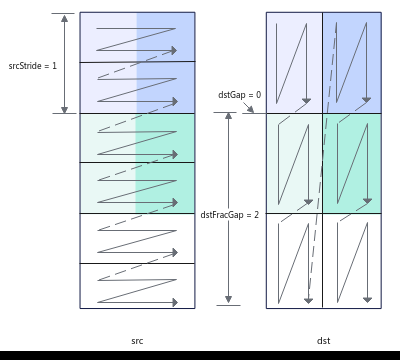

# LoadDataWithTranspose

> **Section**: 6.2.3.2.1.5  
> **PDF Pages**: 1010–1020  

---

<!-- page 1010 -->

返回值说明

无

调用示例

该调用示例支持的运行平台为Atlas 推理系列产品AI Core。

uint32_t srcLen = 896, dstLen = 1024, numOfIndexTabEntry = 1;AscendC::LocalTensor<int8_t> weightB1 = inQueueB1.AllocTensor<int8_t>();AscendC::LoadUnzipIndex(indexGlobal, numOfIndexTabEntry); // 加载索引数据，加载GM上的压缩索引表到内部寄存器AscendC::LoadDataUnzip(weightB1, weGlobal); // 根据内部寄存器里的索引表加载数据

## 6.2.3.2.1.5 LoadDataWithTranspose

产品支持情况

产品是否支持

Atlas 350 加速卡√

Atlas A3 训练系列产品/Atlas A3 推理系列产品√

Atlas A2 训练系列产品/Atlas A2 推理系列产品√

Atlas 200I/500 A2 推理产品√

Atlas 推理系列产品AI Corex

Atlas 推理系列产品Vector Corex

Atlas 训练系列产品x

功能说明

该接口实现带转置的2D格式数据从A1/B1到A2/B2的加载。

下面通过示例来讲解接口功能和关键参数：下文图中一个N形或者一个Z形代表一个分形。

●对于uint8_t/int8_t数据类型，每次迭代处理32*32*1B数据，可处理2个分形（一个分形512B），每次迭代中，源操作数中2个连续的16*32分形将被合并为1个32*32的方块矩阵，基于方块矩阵做转置，转置后分裂为2个16*32分形，根据目的操作数分形间隔等参数可以有不同的排布。

如下图示例：

–共需要处理3072B的数据，每次迭代处理32*32*1B数据，需要3次迭代可以完成，repeatTime = 3；

–srcStride = 1，表示相邻迭代间，源操作数前一个方块矩阵与后一个方块矩阵起始地址的间隔为1（单位：32*32*1B），这里的单位实际上是拼接后的方块矩阵的大小；

–dstGap = 1，表示相邻迭代间，目的操作数前一个迭代第一个分形的结束地址到下一个迭代第一个分形起始地址的间隔为1（单位：512B）；

<!-- page 1011 -->

–dstFracGap = 0，表示每个迭代内目的操作数前一个分形的结束地址与后一个分形起始地址的间隔为0（单位：512B）。



如下图示例：

–repeatTime和srcStride的解释和上图示例一致。

–dstGap = 0，表示相邻迭代间，目的操作数前一个迭代第一个分形的结束地址和下一个迭代第一个分形起始地址无间隔。

–dstFracGap = 2，表示每个迭代内目的操作数前一个分形的结束地址与后一个分形起始地址的间隔为2（单位：512B）。

<!-- page 1012 -->



●对于half/bfloat16_t数据类型，每次迭代处理16*16*2B数据，可处理1个分形（一个分形512B），每次迭代中，源操作数中1个16*16分形将被转置。

–共需要处理1536B的数据，每次迭代处理16*16*2B数据，需要3次迭代可以完成，repeatTime = 3；

–srcStride = 1，表示相邻迭代间，源操作数前一个方块矩阵与后一个方块矩阵起始地址的间隔为1 （单位：16*16*2B）；

–dstGap = 0，表示相邻迭代间，目的操作数前一个迭代第一个分形的结束地址到下一个迭代第一个分形起始地址无间隔；

–该场景下，因为其分形即为方块矩阵，每个迭代处理一个分形，不存在迭代内分形的间隔，该参数设置无效。

<!-- page 1013 -->



●对于float/int32_t/uint32_t数据类型，每次迭代处理16*16*4B数据，可处理2个分形（一个分形512B），每次迭代中，源操作数2个连续的16*8分形将被合并为1个16*16的方块矩阵，基于方块矩阵做转置，转置后分裂为2个16*8分形，根据目的操作数分形间隔等参数可以有不同的排布。

如下图示例：

–共需要处理3072B的数据，每次迭代处理16*16*4B数据，需要3次迭代可以完成，repeatTime = 3；

–srcStride = 1，表示相邻迭代间，源操作数前一个方块矩阵与后一个方块矩阵起始地址的间隔为1（单位：16*16*4B），这里的单位实际上是拼接后的方块矩阵的大小；

–dstGap = 1，表示相邻迭代间，目的操作数前一个迭代第一个分形的结束地址到下一个迭代第一个分形起始地址的间隔为1（单位：512B）；

–dstFracGap = 0，表示每个迭代内目的操作数前一个分形结束地址与后一个分形起始地址的间隔为0（单位：512B）。

<!-- page 1014 -->



如下图示例：

–repeatTime和srcStride的解释和上图示例一致。

–dstGap = 0，表示相邻迭代间，目的操作数前一个迭代第一个分形的结束地址和下一个迭代第一个分形起始地址无间隔。

–dstFracGap = 2，表示每个迭代内目的操作数前一个分形结束地址与后一个分形起始地址的间隔为2（单位：512B）。



●对于int4b_t数据类型，每次迭代处理64*64*0.5B数据，可处理4个分形（一个分形512B），每次迭代中，源操作数中4个连续的16*64分形将被合并为1个64*64的方块矩阵，基于方块矩阵做转置，转置后分裂为4个16*64分形，根据目的操作数分形间隔等参数可以有不同的排布。

int4b_t数据类型需要两个数拼成一个int8_t或uint8_t的数，拼凑的规则如下：



<!-- page 1015 -->

如下图示例：

–共需要处理6144B的数据，每次迭代处理64*64*0.5B数据，需要3次迭代可以完成，repeatTime = 3；

–srcStride = 1，表示相邻迭代间，源操作数前一个方块矩阵与后一个方块矩阵起始地址的间隔为1（单位：64*64*0.5B），这里的单位实际上是拼接后的方块矩阵的大小；

–dstGap = 1，表示相邻迭代间，目的操作数前一个迭代第一个分形的结束地址到下一个迭代第一个分形起始地址的间隔为1（单位：512B）；

–dstFracGap = 0，表示每个迭代内目的操作数前一个分形的结束地址与后一个分形起始地址的间隔为0（单位：512B）。



如下图示例：

–repeatTime和srcStride的解释和上图示例一致。

–dstGap = 0，表示相邻迭代间，目的操作数前一个迭代第一个分形的结束地址和下一个迭代第一个分形起始地址无间隔。

–dstFracGap = 2，表示每个迭代内目的操作数前一个分形的结束地址与后一个分形起始地址的间隔为2（单位：512B）。

<!-- page 1016 -->



函数原型

```cpp
template <typename T>__aicore__ inline void LoadDataWithTranspose(const LocalTensor<T>& dst, const LocalTensor<T>& src, const LoadData2dTransposeParams& loadDataParams)
```

// 该函数原型仅支持Atlas 350 加速卡template <typename T>__aicore__ inline void LoadDataWithTranspose(const LocalTensor<T>& dst, const LocalTensor<T>& src, const LoadData2dTransposeParamsV2& loadDataParams)

参数说明

表6-181模板参数说明

参数名描述

TAtlas A2 训练系列产品/Atlas A2 推理系列产品，支持的数据类型为：int4b_t/int8_t/uint8_t/half/bfloat16_t/float/int32_t/uint32_t，其中int4b_t仅支持B1->B2通路。

Atlas A3 训练系列产品/Atlas A3 推理系列产品，支持的数据类型为：int4b_t/int8_t/uint8_t/half/bfloat16_t/float/int32_t/uint32_t，其中int4b_t仅支持B1->B2通路。

Atlas 200I/500 A2 推理产品，支持的数据类型为：int4b_t/uint8_t/int8_t/uint16_t/int16_t/half/bfloat16_t/uint32_t/int32_t/float。

Atlas 350 加速卡，支持数据类型：int8_t/uint8_t/half/bfloat16_t/float/int32_t/uint32_t。

其中int4b_t数据类型仅在LocalTensor的TPosition为B2时支持。

<!-- page 1017 -->

表6-182参数说明

参数名称输入/输出

含义

dst输出目的操作数，结果矩阵，类型为LocalTensor。

Atlas A2 训练系列产品/Atlas A2 推理系列产品，支持的TPosition为A2/B2。

Atlas A3 训练系列产品/Atlas A3 推理系列产品，支持的TPosition为A2/B2。

Atlas 200I/500 A2 推理产品，支持的TPosition为A2/B2。

Atlas 350 加速卡，支持的TPosition为B2。

LocalTensor的起始地址需要保证512字节对齐。

数据类型和src的数据类型保持一致。

src输入源操作数，类型为LocalTensor。

Atlas A2 训练系列产品/Atlas A2 推理系列产品，支持的TPosition为A1/B1。

Atlas A3 训练系列产品/Atlas A3 推理系列产品，支持的TPosition为A1/B1。

Atlas 200I/500 A2 推理产品，支持的TPosition为A1/B1。

Atlas 350 加速卡，支持的TPosition为B1。

LocalTensor的起始地址需要保证32字节对齐。

数据类型和dst的数据类型保持一致。

loadDataParams输入LoadDataWithTranspose相关参数，类型为LoadData2dTransposeParams。

具体定义请参考${INSTALL_DIR}/include/ascendc/basic_api/interface/kernel_struct_mm.h，${INSTALL_DIR}请替换为CANN软件安装后文件存储路径。

参数说明请参考表6-183。

loadDataParams输入LoadDataWithTranspose相关参数，类型为LoadData2dTransposeParamsV2。

参数说明请参考表6-184。

<!-- page 1018 -->

表6-183 LoadData2dTransposeParams 结构体内参数说明

参数名称输入/输出

含义

startIndex输入方块矩阵ID，搬运起始位置为源操作数中第几个方块矩阵（0 为源操作数中第1个方块矩阵）。取值范围：startIndex∈[0, 65535] 。默认为0。

例如，源操作数中有20个大小为16*8*4B的分形（数据类型为float），startIndex=1表示搬运起始位置为第2个方块矩阵，即将第3和第4个分形从源操作数中转置到目的操作数中（第1、2个分形组成第1个方块矩阵，第3、4个分形组成第2个方块矩阵）。

repeatTimes

输入迭代次数。

对于uint8_t/int8_t数据类型，每次迭代处理32*32*1B数据；

对于half/bfloat16_t数据类型，每次迭代处理16*16*2B数据；

对于float/int32_t/uint32_t数据类型，每次迭代处理16*16*4B数据。

对于int4b_t数据类型，每次迭代处理16*64*0.5B数据。

取值范围：repeatTimes∈[0, 255]。默认为0。

srcStride输入相邻迭代间，源操作数前一个分形与后一个分形起始地址的间隔。这里的单位实际上是拼接后的方块矩阵的大小。

对于uint8_t/int8_t数据类型，单位是32*32*1B；

对于half/bfloat16_t数据类型，单位是16*16*2B；

对于float/int32_t/uint32_t数据类型，单位是16*16*4B。

对于int4b_t数据类型，每次迭代处理16*64*0.5B数据。

取值范围：srcStride∈[0, 65535]。默认为0。

dstGap输入相邻迭代间，目的操作数前一个迭代第一个分形的结束地址到下一个迭代第一个分形起始地址的间隔，单位：512B。取值范围：dstGap∈[0, 65535]。默认为0。

dstFracGap

输入每个迭代内目的操作数转置前一个分形结束地址与后一个分形起始地址的间隔，单位为512B，仅在数据类型为float/int32_t/uint32_t/uint8_t/int8_t/int4b_t时有效。取值范围：dstFracGap∈[0, 65535]。默认为0。

addrMode输入控制地址更新方式，默认为false：

●true：递减，每次迭代在前一个地址的基础上减去srcStride。

●false：递增，每次迭代在前一个地址的基础上加上srcStride。

<!-- page 1019 -->

表6-184 LoadData2dTransposeParamsV2 结构体内参数说明

参数名称输入/输出

含义

startIndex输入方块矩阵 ID，搬运起始位置为源操作数中第几个分形。取值范围：startIndex∈[0, 65535] 。默认为0。

repeatTimes

输入迭代次数。

对于int4b_t数据类型，每次迭代处理4个分形，每个分形为16*64*0.5B数据。

对于uint8_t/int8_t数据类型，每次迭代处理2个分形，每个分形处理16*32*1B数据；

对于half/bfloat16_t数据类型，每次迭代处理1个分形，每个分形处理16*16*2B数据；

对于int32_t/uint32_t/float数据类型，每次迭代处理4个分形，每个分形为16*8*4B数据。

取值范围：repeatTimes∈[1, 255]。

srcStride输入相邻迭代间，源操作数前一个分形与后一个分形起始地址的间隔。单位为单个分形512B。

取值范围：srcStride∈[0, 65535]。默认为0。

dstGap输入相邻迭代间，目的操作数前一个迭代第一个分形的结束地址到下一个迭代第一个分形起始地址的间隔，单位：512B。取值范围：dstGap∈[0, 65535]。默认为0。

dstFracGap

输入每个迭代内目的操作数转置前一个分形结束地址与后一个分形起始地址的间隔，单位为512B，仅在数据类型为float/int32_t/uint32_t/uint8_t/int8_t/int4b_t时有效。

srcFracGap

输入每个迭代内源操作数前一个分形结束地址与后一个分形起始地址的间隔，单位为512B，仅在数据类型为float/int32_t/uint32_t/uint8_t/int8_t/int4b_t时有效。

addrMode输入控制地址更新方式，默认为false：

●true：递减，每次迭代在前一个地址的基础上减去srcStride。

●false：递增，每次迭代在前一个地址的基础上加上srcStride。

约束说明

●repeat=0表示不执行搬运操作。

●开发者需要保证目的操作数转置后的分形没有重叠。

●操作数地址对齐要求请参见通用地址对齐约束。

●针对以下型号，推荐使用LoadData2dTransposeParamsV2作为参数，该参数具有更精细的搬运粒度。

–Atlas 350 加速卡

<!-- page 1020 -->

调用示例

●示例1：该示例输入a矩阵为int8_t类型，shape为[16,32]，输入b矩阵为int8_t类型，shape为[32,64]，输出c的类型为int32_t。a矩阵从A1->A2不转置，b矩阵从B1->B2转置，之后进行Mmad计算和Fixpipe计算。uint16_t m = 16, k = 32, n = 64;uint8_t nBlockSize = 16;uint16_t c0Size = 16;uint16_t nBlockSize = 32;AscendC::LoadData2dTransposeParams loadDataParams;loadDataParams.startIndex = 0;loadDataParams.repeatTimes = n / nBlockSize;loadDataParams.srcStride = 1;loadDataParams.dstGap = 1;loadDataParams.dstFracGap = 0;AscendC::LoadDataWithTranspose(b2Local, b1Local, loadDataParams);

●示例2：该示例输入a矩阵为half类型，shape为[16,32]，输入b矩阵为half类型，shape为[32,32]，输出c的类型为float。a矩阵从A1->A2不转置，b矩阵从B1->B2转置，之后进行Mmad计算和Fixpipe计算。AscendC::LocalTensor<half> b1Local = inQueueB1.DeQue<half>();AscendC::LocalTensor<half> b2Local = inQueueB2.AllocTensor<half>();

```cpp
uint16_t m = 16, k = 32, n = 32;uint32_t nBlockSize = 16;AscendC::LoadData2dTransposeParams loadDataParams;loadDataParams.startIndex = 0;loadDataParams.repeatTimes = k / nBlockSize;loadDataParams.srcStride = 1;loadDataParams.dstGap = 1;for (int i = 0;
 i < (n / nBlockSize); ++i) {    AscendC::LoadDataWithTranspose(b2Local[i * 16 * nBlockSize], b1Local[i * k * nBlockSize], loadDataParams);}
inQueueB1.FreeTensor(b1Local);inQueueB2.EnQue<half>(b2Local);
```

●示例3：该示例输入a矩阵为float类型，shape为[16,16]，输入b矩阵为float类型，shape为[16,32]，输出c的类型为float。a矩阵从A1->A2不转置，b矩阵从B1->B2转置，之后进行Mmad计算和Fixpipe计算。uint32_t m = 16, k = 16, n = 32;uint32_t nBlockSize = 16;AscendC::LocalTensor<half> b1Local = inQueueB1.DeQue<half>();AscendC::LocalTensor<half> b2Local = inQueueB2.AllocTensor<half>();

```cpp
AscendC::LoadData2dTransposeParams loadDataParams;loadDataParams.startIndex = 0;
loadDataParams.repeatTimes = n / nBlockSize;loadDataParams.srcStride = 1;loadDataParams.dstGap = 0;loadDataParams.dstFracGap = n / nBlockSize - 1;AscendC::LoadDataWithTranspose(b2Local, b1Local, loadDataParams);inQueueB1.FreeTensor(b1Local);inQueueB2.EnQue<half>(b2Local);
```

●示例4：该示例使用了LoadData2dTransposeParamsV2结构体作为参数，输入a矩阵为int8_t类型，shape为[128,128]，输入数据格式为NZ，输入b矩阵为int8_t类型，shape为[128,256]，输入数据格式为NZ，输出c的类型为float。a矩阵从A1->A2不转置，b矩阵从B1->B2转置，示例仅展示接口调用过程，其余计算和搬运不作参考。uint32 m = 256;uint32 n = 256;uint32 k = 128;pipe = tpipe;TQue<TPosition::B1, 1> qidB1_;
