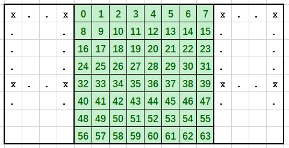
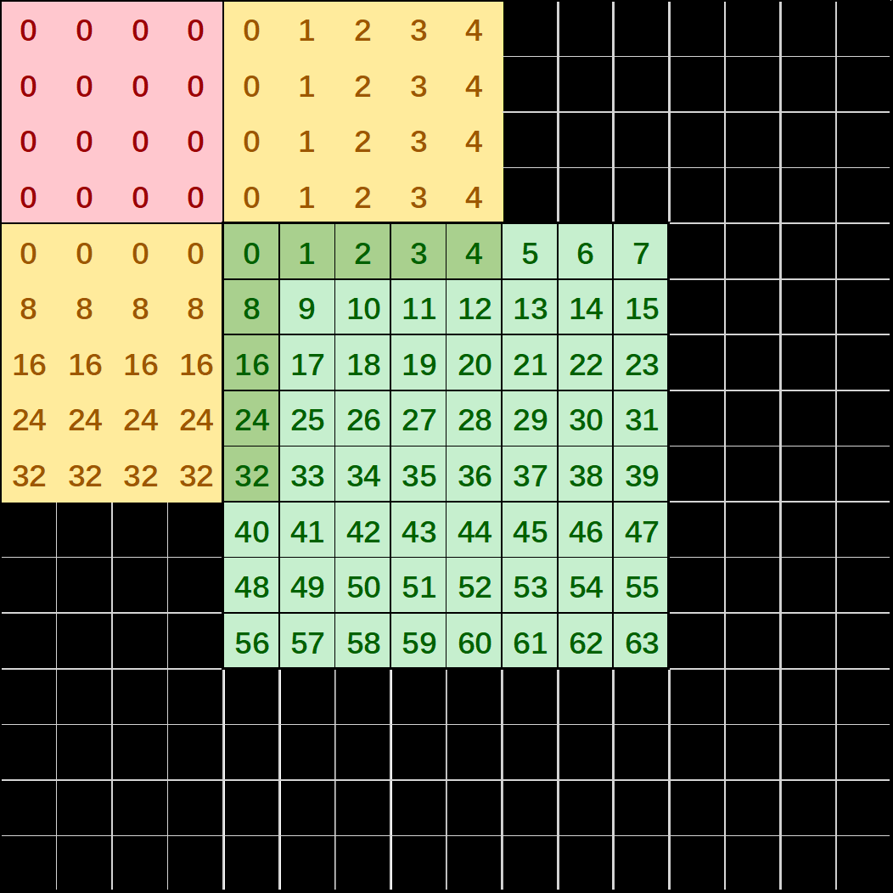
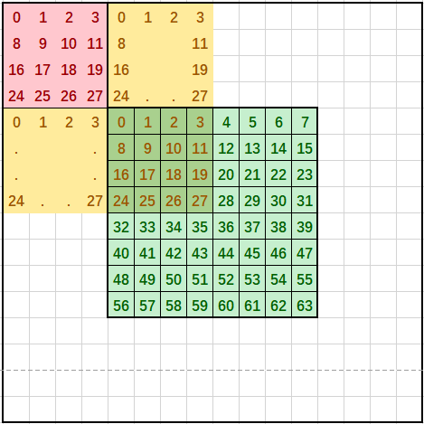
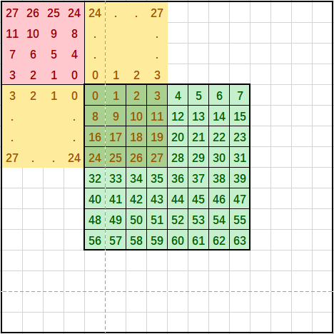

# SetAippFunctions

> **Section**: 6.2.3.2.1.18  
> **PDF Pages**: 1062–1073  

---

<!-- page 1062 -->

参数名称输入/输出

含义

c0ChStride输入在L1 Buffer上的C0 channel stride，单位是C0_SIZE（32B）。

eleWiseData沿N方向以C0为单位切分得到的数据块称为C0channel，两块C0 channel的间隔称之为C0 channelstride。

约束说明

无

返回值说明

无

调用示例

完整示例可参考完整示例。

DataCopy随路量化搬运后，可以逐个元素加/减一个大小为mSize * nSize的LocalTensor，具体LocalTensor地址相关参数需要调用SetFixPipeAddr来设置。

```cpp
__aicore__inline void SetEleSrcPara(const LocalTensor <half>& eleWiseData, uint16_t c0ChStride){    AscendC::SetFixPipeAddr(eleWiseData, c0ChStride);}
```

## 6.2.3.2.1.18 SetAippFunctions

产品支持情况

产品是否支持

Atlas 350 加速卡√

Atlas A3 训练系列产品/Atlas A3 推理系列产品√

Atlas A2 训练系列产品/Atlas A2 推理系列产品√

Atlas 200I/500 A2 推理产品√

Atlas 推理系列产品AI Core√

Atlas 推理系列产品Vector Corex

Atlas 训练系列产品x

功能说明

设置图片预处理（AIPP，AI core pre-process）相关参数。和 LoadImageToLocal接口配合使用。设置后，调用 LoadImageToLocal接口可在搬运过程中完成图像预处理

<!-- page 1063 -->

操作：包括数据填充，通道交换，单行读取、数据类型转换、通道填充、色域转换。调用SetAippFunctions接口时需传入源图片在Global Memory上的矩阵、源图片的图片格式。

●数据填充：在图片HW方向上padding。分为如下几种模式：

–模式0：常量填充模式，padding区域各位置填充为常数，支持设置每个通道填充的常数。该模式下仅支持左右padding，不支持上下padding。

图6-32常量填充模式（图片中间的绿色区域表示原始数据，其他为padding数据）



–模式1：行列填充模式，padding区域各位置填充行/列上最邻近源图片位置的数据。

<!-- page 1064 -->

图6-33行列填充模式（图片中间的绿色区域表示原始数据，其他为padding数据）



–模式2：块填充模式，按照padding的宽高，从源图片拷贝数据块进行padding区域填充。

<!-- page 1065 -->

图6-34块填充模式（图片中间的绿色区域表示原始数据，其他为padding数据）



–模式3：镜像块填充模式，按照padding的宽高，从源图片拷贝数据块的镜像进行padding区域填充。

<!-- page 1066 -->

图6-35镜像块填充模式（图片中间的绿色区域表示原始数据，其他为padding 数据）



●通道交换：将图片通道进行交换。

对于RGB888格式，支持交换R和B通道。

对于YUV420SP格式，支持交换U和V通道。

对于XRGB8888格式，支持X通道后移（XRGB->RGBX）、支持交换R和B通道。

●单行读取：源图片中仅读取一行。

说明

调用数据搬运接口时，开启单行读取后设置的目的图片高度参数无效，如LoadImageToLocal接口的loadImageToLocalParams.vertSize。

●数据类型转换：转换像素的数据类型，支持uint8_t转换为int8_t或half。当uint8_t转换成int8_t的时候，输出数据范围限制在[-128， 127]。// 例1：实现uint8_t ->int8_t 的类型转换，同时实现零均值化：设置每个通道mean值为该通道所有数据的平均值（min和var值无效，不用设置）。output[i][j][k] = input[i][j][k] - mean[k]// 例2：实现uint8_t -> fp16 的类型转换，同时实现归一化：设置每个通道mean值为该通道所有数据的平均值，min值为该通道所有数据零均值化后的最小值，var值为该通道所有数据的最大值减最小值的倒数。uint8_t -> fp16:  output[i][j][k] = (input[i][j][k] - mean[k] - min[k]) * var[k]

说明

转换后的数据类型是由模板参数U配置，U为uint8_t时数据类型转换功能不生效。

调用数据搬运接口时，目的Tensor的数据类型需要与本接口输出数据类型保持一致，如LoadImageToLocal的dstLocal参数的数据类型。

<!-- page 1067 -->

●通道填充：在图片通道方向上padding。默认为模式0。

模式0：将通道padding至32Bytes。即输出数据类型为uint8_t/int8_t时，padding至32通道；输出数据类型为fp16时，padding至16通道。

模式1：将通道padding至4通道。

●色域转换：RGB格式转换为YUV格式，或YUV模式转换为RGB格式。


函数原型

●输入图片格式为YUV400、RGB888、XRGB8888template<typename T, typename U>__aicore__ inline void SetAippFunctions(const GlobalTensor<T>& src0, AippInputFormat format, AippParams<U> config)

●输入图片格式为YUV420 Semi-Planartemplate<typename T, typename U>__aicore__ inline void SetAippFunctions(const GlobalTensor<T>& src0, const GlobalTensor<T>& src1, AippInputFormat format, AippParams<U> config)

参数说明

表6-205模板参数说明

参数名称含义

T输入的数据类型，需要与format中设置的数据类型保持一致。

U输出的数据类型，需要在搬运接口配置同样的数据类型，如LoadImageToLocal的dstLocal参数数据类型。

●如果不使能数据类型转换功能，需要与输入类型保持一致；

●如果使能数据类型转换功能，需要与期望转换后的类型保持一致。

<!-- page 1068 -->

表6-206参数说明

参数名称输入/输出

含义

src0输入源图片在Global Memory上的矩阵。

源图片格式为YUV420SP时，表示Y维度在Global Memory上的矩阵。

src1输入源图片格式为YUV420SP时，表示UV维度在Global Memory上的矩阵。

源图片格式为其他格式时，该参数无效。

format输入源图片的图片格式。AippInputFormat为枚举类型，取值为：

AippInputFormat::YUV420SP_U8：图片格式为YUV420Semi-Planar，数据类型为uint8_t

AippInputFormat::XRGB8888_U8：图片格式为XRGB8888，数据类型为uint8_t

AippInputFormat::RGB888_U8：图片格式为RGB888，数据类型为uint8_t

AippInputFormat::YUV400_U8：图片格式为YUV400，数据类型为uint8_tenum class AippInputFormat : uint8_t {    YUV420SP_U8 = 0,    XRGB8888_U8 = 1,    RGB888_U8 = 4,    YUV400_U8 = 9,};

<!-- page 1069 -->

参数名称输入/输出

含义

config输入图片预处理的相关参数，类型为AippParams，结构体具体定义为：template <typename T>struct AippParams {    AippPaddingParams<T> paddingParams;    AippSwapParams swapParams;    AippSingleLineParams singleLineParams;    AippDataTypeConvParams dtcParams;    AippChannelPaddingParams<T> cPaddingParams;    AippColorSpaceConvParams cscParams;};

AippParams结构体内各子结构体定义如下：

●数据填充功能相关参数，说明见表6-207。template <typename T>struct AippPaddingParams {    uint32_t paddingMode;    T paddingValueCh0;    T paddingValueCh1;    T paddingValueCh2;    T paddingValueCh3;};

●通道交换功能相关参数，说明见表6-208。struct AippSwapParams {    bool isSwapRB;    bool isSwapUV;    bool isSwapAX;};

●单行读取功能相关参数，说明见表6-209。struct AippSingleLineParams {    bool isSingleLineCopy;};

●数据类型转换功能相关参数，说明见表6-210。struct AippDataTypeConvParams {    uint8_t dtcMeanCh0{ 0 };    uint8_t dtcMeanCh1{ 0 };    uint8_t dtcMeanCh2{ 0 };    half dtcMinCh0{ 0 };    half dtcMinCh1{ 0 };    half dtcMinCh2{ 0 };    half dtcVarCh0{ 1.0 };    half dtcVarCh1{ 1.0 };    half dtcVarCh2{ 1.0 };    uint32_t dtcRoundMode{ 0 };};

●通道填充功能相关参数，说明见表6-211。template <typename T>struct AippChannelPaddingParams {    uint32_t cPaddingMode;    T cPaddingValue;};

●色域转换功能相关参数，说明见表6-212。struct AippColorSpaceConvParams {    bool isEnableCsc;    int16_t cscMatrixR0C0;    int16_t cscMatrixR0C1;    int16_t cscMatrixR0C2;    int16_t cscMatrixR1C0;    int16_t cscMatrixR1C1;    int16_t cscMatrixR1C2;

<!-- page 1070 -->

参数名称输入/输出

含义

```cpp
int16_t cscMatrixR2C0;
    int16_t cscMatrixR2C1;
    int16_t cscMatrixR2C2;
    uint8_t cscBiasIn0;
    uint8_t cscBiasIn1;
    uint8_t cscBiasIn2;
    uint8_t cscBiasOut0;
    uint8_t cscBiasOut1;
    uint8_t cscBiasOut2;};
```

表6-207 AippPaddingParams 结构体内参数说明

参数名称输入/输出

含义

paddingMode

输入padding的模式，取值范围[0, 3]，默认值为0。

0：常数填充模式，此模式仅支持左右填充。

1：行列拷贝模式。

2：块拷贝模式。

3：镜像块拷贝模式。

paddingValueCh0

输入padding区域中channel0填充的数据，仅常数填充模式有效，数据类型为T，默认值为0。

paddingValueCh1

输入padding区域中channel1填充的数据，仅常数填充模式有效，数据类型为T，默认值为0。

paddingValueCh2

输入padding区域中channel2填充的数据，仅常数填充模式有效，数据类型为T，默认值为0。

paddingValueCh3

输入padding区域中channel3填充的数据，仅常数填充模式有效，数据类型为T，默认值为0。

表6-208 AippSwapParams 结构体内参数说明

参数名称输入/输出

含义

isSwapRB输入对于RGB888、XRGB8888格式，是否交换R和B通道。默认值为false。

isSwapUV输入对于YUV420SP格式，是否交换U和V通道。默认值为false。

isSwapAX输入对于XRGB8888格式，是否将X通道后移，即XRGB->RGBX。默认值为false。

<!-- page 1071 -->

表6-209 AippSingleLineParams 结构体内参数说明

参数名称输入/输出

含义

isSingleLineCopy

输入是否开启单行读取模式。开启后，仅从源图片读取一行。默认值为false。

表6-210 AippDataTypeConvParams 结构体内参数说明

参数名称输入/输出

含义

dtcMeanCh0

输入计算公式内的mean值，channel0，数据类型为uint8_t，默认值为0。

dtcMeanCh1

输入计算公式内的mean值，channel1，数据类型为uint8_t，默认值为0。

dtcMeanCh2

输入计算公式内的mean值，channel2，数据类型为uint8_t，默认值为0。

dtcMinCh0输入计算公式内的min值，channel0，数据类型为half，默认值为0。

Atlas 200I/500 A2 推理产品不支持配置该参数。

dtcMinCh1输入计算公式内的min值，channel1，数据类型为half，默认值为0。

Atlas 200I/500 A2 推理产品不支持配置该参数。

dtcMinCh2输入计算公式内的min值，channel2，数据类型为half，默认值为0。

Atlas 200I/500 A2 推理产品不支持配置该参数。

dtcVarCh0输入计算公式内的var值，channel0，数据类型为half，默认值为1.0。

dtcVarCh1输入计算公式内的var值，channel1，数据类型为half，默认值为1.0。

dtcVarCh2输入计算公式内的var值，channel2，数据类型为half，默认值为1.0。

dtcRoundMode

输入控制dtc做数据类型转换的模式，数据类型为uint32_t，默认值为0。

0：四舍五入到最接近的整数值（C语言round）。

1：四舍五入到最接近的偶数（C语言rint）。

仅Atlas 200I/500 A2 推理产品支持配置该参数。

<!-- page 1072 -->

表6-211 AippChannelPaddingParams 结构体内参数说明

参数名称输入/输出

含义

cPaddingMode

输入channel padding的类型，取值范围为[0, 1]，默认值为0。

0：填充到32B。即输出数据类型U为uint8_t/int8_t时填充到32通道，为half时填充到16通道。

1：填充到4通道。

cPaddingValue

输入channel padding填充的值，数据类型为T，默认值为0。

表6-212 AippColorSpaceConvParams 结构体内参数说明

参数名称输入/输出

含义

isEnableCsc

输入是否开启色域转换功能，默认值为false。

cscMatrixR0C0

输入色域转换矩阵cscMatrix[0][0]。

cscMatrixR0C1

输入色域转换矩阵cscMatrix[0][1]。

cscMatrixR0C2

输入色域转换矩阵cscMatrix[0][2]。

cscMatrixR1C0

输入色域转换矩阵cscMatrix[1][0]。

cscMatrixR1C1

输入色域转换矩阵cscMatrix[1][1]。

cscMatrixR1C2

输入色域转换矩阵cscMatrix[1][2]。

cscMatrixR2C0

输入色域转换矩阵cscMatrix[2][0]。

cscMatrixR2C1

输入色域转换矩阵cscMatrix[2][1]。

cscMatrixR2C2

输入色域转换矩阵cscMatrix[2][2]。

cscBiasIn0输入RGB转YUV偏置cscBiasIn[0]。YUV转RGB时无效。

cscBiasIn1输入RGB转YUV偏置cscBiasIn[1]。YUV转RGB时无效。

cscBiasIn2输入RGB转YUV偏置cscBiasIn[2]。YUV转RGB时无效。

<!-- page 1073 -->

参数名称输入/输出

含义

cscBiasOut0

输入YUV转RGB偏置cscBiasOut0[0]。RGB转YUV时无效。

cscBiasOut1

输入YUV转RGB偏置cscBiasOut1[1]。RGB转YUV时无效。

cscBiasOut2

输入YUV转RGB偏置cscBiasOut2[2]。RGB转YUV时无效。

约束说明

●src0、src1在Global Memory上的地址对齐要求如下：

图片格式src0src1

YUV420SP必须2Bytes对齐必须2Bytes对齐

XRGB8888必须4Bytes对齐-

RGB888无对齐要求-

YUV400无对齐要求-

●对于XRGB输入格式的数据，芯片在处理的时候会默认丢弃掉第四个通道的数据输出RGB格式的数据，所以如果是X在channel0的场景下，为了达成上述目的，X通道后移的功能必须使能，将输入的通道转换为RGBX；反之如果是X在channel3的场景下，X通道后移的功能必须不使能以输出RGB格式的数据。

返回值说明

无

调用示例

●该调用示例支持的运行平台为Atlas 推理系列产品AI Core，示例图片格式为YUV420SP。uint16_t horizSize = 32, vertSize = 32, horizStartPos = 0, vertStartPos = 0, srcHorizSize = 32, srcVertSize = 32, leftPadSize = 0, rightPadSize = 0;uint32_t dstHorizSize = 32, dstVertSize = 32, cSize = 32;uint8_t topPadSize = 0, botPadSize = 0;uint32_t gmSrc0Size = 0, gmSrc1Size = 0, dstSize = 0;AscendC::AippInputFormat inputFormat = AscendC::AippInputFormat::YUV420SP_U8;uint32_t cPadMode = 0;int8_t cPaddingValue = 0;

```cpp
AscendC::TPipe pipe;AscendC::TQue<AscendC::TPosition::A1, 1> inQueueA1;AscendC::TQue<AscendC::TPosition::VECOUT, 1> outQueueUB;AscendC::LocalTensor<int8_t> featureMapA1 = inQueueA1.AllocTensor<int8_t>();uint64_t fm_addr = static_cast<uint64_t>(reinterpret_cast<uintptr_t>(fmGlobal.GetPhyAddr()));        // aipp configAscendC::AippParams<int8_t> aippConfig;aippConfig.cPaddingParams.cPaddingMode = cPadMode;aippConfig.cPaddingParams.cPaddingValue = cPaddingValue;
```
