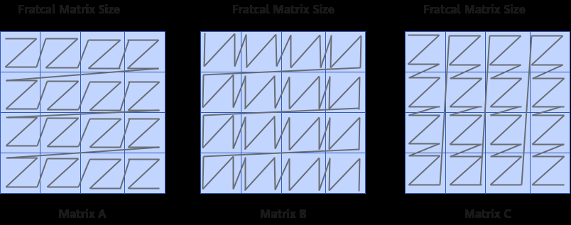

# Mmad

> **Section**: 6.2.3.2.2.1  
> **PDF Pages**: 1077–1085  

---

<!-- page 1077 -->

AscendC::LocalTensor<int8_t> featureMapA1 = inQueueA1.AllocTensor<int8_t>();uint64_t fm_addr = static_cast<uint64_t>(reinterpret_cast<uintptr_t>(fmGlobal.GetPhyAddr()));// aipp configAscendC::AippParams<int8_t> aippConfig;aippConfig.cPaddingParams.cPaddingMode = cPadMode;aippConfig.cPaddingParams.cPaddingValue = cPaddingValue;// fmGlobal为整张输入图片，src1参数处填入图片UV维度的起始地址AscendC::SetAippFunctions(fmGlobal, fmGlobal[gmSrc0Size], inputFormat, aippConfig);AscendC::LoadImageToLocal(featureMapA1, { horizSize, vertSize, horizStartPos, vertStartPos, srcHorizSize, topPadSize, botPadSize, leftPadSize, rightPadSize });

## 6.2.3.2.2 矩阵计算

## 6.2.3.2.2.1 Mmad

产品支持情况

是否支持（

产品是否支持（

不传入bias的原型

传入bias的原型

）

）

Atlas 350 加速卡√√

Atlas A3 训练系列产品/Atlas A3 推理系列产品

√√

Atlas A2 训练系列产品/Atlas A2 推理系列产品

√√

Atlas 200I/500 A2 推理产品√√

Atlas 推理系列产品AI Core√x

Atlas 推理系列产品Vector Corexx

Atlas 训练系列产品√x

功能说明

功能一：完成矩阵乘加（C += A * B）操作。矩阵ABC分别为A2/B2/CO1中的数据。

●ABC矩阵的数据排布格式分别为ZZ，ZN，NZ。数据排布格式详解请参考2.9.2.2数据排布格式。

下图中每个小方格代表一个分形矩阵，Z字形的黑色线条代表数据的排列顺序，起始点是左上角，终点是右下角。

矩阵A：每个分形矩阵内部是行主序，分形矩阵之间是行主序。简称小Z大Z格式。分形shape为16 x (32B/sizeof(AType))，大小为512Byte。

矩阵B：每个分形矩阵内部是列主序，分形矩阵之间是行主序。简称小N大Z格式。分形shape为 (32B/sizeof(BType)) x 16，大小为512Byte。

矩阵C：每个分形矩阵内部是行主序，分形矩阵之间是列主序。简称小Z大N格式。分形shape为16 x 16，大小为256个元素。

<!-- page 1078 -->

以下是一个简单的例子，假设分形矩阵的大小是2x2（并不符合真实情况，仅作为示例），矩阵ABC的大小都是4x4。

0123

4567

891011

12131415

矩阵A的排列顺序：0，1，4，5，2，3，6，7，8，9，12，13，10，11，14，15。

矩阵B的排列顺序：0，4，1，5，2，6，3，7，8，12，9，13，10，14，11，15。

矩阵C的排列顺序：0，1，4，5，8，9，12，13，2，3，6，7，10，11，14，15。

●ABC矩阵的数据排布格式分别为NZ，ZN，NZ。

矩阵A：每个分形矩阵内部是行主序，分形矩阵之间是列主序。简称小Z大N格式。其shape为16 x (32B/sizeof(AType))，大小为512Byte。

矩阵B：每个分形矩阵内部是列主序，分形矩阵之间是行主序。简称小N大Z格式。其shape为 (32B/sizeof(BType)) x 16，大小为512Byte。

矩阵C：每个分形矩阵内部是行主序，分形矩阵之间是列主序。简称小Z大N格式。其shape为16 x 16，大小为256个元素。

以下是一个简单的例子，假设分形矩阵的大小是2x2（并不符合真实情况，仅作为示例），矩阵ABC的大小都是4x4。

<!-- page 1079 -->

0123

4567

891011

12131415

矩阵A的排列顺序:0，1，4，5，8，9，12，13，2，3，6，7，10，11，14，15。

矩阵B的排列顺序:0，4，1，5，2，6，3，7，8，12，9，13，10，14，11，15。

矩阵C的排列顺序:0，1，4，5，8，9，12，13，2，3，6，7，10，11，14，15。

功能二：针对Atlas 350 加速卡，还支持包含缩放功能的矩阵乘，公式如下：C =(ScaleA ⊗ A) ∗ (ScaleB ⊗ B) + C。ScaleA和ScaleB通过LoadData2DMX接口载入。

●ScaleA的分形格式为小Z大Z ，shape为（16，2），数据类型为fp8_e8m0_t。

●ScaleB的分形格式为小N大N，shape为（2，16），数据类型为fp8_e8m0_t。

以AB矩阵均为fp4x2_e2m1_t数据类型为例，下图展示了ScaleA、ScaleB的分形排布格式和缩放功能原理：

函数原型

●不传入biastemplate <typename T, typename U, typename S>__aicore__ inline void Mmad(const LocalTensor<T>& dst, const LocalTensor<U>& fm, const LocalTensor<S>& filter, const MmadParams& mmadParams)

<!-- page 1080 -->

●传入biastemplate <typename T, typename U, typename S, typename V>__aicore__ inline void Mmad(const LocalTensor<T>& dst, const LocalTensor<U>& fm, const LocalTensor<S>& filter, const LocalTensor<V>& bias, const MmadParams& mmadParams)

参数说明

表6-215模板参数说明

参数名描述

T目的操作数的数据类型。

U左矩阵的数据类型。

S右矩阵的数据类型。

VBias矩阵的数据类型。

表6-216参数说明

参数名称输入/输出

含义

dst输出目的操作数，结果矩阵，类型为LocalTensor，支持的TPosition为CO1。

LocalTensor的起始地址需要256个元素对齐。

fm输入源操作数，左矩阵a，类型为LocalTensor，支持的TPosition为A2。

LocalTensor的起始地址需要512字节对齐。

filter输入源操作数，右矩阵b，类型为LocalTensor，支持的TPosition为B2。

LocalTensor的起始地址需要512字节对齐。

bias输入源操作数，bias矩阵，类型为LocalTensor，支持的TPosition为C2、CO1。

LocalTensor的起始地址需要128字节对齐。

mmadParams

输入矩阵乘相关参数，该参数类型的具体定义请参考${INSTALL_DIR}/include/ascendc/basic_api/interface/kernel_struct_mm.h，${INSTALL_DIR}请替换为CANN软件安装后文件存储路径。

MmadParams参数说明请参考表6-217。

<!-- page 1081 -->

表6-217 MmadParams 结构体内参数说明

参数名称含义

m左矩阵Height，取值范围：m∈[0, 4095] 。默认值为0。

n右矩阵Width，取值范围：n∈[0, 4095] 。默认值为0。

k左矩阵Width、右矩阵Height，取值范围：k∈[0, 4095] 。默认值为0。

cmatrixInitVal

配置C矩阵初始值是否为0。默认值true。

●true：C矩阵初始值为0；

●false：C矩阵初始值通过cmatrixSource参数进行配置。

cmatrixSource

配置C矩阵初始值是否来源于C2（存放Bias的硬件缓存区）。默认值为false。

●false：来源于CO1；

●true：来源于C2。

Atlas 训练系列产品，仅支持配置为false。

Atlas 推理系列产品AI Core，仅支持配置为false。

Atlas A2 训练系列产品/Atlas A2 推理系列产品，支持配置为true/false。

Atlas A3 训练系列产品/Atlas A3 推理系列产品，支持配置为true/false。

Atlas 200I/500 A2 推理产品，支持配置为true/false。

Atlas 350 加速卡，支持配置为true/false。

注意：带bias输入的接口配置该参数无效，会根据bias输入的位置来判断C矩阵初始值是否来源于CO1还是C2。

isBias该参数废弃，新开发内容不要使用该参数。如果需要累加初始矩阵，请使用带bias的接口来实现；也可以通过cmatrixInitVal和cmatrixSource参数配置C矩阵的初始值来源来实现。推荐使用带bias的接口，相比于配置cmatrixInitVal和cmatrixSource参数更加简单方便。

配置是否需要累加初始矩阵，默认值为false，取值说明如下：

●false：矩阵乘，无需累加初始矩阵，C = A * B。

●true：矩阵乘加，需要累加初始矩阵，C += A * B。

disableGemv

M = 1时，用于配置Mmad计算是否开启GEMV。当输入为false时，表示开启GEMV；反之，输入为true时，表示关闭GEMV。

GEMV（General Matrix-Vector Multiplication）表示实现矩阵和向量的乘积，开启GEMV后，Mmad API 从L0A Buffer读取数据时，数据将以ND格式进行读取，而不会将其视为ZZ格式。

该参数仅支持如下型号：

Atlas 350 加速卡

<!-- page 1082 -->

参数名称含义

unitFlagunitFlag是一种Mmad指令和Fixpipe指令细粒度的并行，使能该功能后，硬件每计算完一个分形，计算结果就会被搬出，该功能不适用于在L0C Buffer累加的场景。取值说明如下：

0：保留值；

2：使能unitFlag，硬件执行完指令之后，不会关闭unitFlag功能；

3：使能unitFlag，硬件执行完指令之后，会将unitFlag功能关闭。

使能该功能时，Mmad指令的unitFlag在最后1个分形设置为3、其余分形计算设置为2即可。

该参数仅支持如下型号：

Atlas 350 加速卡

Atlas A2 训练系列产品/Atlas A2 推理系列产品

Atlas A3 训练系列产品/Atlas A3 推理系列产品

fmOffset预留参数。为后续的功能做保留，开发者暂时无需关注，使用默认值即可。enSsparse

enWinogradA

enWinogradB

kDirectionAlign

设置是否需要对齐，默认值为false。

Atlas 训练系列产品，仅支持配置为false。

Atlas 推理系列产品AI Core，仅支持配置为false。

Atlas A2 训练系列产品/Atlas A2 推理系列产品，仅支持配置为false。

Atlas A3 训练系列产品/Atlas A3 推理系列产品，仅支持配置为false。

Atlas 200I/500 A2 推理产品，仅支持配置为false。

Atlas 350 加速卡，仅支持配置为false。

表6-218 dst、fm、filter 支持的精度类型组合（Atlas 训练系列产品）

左矩阵fm type右矩阵filter type结果矩阵dst type

uint8_tuint8_tuint32_t

int8_tint8_tint32_t

uint8_tint8_tint32_t

<!-- page 1083 -->

左矩阵fm type右矩阵filter type结果矩阵dst type

halfhalfhalf

说明

该精度类型组合，精度无法达到双千分之一，且后续处理器版本不支持该类型转换，建议直接使用half输入float输出。

双千分之一是指每个实际数据和真值数据之间的误差不超过千分之一，误差超过千分之一的数据总和不超过总数据数的千分之一。

halfhalffloat

表6-219 dst、fm、filter 支持的精度类型组合（Atlas 推理系列产品AI Core ）

左矩阵fm type右矩阵filter type结果矩阵dst type

int8_tint8_tint32_t

uint8_tint8_tint32_t

uint8_tuint8_tint32_t

halfhalfhalf

说明

该精度类型组合，精度无法达到双千分之一，且后续处理器版本不支持该类型转换，建议直接使用half输入float输出。

双千分之一是指每个实际数据和真值数据之间的误差不超过千分之一，误差超过千分之一的数据总和不超过总数据数的千分之一。

halfhalffloat

int4b_tint4b_tint32_t

表6-220 dst、fm、filter 支持的精度类型组合（Atlas 200I/500 A2 推理产品）（Atlas A2 训练系列产品/Atlas A2 推理系列产品）（Atlas A3 训练系列产品/AtlasA3 推理系列产品）

左矩阵fm type右矩阵filter type结果矩阵dst type

int8_tint8_tint32_t

halfhalffloat

<!-- page 1084 -->

左矩阵fm type右矩阵filter type结果矩阵dst type

floatfloatfloat

bfloat16_tbfloat16_tfloat

int4b_tint4b_tint32_t

表6-221 dst、fm、filter 支持的精度类型组合（Atlas 350 加速卡）

左矩阵fm type右矩阵filter type结果矩阵dst type

备注

int8_tint8_tint32_t仅支持不含缩放的矩阵乘halfhalffloat

floatfloatfloat

bfloat16_tbfloat16_tfloat

fp8_e4m3fn_tfp8_e4m3fn_tfloat

fp8_e4m3fn_tfp8_e5m2_tfloat

fp8_e5m2_tfp8_e4m3fn_tfloat

fp8_e5m2_tfp8_e5m2_tfloat

hifloat8_thifloat8_tfloat

fp4x2_e1m2_tfp4x2_e1m2_tfloat仅支持包含缩放的矩阵乘fp4x2_e2m1_tfp4x2_e1m2_tfloat

fp4x2_e1m2_tfp4x2_e2m1_tfloat

fp4x2_e2m1_tfp4x2_e2m1_tfloat

AscendC::mx_fp8_e4m3_t

AscendC::mx_fp8_e4m3_t

float

AscendC::mx_fp8_e4m3_t

AscendC::mx_fp8_e5m2_t

float

AscendC::mx_fp8_e5m2_t

AscendC::mx_fp8_e4m3_t

float

AscendC::mx_fp8_e5m2_t

AscendC::mx_fp8_e5m2_t

float

<!-- page 1085 -->

表6-222 dst、fm、filter、bias 支持的精度类型组合（Atlas 200I/500 A2 推理产品）（Atlas A2 训练系列产品/Atlas A2 推理系列产品）（Atlas A3 训练系列产品/AtlasA3 推理系列产品）

左矩阵fm type右矩阵filter typebias type结果矩阵dst type

int8_tint8_tint32_tint32_t

halfhalffloatfloat

floatfloatfloatfloat

bfloat16_tbfloat16_tfloatfloat

表6-223 dst、fm、filter、bias 支持的精度类型组合（Atlas 350 加速卡）

左矩阵fm type右矩阵filtertype

**bias type结果矩阵dsttype**

备注

int8_tint8_tint32_tint32_t仅支持不含缩放的矩阵乘halfhalffloatfloat

floatfloatfloatfloat

bfloat16_tbfloat16_tfloatfloat

fp8_e4m3fn_tfp8_e4m3fn_tfloatfloat

fp8_e4m3fn_tfp8_e5m2_tfloatfloat

fp8_e5m2_tfp8_e4m3fn_tfloatfloat

fp8_e5m2_tfp8_e5m2_tfloatfloat

hifloat8_thifloat8_tfloatfloat

fp4x2_e1m2_tfp4x2_e1m2_tfloatfloat仅支持包含缩放的矩阵乘fp4x2_e2m1_tfp4x2_e1m2_tfloatfloat

fp4x2_e1m2_tfp4x2_e2m1_tfloatfloat

fp4x2_e2m1_tfp4x2_e2m1_tfloatfloat

AscendC::mx_fp8_e4m3_t

AscendC::mx_fp8_e4m3_t

floatfloat

AscendC::mx_fp8_e4m3_t

AscendC::mx_fp8_e5m2_t

floatfloat

AscendC::mx_fp8_e5m2_t

AscendC::mx_fp8_e4m3_t

floatfloat

AscendC::mx_fp8_e5m2_t

AscendC::mx_fp8_e5m2_t

floatfloat
