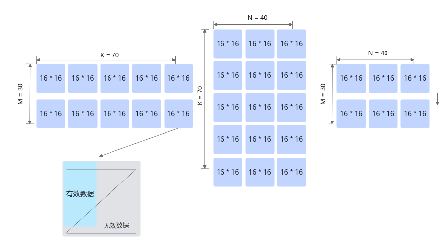
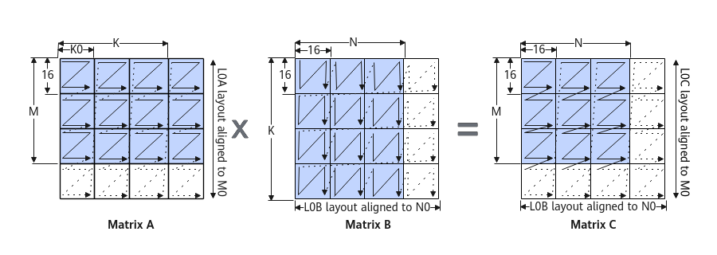
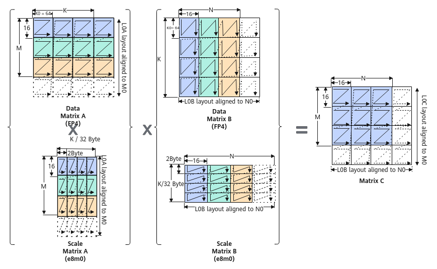

# MmadBitMode

> **Section**: 6.2.3.2.2.2  
> **PDF Pages**: 1086–1093  

---

<!-- page 1086 -->

约束说明

●dst只支持位于CO1，fm只支持位于A2，filter只支持位于B2。

●当M、K、N中的任意一个值为0时，该指令不会被执行。

●当M = 1时，会默认开启GEMV（General Matrix-Vector Multiplication）功能。在这种情况下，Mmad API从L0A Buffer读取数据时，会以ND格式进行读取，而不会将其视为ZZ格式。所以此时左矩阵需要直接按照ND格式进行排布。针对Atlas 350 加速卡，可以通过设置MmadParams的disableGemv参数为true，将该功能关闭。

●操作数地址对齐要求请参见通用地址对齐约束。

●通过一个具体的示例来介绍无效数据与有效数据的排布方式。

数据为half类型，当M=30，K=70，N=40的时候，A2中有2x5个16x16矩阵，B2中有5x3个16x16矩阵，CO1中有2x3个16x16矩阵。在这种场景下M、K和N都不是16的倍数，A2中右下角的矩阵实际有效的数据只有14x6个，但是也需要占一个16x16矩阵的空间，其他无效数据在计算中会被忽略。一个16x16分形的数据块中，无效数据与有效数据排布的方式示意如下：



调用示例

不含矩阵乘偏置的样例请参考Mmad样例。

包含矩阵乘偏置的样例请参考包含矩阵乘偏置的Mmad样例。

## 6.2.3.2.2.2 MmadBitMode

产品支持情况

产品是否支持（

是否支持（

不传入bias的原型

传入bias的原型

）

）

Atlas 350 加速卡√√

<!-- page 1087 -->

是否支持（

产品是否支持（

传入bias的原型

不传入bias的原型

）

）

Atlas A3 训练系列产品/Atlas A3 推理系列产品

xx

Atlas A2 训练系列产品/Atlas A2 推理系列产品

xx

Atlas 200I/500 A2 推理产品xx

Atlas 推理系列产品AI Corexx

Atlas 推理系列产品Vector Corexx

Atlas 训练系列产品xx

功能说明

功能一：完成矩阵乘加（C += A * B）操作。矩阵ABC分别为A2/B2/CO1中的数据。

●ABC矩阵的数据排布格式分别为ZZ，ZN，NZ。数据排布格式详解请参考2.9.2.2数据排布格式。

下图中每个小方格代表一个分形矩阵，Z字形的黑色线条代表数据的排列顺序，起始点是左上角，终点是右下角。

矩阵A：每个分形矩阵内部是行主序，分形矩阵之间是行主序。简称小Z大Z格式。分形shape为16 x (32B/sizeof(AType))，大小为512Byte。

矩阵B：每个分形矩阵内部是列主序，分形矩阵之间是行主序。简称小N大Z格式。分形shape为 (32B/sizeof(BType)) x 16，大小为512Byte。

矩阵C：每个分形矩阵内部是行主序，分形矩阵之间是列主序。简称小Z大N格式。分形shape为16 x 16，大小为256个元素。


以下是一个简单的例子，假设分形矩阵的大小是2x2（并不符合真实情况，仅作为示例），矩阵ABC的大小都是4x4。

0123

4567

<!-- page 1088 -->

891011

12131415

矩阵A的排列顺序：0，1，4，5，2，3，6，7，8，9，12，13，10，11，14，15。

矩阵B的排列顺序：0，4，1，5，2，6，3，7，8，12，9，13，10，14，11，15。

矩阵C的排列顺序：0，1，4，5，8，9，12，13，2，3，6，7，10，11，14，15。

●ABC矩阵的数据排布格式分别为NZ，ZN，NZ。

矩阵A：每个分形矩阵内部是行主序，分形矩阵之间是列主序。简称小Z大N格式。其shape为16 x (32B/sizeof(AType))，大小为512Byte。

矩阵B：每个分形矩阵内部是列主序，分形矩阵之间是行主序。简称小N大Z格式。其shape为 (32B/sizeof(BType)) x 16，大小为512Byte。

矩阵C：每个分形矩阵内部是行主序，分形矩阵之间是列主序。简称小Z大N格式。其shape为16 x 16，大小为256个元素。



以下是一个简单的例子，假设分形矩阵的大小是2x2（并不符合真实情况，仅作为示例），矩阵ABC的大小都是4x4。

0123

4567

891011

12131415

矩阵A的排列顺序:0，1，4，5，8，9，12，13，2，3，6，7，10，11，14，15。

矩阵B的排列顺序:0，4，1，5，2，6，3，7，8，12，9，13，10，14，11，15。

矩阵C的排列顺序:0，1，4，5，8，9，12，13，2，3，6，7，10，11，14，15。

功能二：针对Atlas 350 加速卡，还支持包含缩放功能的矩阵乘，公式如下：C =(ScaleA ⊗ A) ∗ (ScaleB ⊗ B) + C。ScaleA和ScaleB通过LoadData2DMX接口载入。

<!-- page 1089 -->

●ScaleA的分形格式为小Z大Z ，shape为（16，2），数据类型为fp8_e8m0_t。

●ScaleB的分形格式为小N大N，shape为（2，16），数据类型为fp8_e8m0_t。

以AB矩阵均为fp4x2_e2m1_t数据类型为例，下图展示了ScaleA、ScaleB的分形排布格式和缩放功能原理：



函数原型

●不传入biastemplate <typename T, typename U, typename S>__aicore__ inline void Mmad(const LocalTensor<T>& dst, const LocalTensor<U>& fm, const LocalTensor<S>& filter, const MmadBitModeParams& mmadParams)

●传入biastemplate <typename T, typename U, typename S, typename V>__aicore__ inline void Mmad(const LocalTensor<T>& dst, const LocalTensor<U>& fm, const LocalTensor<S>& filter, const LocalTensor<V>& bias, const MmadBitModeParams& mmadParams)

参数说明

表6-224模板参数说明

参数名描述

T目的操作数的数据类型。

U左矩阵的数据类型。

S右矩阵的数据类型。

VBias矩阵的数据类型。

<!-- page 1090 -->

表6-225参数说明

参数名称输入/输出

含义

dst输出目的操作数，结果矩阵，类型为LocalTensor，支持的TPosition为CO1。

LocalTensor的起始地址需要256个元素对齐。

fm输入源操作数，左矩阵a，类型为LocalTensor，支持的TPosition为A2。

LocalTensor的起始地址需要512字节对齐。

filter输入源操作数，右矩阵b，类型为LocalTensor，支持的TPosition为B2。

LocalTensor的起始地址需要512字节对齐。

bias输入源操作数，bias矩阵，类型为LocalTensor，支持的TPosition为C2、CO1。

LocalTensor的起始地址需要128字节对齐。

mmadParams

输入矩阵乘相关参数，该参数类型的具体定义请参考${INSTALL_DIR}/include/ascendc/basic_api/interface/kernel_struct_mm.h，${INSTALL_DIR}请替换为CANN软件安装后文件存储路径。

MmadBitModeParams，参数说明请参考表6-226。

表6-226 MmadBitModeParams 类参数说明

参数名称含义

config0uint64_t类型，与MmadBitModeConfig0位域（bit-field）结构体类型参数config0BitMode组成联合体（union），初始化为0，可以使用类对象的GetConfig0()函数获取其值。

config0BitMode

MmadBitModeConfig0位域（bit-field）结构体类型，参数参考表6-227，与config0组成联合体（union）。

MmadBitModeParams类参数设计思想说明：

联合体（union）是一种特殊的数据结构，允许在相同的内存位置存储不同的数据类型。union的所有成员共享同一块内存空间，大小由最大成员决定，同一时间只能使用一个成员。

位域（bit-field）是一种特殊的类成员，允许精确控制结构体中成员变量所占用的内存位数。结构体中成员变量从上到下对应内存中从低位到高位。

MmadBitModeParams类使用union与bit-field方法，采用bit位表达参数类型，使用bit-field结构体自动处理入参的bit位数，并利用union的特性实现多参数融合传递，仅需传递一个入参即可包含全部所需信息，对应底层接口仅需要接收一个参数。同时，当需要修改参数中某一bit位的值时，仅需要通过循环和位运算即可实现，不需要重新传入参数，减少了scalar计算，实现性能提升。

<!-- page 1091 -->

MmadBitModeParams类可以直接使用MmadBitModeParams结构体类型对象初始化：

```cpp
__aicore__ inline MmadBitModeParams(const MmadBitModeParams &mmadParams_);
```

也可以使用各参数的Set函数修改参数值，并且由于使用了联合体，还可以对congfig0直接进行逐bit位修改来修改参数。

表6-227 MmadBitModeConfig0 结构体参数说明

参数名称含义

m左矩阵Height，取值范围：m∈[0, 4095] 。默认值为0。

该参数是位域结构体的最低位参数，占用12bit，可以使用MmadBitModeParams类对象的SetM()函数设置其值，使用GetM()函数获取其值。

k右矩阵Width，取值范围：n∈[0, 4095] 。默认值为0。

该参数是位域结构体的第二低位参数，占用12bit，可以使用MmadBitModeParams类对象的SetK()函数设置其值，使用GetK()函数获取其值。

n左矩阵Width、右矩阵Height，取值范围：k∈[0, 4095] 。默认值为0。

该参数是位域结构体的第三低位参数，占用12bit，可以使用MmadBitModeParams类对象的SetN()函数设置其值，使用GetN()函数获取其值。

unitFlag预留参数。为后续的功能做保留，开发者暂时无需关注，使用默认值即可。

该参数是位域结构体的第四低位参数，占用2bit，可以使用MmadBitModeParams类对象的SetUnitFlag()函数设置其值，使用GetUnitFlag()函数获取其值。

disableGemv

M = 1时，用于配置Mmad计算是否开启GEMV。当输入为false时，表示开启GEMV；反之，输入为true时，表示关闭GEMV。

GEMV（General Matrix-Vector Multiplication）表示实现矩阵和向量的乘积，开启GEMV后，Mmad API 从L0A Buffer读取数据时，数据将以ND格式进行读取，而不会将其视为ZZ格式。

该参数是位域结构体的第五低位参数，占用1bit，可以使用MmadBitModeParams类对象的SetDisableGemv()函数设置其值，使用GetDisableGemv()函数获取其值。

cmatrixSource

配置C矩阵初始值是否来源于C2（存放Bias的硬件缓存区）。默认值为false。

●false：来源于CO1；

●true：来源于C2。

注意：带bias输入的接口配置该参数无效，会根据bias输入的位置来判断C矩阵初始值是否来源于CO1还是C2。

该参数是位域结构体的第六低位参数，占用1bit，可以使用MmadBitModeParams类对象的SetCmatrixSource()函数设置其值，使用GetCmatrixSource()函数获取其值。

<!-- page 1092 -->

参数名称含义

cmatrixInitVal

配置C矩阵初始值是否为0。默认值true。

●true：C矩阵初始值为0；

●false：C矩阵初始值通过cmatrixSource参数进行配置。

该参数是位域结构体的最高位参数，占用1bit，可以使用MmadBitModeParams类对象的SetCmatrixInitVal()函数设置其值，使用GetCmatrixInitVal()函数获取其值。

MmadBitModeConfig0结构体参数的含义与MmadBitModeParams结构体中的同名参数含义相同，具体参考表6-217。

表6-228 dst、fm、filter 支持的精度类型组合（Atlas 350 加速卡）

左矩阵fm type右矩阵filter type结果矩阵dst type

备注

int8_tint8_tint32_t仅支持不含缩放的矩阵乘halfhalffloat

floatfloatfloat

bfloat16_tbfloat16_tfloat

fp8_e4m3fn_tfp8_e4m3fn_tfloat

fp8_e4m3fn_tfp8_e5m2_tfloat

fp8_e5m2_tfp8_e4m3fn_tfloat

fp8_e5m2_tfp8_e5m2_tfloat

hifloat8_thifloat8_tfloat

fp4x2_e1m2_tfp4x2_e1m2_tfloat仅支持包含缩放的矩阵乘fp4x2_e2m1_tfp4x2_e1m2_tfloat

fp4x2_e1m2_tfp4x2_e2m1_tfloat

fp4x2_e2m1_tfp4x2_e2m1_tfloat

AscendC::mx_fp8_e4m3_t

AscendC::mx_fp8_e4m3_t

float

AscendC::mx_fp8_e4m3_t

AscendC::mx_fp8_e5m2_t

float

AscendC::mx_fp8_e5m2_t

AscendC::mx_fp8_e4m3_t

float

AscendC::mx_fp8_e5m2_t

AscendC::mx_fp8_e5m2_t

float

<!-- page 1093 -->

表6-229 dst、fm、filter、bias 支持的精度类型组合（Atlas 350 加速卡）

左矩阵fm type右矩阵filtertype

**bias type结果矩阵dsttype**

备注

int8_tint8_tint32_tint32_t仅支持不含缩放的矩阵乘halfhalffloatfloat

floatfloatfloatfloat

bfloat16_tbfloat16_tfloatfloat

fp8_e4m3fn_tfp8_e4m3fn_tfloatfloat

fp8_e4m3fn_tfp8_e5m2_tfloatfloat

fp8_e5m2_tfp8_e4m3fn_tfloatfloat

fp8_e5m2_tfp8_e5m2_tfloatfloat

hifloat8_thifloat8_tfloatfloat

fp4x2_e1m2_tfp4x2_e1m2_tfloatfloat仅支持包含缩放的矩阵乘fp4x2_e2m1_tfp4x2_e1m2_tfloatfloat

fp4x2_e1m2_tfp4x2_e2m1_tfloatfloat

fp4x2_e2m1_tfp4x2_e2m1_tfloatfloat

AscendC::mx_fp8_e4m3_t

AscendC::mx_fp8_e4m3_t

floatfloat

AscendC::mx_fp8_e4m3_t

AscendC::mx_fp8_e5m2_t

floatfloat

AscendC::mx_fp8_e5m2_t

AscendC::mx_fp8_e4m3_t

floatfloat

AscendC::mx_fp8_e5m2_t

AscendC::mx_fp8_e5m2_t

floatfloat

约束说明

●dst只支持位于CO1，fm只支持位于A2，filter只支持位于B2。

●当M、K、N中的任意一个值为0时，该指令不会被执行。

●当M = 1时，会默认开启GEMV（General Matrix-Vector Multiplication）功能。在这种情况下，Mmad API从L0A Buffer读取数据时，会以ND格式进行读取，而不会将其视为ZZ格式。所以此时左矩阵需要直接按照ND格式进行排布。针对Atlas 350 加速卡，可以通过设置MmadBitModeParams的disableGemv参数为true，将该功能关闭。

●操作数地址对齐要求请参见通用地址对齐约束。

●通过一个具体的示例来介绍无效数据与有效数据的排布方式。

数据为half类型，当M=30，K=70，N=40的时候，A2中有2x5个16x16矩阵，B2中有5x3个16x16矩阵，CO1中有2x3个16x16矩阵。在这种场景下M、K和N都不
