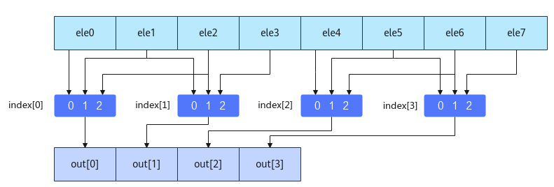

# MmadWithSparse

> **Section**: 6.2.3.2.2.3  
> **PDF Pages**: 1094–1096  

---

<!-- page 1094 -->

是16的倍数，A2中右下角的矩阵实际有效的数据只有14x6个，但是也需要占一个16x16矩阵的空间，其他无效数据在计算中会被忽略。一个16x16分形的数据块中，无效数据与有效数据排布的方式示意如下：


调用示例

不含矩阵乘偏置的样例请参考Mmad样例。

包含矩阵乘偏置的样例请参考包含矩阵乘偏置的Mmad样例。

## 6.2.3.2.2.3 MmadWithSparse

产品支持情况

产品是否支持

Atlas 350 加速卡x

Atlas A3 训练系列产品/Atlas A3 推理系列产品√

Atlas A2 训练系列产品/Atlas A2 推理系列产品√

Atlas 200I/500 A2 推理产品x

Atlas 推理系列产品AI Corex

Atlas 推理系列产品Vector Corex

Atlas 训练系列产品x

功能说明

完成矩阵乘加操作，传入的左矩阵A为稀疏矩阵，右矩阵B为稠密矩阵。对于矩阵A，在MmadWithSparse计算时完成稠密化；对于矩阵B，在计算执行前的输入数据准备时自行完成稠密化（按照下文中介绍的稠密算法进行稠密化），所以输入本接口的B矩阵为稠密矩阵。B稠密矩阵需要通过调用LoadDataWithSparse载入，同时加载索引矩阵，索引矩阵在矩阵B稠密化的过程中生成，再用于A矩阵的稠密化。

<!-- page 1095 -->

函数原型

```cpp
template <typename T = int32_t, typename U = int8_t, typename Std::enable_if<Std::is_same<PrimT<T>, int32_t>::value, bool>::type = true, typename Std::enable_if<Std::is_same<PrimT<U>, int8_t>::value, bool>::type = true>__aicore__ inline void MmadWithSparse(const LocalTensor<T>& dst, const LocalTensor<U>& fm, const LocalTensor<U>& filter, const MmadParams& mmadParams)
```

参数说明

表6-230模板参数说明

参数名描述

Tdst的数据类型。

Ufm、filter的数据类型。

●当dst、fm、filter为基础数据类型时， T必须为int32_t类型，U必须为int8_t类型，否则编译失败。

●当dst、fm、filter为TensorTrait类型时，T的LiteType必须为int32_t类型，U的LiteType必须为int8_t类型，否则编译失败。

最后两个模板参数仅用于上述数据类型检查，用户无需关注。

表6-231参数说明

参数名称输入/输出

含义

dst输出目的操作数，结果矩阵，类型为LocalTensor，支持的TPosition为CO1。

LocalTensor的起始地址需要256个元素（1024字节）对齐。

fm输入源操作数，左矩阵A，类型为LocalTensor，支持的TPosition为A2。

LocalTensor的起始地址需要512字节对齐。

filter输入源操作数，右矩阵B，类型为LocalTensor，支持的TPosition为B2。

LocalTensor的起始地址需要512字节对齐。

mmadParams

输入矩阵乘相关参数，类型为MmadParams。

具体定义请参考${INSTALL_DIR}/include/ascendc/basic_api/interface/kernel_struct_mm.h，${INSTALL_DIR}请替换为CANN软件安装后文件存储路径。

参数说明请参考表6-217。

约束说明

●原始稀疏矩阵B每4个元素中应保证最多2个非零元素，如果存在3个或更多非零元素，则仅使用前2个非零元素。

<!-- page 1096 -->

●当M、K、N中的任意一个值为0时，该指令不会被执行。

●操作数地址对齐要求请参见通用地址对齐约束。

稠密算法说明

假设原始稀疏矩阵B的每4个元素中至少有2个零，稠密化后的矩阵B是一个在每4个元素中过滤掉2个零的稠密矩阵。矩阵B稠密化的过程中生成索引矩阵，过程如下：对于稀疏矩阵B中的每4个元素，将在index矩阵中生成2个2位索引，并按照以下规则进行编码。索引必须在{0, 1, 2}范围内。

●第一个索引用于指示前3个元素中第1个非零元素的相对位置。

●第二个索引用于指示第2个非零元素在后3个元素中的相对位置。

具体可参考下表。其中，“-”表示算法不关心该位置上的值，因为其会被过滤。

示例ele0ele1ele2ele3Index_a[i]Index_b[i]

Two non-zeroelements

00XY2’b102’b10

0X0Y2’b012’b10

X00Y2’b002’b10

0XY-2’b012’b01

X0Y-2’b002’b01

XY--2’b002’b00

One non-zeroelement

000X2’b002’b10

00X02’b102’b00

0X002’b012’b00

X0002’b002’b00

All zero00002’b002’b00

该索引矩阵用于A矩阵的稠密化，根据索引矩阵从MatrixA中的4个元素中选择2个元素参与计算，如下图所示：



