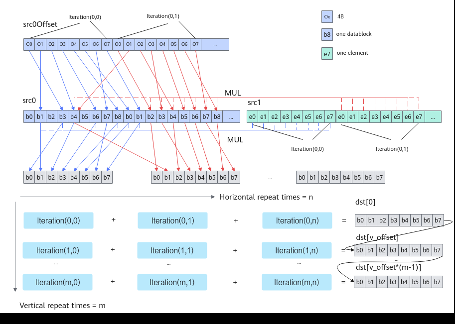

# BilinearInterpolation(ISASI)

> **Section**: 6.2.3.3.1.15  
> **PDF Pages**: 1159–1162  

---

<!-- page 1159 -->

●tensor高维切分计算样例-mask连续模式uint64_t mask = 128;// repeatTime = 4，一次迭代计算128个数，共计算512个数// dstBlkStride, src0BlkStride, src1BlkStride = 1，单次迭代内数据连续读取和写入// dstRepStride, src0RepStride, src1RepStride = 8，相邻迭代间数据连续读取和写入AscendC::Min(dstLocal, src0Local, src1Local, mask, 4, { 1, 1, 1, 8, 8, 8 });

●tensor高维切分计算样例-mask逐bit模式uint64_t mask[2] = { UINT64_MAX, UINT64_MAX };// repeatTime = 4，一次迭代计算128个数，共计算512个数// dstBlkStride, src0BlkStride, src1BlkStride = 1，单次迭代内数据连续读取和写入// dstRepStride, src0RepStride, src1RepStride = 8，相邻迭代间数据连续读取和写入AscendC::Min(dstLocal, src0Local, src1Local, mask, 4, { 1, 1, 1, 8, 8, 8 });

●tensor前n个数据计算样例AscendC::Min(dstLocal, src0Local, src1Local, 512);

结果示例如下：输入数据src0Local：[1 2 3 ... 512]输入数据src1Local：[513 512 511 ... 2]输出数据dstLocal：[1 2 3 ... 2]

## 6.2.3.3.1.15 BilinearInterpolation(ISASI)

产品支持情况

产品是否支持

Atlas 350 加速卡√

Atlas A3 训练系列产品/Atlas A3 推理系列产品√

Atlas A2 训练系列产品/Atlas A2 推理系列产品√

Atlas 200I/500 A2 推理产品x

Atlas 推理系列产品AI Core√

Atlas 推理系列产品Vector Corex

Atlas 训练系列产品x

功能说明

功能分为水平迭代和垂直迭代。每个水平迭代顺序地从src0Offset读取8个偏移值，表示src0的偏移，每个偏移值指向src0的一个DataBlock的起始地址，如果repeatMode=false，从src1中取一个值，与src0中8个DataBlock中每个值进行乘操作；如果repeatMode=true，从src1中取8个值，按顺序与src0中8个DataBlock中的值进行乘操作，最后当前迭代的dst结果与前一个dst结果按DataBlock进行累加，存入目的地址，在同一个水平迭代内dst地址不变。然后进行垂直迭代，垂直迭代的dst起始地址为上一轮垂直迭代的dst起始地址加上vROffset，本轮垂直迭代占用dst空间为dst起始地址之后的8个DataBlock，每轮垂直迭代进行hRepeat次水平迭代。

<!-- page 1160 -->



函数原型

●mask逐bit模式：template <typename T>__aicore__ inline void BilinearInterpolation(const LocalTensor<T>& dst, const LocalTensor<T>& src0, const LocalTensor<uint32_t>& src0Offset, const LocalTensor<T>& src1, uint64_t mask[], uint8_t hRepeat, bool repeatMode, uint16_t dstBlkStride, uint16_t vROffset, uint8_t vRepeat, const LocalTensor<uint8_t> &sharedTmpBuffer)

●mask连续模式：template <typename T>__aicore__ inline void BilinearInterpolation(const LocalTensor<T>& dst, const LocalTensor<T>& src0, const LocalTensor<uint32_t>& src0Offset, const LocalTensor<T>& src1, uint64_t mask, uint8_t hRepeat, bool repeatMode, uint16_t dstBlkStride, uint16_t vROffset, uint8_t vRepeat, const LocalTensor<uint8_t> &sharedTmpBuffer)

参数说明

表6-269模板参数说明

参数名描述

T操作数数据类型。

Atlas 350 加速卡，支持的数据类型为：half。

Atlas A2 训练系列产品/Atlas A2 推理系列产品，支持的数据类型为：half。

Atlas A3 训练系列产品/Atlas A3 推理系列产品，支持的数据类型为：half。

Atlas 推理系列产品AI Core，支持的数据类型为：half。

<!-- page 1161 -->

表6-270参数说明

参数名输入/输出

描述

dst输出目的操作数。

类型为LocalTensor，支持的TPosition为VECIN/VECCALC/VECOUT。

LocalTensor的起始地址需要32字节对齐。

src0、src1输入源操作数。

类型为LocalTensor，支持的TPosition为VECIN/VECCALC/VECOUT。

LocalTensor的起始地址需要32字节对齐。

两个源操作数的数据类型需要与目的操作数保持一致。

src0Offset输入源操作数。

类型为LocalTensor，支持的TPosition为VECIN/VECCALC/VECOUT。

LocalTensor的起始地址需要32字节对齐。

mask[]/mask

输入mask用于控制每次迭代内参与计算的元素。

●逐bit模式：可以按位控制哪些元素参与计算，bit位的值为1表示参与计算，0表示不参与。mask为数组形式，数组长度和数组元素的取值范围和操作数的数据类型有关。当操作数为16位时，数组长度为2，mask[0]、mask[1]∈[0, 264-1]并且不同时为0；当操作数为32位时，数组长度为1，mask[0]∈(0,264-1]；当操作数为64位时，数组长度为1，mask[0]∈(0, 232-1]。

例如，mask=[8, 0]，8=0b1000，表示仅第4个元素参与计算。

●连续模式：表示前面连续的多少个元素参与计算。取值范围和操作数的数据类型有关，数据类型不同，每次迭代内能够处理的元素个数最大值不同。当操作数为16位时，mask∈[1, 128]；当操作数为32位时，mask∈[1,64]；当操作数为64位时，mask∈[1, 32]。

hRepeat输入水平方向迭代次数，取值范围为[1, 255]。

repeatMode

输入迭代模式：

●false：每次迭代src0读取的8个datablock中每个值均与src1的单个数值相乘。

●true：每次迭代src0的每个datablock分别与src1的1个数值相乘，共消耗8个block和8个elements。

dstBlkStride

输入单次迭代内，目的操作数不同DataBlock间地址步长，以32B为单位。

<!-- page 1162 -->

参数名输入/输出

描述

vROffset输入垂直迭代间，目的操作数地址偏移量，以元素为单位，取值范围为[128, 65535)，vROffset * sizeof(T)需要保证32字节对齐。

vRepeat输入垂直方向迭代次数，取值范围为[1, 255]。

sharedTmpBuffer

输入临时空间。

Atlas 350 加速卡，不需要分配临时空间。

Atlas A2 训练系列产品/Atlas A2 推理系列产品，需要保证至少分配了src0.GetSize() * 32 + src1.GetSize() * 32字节的空间。

Atlas A3 训练系列产品/Atlas A3 推理系列产品，需要保证至少分配了src0.GetSize() * 32 + src1.GetSize() * 32字节的空间。

Atlas 推理系列产品AI Core，需要保证至少分配了src0OffsetLocal.GetSize() * sizeof(uint32_t)字节的空间。

返回值说明

无

约束说明

●操作数地址对齐要求请参见通用地址对齐约束。

●src0、src1、src0Offset之间不允许地址重叠，且两个垂直repeat的目的地址之间不允许地址重叠。

调用示例

●接口样例-mask连续模式AscendC::LocalTensor<half> dstLocal, src0Local, src1Local;AscendC::LocalTensor<uint32_t> src0OffsetLocal;AscendC::LocalTensor<uint8_t> tmpLocal;uint64_t mask = 128;        // mask连续模式uint8_t hRepeat = 2;        // 水平迭代2次bool repeatMode = false;    // 迭代模式uint16_t dstBlkStride = 1;  // 单次迭代内数据连续写入uint16_t vROffset = 128;    // 相邻迭代间数据连续写入uint8_t vRepeat = 2;        // 垂直迭代2次

```cpp
AscendC::BilinearInterpolation(dstLocal, src0Local, src0OffsetLocal, src1Local, mask, hRepeat, repeatMode,            dstBlkStride, vROffset, vRepeat, tmpLocal);
```

●接口样例-mask逐bit模式AscendC::LocalTensor<half> dstLocal, src0Local, src1Local;AscendC::LocalTensor<uint32_t> src0OffsetLocal;AscendC::LocalTensor<uint8_t> tmpLocal;uint64_t mask[2] = { UINT64_MAX, UINT64_MAX }; // mask逐bit模式uint8_t hRepeat = 2;        // 水平迭代2次bool repeatMode = false;    // 迭代模式uint16_t dstBlkStride = 1;  // 单次迭代内数据连续写入uint16_t vROffset = 128;    // 相邻迭代间数据连续写入
