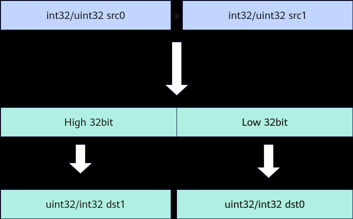

# Mull(ISASI)

> **Section**: 6.2.3.3.1.17  
> **PDF Pages**: 1164–1165  

---

<!-- page 1164 -->

表6-272参数说明

参数名输入/输出

描述

dst输出目的操作数。

类型为LocalTensor，支持的TPosition为VECIN/VECCALC/VECOUT。

LocalTensor的起始地址需要32字节对齐。

src0、src1输入源操作数。

类型为LocalTensor，支持的TPosition为VECIN/VECCALC/VECOUT。

LocalTensor的起始地址需要32字节对齐。

两个源操作数的数据类型需要与目的操作数保持一致。

count输入参与计算的元素个数。

返回值说明

无

约束说明

●操作数地址对齐要求请参见通用地址对齐约束。

调用示例

```cpp
AscendC::Prelu(dstLocal, src0Local, src1Local, 512);
```

结果示例如下：输入数据src0Local：[1 -2 -3 ... -512]输入数据src1Local：[513 -514 515 ... 1]输出数据dstLocal：[1 1024 -1045 ... -512]

## 6.2.3.3.1.17 Mull(ISASI)

产品支持情况

产品是否支持

Atlas 350 加速卡√

Atlas A3 训练系列产品/Atlas A3 推理系列产品x

Atlas A2 训练系列产品/Atlas A2 推理系列产品x

Atlas 200I/500 A2 推理产品x

Atlas 推理系列产品AI Corex

Atlas 推理系列产品Vector Corex

Atlas 训练系列产品x

<!-- page 1165 -->

功能说明

对前count个输入数据src0、src1按元素相乘操作，将结果写入dst0Local，溢出部分写入dst1Local。计算过程如下：



函数原型

```cpp
template <typename T>__aicore__ inline void Mull(const LocalTensor<T>& dst0, const LocalTensor<T>& dst1, const LocalTensor<T>& src0, const LocalTensor<T>& src1, const uint32_t count)
```

参数说明

表6-273模板参数说明

参数名描述

T操作数数据类型。

Atlas 350 加速卡，支持的数据类型为：int32_t、uint32_t。

表6-274参数说明

参数名输入/输出

描述

dst0、dst1输出目的操作数。

类型为LocalTensor，支持的TPosition为VECIN/VECCALC/VECOUT。

LocalTensor的起始地址需要32字节对齐。
