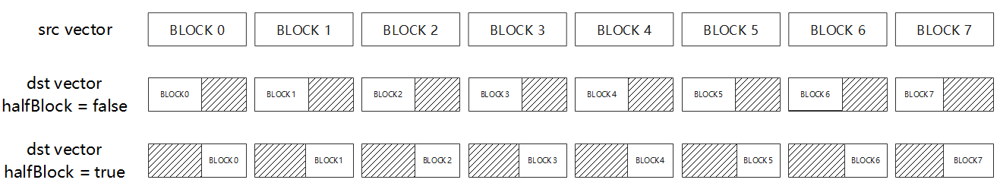

# CastDequant

> **Section**: 6.2.3.3.3.2  
> **PDF Pages**: 1254–1258  

---

<!-- page 1254 -->

致，所以每次迭代选取前4个datablock参与计算。设置Repeat Stride参数和mask参数以及地址重叠时，需要考虑该限制。

●针对Atlas 350 加速卡，uint64_t/int64_t数据类型仅支持tensor前n个数据计算接口。

调用示例

本样例中只展示Compute流程中的部分代码。

●tensor高维切分计算样例-mask连续模式// repeatTime = 4, mask = 128, 128 elements one repeat, 512 elements total// srcLocal数据类型为half，scalar数据类型为half，dstLocal数据类型为half// dstBlkStride, srcBlkStride = 1, no gap between blocks in one repeat// dstRepStride, srcRepStride = 8, no gap between repeats AscendC::Axpy(dstLocal, srcLocal, (half)2.0, 128, 4,{ 1, 1, 8, 8 });

// srcLocal数据类型为half，scalar数据类型为half，dstLocal数据类型为float// repeatTime = 8, mask = 64, 64 elements one repeat, 512 elements total// dstBlkStride, srcBlkStride = 1, no gap between blocks in one repeat// dstRepStride = 8, srcRepStride = 4, no gap between repeats AscendC::Axpy(dstLocal, srcLocal, (half)2.0, 64, 8,{ 1, 1, 8, 4 }); // 每次迭代选取源操作数前4个datablock参与计算

●tensor高维切分计算样例-mask逐bit模式uint64_t mask[2] = { 0xFFFFFFFFFFFFFFFF, 0xFFFFFFFFFFFFFFFF };// repeatTime = 4, 128 elements one repeat, 512 elements total, half精度组合// dstBlkStride, srcBlkStride = 1, no gap between blocks in one repeat// dstRepStride, srcRepStride = 8, no gap between repeatsAscendC::Axpy(dstLocal, srcLocal, (half)2.0, mask, 4,{ 1, 1, 8, 8 });

●tensor前n个数据计算样例AscendC::Axpy(dstLocal, src0Local, (half)2.0, 512);// half精度组合

结果示例如下：

输入数据(src0Local):[1. 2. 3. 4. 5. 6. ... 512.]输入数据(scalarValue):2.0输出数据(dstLocal)初始值:[0. 0. 0. 0. 0. 0. ... 0.]进行Axpy计算后，输出数据(dstLocal):[2. 4. 6. 8. 10. 12. ... 1024.]

## 6.2.3.3.3.2 CastDequant

产品支持情况

产品是否支持

Atlas 350 加速卡√

Atlas A3 训练系列产品/Atlas A3 推理系列产品√

Atlas A2 训练系列产品/Atlas A2 推理系列产品√

Atlas 200I/500 A2 推理产品x

Atlas 推理系列产品AI Core√

Atlas 推理系列产品Vector Corex

Atlas 训练系列产品x

<!-- page 1255 -->

功能说明

对输入做量化并进行精度转换。不同的数据类型，转换公式不同。

●在输入类型为int16_t的情况下，对int16_t类型的输入做量化并进行精度转换，得到int8_t/uint8_t类型的数据。使用该接口前需要调用SetDeqScale设置scale、offset、signMode等量化参数。

通过模板参数isVecDeq控制是否选择向量量化模式。

–当isVecDeq=false时，根据SetDeqScale设置的scale、offset、signMode，对输入做量化并进行精度转换。计算公式如下：

–当isVecDeq=true时，根据SetDeqScale设置的一段128B的UB上的16组量化参数scale0-scale15、offset0-offset15、signMode0-signMode15，以循环的方式对输入做量化并进行精度转换。计算公式如下：

●在输入类型为int32_t的情况下，对int32_t类型的输入做量化并进行精度转换，得到half类型的数据。使用该接口前需要调用SetDeqScale设置scale参数。

.

函数原型

●tensor前n个数据计算template <typename T, typename U, bool isVecDeq = true, bool halfBlock = true>__aicore__ inline void CastDequant(const LocalTensor<T>& dst, const LocalTensor<U>& src, const uint32_t count)

●tensor高维切分计算

–mask逐bit模式template <typename T, typename U, bool isSetMask = true, bool isVecDeq = true, bool halfBlock = true>__aicore__ inline void CastDequant(const LocalTensor<T>& dst, const LocalTensor<U>& src, const uint64_t mask[], uint8_t repeatTime, const UnaryRepeatParams& repeatParams)

–mask连续模式template <typename T, typename U, bool isSetMask = true, bool isVecDeq = true, bool halfBlock = true>__aicore__ inline void CastDequant(const LocalTensor<T>& dst, const LocalTensor<U>& src, const int32_t mask, uint8_t repeatTime, const UnaryRepeatParams& repeatParams)

<!-- page 1256 -->

参数说明

表6-318模板参数说明

参数名描述

T输出Tensor的数据类型。

Atlas 350 加速卡，支持的数据类型为：int8_t/uint8_t/half

Atlas A3 训练系列产品/Atlas A3 推理系列产品，支持的数据类型为：int8_t/uint8_t/half

Atlas A2 训练系列产品/Atlas A2 推理系列产品，支持的数据类型为：int8_t/uint8_t/half

Atlas 推理系列产品AI Core，支持的数据类型为：int8_t/uint8_t

和SetDeqScale接口的signMode入参配合使用，当signMode=true时输出数据类型int8_t；signMode=false时输出数据类型uint8_t。

U输入Tensor的数据类型。

Atlas 350 加速卡，支持的数据类型为：int16_t/int32_t

Atlas A3 训练系列产品/Atlas A3 推理系列产品，支持的数据类型为：int16_t/int32_t

Atlas A2 训练系列产品/Atlas A2 推理系列产品，支持的数据类型为：int16_t/int32_t

Atlas 推理系列产品AI Core，支持的数据类型为：int16_t

isSetMask是否在接口内部设置mask。

●true，表示在接口内部设置mask。

●false，表示在接口外部设置mask，开发者需要使用SetVectorMask接口设置mask值。这种模式下，本接口入参中的mask值必须设置为占位符MASK_PLACEHOLDER。

isVecDeq控制是否选择向量量化模式。和SetDeqScale(const LocalTensor<T>&src)接口配合使用，当SetDeqScale接口传入Tensor时，isVecDeq必须为true。

halfBlock对int16_t类型的输入做量化并进行精度转换得到int8_t/uint8_t类型的数据时，halfBlock参数用于指示输出元素存放在上半还是下半Block。halfBlock=true时，结果存放在下半Block；halfBlock=false时，结果存放在上半Block，如图图6-36。

表6-319接口参数说明

参数名输入/输出

描述

dst输出目的操作数。

类型为LocalTensor，支持的TPosition为VECIN/VECCALC/VECOUT。

LocalTensor的起始地址需要32字节对齐。

<!-- page 1257 -->

参数名输入/输出

描述

src输入源操作数。

类型为LocalTensor，支持的TPosition为VECIN/VECCALC/VECOUT。

LocalTensor的起始地址需要32字节对齐。

mask/mask[]

输入mask用于控制每次迭代内参与计算的元素。

●逐bit模式：可以按位控制哪些元素参与计算，bit位的值为1表示参与计算，0表示不参与。mask为数组形式，数组长度和数组元素的取值范围和操作数的数据类型有关。当操作数为16位时，数组长度为2，mask[0]、mask[1]∈[0, 264-1]并且不同时为0；当操作数为32位时，数组长度为1，mask[0]∈(0,264-1]；当操作数为64位时，数组长度为1，mask[0]∈(0, 232-1]。

例如，mask=[8, 0]，8=0b1000，表示仅第4个元素参与计算。

●连续模式：表示前面连续的多少个元素参与计算。取值范围和操作数的数据类型有关，数据类型不同，每次迭代内能够处理的元素个数最大值不同。当操作数为16位时，mask∈[1, 128]；当操作数为32位时，mask∈[1,64]；当操作数为64位时，mask∈[1, 32]。

当源操作数和目的操作数位数不同时，以数据类型的字节较大的为准。例如，源操作数为int16_t类型，目的操作数为int8_t类型，计算mask时以int16_t为准。

repeatTime输入重复迭代次数。矢量计算单元，每次读取连续的256Bytes数据进行计算，为完成对输入数据的处理，必须通过多次迭代（repeat）才能完成所有数据的读取与计算。repeatTime表示迭代的次数。

关于该参数的具体描述请参考2.5.2.2.2 高维切分API。

repeatParams

输入控制操作数地址步长的参数。6.2.6.4UnaryRepeatParams类型，包含操作数相邻迭代间相同DataBlock的地址步长，操作数同一迭代内不同DataBlock的地址步长等参数。

相邻迭代间的地址步长参数说明请参考repeatStride；同一迭代内DataBlock的地址步长参数说明请参考dataBlockStride。

count输入参与计算的元素个数。

<!-- page 1258 -->

图6-36 halfBlock 说明

返回值说明

无

约束说明

●操作数地址对齐要求请参见通用地址对齐约束。

●操作数地址重叠约束请参考通用地址重叠约束。

调用示例

●高维切分计算接口样例-mask连续模式int32_t mask = 256 / sizeof(int16_t);// repeatTime = 2, 128 elements one repeat, 256 elements total// dstBlkStride, srcBlkStride = 1, no gap between blocks in one repeat// dstRepStride, srcRepStride = 8, no gap between repeatsAscendC::CastDequant<uint8_t, int16_t, true, true, true>(dstLocal, srcLocal, mask, 2, { 1, 1, 8, 8 });

●高维切分计算接口样例-mask逐bit模式uint64_t mask[2] = { UINT64_MAX, UINT64_MAX };// repeatTime = 2, 128 elements one repeat, 256 elements total// dstBlkStride, srcBlkStride = 1, no gap between blocks in one repeat// dstRepStride, srcRepStride = 8, no gap between repeatsAscendC::CastDequant<uint8_t, int16_t, true, true, true>(dstLocal, srcLocal, mask, 2, { 1, 1, 8, 8 });

●前n个数计算接口样例AscendC::CastDequant<uint8_t, int16_t, true, true>(dstLocal, srcLocal, 256);

结果示例如下：

输入数据srcLocal: [20 53 26 12 36  6 20 93 66 30 56 99 59 92  7 37 22 47 98 10 85 29 14 46 17 34 45 17 25 45 82 17 66 94 68 23 67  8 89  8 92  6 10 80 87 20  9 81 70 62 11 58 38 83 32 14 38 47 41 63 94 26 96 89 88 35 86 55 60 82 15 65 92 67 83 23 63 25 85 93 50 91 75 60 80 10 55 20 71 14 67 23 31 63  7 93 69 45 61 23 43 86 11 81 81 36 76 58 53 25 23 51 59 78 82 10 39 40 24 50 68 49 79 40  4 53 22 38 45 17 29 54  9 66 98 47 12 47 47 20 98  0 59 77  1 21 39 70 66 20 68  8 77 77 54  0  3 33 37 37 48 60 83 88 27 70 31 49 75 21 59  3 99 84 92 84 14 44 26 56 72 56 37 52 39 11  2 59 59 65 71 64 10 65 62 48 42 79 69 69 27 99  8 38 36 77 34 34 60 50 52 50 41 31 95 68 27 16 42 64 19 47  0 10 36 36 33 62 98 64 32 81 49 53 27 70 35  9 63  7 10 89  3 39 94 23 89 16 23 60 71 42 46 58 65 90]输出数据dstLocal: [ 0  0  0  0  0  0  0  0  0  0  0  0  0  0  0  0 20 53 26 12 36  6 20 93 66 30 56 99 59 92  7 37  0  0  0  0  0  0  0  0  0  0  0  0  0  0  0  0 22 47 98 10 85 29 14 46 17 34 45 17 25 45 82 17  0  0  0  0  0  0  0  0  0  0  0  0  0  0  0  0 66 94 68 23 67  8 89  8 92  6 10 80 87 20  9 81  0  0  0  0  0  0  0  0  0  0  0  0  0  0  0  0 70 62 11 58 38 83 32 14 38 47 41 63 94 26 96 89  0  0  0  0  0  0  0  0  0  0  0  0  0  0  0  0 88 35 86 55 60 82 15 65 92 67 83 23 63 25 85 93  0  0  0  0  0  0  0  0  0  0  0  0  0  0  0  0 50 91 75 60 80 10 55 20 71 14 67 23 31 63  7 93  0  0  0  0  0  0  0  0  0  0  0  0  0  0  0  0 69 45 61 23 43 86 11 81 81 36 76 58 53 25 23 51  0  0  0  0  0  0  0  0  0  0  0  0  0  0  0  0 59 78 82 10 39 40 24 50 68 49 79 40  4 53 22 38  0  0  0  0  0  0  0  0  0  0  0  0  0  0  0  0 45 17 29 54  9 66 98 47 12 47 47 20 98  0 59 77
