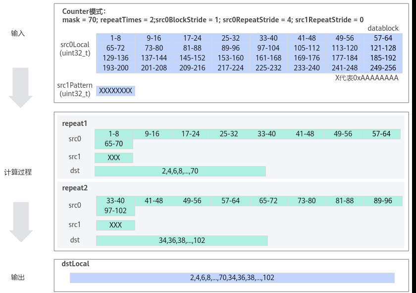

# GatherMask

> **Section**: 6.2.3.3.4.9  
> **PDF Pages**: 1342–1347  

---

<!-- page 1342 -->

●本接口传入LocalTensor单点数据作为标量时，idx参数需要传入编译期已知的常量，传入变量时需要声明为constexpr。

●模式1场景使用灵活标量位置接口时需要填写模板参数config避免接口匹配到其他模式。

调用示例

●Select-tensor前n个数据计算样例（模式1）// 灵活标量位置，src1Local[0]作为标量static constexpr AscendC::BinaryConfig config = { 1 };AscendC::Select<BinaryDefaultType, uint8_t, config>(dstLocal, maskLocal, src0Local, src1Local[0], AscendC::SELMODE::VSEL_TENSOR_SCALAR_MODE, dataSize);

// 灵活标量位置，src0Local[0]作为标量static constexpr AscendC::BinaryConfig config = { 0 };AscendC::Select<BinaryDefaultType, uint8_t, config>(dstLocal, maskLocal, src0Local[0], src1Local, AscendC::SELMODE::VSEL_TENSOR_SCALAR_MODE, dataSize);

## 6.2.3.3.4.9 GatherMask

产品支持情况

产品是否支持

Atlas 350 加速卡√

Atlas A3 训练系列产品/Atlas A3 推理系列产品√

Atlas A2 训练系列产品/Atlas A2 推理系列产品√

Atlas 200I/500 A2 推理产品√

Atlas 推理系列产品AI Core√

Atlas 推理系列产品Vector Corex

Atlas 训练系列产品x

功能说明

以内置固定模式对应的二进制或者用户自定义输入的Tensor数值对应的二进制为gather mask（数据收集的掩码），从源操作数中选取元素写入目的操作数中。

函数原型

●用户自定义模式template <typename T, typename U, GatherMaskMode mode = defaultGatherMaskMode>__aicore__ inline void GatherMask(const LocalTensor<T>& dst, const LocalTensor<T>& src0, const LocalTensor<U>& src1Pattern, const bool reduceMode, const uint32_t mask, const GatherMaskParams& gatherMaskParams, uint64_t& rsvdCnt)

●内置固定模式template <typename T, GatherMaskMode mode = defaultGatherMaskMode>__aicore__ inline void GatherMask(const LocalTensor<T>& dst, const LocalTensor<T>& src0, const uint8_t src1Pattern, const bool reduceMode, const uint32_t mask, const GatherMaskParams& gatherMaskParams, uint64_t& rsvdCnt)

<!-- page 1343 -->

参数说明

表6-365模板参数说明

参数名称含义

T源操作数src0和目的操作数dst的数据类型。

Atlas 350 加速卡，支持的数据类型为：int8_t/uint8_t/int16_t/uint16_t/half/bfloat16_t/float/int32_t/uint32_t

Atlas A3 训练系列产品/Atlas A3 推理系列产品，支持的数据类型为：half/bfloat16_t/uint16_t/int16_t/float/uint32_t/int32_t

Atlas A2 训练系列产品/Atlas A2 推理系列产品，支持的数据类型为：half/bfloat16_t/uint16_t/int16_t/float/uint32_t/int32_t

Atlas 200I/500 A2 推理产品，支持的数据类型为：half/uint16_t/int16_t/float/uint32_t/int32_t

Atlas 推理系列产品AI Core，支持的数据类型为：half/uint16_t/int16_t/float/uint32_t/int32_t

U用户自定义模式下src1Pattern的数据类型。支持的数据类型为uint8_t/uint16_t/uint32_t。

●当目的操作数数据类型为uint8_t/int8_t时，src1Pattern应为uint8_t数据类型。

●当目的操作数数据类型为b16时，src1Pattern应为uint16_t数据类型。

●当目的操作数数据类型为float/uint32_t/int32_t时，src1Pattern应为uint32_t数据类型。

mode预留参数，为后续功能做预留，当前提供默认值，用户无需设置该参数。

表6-366参数说明

参数名称输入/输出

含义

dst输出目的操作数。

类型为LocalTensor，支持的TPosition为VECIN/VECCALC/VECOUT。

LocalTensor的起始地址需要32字节对齐。

src0输入源操作数。

类型为LocalTensor，支持的TPosition为VECIN/VECCALC/VECOUT。

LocalTensor的起始地址需要32字节对齐。

数据类型需要与目的操作数保持一致。

<!-- page 1344 -->

参数名称输入/输出

含义

src1Pattern

输入gather mask（数据收集的掩码），分为内置固定模式和用户自定义模式两种，根据内置固定模式对应的二进制或者用户自定义输入的Tensor数值对应的二进制从源操作数中选取元素写入目的操作数中。1为选取，0为不选取。

●内置固定模式：src1Pattern数据类型为uint8_t，取值范围为[1,7]，所有repeat迭代使用相同的gather mask。不支持配置src1RepeatStride。

–1：01010101…0101 # 每个repeat取偶数索引元素

–2：10101010…1010 # 每个repeat取奇数索引元素

–3：00010001…0001 # 每个repeat内每四个元素取第一个元素

–4：00100010…0010 # 每个repeat内每四个元素取第二个元素，

–5：01000100…0100 # 每个repeat内每四个元素取第三个元素

–6：10001000…1000 # 每个repeat内每四个元素取第四个元素

–7：11111111...1111 # 每个repeat内取全部元素

Atlas 350 加速卡支持模式1-7

Atlas A3 训练系列产品/Atlas A3 推理系列产品支持模式1-7

Atlas A2 训练系列产品/Atlas A2 推理系列产品支持模式1-7

Atlas 200I/500 A2 推理产品支持模式1-7

Atlas 推理系列产品AI Core支持模式1-6

●用户自定义模式：src1Pattern数据类型为LocalTensor，迭代间间隔由src1RepeatStride决定，迭代内src1Pattern连续消耗。

<!-- page 1345 -->

参数名称输入/输出

含义

reduceMode

输入用于选择mask参数模式，数据类型为bool，支持如下取值。

●false：Normal模式。该模式下，每次repeat操作256Bytes数据，总的数据计算量为repeatTimes *256Bytes。

–mask参数无效，建议设置为0。

–按需配置repeatTimes、src0BlockStride、src0RepeatStride参数。

–支持src1Pattern配置为内置固定模式或用户自定义模式。用户自定义模式下可根据实际情况配置src1RepeatStride。

●true：Counter模式。根据mask等参数含义的不同，该模式有以下两种配置方式：

–配置方式一：每次repeat操作mask个元素，总的数据计算量为repeatTimes * mask个元素。

–mask值配置为每一次repeat计算的元素个数。

–按需配置repeatTimes、src0BlockStride、src0RepeatStride参数。

–支持src1Pattern配置为内置固定模式或用户自定义模式。用户自定义模式下可根据实际情况配置src1RepeatStride。

–配置方式二：总的数据计算量为mask个元素。

–mask配置为总的数据计算量。

–repeatTimes值不生效，指令的迭代次数由源操作数和mask共同决定。

–按需配置src0BlockStride、src0RepeatStride参数。

–支持src1Pattern配置为内置固定模式或用户自定义模式。用户自定义模式下可根据实际情况配置src1RepeatStride。

Atlas 350 加速卡，支持配置方式一

Atlas A3 训练系列产品/Atlas A3 推理系列产品，支持配置方式一

Atlas A2 训练系列产品/Atlas A2 推理系列产品，支持配置方式一

Atlas 200I/500 A2 推理产品，支持配置方式一

Atlas 推理系列产品AI Core，支持配置方式二

mask输入用于控制每次迭代内参与计算的元素。根据reduceMode，分为两种模式：

●Normal模式：mask无效，建议设置为0。

●Counter模式：取值范围[1, 232 – 1]。不同的版本型号Counter模式下，mask参数表示含义不同。具体配置规则参考上文reduceMode参数描述。

<!-- page 1346 -->

参数名称输入/输出

含义

gatherMaskParams

输入控制操作数地址步长的数据结构，GatherMaskParams类型。

具体定义请参考${INSTALL_DIR}/include/ascendc/basic_api/interface/kernel_struct_gather.h，${INSTALL_DIR}请替换为CANN软件安装后文件存储路径。

具体参数说明表6-367。

rsvdCnt输出该条指令筛选后保留下来的元素计数，对应dstLocal中有效元素个数，数据类型为uint64_t。

表6-367 GatherMaskParams 结构体参数说明

参数名称含义

src0BlockStride

用于设置src0同一迭代不同DataBlock间的地址步长（起始地址之间的间隔）。单位为DataBlock。

repeatTimes

迭代次数。

src0RepeatStride

用于设置src0相邻迭代间的地址步长（起始地址之间的间隔）。单位为DataBlock。

src1RepeatStride

用于设置src1相邻迭代间的地址步长（起始地址之间的间隔）。单位为DataBlock。

返回值说明

无

约束说明

●操作数地址对齐要求请参见通用地址对齐约束。

●操作数地址重叠约束请参考通用地址重叠约束。

●若调用该接口前为Counter模式，在调用该接口后需要显式设置回Counter模式（接口内部执行结束后会设置为Normal模式）。

调用示例

●用户自定义Tensor样例示例。uint32_t mask = 70; // 每次迭代内参与计算的元素uint64_t rsvdCnt = 0; // 保留下来的元素个数

// src0Local：源操作数// src1Local：存放数据收集的掩码的Tensor// dstLocal：目的操作数// reduceMode = true;    使用Counter模式// {}中的参数为：// src0BlockStride = 1;  单次迭代内数据间隔1个datablock，即数据连续读取和写入

<!-- page 1347 -->

// repeatTimes = 2;      Counter模式时，仅在部分产品型号下会生效// src0RepeatStride = 4; 源操作数迭代间数据间隔4个datablock// src1RepeatStride = 0; src1迭代间数据间隔0个datablock，即原位置读取AscendC::GatherMask (dstLocal, src0Local, src1Local, true, mask, { 1, 2, 4, 0 }, rsvdCnt);

下图为Counter模式配置方式一示意图：

–mask = 70，每一次repeat计算70个元素；

–repeatTimes = 2，共进行2次repeat；

–src0BlockStride = 1，源操作数src0Local单次迭代内datablock之间无间隔；

–src0RepeatStride = 4，源操作数src0Local相邻迭代间的间隔为4个datablock，所以第二次repeat从第33个元素开始处理。

–src1Pattern配置为用户自定义模式。src1RepeatStride = 0，src1Pattern相邻迭代间的间隔为0个datablock，所以第二次repeat仍从src1Pattern的首地址开始处理。

图6-37 Counter 模式配置方式一示意图

下图为Counter模式配置方式二示意图：

–mask = 70，一共计算70个元素；

–repeatTimes配置不生效，根据源操作数和mask自动推断：源操作数的数据类型为uint32_t，每个迭代处理256Bytes数据，一个迭代处理64个元素，共需要进行2次repeat；

–src0BlockStride = 1，源操作数src0Local单次迭代内datablock之间无间隔；

–src0RepeatStride = 4，源操作数src0Local相邻迭代间的间隔为4个datablock，所以第二次repeat从第33个元素开始处理。

–src1Pattern配置为用户自定义模式。src1RepeatStride = 0，src1Pattern相邻迭代间的间隔为0个datablock，所以第二次repeat仍从src1Pattern的首地址开始处理。
