# Cast

> **Section**: 6.2.3.3.5.1  
> **PDF Pages**: 1348–1375  

---

<!-- page 1348 -->

图6-38 Counter 模式配置方式二示意图

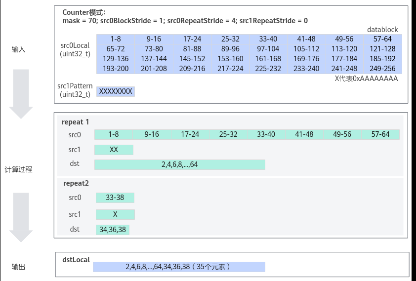

●内置固定模式样例示例。uint32_t mask = 0; // 每次迭代内参与计算的元素，normal模式下mask建议设置为0uint64_t rsvdCnt = 0; // 用于保存筛选后保留下来的元素个数uint8_t src1Pattern = 2; // 内置固定模式

// src0Local：源操作数// src1Pattern ：存放数据收集的掩码的Tensor// dstLocal：目的操作数// reduceMode = false; 使用normal模式// {}中的参数为：// src0BlockStride = 1; 单次迭代内数据间隔1个Block，即数据连续读取和写入// repeatTimes = 1;重复迭代一次// src0RepeatStride = 0;重复一次，故设置为0// src1RepeatStride = 0;重复一次，故设置为0AscendC::GatherMask(dstLocal, src0Local, src1Pattern, false, mask, { 1, 1, 0, 0 }, rsvdCnt);

结果示例如下：

输入数据src0Local：[1 2 3 ... 128]输入数据src1Pattern：src1Pattern = 2;输出数据dstLocal：[2 4 6 8 10 12 14 16 18 20 22 24 26 28 30 32 34 36 38 40 42 44 46 48 50 52 54 56 58 60 62 64 66 68 70 72 74 76 78 80 82 84 86 88 90 92 94 96 98 100 102 104 106 108 110 112 114 116 118 120 122 124 126 128 undefined ..undefined]输出数据rsvdCnt：64

## 6.2.3.3.5 类型转换

## 6.2.3.3.5.1 Cast

产品支持情况

产品是否支持

Atlas 350 加速卡√

Atlas A3 训练系列产品/Atlas A3 推理系列产品√

<!-- page 1349 -->

产品是否支持

Atlas A2 训练系列产品/Atlas A2 推理系列产品√

Atlas 200I/500 A2 推理产品√

Atlas 推理系列产品AI Core√

Atlas 推理系列产品Vector Corex

Atlas 训练系列产品√

功能说明

根据源操作数和目的操作数Tensor的数据类型进行精度转换。

在了解精度转换规则之前，需要先了解浮点数的表示方式和二进制的舍入规则：

●浮点数的表示方式

–half共16bit，包括1bit符号位（S），5bit指数位（E）和10bit尾数位（M）。

当E不全为0或不全为1时，表示的结果为：

(-1)S * 2E - 15 * (1 + M)

当E全为0时，表示的结果为：

(-1)S * 2-14 * M

当E全为1时，若M全为0，表示的结果为±inf（取决于符号位）；若M不全为0，表示的结果为nan。

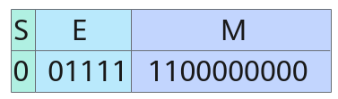

上图中S=0，E=15，M = 2-1 + 2-2，表示的结果为1.75。

–float共32bit，包括1bit符号位（S），8bit指数位（E）和23bit尾数位（M）。

当E不全为0或不全为1时，表示的结果为：

(-1)S * 2E - 127 * (1 + M)

当E全为0时，表示的结果为：

(-1)S * 2-126 * M

当E全为1时，若M全为0，表示的结果为±inf（取决于符号位）；若M不全为0，表示的结果为nan。

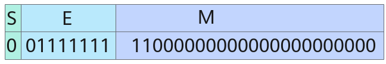

<!-- page 1350 -->

上图中S = 0，E = 127，M = 2-1 + 2-2，最终表示的结果为1.75 。

–bfloat16_t共16bit，包括1bit符号位（S），8bit指数位（E）和7bit尾数位（M）。

当E不全为0或不全为1时，表示的结果为：

(-1)S * 2E - 127 * (1 + M)

当E全为0时，表示的结果为：

(-1)S * 2-126 * M

当E全为1时，若M全为0，表示的结果为±inf（取决于符号位）；若M不全为0，表示的结果为nan。

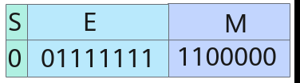

上图中S = 0，E = 127，M = 2-1 + 2-2，最终表示的结果为1.75。

●二进制的舍入规则和十进制类似，具体如下：


–CAST_RINT模式下，若待舍入部分的第一位为0，则不进位；若第一位为1且后续位不全为0，则进位；若第一位为1且后续位全为0，当M的最后一位为0则不进位，当M的最后一位为1则进位。

–CAST_FLOOR模式下，若S为0，则不进位；若S为1，当待舍入部分全为0则不进位，否则，进位。

–CAST_CEIL模式下，若S为1，则不进位；若S为0，当待舍入部分全为0则不进位；否则，进位。

–CAST_ROUND模式下，若待舍入部分的第一位为0，则不进位；否则，进位。

–CAST_TRUNC模式下，总是不进位。

–CAST_ODD模式下，若待舍入部分全为0，则不进位；若待舍入部分不全为0，当M的最后一位为1则不进位，当M的最后一位为0则进位。

–CAST_HYBRID：随机舍入，目前特指输出结果是hif8数据类型时，会用到的一种随机舍入。

精度转换规则如下表所示（为方便描述下文描述中的src代表源操作数，dst代表目的操作数）：

<!-- page 1351 -->

表6-368精度转换规则

**src类型**

**dst类型**

精度转换规则介绍

floatfloat将src按照roundMode（精度转换处理模式，参见参数说明中的roundMode参数）取整，仍以float格式存入dst中。

示例：输入0.5，

CAST_RINT模式输出0.0，CAST_FLOOR模式输出0.0，CAST_CEIL模式输出1.0，CAST_ROUND模式输出1.0，CAST_TRUNC模式输出0.0。

half将src按照roundMode取到half所能表示的数，以half格式（溢出默认按照饱和处理）存入dst中。

示例：输入0.5 + 2-12，写成float的表示形式：2-1 * (1 + 2-11)，因此E = -1 + 127 = 126，M = 2-11。

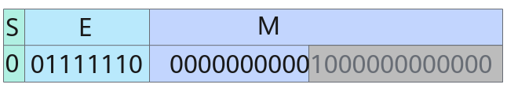

half的指数位可以表示出2-1，E = -1 + 15 = 14，但half只有10 bit尾数位，因此灰色部分要进行舍入。

CAST_RINT模式舍入得尾数0000000000，E = 14，M = 0，最终表示的结果为0.5；

CAST_FLOOR模式舍入得尾数0000000000，E = 14，M = 0，最终表示的结果为0.5；

CAST_CEIL模式舍入得尾数0000000001，E = 14，M = 2-10，最终表示的结果为0.5 + 2-11；

CAST_ROUND模式舍入得尾数0000000001，E = 14，M = 2-10，最终表示的结果为0.5 + 2-11；

CAST_TRUNC模式舍入得尾数0000000000，E = 14，M = 0，最终表示的结果为0.5；

CAST_ODD模式舍入得尾数0000000001，E = 14，M = 2-10，最终表示的结果为0.5 + 2-11。

int64_t

将src按照roundMode取整，以int64_t格式（溢出默认按照饱和处理）存入dst中。

示例：输入222 + 0.5，

CAST_RINT模式输出222，CAST_FLOOR模式输出222，CAST_CEIL模式输出222 + 1，CAST_ROUND模式输出222 + 1，CAST_TRUNC模式输出222。

<!-- page 1352 -->

**src类型**

**dst类型**

精度转换规则介绍

int32_t

将src按照roundMode取整，以int32_t格式（溢出默认按照饱和处理）存入dst中。

示例：输入222 + 0.5，

CAST_RINT模式输出222，CAST_FLOOR模式输出222，CAST_CEIL模式输出222 + 1，CAST_ROUND模式输出222 + 1，CAST_TRUNC模式输出222。

int16_t

将src按照roundMode取整，以int16_t格式（溢出默认按照饱和处理）存入dst中。

示例：输入222 + 0.5，

CAST_RINT模式输出215 - 1（溢出处理），CAST_FLOOR模式输出215 - 1（溢出处理），CAST_CEIL模式输出215 - 1（溢出处理），CAST_ROUND模式输出215 - 1（溢出处理），CAST_TRUNC模式输出215 - 1（溢出处理）。

bfloat16_t

将src按照roundMode取到bfloat16_t所能表示的数，以bfloat16_t格式（溢出默认按照饱和处理）存入dst中。

示例：输入0.5+ 2-9 + 2-11，写成float的表示形式：2-1 * (1 + 2-8

+ 2-10)，因此E = -1 + 127 = 126，M = 2-8 + 2-10。

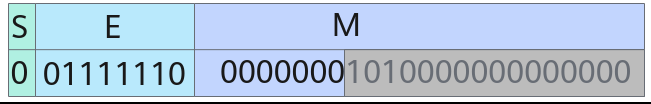

bfloat16_t的指数位位数和float的相同，有E = 126，但bfloat16_t只有7bit尾数位，因此灰色部分要进行舍入。

CAST_RINT模式舍入得尾数0000001，E = 126，M = 2-7，最终表示的结果为0.5 + 2-8；

CAST_FLOOR模式舍入得尾数0000000，E = 126，M = 0，最终表示的结果为0.5；

CAST_CEIL模式舍入得尾数0000001，E = 126，M = 2-7，最终表示的结果为0.5 + 2-8；

CAST_ROUND模式舍入得尾数0000001，E = 126，M = 2-7，最终表示的结果为0.5 + 2-8；

CAST_TRUNC模式舍入得尾数0000000，E = 126，M = 0，最终表示的结果为0.5。

floathifloat8_t

将src按照roundMode取整，以hifloat8_t格式（溢出默认按照饱和处理）存入dst中。

示例：输入1.75，CAST_ROUND模式输出2；CAST_HYBRID参考表6-597输出。

fp8_e4m3fn_t

将src按照roundMode取整，以fp8_e4m3fn_t格式（溢出默认按照饱和处理）存入dst中。

示例：输入2.5，CAST_RINT模式输出2。

<!-- page 1353 -->

**src类型**

**dst类型**

精度转换规则介绍

fp8_e5m2_t

将src按照roundMode取整，以fp8_e5m2_t格式（溢出默认按照饱和处理）存入dst中。

示例：输入2.5，CAST_RINT模式输出2。

halffloat将src以float格式存入dst中，不存在精度转换问题，无舍入模式。

示例：输入1.5 - 2-10，输出1.5 - 2-10。

int32_t

将src按照roundMode取整，以int32_t格式存入dst中。

示例：输入-1.5，

CAST_RINT模式输出-2，CAST_FLOOR模式输出-2，CAST_CEIL模式输出-1，CAST_ROUND模式输出-2，CAST_TRUNC模式输出-1。

int16_t

将src按照roundMode取整，以int16_t格式（溢出默认按照饱和处理）存入dst中。

示例：输入27 - 0.5，

CAST_RINT模式输出27，CAST_FLOOR模式输出27 - 1，CAST_CEIL模式输出27，CAST_ROUND模式输出27，CAST_TRUNC模式输出27 - 1。

int8_t将src按照roundMode取整，以int8_t格式（溢出默认按照饱和处理）存入dst中。

示例：输入27 - 0.5，

CAST_RINT模式输出27 - 1（溢出处理），CAST_FLOOR模式输出27 - 1，CAST_CEIL模式输出27 - 1（溢出处理），CAST_ROUND模式输出27 - 1（溢出处理），CAST_TRUNC模式输出27 - 1。

uint8_t

将src按照roundMode取整，以uint8_t格式（溢出默认按照饱和处理）存入dst中。

负数输入会被视为异常。

示例：输入1.75，

CAST_RINT模式输出2，CAST_FLOOR模式输出1，CAST_CEIL模式输出2，CAST_ROUND模式输出2，CAST_TRUNC模式输出1。

int4b_t

将src按照roundMode取整，以int4b_t格式（溢出默认按照饱和处理）存入dst中。

示例：输入1.5，

CAST_RINT模式输出2，CAST_FLOOR模式输出1，CAST_CEIL模式输出2，CAST_ROUND模式输出2，CAST_TRUNC模式输出1。

halfbfloat16_t

将src按照roundMode取整，以bfloat16_t格式存入dst中。

示例：输入1.75，

CAST_RINT模式输出2，CAST_FLOOR模式输出1，CAST_CEIL模式输出2，CAST_ROUND模式输出2，CAST_TRUNC模式输出1。

<!-- page 1354 -->

**src类型**

**dst类型**

精度转换规则介绍

halfhifloat8_t

将src按照roundMode取整，以hifloat8_t格式（溢出默认按照饱和处理）存入dst中。

示例：输入1.75，

CAST_ROUND模式输出2，CAST_HYBRID模式参考表6-597输出。

bfloat16_t

float将src以float格式存入dst中，不存在精度转换问题，无舍入模式。

示例：输入1.5 - 2-6，输出1.5 - 2-6。

int32_t

将src按照roundMode取整，以int32_t格式（溢出默认按照饱和处理）存入dst中。

示例：输入26 + 0.5

CAST_RINT模式输出26，CAST_FLOOR模式输出26，CAST_CEIL模式输出26 + 1，CAST_ROUND模式输出26 + 1，CAST_TRUNC模式输出26。

bfloat16_t

half将src按照roundMode取整，以half格式（溢出默认按照饱和处理）存入dst中。

示例：输入2.90573e-06

CAST_RINT模式输出2.9e-06，CAST_FLOOR模式输出2.861e-06 ，CAST_CEIL模式输出2.9e-06，CAST_ROUND模式输出2.9e-06，CAST_TRUNC模式输出2.861e-06。

将src按照roundMode取整，以fp4x2_e2m1_t格式（溢出默认按照饱和处理）存入dst中。

fp4x2_e2m1_t

示例：输入2.5

CAST_RINT模式输出2，CAST_FLOOR模式输出2 ，CAST_CEIL模式输出3，CAST_ROUND模式输出3，CAST_TRUNC模式输出2。

fp4x2_e1m2_t

将src按照roundMode取整，以fp4x2_e1m2_t格式（溢出默认按照饱和处理）存入dst中。

示例：输入2.5

CAST_RINT模式输出2，CAST_FLOOR模式输出2 ，CAST_CEIL模式输出3，CAST_ROUND模式输出3，CAST_TRUNC模式输出2。

int4b_t

half将src以half格式存入dst中，不存在精度转换问题，无舍入模式。

示例：输入1，输出1.0。

int16_t

将src以int16_t格式存入dst中，不存在精度转换问题，无舍入模式。

示例：输入1，输出1。

bfloat16_t

将src以bfloat16_t格式存入dst中，不存在精度转换问题，无舍入模式。

示例：输入1，输出1.0。

<!-- page 1355 -->

**src类型**

**dst类型**

精度转换规则介绍

uint8_t

half将src以half格式存入dst中，不存在精度转换问题，无舍入模式。

示例：输入1，输出1.0。

uint8_t

uint16_t

将src以uint16_t格式存入dst中，不存在精度转换问题，无舍入模式。

示例：输入28 - 1，输出28 - 1。

uint32_t

将src以uint32_t格式存入dst中，不存在精度转换问题，无舍入模式。

示例：输入28 - 1，输出28 - 1。

int8_thalf将src以half格式存入dst中，不存在精度转换问题，无舍入模式。

示例：输入-1，输出-1.0。

int8_tint16_t

将src以uint16_t格式存入dst中，不存在精度转换问题，无舍入模式。

示例：输入27 - 1，输出27 - 1。

int32_t

将src以uint32_t格式存入dst中，不存在精度转换问题，无舍入模式。

示例：输入27 - 1，输出27 - 1。

uint16_t

uint8_t

将src以uint8_t格式（溢出默认按照饱和处理）存入dst中，不存在精度转换问题，无舍入模式。

示例：输入216 - 1，输出28 - 1。

uint32_t

将src以uint32_t格式存入dst中，不存在精度转换问题，无舍入模式。

示例：输入216 - 1，输出216 - 1。

<!-- page 1356 -->

**src类型**

**dst类型**

精度转换规则介绍

int16_t

half将src按照roundMode取到half所能表示的数，以half格式存入dst中。

示例：输入212 + 2，写成half的表示形式：212 * (1 + 2-11)，要求E = 12 + 15 = 27，M = 2-11：

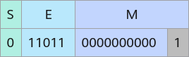

由于half只有10bit尾数位，因此灰色部分要进行舍入。

CAST_RINT模式舍入得尾数0000000000，E = 27，M = 0，最终表示的结果为212；

CAST_FLOOR模式舍入得尾数0000000000，E = 27，M = 0，最终表示的结果为212；

CAST_CEIL模式舍入得尾数0000000001，E = 27，M = 2-10，最终表示的结果为212 + 4；

CAST_ROUND模式舍入得尾数0000000001，E = 27，M = 2-10，最终表示的结果为212 + 4；

CAST_TRUNC模式舍入得尾数0000000000，E = 27，M = 0，最终表示的结果为212。

float将src以float格式存入dst中，不存在精度转换问题，无舍入模式。

示例：输入215 - 1，输出215 - 1。

int16_t

uint8_t

将src以uint8_t格式（溢出默认按照饱和处理）存入dst中，不存在精度转换问题，无舍入模式。

负数输入会被视为异常。

示例：输入215 - 1，输出28 - 1。

uint32_t

将src以uint32_t格式存入dst中，不存在精度转换问题，无舍入模式。

负数输入会默认转换成0。

示例：输入215 - 1，输出215 - 1。

int32_t

将src以int32_t格式存入dst中，不存在精度转换问题，无舍入模式。

示例：输入215 - 1，输出215 - 1。

int4b_t

将src以int4b_t格式（溢出默认按照饱和处理）存入dst中，不存在精度转换问题，无舍入模式。

示例：输入232 - 1，输出23 - 1。

<!-- page 1357 -->

**src类型**

**dst类型**

精度转换规则介绍

uint32_t

uint8_t

将src以uint8_t格式（溢出默认按照饱和处理）存入dst中，不存在精度转换问题，无舍入模式。

示例：输入232 - 1，输出28 - 1。

uint16_t

将src以uint16_t格式（溢出默认按照饱和处理）存入dst中，不存在精度转换问题，无舍入模式。

示例：输入232 - 1，输出216 - 1。

int16_t

将src以int16_t格式（溢出默认按照饱和处理）存入dst中，不存在精度转换问题，无舍入模式。

示例：输入232 - 1，输出215 - 1。

int32_t

float将src按照roundMode取到float所能表示的数，以float格式存入dst中。

示例：输入225 + 3，写成float的表示形式：225 * (1 + 2-24 +2-25)，要求E = 25 + 127 = 152， M = 2-24 + 2-25。

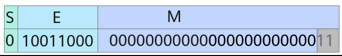

由于float只有23bit尾数位，因此灰色部分要进行舍入。

CAST_RINT模式舍入得尾数00000000000000000000001，E =152，M = 2-23，最终表示的结果为225 + 4；

CAST_FLOOR模式舍入得尾数00000000000000000000000，E =152，M = 0，最终表示的结果为225；

CAST_CEIL模式舍入得尾数00000000000000000000001，E =152，M = 2-23，最终表示的结果为225 + 4；

CAST_ROUND模式舍入得尾数00000000000000000000001，E =152，M = 2-23，最终表示的结果为225 + 4；

CAST_TRUNC模式舍入得尾数00000000000000000000000，E =152，M = 0，最终表示的结果为225。

int64_t

将src以int64_t格式存入dst中，不存在精度转换问题，无舍入模式。

示例：输入231 - 1，输出231 - 1。

int16_t

将src以int16_t格式（溢出默认按照饱和处理）存入dst中，不存在精度转换问题，无舍入模式。

示例：输入231 - 1，输出215 - 1。

half与SetDeqScale(half scale)接口配合使用，输出src / 217 * scale* 217。

<!-- page 1358 -->

**src类型**

**dst类型**

精度转换规则介绍

int32_t

uint8_t

将src以uint8_t格式（溢出默认按照饱和处理）存入dst中，不存在精度转换问题，无舍入模式。

负数输入会被视为异常。

示例：输入231 - 1，输出28 - 1。

uint16_t

将src以uint16_t格式（溢出默认按照饱和处理）存入dst中，不存在精度转换问题，无舍入模式。

负数输入会被视为异常。

示例：输入231 - 1，输出216 - 1。

int64_t

int32_t

将src以int32_t格式（溢出默认按照饱和处理）存入dst中，不存在精度转换问题，无舍入模式。

示例：输入231，输出231 - 1。

float将src按照roundMode取到float所能表示的数，以float格式存入dst中。

示例：输入235 + 212 + 211，写成float的表示形式：235 * (1 +2-23 + 2-24)，要求E = 35 + 127 = 162，M = 2-23 + 2-24。

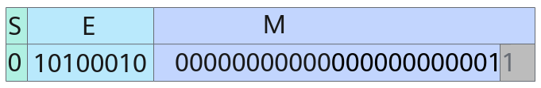

由于float只有23bit尾数位，因此灰色部分要进行舍入。

CAST_RINT模式舍入得尾数00000000000000000000010，E =162，M = 2-22，最终表示的结果为235 + 213；

CAST_FLOOR模式舍入得尾数00000000000000000000001，E =162，M = 2-23，最终表示的结果为225 + 212；

CAST_CEIL模式舍入得尾数00000000000000000000010，E =162，M = 2-22，最终表示的结果为225 + 213；

CAST_ROUND模式舍入得尾数00000000000000000000010，E =162，M = 2-22，最终表示的结果为225 + 213；

CAST_TRUNC模式舍入得尾数00000000000000000000001，E =162，M = 2-23，最终表示的结果为225 + 212。

<!-- page 1359 -->

**src类型**

**dst类型**

精度转换规则介绍

double

将src按照roundMode取到double所能表示的数，以double格式存入dst中。

示例：输入261 + 29 + 28，写成float的表示形式：261 * (1 + 2-52

+ 2-53)，要求E = 61 + 1023 = 1084，M =2-52 + 2-53。

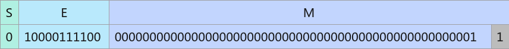

由于double只有52bit尾数位，因此灰色部分要进行舍入。

CAST_RINT模式舍入得尾数0000000000000000000000000000000000000000000000000010，E = 1084，M = 2-51，最终表示的结果为261 + 210；

CAST_FLOOR模式舍入得尾数0000000000000000000000000000000000000000000000000001，E = 1084，M = 2-52，最终表示的结果为261 + 29；

CAST_CEIL模式舍入得尾数0000000000000000000000000000000000000000000000000010，E = 1084，M =2-51，最终表示的结果为261 + 210；

CAST_ROUND模式舍入得尾数0000000000000000000000000000000000000000000000000010，E = 1084，M = 2-51，最终表示的结果为261 + 210；

CAST_TRUNC模式舍入得尾数0000000000000000000000000000000000000000000000000001，E = 1084，M = 2-52，最终表示的结果为261 + 29。

注：仅支持tensor前n个数据计算接口。

hifloat8_t

float将src以float格式存入dst中，不存在精度转换问题，无舍入模式。

示例：输入2，输出2。

half将src以half格式存入dst中，不存在精度转换问题，无舍入模式。

示例：输入2，输出2。

fp8_e4m3fn_t

float将src以float格式存入dst中，不存在精度转换问题，无舍入模式。

示例：输入2，输出2。

fp8_e5m2_t

float将src以float格式存入dst中，不存在精度转换问题，无舍入模式。

示例：输入2，输出2。

fp4x2_e2m1_t

bfloat16_t

将src以bfloat16_t格式存入dst中，不存在精度转换问题，无舍入模式。

示例：输入2，输出2。

fp4x2_e1m2_t

bfloat16_t

将src以bfloat16_t格式存入dst中，不存在精度转换问题，无舍入模式。

示例：输入2，输出2。

<!-- page 1360 -->

**src类型**

**dst类型**

精度转换规则介绍

complex64

complex64

complex64实部和虚部都是float类型，参考float与float之间的精度转换规则。

complex32

complex64实部和虚部都是float类型，complex32实部和虚部都是half类型，参考从float到half的精度转换规则。

complex32

complex64

complex64实部和虚部都是float类型，complex32实部和虚部都是half类型，参考从half到float的精度转换规则。

double

float将src按照roundMode取到float所能表示的数，以float格式存入dst中。

示例：输入235 + 212 + 211，写成float的表示形式：235 * (1 +2-23 + 2-24)，要求E = 1058 - 1023 + 127 = 162，M = 2-23 +2-24。

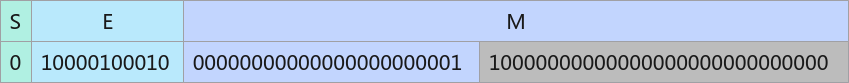

由于float只有8bit指数位，指数部分需要转换，只有23bit尾数位，因此灰色部分要进行舍入。

CAST_RINT模式舍入得尾数00000000000000000000010，E =162，M = 2-22，最终表示的结果为235 + 213；

CAST_FLOOR模式舍入得尾数00000000000000000000001，E =162，M = 2-23，最终表示的结果为235 + 212；

CAST_CEIL模式舍入得尾数00000000000000000000010，E =162，M = 2-22，最终表示的结果为235 + 213；

CAST_ROUND模式舍入得尾数00000000000000000000010，E =162，M = 2-22，最终表示的结果为235 + 213；

CAST_TRUNC模式舍入得尾数00000000000000000000001，E =162，M = 2-23，最终表示的结果为235 + 212。

注：仅支持tensor前n个数据计算接口。

<!-- page 1361 -->

**src类型**

**dst类型**

精度转换规则介绍

bfloat16_t

将src按照roundMode取到bfloat16_t所能表示的数，以bfloat16_t格式存入dst中。

示例：输入235 + 228 + 227，写成bfloat16_t的表示形式：235 * (1+ 2-7 + 2-8)，要求E = 1058 - 1023 + 127 = 162，M = 2-7 +2-8。

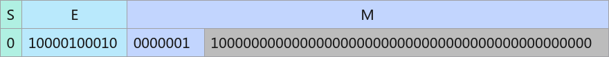

由于bfloat16_t只有8bit指数位，指数部分需要转换，只有7bit尾数位，因此灰色部分要进行舍入。

CAST_RINT模式舍入得尾数0000010，E = 162，M = 2-6，最终表示的结果为235 + 229；

CAST_FLOOR模式舍入得尾数0000001，E = 162，M = 2-7，最终表示的结果为235 + 228；

CAST_CEIL模式舍入得尾数0000010，E = 162，M = 2-6，最终表示的结果为235 + 229；

CAST_ROUND模式舍入得尾数0000010，E = 162，M = 2-6，最终表示的结果为235 + 229；

CAST_TRUNC模式舍入得尾数0000001，E = 162，M = 2-7，最终表示的结果为235 + 228。

注：仅支持tensor前n个数据计算接口。

int32_t

将src按照roundMode取整，以int32_t格式（溢出默认按照饱和处理）存入dst中。

示例：输入-1.5，

CAST_TRUNC模式输出-1。

int64_t

将src按照roundMode取整，以int64_t格式（溢出默认按照饱和处理）存入dst中。

示例：输入-1.5，

CAST_TRUNC模式输出-1。

函数原型

●tensor前n个数据计算template <typename T, typename U>__aicore__ inline void Cast(const LocalTensor<T>& dst, const LocalTensor<U>& src, const RoundMode& roundMode, const uint32_t count)

●tensor高维切分计算

–mask逐bit模式template <typename T, typename U, bool isSetMask = true>__aicore__ inline void Cast(const LocalTensor<T>& dst, const LocalTensor<U>& src, const RoundMode& roundMode, const uint64_t mask[], const uint8_t repeatTime, const UnaryRepeatParams& repeatParams)

<!-- page 1362 -->

–mask连续模式template <typename T, typename U, bool isSetMask = true>__aicore__ inline void Cast(const LocalTensor<T>& dst, const LocalTensor<U>& src, const RoundMode& roundMode, const uint64_t mask, const uint8_t repeatTime, const UnaryRepeatParams& repeatParams)

参数说明

表6-369模板参数说明

参数名描述

T目的操作数数据类型。

Atlas 350 加速卡，支持的数据类型见表6-376

Atlas A3 训练系列产品/Atlas A3 推理系列产品，支持的数据类型见表6-374

Atlas A2 训练系列产品/Atlas A2 推理系列产品，支持的数据类型见表6-373

Atlas 200I/500 A2 推理产品，支持的数据类型见表6-375

Atlas 推理系列产品AI Core，支持的数据类型见表6-372

Atlas 训练系列产品，支持的数据类型见表6-371

U源操作数数据类型。

Atlas 350 加速卡，支持的数据类型见表6-376

Atlas A3 训练系列产品/Atlas A3 推理系列产品，支持的数据类型见表6-374

Atlas A2 训练系列产品/Atlas A2 推理系列产品，支持的数据类型见表6-373

Atlas 200I/500 A2 推理产品，支持的数据类型见表6-375

Atlas 推理系列产品AI Core，支持的数据类型见表6-372

Atlas 训练系列产品，支持的数据类型见表6-371

isSetMask是否在接口内部设置mask。

●true，表示在接口内部设置mask。

●false，表示在接口外部设置mask，开发者需要使用SetVectorMask接口设置mask值。这种模式下，本接口入参中的mask值必须设置为占位符MASK_PLACEHOLDER。

表6-370参数说明

参数名输入/输出

描述

dst输出目的操作数。

类型为LocalTensor，支持的TPosition为VECIN/VECCALC/VECOUT。

LocalTensor的起始地址需要32字节对齐。

<!-- page 1363 -->

参数名输入/输出

描述

src输入源操作数。

类型为LocalTensor，支持的TPosition为VECIN/VECCALC/VECOUT。

LocalTensor的起始地址需要32字节对齐。

roundMode

输入精度转换处理模式，类型是RoundMode。

RoundMode为枚举类型，用以控制精度转换处理模式，具体定义为：enum class RoundMode {    CAST_NONE = 0,  // 在转换有精度损失时表示CAST_RINT模式，不涉及精度损失时表示不舍入    CAST_RINT,      // rint，四舍六入五成双舍入    CAST_FLOOR,     // floor，向负无穷舍入    CAST_CEIL,      // ceil，向正无穷舍入    CAST_ROUND,     // round，四舍五入舍入    CAST_TRUNC,     // trunc，向零舍入    CAST_ODD,       // Von Neumann rounding，最近邻奇数舍入    CAST_HYBRID,    // hybrid，目前特指输出结果是hif8数据时，会用到的一种随机舍入};

对于Atlas 训练系列产品，CAST_ROUND表示反向0取整，远离0，对正数x.y变成(x + 1)，对负数-x.y，变成-(x + 1)。

count输入参与计算的元素个数。

mask/mask[]

输入mask用于控制每次迭代内参与计算的元素。

●逐bit模式：可以按位控制哪些元素参与计算，bit位的值为1表示参与计算，0表示不参与。mask为数组形式，数组长度和数组元素的取值范围和操作数的数据类型有关。当操作数为16位时，数组长度为2，mask[0]、mask[1]∈[0, 264-1]并且不同时为0；当操作数为32位时，数组长度为1，mask[0]∈(0,264-1]；当操作数为64位时，数组长度为1，mask[0]∈(0, 232-1]。

例如，mask=[8, 0]，8=0b1000，表示仅第4个元素参与计算。

●连续模式：表示前面连续的多少个元素参与计算。取值范围和操作数的数据类型有关，数据类型不同，每次迭代内能够处理的元素个数最大值不同。当操作数为16位时，mask∈[1, 128]；当操作数为32位时，mask∈[1,64]；当操作数为64位时，mask∈[1, 32]。

repeatTime输入重复迭代次数。矢量计算单元，每次读取连续的256Bytes数据进行计算，为完成对输入数据的处理，必须通过多次迭代（repeat）才能完成所有数据的读取与计算。repeatTime表示迭代的次数，repeatTime∈[0,255]。

关于该参数的具体描述请参考2.5.2.2.2 高维切分API。

<!-- page 1364 -->

参数名输入/输出

描述

repeatParams

输入控制操作数地址步长的参数，6.2.6.4UnaryRepeatParams类型。包含操作数相邻迭代间的地址步长，操作数同一迭代内datablock的地址步长等参数。其中dstRepStride/srcRepStride∈[0,255]。

相邻迭代间的地址步长参数说明请参考repeatStride；同一迭代内DataBlock的地址步长参数说明请参考dataBlockStride。

表6-371 Atlas 训练系列产品Cast 指令参数说明

**src数据类型**

**dst数据类型**

支持的roundMode

halffloatCAST_NONE

int32_tCAST_RINT/CAST_FLOOR/CAST_CEIL/CAST_ROUND/CAST_TRUNC

int8_tCAST_FLOOR/CAST_CEIL/CAST_ROUND/CAST_TRUNC/CAST_NONE

uint8_tCAST_FLOOR/CAST_CEIL/CAST_ROUND/CAST_TRUNC/CAST_NONE

floathalfCAST_NONE/CAST_ODD

int32_tCAST_RINT/CAST_FLOOR/CAST_CEIL/CAST_ROUND/CAST_TRUNC

uint8_thalfCAST_NONE

int8_thalfCAST_NONE

int32_tfloatCAST_NONE

表6-372 Atlas 推理系列产品AI CoreCast 指令参数说明

**src数据类型**

**dst数据类型**

支持的roundMode

halfint32_tCAST_RINT/CAST_FLOOR/CAST_CEIL/CAST_ROUND/CAST_TRUNC

int16_tCAST_RINT

floatCAST_NONE

int8_tCAST_FLOOR/CAST_CEIL/CAST_ROUND/CAST_TRUNC/CAST_NONE

<!-- page 1365 -->

**src数据类型**

**dst数据类型**

支持的roundMode

uint8_tCAST_FLOOR/CAST_CEIL/CAST_ROUND/CAST_TRUNC/CAST_NONE

int4b_tCAST_NONE

floatint32_tCAST_RINT/CAST_FLOOR/CAST_CEIL/CAST_ROUND/CAST_TRUNC

halfCAST_NONE/CAST_ODD

uint8_thalfCAST_NONE

int8_thalfCAST_NONE

int16_thalfCAST_NONE

int32_tfloatCAST_NONE

int16_tCAST_NONE

halfroundMode不生效，与SetDeqScale(half scale)接口配合使用。

表6-373 Atlas A2 训练系列产品/Atlas A2 推理系列产品Cast 指令参数说明

**src数据类型**

**dst数据类型**

支持的roundMode

halfint32_tCAST_RINT/CAST_FLOOR/CAST_CEIL/CAST_ROUND/CAST_TRUNC

int16_tCAST_RINT/CAST_FLOOR/CAST_CEIL/CAST_ROUND/CAST_TRUNC

floatCAST_NONE

int8_tCAST_RINT/CAST_FLOOR/CAST_CEIL/CAST_ROUND/CAST_TRUNC/CAST_NONE

uint8_tCAST_RINT/CAST_FLOOR/CAST_CEIL/CAST_ROUND/CAST_TRUNC/CAST_NONE

int4b_tCAST_RINT/CAST_FLOOR/CAST_CEIL/CAST_ROUND/CAST_TRUNC/CAST_NONE

floatfloatCAST_RINT/CAST_FLOOR/CAST_CEIL/CAST_ROUND/CAST_TRUNC

int32_tCAST_RINT/CAST_FLOOR/CAST_CEIL/CAST_ROUND/CAST_TRUNC

halfCAST_RINT/CAST_FLOOR/CAST_CEIL/CAST_ROUND/CAST_TRUNC/CAST_ODD/CAST_NONE

<!-- page 1366 -->

**src数据类型**

**dst数据类型**

支持的roundMode

int64_tCAST_RINT/CAST_FLOOR/CAST_CEIL/CAST_ROUND/CAST_TRUNC

int16_tCAST_RINT/CAST_FLOOR/CAST_CEIL/CAST_ROUND/CAST_TRUNC

floatbfloat16_t

CAST_RINT/CAST_FLOOR/CAST_CEIL/CAST_ROUND/CAST_TRUNC

bfloat16_t

floatCAST_NONE

int32_tCAST_RINT/CAST_FLOOR/CAST_CEIL/CAST_ROUND/CAST_TRUNC

int4b_thalfCAST_NONE

uint8_thalfCAST_NONE

int8_thalfCAST_NONE

int16_thalfCAST_RINT/CAST_FLOOR/CAST_CEIL/CAST_ROUND/CAST_TRUNC/CAST_NONE

floatCAST_NONE

int32_tfloatCAST_RINT/CAST_FLOOR/CAST_CEIL/CAST_ROUND/CAST_TRUNC/CAST_NONE

int16_tCAST_NONE

halfroundMode不生效，与SetDeqScale(half scale)接口配合使用。

int64_tCAST_NONE

int64_tint32_tCAST_NONE

floatCAST_RINT/CAST_FLOOR/CAST_CEIL/CAST_ROUND/CAST_TRUNC

表6-374 Atlas A3 训练系列产品/Atlas A3 推理系列产品Cast 指令参数说明

**src数据类型**

**dst数据类型**

支持的roundMode

halfint32_tCAST_RINT/CAST_FLOOR/CAST_CEIL/CAST_ROUND/CAST_TRUNC

int16_tCAST_RINT/CAST_FLOOR/CAST_CEIL/CAST_ROUND/CAST_TRUNC

floatCAST_NONE

<!-- page 1367 -->

**src数据类型**

**dst数据类型**

支持的roundMode

int8_tCAST_RINT/CAST_FLOOR/CAST_CEIL/CAST_ROUND/CAST_TRUNC/CAST_NONE

uint8_tCAST_RINT/CAST_FLOOR/CAST_CEIL/CAST_ROUND/CAST_TRUNC/CAST_NONE

int4b_tCAST_RINT/CAST_FLOOR/CAST_CEIL/CAST_ROUND/CAST_TRUNC/CAST_NONE

floatfloatCAST_RINT/CAST_FLOOR/CAST_CEIL/CAST_ROUND/CAST_TRUNC

int32_tCAST_RINT/CAST_FLOOR/CAST_CEIL/CAST_ROUND/CAST_TRUNC

halfCAST_RINT/CAST_FLOOR/CAST_CEIL/CAST_ROUND/CAST_TRUNC/CAST_ODD/CAST_NONE

int64_tCAST_RINT/CAST_FLOOR/CAST_CEIL/CAST_ROUND/CAST_TRUNC

int16_tCAST_RINT/CAST_FLOOR/CAST_CEIL/CAST_ROUND/CAST_TRUNC

floatbfloat16_t

CAST_RINT/CAST_FLOOR/CAST_CEIL/CAST_ROUND/CAST_TRUNC

bfloat16_t

floatCAST_NONE

int32_tCAST_RINT/CAST_FLOOR/CAST_CEIL/CAST_ROUND/CAST_TRUNC

int4b_thalfCAST_NONE

uint8_thalfCAST_NONE

int8_thalfCAST_NONE

int16_thalfCAST_RINT/CAST_FLOOR/CAST_CEIL/CAST_ROUND/CAST_TRUNC/CAST_NONE

floatCAST_NONE

int32_tfloatCAST_RINT/CAST_FLOOR/CAST_CEIL/CAST_ROUND/CAST_TRUNC/CAST_NONE

int16_tCAST_NONE

halfroundMode不生效，与SetDeqScale(half scale)接口配合使用。

int64_tCAST_NONE

int64_tint32_tCAST_NONE

<!-- page 1368 -->

**src数据类型**

**dst数据类型**

支持的roundMode

floatCAST_RINT/CAST_FLOOR/CAST_CEIL/CAST_ROUND/CAST_TRUNC

表6-375 Atlas 200I/500 A2 推理产品Cast 指令参数说明

**src数据类型**

**dst数据类型**

支持的roundMode

halfint32_tCAST_RINT/CAST_FLOOR/CAST_CEIL/CAST_ROUND/CAST_TRUNC

int16_tCAST_RINT/CAST_FLOOR/CAST_CEIL/CAST_ROUND/CAST_TRUNC

floatCAST_NONE

int8_tCAST_RINT/CAST_FLOOR/CAST_CEIL/CAST_ROUND/CAST_TRUNC/CAST_NONE

uint8_tCAST_RINT/CAST_FLOOR/CAST_CEIL/CAST_ROUND/CAST_TRUNC/CAST_NONE

floatfloatCAST_RINT/CAST_FLOOR/CAST_CEIL/CAST_ROUND/CAST_TRUNC

int32_tCAST_RINT/CAST_FLOOR/CAST_CEIL/CAST_ROUND/CAST_TRUNC

halfCAST_RINT/CAST_FLOOR/CAST_CEIL/CAST_ROUND/CAST_TRUNC/CAST_ODD/CAST_NONE

int64_tCAST_RINT/CAST_FLOOR/CAST_CEIL/CAST_ROUND/CAST_TRUNC

int16_tCAST_RINT/CAST_FLOOR/CAST_CEIL/CAST_ROUND/CAST_TRUNC

floatbfloat16_t

CAST_RINT/CAST_FLOOR/CAST_CEIL/CAST_ROUND/CAST_TRUNC

bfloat16_t

floatCAST_NONE

int32_tCAST_RINT/CAST_FLOOR/CAST_CEIL/CAST_ROUND/CAST_TRUNC

uint8_thalfCAST_NONE

int8_thalfCAST_NONE

int16_thalfCAST_RINT/CAST_FLOOR/CAST_CEIL/CAST_ROUND/CAST_TRUNC/CAST_NONE

floatCAST_NONE

<!-- page 1369 -->

**src数据类型**

**dst数据类型**

支持的roundMode

int32_tfloatCAST_RINT/CAST_FLOOR/CAST_CEIL/CAST_ROUND/CAST_TRUNC/CAST_NONE

int16_tCAST_NONE

halfCAST_NONE

int64_tCAST_NONE

int64_tint32_tCAST_NONE

floatCAST_RINT/CAST_FLOOR/CAST_CEIL/CAST_ROUND/CAST_TRUNC

表6-376 Atlas 350 加速卡Cast 指令参数说明

**src数据类型**

**dst数据类型**

支持的roundMode

floatfloatCAST_RINT/CAST_FLOOR/CAST_CEIL/CAST_ROUND/CAST_TRUNC

halfCAST_RINT/CAST_FLOOR/CAST_CEIL/CAST_ROUND/CAST_TRUNC/CAST_ODD/CAST_NONE

int64_tCAST_RINT/CAST_FLOOR/CAST_CEIL/CAST_ROUND/CAST_TRUNC

int32_tCAST_RINT/CAST_FLOOR/CAST_CEIL/CAST_ROUND/CAST_TRUNC

int16_tCAST_RINT/CAST_FLOOR/CAST_CEIL/CAST_ROUND/CAST_TRUNC

bfloat16_t

CAST_RINT/CAST_FLOOR/CAST_CEIL/CAST_ROUND/CAST_TRUNC

hifloat8_tCAST_ROUND/CAST_HYBRID

fp8_e4m3fn_t

CAST_RINT

fp8_e5m2_t

CAST_RINT

halffloatCAST_NONE

int32_tCAST_RINT/CAST_FLOOR/CAST_CEIL/CAST_ROUND/CAST_TRUNC

int16_tCAST_RINT/CAST_FLOOR/CAST_CEIL/CAST_ROUND/CAST_TRUNC

<!-- page 1370 -->

**src数据类型**

**dst数据类型**

支持的roundMode

int8_tCAST_RINT/CAST_FLOOR/CAST_CEIL/CAST_ROUND/CAST_TRUNC

uint8_tCAST_RINT/CAST_FLOOR/CAST_CEIL/CAST_ROUND/CAST_TRUNC

int4b_tCAST_RINT/CAST_FLOOR/CAST_CEIL/CAST_ROUND/CAST_TRUNC

bfloat16_t

CAST_RINT/CAST_FLOOR/CAST_CEIL/CAST_ROUND/CAST_TRUNC

hifloat8_tCAST_ROUND/CAST_HYBRID

bfloat16_t

floatCAST_NONE

int32_tCAST_RINT/CAST_FLOOR/CAST_CEIL/CAST_ROUND/CAST_TRUNC

halfCAST_RINT/CAST_FLOOR/CAST_CEIL/CAST_ROUND/CAST_TRUNC

fp4x2_e2m1_t

CAST_RINT/CAST_FLOOR/CAST_CEIL/CAST_ROUND/CAST_TRUNC

fp4x2_e1m2_t

CAST_RINT/CAST_FLOOR/CAST_CEIL/CAST_ROUND/CAST_TRUNC

int4b_thalfCAST_NONE

int16_tCAST_NONE

bfloat16_t

CAST_NONE

uint8_thalfCAST_NONE

uint16_tCAST_NONE

uint32_tCAST_NONE

int8_thalfCAST_NONE

int16_tCAST_NONE

int32_tCAST_NONE

uint16_tuint8_tCAST_NONE

uint32_tCAST_NONE

int16_thalfCAST_RINT/CAST_FLOOR/CAST_CEIL/CAST_ROUND/CAST_TRUNC

floatCAST_NONE

<!-- page 1371 -->

**src数据类型**

**dst数据类型**

支持的roundMode

uint8_tCAST_NONE

uint32_tCAST_NONE

int4b_tCAST_NONE

int32_tCAST_NONE

uint32_tuint8_tCAST_NONE

uint16_tCAST_NONE

int16_tCAST_NONE

int32_tfloatCAST_RINT/CAST_FLOOR/CAST_CEIL/CAST_ROUND/CAST_TRUNC

int64_tCAST_NONE

int16_tCAST_NONE

halfroundMode不生效，与SetDeqScale(half scale)接口配合使用。

uint8_tCAST_NONE

uint16_tCAST_NONE

int64_tint32_tCAST_NONE

floatCAST_RINT/CAST_FLOOR/CAST_CEIL/CAST_ROUND/CAST_TRUNC

doubleCAST_RINT/CAST_FLOOR/CAST_CEIL/CAST_ROUND/CAST_TRUNC

hifloat8_tfloatCAST_NONE

halfCAST_NONE

fp8_e4m3fn_t

floatCAST_NONE

fp8_e5m2_t

floatCAST_NONE

fp4x2_e2m1_t

bfloat16_t

CAST_NONE

fp4x2_e1m2_t

bfloat16_t

CAST_NONE

complex64

complex64

CAST_RINT/CAST_FLOOR/CAST_CEIL/CAST_ROUND/CAST_TRUNC

<!-- page 1372 -->

**src数据类型**

**dst数据类型**

支持的roundMode

complex32

CAST_RINT/CAST_FLOOR/CAST_CEIL/CAST_ROUND/CAST_TRUNC/CAST_ODD/CAST_NONE

complex32

complex64

CAST_NONE

doublefloatCAST_RINT/CAST_FLOOR/CAST_CEIL/CAST_ROUND/CAST_TRUNC

bfloat16_t

CAST_RINT/CAST_FLOOR/CAST_CEIL/CAST_ROUND/CAST_TRUNC

int32_tCAST_TRUNC

int64_tCAST_TRUNC

返回值说明

无

约束说明

●操作数地址对齐要求请参见通用地址对齐约束。

●操作数地址重叠约束请参考通用地址重叠约束。特别地，对于长度较小的数据类型转换为长度较大的数据类型时，地址重叠可能会导致结果错误。

●每个repeat能处理的数据量取决于数据精度、AI处理器型号，如float->half转换每次迭代操作64个源/目的元素。

●当源操作数和目的操作数位数不同时，计算输入参数以数据类型的字节较大的为准。例如，源操作数为half类型，目的操作数为int32_t类型时，为保证输出和输入是连续的，dstRepStride应设置为8，srcRepStride应设置为4。

●当dst或src为int4b_t时，由于一个int4b_t只占半个字节，故申请Tensor空间时，只需申请相同数量的int8_t数据空间的一半。host侧目前暂不支持int4b_t，故在申请int4b_t类型的tensor时，应先申请一个类型为int8_t的tensor，再用ReinterpretCast转化为int4b_t并调用Cast指令，详见调用示例。

●当dst或src为int4b_t时，tensor高维切分计算接口的连续模式的mask与tensor前n个数据计算接口的count必须为偶数；对于tensor高维切分计算接口的逐bit模式，对应同一字节的相邻两个比特位的数值必须一致，即0-1位数值一致，2-3位数值一致，4-5位数值一致，以此类推。

●针对Atlas 350 加速卡，complex32/complex64/double数据类型仅支持tensor前n个数据计算接口。

调用示例

本样例中只展示Compute流程中的部分代码。本样例的srcLocal为half类型，dstLocal为int32_t类型，计算mask时以int32_t为准。

根据不同的RoundMode取值，输出结果会有差异，下面样例以RoundMode::CAST_CEIL（向正无穷舍入）为例。

<!-- page 1373 -->

●tensor高维切分计算样例-mask连续模式uint64_t mask = 256 / sizeof(int32_t);// repeatTime = 8, 64 elements one repeat, 512 elements total// dstBlkStride, srcBlkStride = 1, no gap between blocks in one repeat// dstRepStride = 8, srcRepStride = 4, no gap between repeatsAscendC::Cast(dstLocal, srcLocal, AscendC::RoundMode::CAST_CEIL, mask, 8, { 1, 1, 8, 4 });

●tensor高维切分计算样例-mask逐bit模式uint64_t mask[2] = { 0, UINT64_MAX };// repeatTime = 8, 64 elements one repeat, 512 elements total// dstBlkStride, srcBlkStride = 1, no gap between blocks in one repeat// dstRepStride = 8, srcRepStride = 4, no gap between repeatsAscendC::Cast(dstLocal, srcLocal, AscendC::RoundMode::CAST_CEIL, mask, 8, { 1, 1, 8, 4 });

●tensor前n个数据计算样例uint32_t count = 512; // 参与计算的元素个数AscendC::Cast(dstLocal, srcLocal, AscendC::RoundMode::CAST_CEIL, count);

结果示例如下：

输入数据(srcLocal): [1.4, 1.5, 1.6, 2.4, 2.5, 2.6, ... 2.6]输出数据(dstLocal): [2, 2, 2, 3, 3, 3, ... 3]

当RoundMode为RoundMode::CAST_NONE（half转int32_t有精度损失，此时同CAST_RINT模式）或RoundMode::CAST_RINT（四舍六入五成双舍入）时，结果示例如下：

输入数据(srcLocal): [1.4, 1.5, 1.6, 2.4, 2.5, 2.6, ... 2.6]输出数据(dstLocal): [1, 2, 2, 2, 2, 3, ... 3]

当RoundMode为RoundMode::CAST_FLOOR（向负无穷舍入）时，结果示例如下：

输入数据(srcLocal): [1.4, 1.5, 1.6, 2.4, 2.5, 2.6, ... 2.6]输出数据(dstLocal): [1, 1, 1, 2, 2, 2, ... 2]

当RoundMode为RoundMode::CAST_ROUND（四舍五入舍入）时，结果示例如下：

输入数据(srcLocal): [1.4, 1.5, 1.6, 2.4, 2.5, 2.6, ... 2.6]输出数据(dstLocal): [1, 2, 2, 2, 3, 3, ... 3]

当RoundMode为RoundMode::CAST_TRUNC（向零舍入）时，结果示例如下：

输入数据(srcLocal): [1.4, 1.5, 1.6, 2.4, 2.5, 2.6, ... 2.6]输出数据(dstLocal): [1, 1, 1, 2, 2, 2, ... 2]

●当Cast涉及int4b_t时，调用示例如下：

dstLocal为int8_t类型，srcLocal为half类型

```cpp
inBufferSize_ = srcSize;  // src buffer sizeoutBufferSize_ = srcSize / 2;   //dst buffer sizeuint64_t mask = 128;AscendC::LocalTensor<half> srcLocal;srcLocal.SetSize(inBufferSize_);AscendC::LocalTensor<int8_t> dstLocal;dstLocal.SetSize(outBufferSize_);AscendC::LocalTensor<AscendC::int4b_t> dstLocalTmp = dstLocal.ReinterpretCast<AscendC::int4b_t>();// repeatTime = 1, 128 elements one repeat, 128 elements total// dstBlkStride, srcBlkStride = 1, no gap between blocks in one repeat// dstRepStride = 2, srcRepStride = 8, no gap between repeats
```

<!-- page 1374 -->

```cpp
AscendC::Cast<AscendC::int4b_t, half>(dstLocalTmp, srcLocal, AscendC::RoundMode::CAST_CEIL, mask, 1, {1, 1, 2, 8});
```

更多样例

更多地，您可以参考以下样例，了解如何使用Cast指令的tensor高维切分计算接口，进行更灵活的操作、实现更高级的功能。

●通过tensor高维切分计算接口中的mask连续模式，实现数据非连续计算。uint64_t mask = 32;  // 每个迭代内只计算前32个数AscendC::Cast(dstLocal, srcLocal, AscendC::RoundMode::CAST_CEIL, mask, 8, { 1, 1, 8, 4 });

结果示例如下：

输入数据(srcLocal): [37.4     7.11   53.5    19.44   22.66   43.     43.16    5.316  74.2 15.7    87.75   86.94   92.56   25.45   36.06   94.6    73.6    30.48 48.16   12.55   27.81   14.67    6.58   48.38   67.5    57.5    63.3 85.2     3.654  68.7    52.53   16.38   13.945  63.84   87.2    82.5 85.7    27.78   15.41   41.66   31.38   14.65   88.25    0.0332 43.06 46.88   15.57   87.1    53.16   33.5    91.06   36.5    55.34   60.53  3.238  23.92   97.5    91.1    78.44   54.47   82.     53.8    72.1 25.06   32.12   15.88   33.38   36.7    33.3    84.4    19.25    1.743 46.16   22.06    4.582  71.1    15.94   22.23   53.47   17.05   48.56 94.44   77.4    90.2    46.56   92.4     9.45   68.44   35.7    31.62 68.1    63.7    77.     92.06   20.45   27.67   93.4    22.39   17.22 73.06    7.12   25.34   36.34   13.54   38.12   24.56   86.56   69.7 68.3    30.38   68.4    86.1    54.44   70.     55.3    48.6    59.03 64.44   15.45   66.5    92.7    60.7    52.22   47.     99.75   41.94 43.06   89.5    36.9    62.5     1.306  48.06    9.37   62.25   20.61 43.8    69.25   27.22   71.44   52.75   11.82   80.6    63.44   53.22 85.44   25.25    2.309  26.88   84.5    29.83    9.93   81.9    97.75 75.75   97.7    72.     19.86   26.62   88.7    74.06    9.24   42.5 14.     39.44   98.56   66.94   89.     57.12   39.     11.57   19.05 86.56   32.66   19.25   99.3    95.6    58.7    79.6    37.38   65. 75.7     8.586  77.7     2.68   75.7    77.56   39.1    39.72   64.06 98.44   30.27   31.9    94.4    85.94    4.965   2.758  92.4    49.53 50.75    5.7    19.69   87.6    20.08   88.8    87.4    63.6    68.3 78.9    45.66   10.01   35.25   71.9    37.38   39.7    43.47   11.67 64.3    35.62   74.3    59.3    28.69   29.56   23.14   36.22    4.88 70.5    25.05   72.6    71.6    32.28   34.66   80.     96.1    98.7 12.91   95.4    61.97   87.94   19.1    40.47   89.6    84.     29.72 17.8    81.44   23.25   33.03   18.67   78.     49.62   63.1    72.75 77.25    3.74   38.9    17.92   76.     25.62   34.53   84.     32.03 57.3     9.21    6.836  68.9    35.78   96.75   56.3    96.1    23.45 78.75   94.25   12.44   56.7    24.55   25.11   90.7    50.94   78.4  3.576  21.81   53.28   26.2    43.1     7.742  13.4    86.44   86.9 13.93   16.48   91.06   42.3    95.5    66.8    40.6    98.06   71.9 67.6    55.9    82.44   93.75   41.53   23.62   40.12   40.53   80.7 80.25   96.3    51.38   93.6    91.3    32.84   88.     69.7    63.16 41.75   43.22   43.22   31.73   84.9    91.6    80.     53.34   27.12 76.6    97.25   44.5    30.28   74.3    76.06   40.     41.28   37.72 99.56   18.73   16.45   92.75   79.1    40.3    68.     23.98   88.7 86.6    24.97   59.6    28.25   82.94   46.12   60.12   34.53   79.7 11.086  20.25   44.88   39.97   42.12   62.7    30.66   42.56   16.69 85.2    90.8    78.75   26.16   18.14   94.06   40.3    20.16   38. 12.99   95.44   76.25   26.03   76.     30.06   27.25   84.56   30.45 66.1    83.25    3.732  39.1    54.22   82.8    43.22   53.03   11.66 88.1     6.83   66.8    44.4     7.5    24.77   74.4    35.9    79.75 41.62   37.06   60.12   57.9    96.94   84.25   39.88   22.55   72.7 58.9    44.75   90.4    46.34   71.3    16.4    26.12   21.45   10.27 91.     41.53   39.03   80.25    2.11    7.88   72.2    27.83   88.1 67.56   10.72   52.84   91.2    97.6    51.44   74.7     3.527  79.25 11.3    19.16   39.53    3.469  98.7    45.72   40.16   47.1    71.8 11.81   52.97   71.44   37.7    26.81   46.22   26.94    4.805  12.18 70.4    51.4    24.2    83.9     9.62   12.445  57.6    85.8    55.12 88.25   32.38   62.88    1.903  47.72   35.9    48.94   86.06   32.44  1.219  35.56   49.78   49.97   24.45   94.5    99.94   44.72    3.404 83.6    23.14   76.7    91.7    24.33   20.62   24.72    4.55   88.94

<!-- page 1375 -->

```cpp
87.44   95.75   41.56   13.77   34.6    95.94   77.1    24.28   70.06 10.06   11.38   88.8    57.22   94.56   35.     79.8    58.22   44.06 26.9    16.25   99.94   51.1    42.38   84.25    0.9604 48.1   ]
```

输出数据(dstLocal): [        38          8         54         20         23         43         44          6         75         16         88         87         93         26         37         95         74         31         49         13         28         15          7         49         68         58         64         86          4         69         53         17 1879993057 1827499998 1823960025 1570990114 1828150463 1811639312 1794470101 1754296176 1888841335 1715628997 1839753994 1850888497 1889364175 1891068936 1823369913 1769105534 1815638091 1808559970 1601662785 1739089473 1863146361 1694785989 1597138938 1836478181 1888774249 1637707434 1877372650 1796304934 1887530885 1839295471 1707240971 1873242695         33         16         34         37         34         85         20          2         47         23          5         72         16         23         54         18         49         95         78         91         47         93         10         69         36         32         69         64         77         93         21         28 1753837732 1488743807 1711632378 1799581711 1818783215 1891790695 1837723802 1752132873 1727950918 1760390205 1866887130 1824876865 1807839436 1890544910 1889755550 1787129270 1502702106 1841065201 1820156583 1779396288 1760521448 1844604520 1831039103 1843491014 1891199259 1839493317 1801349958 1577807434 1811377215 1879404734 1826057367 1837853054         37         63          2         49         10         63         21         44         70         28         72         53         12         81         64         54         86         26          3         27         85         30         10         82         98         76         98         72         20         27         89         75 1890086927 1826517134 1814783944 1824156809 1875733079 1842114682 1845456975 1830120794 1787980861 1807380585 1535469972 1883860884 1889167601 1747872128 1888317235 1720937006 1836806331 1654152236 1695309475 1892773593 1840737395 1868392748 1833724316 1600153936 1869310159 1883467778 1892641857 1776248953 1833201514 1886743848 1745972258 1860657622         95         86          5          3         93         50         51          6         20         88         21         89         88         64         69         79         46         11         36         72         38         40         44         12         65         36         75         60         29         30         24         37 1733652589 1756325317 1685744372 1780772214 1660252348 1629973784 1847815925 1828941229 1683778661 1519480967 1762160488 1844801381 1832742021 1891724641 1761701480 1695312651 1429433841 1774275423 1828349211 1779786303 1835953259 1784896595 1858432988 1413442268 1893363867 1886679050 1872588913 1473866635 1793158916 1762946052 1719627087 1893231666         76         26         35         84         33         58         10          7         69         36         97         57         97         24         79         95         13         57         25         26         91         51         79          4         22         54         27         44          8         14         87         87 1208960410 1208567888 1215973275 1214859418 1210992732 1208305714 1165379704 1215252623 1197033625 1212172318 1217415148 1211058280 1206798479 1215645776 1209223143 1217611809 1212500082 1215383615 1208567769 1200179260 1216694386 1218070398 1195526187 1211516213 1213089850 1213941743 1216825148 1212565573 1216694248 1217546087 1200178778 1215973524         92         80         54         28         77         98         45         31         75         77         40         42         38        100         19         17         93         80         41         68         24         89         87         25         60         29         83         47         61         35         80         12 1189759014 1218070662 1211057953 1216825400 1215121414 1214596952 1216169420 1210075102 1209157633 1213941279 1195984973 1211648118 1201686666 1212041360 1216103688 1212500024 1173112887 1194608648 1216825427 1209747582 1207191587 1214859224 1203980407 1215711379 1213155353 1203259396 1214859350 1211779156 1217218713 1202473003 1216628529 1196771437
