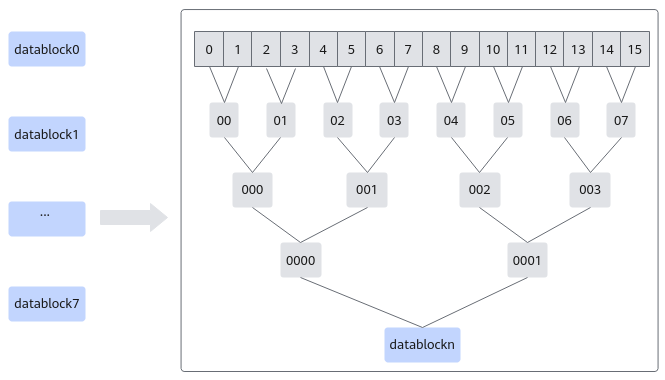
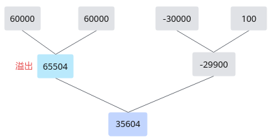

# BlockReduceSum

> **Section**: 6.2.3.3.6.9  
> **PDF Pages**: 1417–1420  

---

<!-- page 1417 -->

●对于Atlas 200I/500 A2 推理产品，若配置的mask/mask[]参数后，存在某个datablock里的任何一个元素都不参与计算，则该datablock内所有元素的最小值会填充为inf返回。比如float场景下，当mask配置为32，即只计算前4个datablock，则后四个datablock内的最小值会返回inf。half场景下，最小值会返回65504。

●针对不同场景合理使用归约指令可以带来性能提升，相关介绍请参考3.8.6.3 选择低延迟指令，优化归约操作性能，具体样例请参考ReduceCustom。

调用示例

●BlockReduceMin-tensor高维切分计算样例-mask连续模式// 设定mask为最多的128个全部元素参与计算int32_t mask = 256/sizeof(half);// 每个repeat128个元素，一共128个元素。int repeat = 1;// dstLocal: 目的操作数tensor// srcLocal: 源操作数tensor// srcBlkStride = 1, 在一个repeat中，block间没有空隙。// dstRepStride = 1, srcRepStride = 8, repeat间没有空隙。AscendC::BlockReduceMin<half>(dstLocal, srcLocal, repeat, mask, 1, 1, 8);

●BlockReduceMin-tensor高维切分计算样例-mask逐bit模式// 设定mask为最多的128个全部元素参与计算uint64_t mask[2] = { UINT64_MAX, UINT64_MAX };// 每个repeat128个元素，一共128个元素。int repeat = 1;// dstLocal: 目的操作数tensor// srcLocal: 源操作数tensor// srcBlkStride = 1, 在一个repeat中，block间没有空隙。// dstRepStride = 1, srcRepStride = 8, repeat间没有空隙。AscendC::BlockReduceMin<half>(dstLocal, srcLocal, repeat, mask, 1, 1, 8);

结果示例如下：输入数据src_gm: [10, 10, 10, 10, 10, 10, 10, 10, 10, 10, 10, 2, 10, 10, 10, 10, 10, 10, 10, 10, 10, 10, 10, 10, 10, 10, 10, 10, 10, -3, 10, 10, ... 10, 10, 10, 10, 10, 10, 10, 10, 10, 4, 10, 10, 10, 10, 10, 10,]

输出数据dst_gm: [2, -3, ..., 4]

## 6.2.3.3.6.9 BlockReduceSum

产品支持情况

产品是否支持

Atlas 350 加速卡√

Atlas A3 训练系列产品/Atlas A3 推理系列产品√

Atlas A2 训练系列产品/Atlas A2 推理系列产品√

Atlas 200I/500 A2 推理产品√

Atlas 推理系列产品AI Core√

<!-- page 1418 -->

产品是否支持

Atlas 推理系列产品Vector Corex

Atlas 训练系列产品√

功能说明

对每个datablock内所有元素求和。源操作数相加采用二叉树方式，两两相加。归约指令的总体介绍请参考2.5.2.3.2 如何使用归约计算API。

以128个half类型的数据求和为例，每个datablock可以计算16个half类型数据，分成8个datablock进行计算；每个datablock内，通过二叉树的方式，两两相加，BlockReduceSum求和示意图如下。

图6-41 BlockReduceSum 求和示意图

需要注意的是两两相加的计算过程中，计算结果大于65504时结果保存为65504。例如，源操作数为[60000,60000,-30000,100]，首先60000+60000溢出，结果为65504，然后计算-30000+100=-29900，最后计算65504-29900=35604，计算示意图如下图所示。

<!-- page 1419 -->

图6-42存在溢出场景时的计算示意图

函数原型

●mask逐比特模式template <typename T, bool isSetMask = true>__aicore__ inline void BlockReduceSum(const LocalTensor<T>& dst, const LocalTensor<T>& src,const int32_t repeatTime, const uint64_t mask[], const int32_t dstRepStride, const int32_t srcBlkStride, const int32_t srcRepStride)

●mask连续模式template <typename T, bool isSetMask = true>__aicore__ inline void BlockReduceSum(const LocalTensor<T>& dst, const LocalTensor<T>& src,const int32_t repeatTime, const int32_t mask, const int32_t dstRepStride, const int32_t srcBlkStride, const int32_t srcRepStride)

参数说明

表6-395模板参数说明

参数名描述

T操作数数据类型。

Atlas 350 加速卡，支持的数据类型为：half、float

Atlas A3 训练系列产品/Atlas A3 推理系列产品，支持的数据类型为：half/float

Atlas A2 训练系列产品/Atlas A2 推理系列产品，支持的数据类型为：half/float

Atlas 200I/500 A2 推理产品，支持的数据类型为：half/float

Atlas 推理系列产品AI Core，支持的数据类型为：half/float

Atlas 训练系列产品，支持的数据类型为：half

isSetMask

是否在接口内部设置mask。

●true，表示在接口内部设置mask。

●false，表示在接口外部设置mask，开发者需要使用 SetVectorMask接口设置mask值。这种模式下，本接口入参中的mask值必须设置为占位符MASK_PLACEHOLDER。

<!-- page 1420 -->

表6-396参数说明

参数名称输入/输出

含义

dst输出目的操作数。

类型为LocalTensor，支持的TPosition为VECIN/VECCALC/VECOUT。

LocalTensor的起始地址需要保证16字节对齐（针对half数据类型），32字节对齐（针对float数据类型）。

src输入源操作数。

类型为LocalTensor，支持的TPosition为VECIN/VECCALC/VECOUT。

LocalTensor的起始地址需要32字节对齐。

repeatTime

输入迭代次数。取值范围为[0, 255]。

关于该参数的具体描述请参考2.5.2.2.2 高维切分API。

mask/mask[]

输入mask用于控制每次迭代内参与计算的元素。

●逐bit模式：可以按位控制哪些元素参与计算，bit位的值为1表示参与计算，0表示不参与。mask为数组形式，数组长度和数组元素的取值范围和操作数的数据类型有关。当操作数为16位时，数组长度为2，mask[0]、mask[1]∈[0, 264-1]并且不同时为0；当操作数为32位时，数组长度为1，mask[0]∈(0, 264-1]；当操作数为64位时，数组长度为1，mask[0]∈(0, 232-1]。

例如，mask=[8, 0]，8=0b1000，表示仅第4个元素参与计算。

●连续模式：表示前面连续的多少个元素参与计算。取值范围和操作数的数据类型有关，数据类型不同，每次迭代内能够处理的元素个数最大值不同。当操作数为16位时，mask∈[1, 128]；当操作数为32位时，mask∈[1, 64]；当操作数为64位时，mask∈[1, 32]。

dstRepStride

输入目的操作数相邻迭代间的地址步长。以一个repeatTime归约后的长度为单位。

每个repeatTime(8个datablock)归约后，得到8个元素，所以输入类型为half类型时，RepStride单位为16Byte；输入类型为float类型时，RepStride单位为32Byte。

注意，此参数值Atlas 训练系列产品不支持配置0。

srcBlkStride

输入单次迭代内datablock的地址步长。详细说明请参考dataBlockStride。

srcRepStride

输入源操作数相邻迭代间的地址步长，即源操作数每次迭代跳过的datablock数目。详细说明请参考repeatStride。

返回值说明

无
