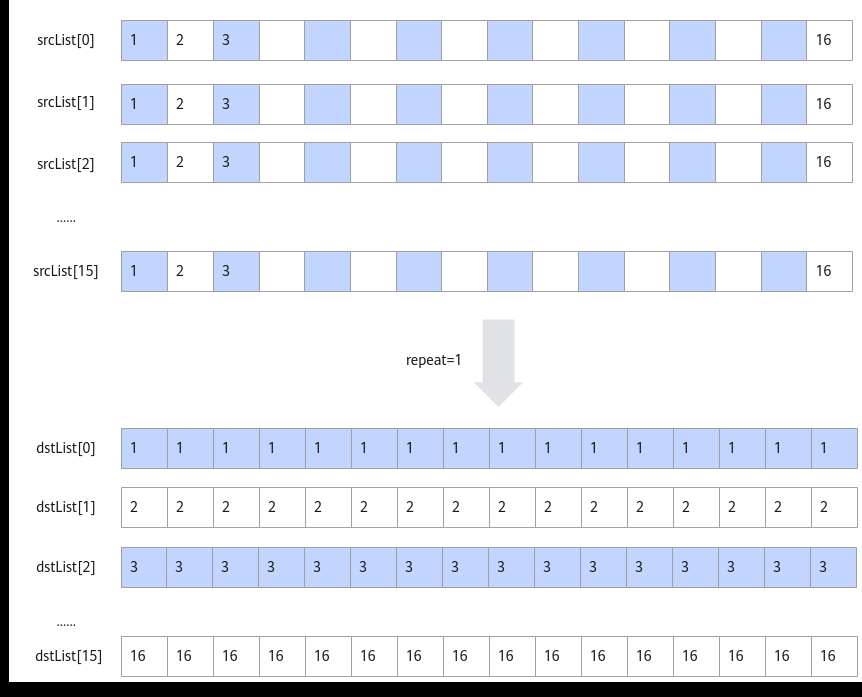
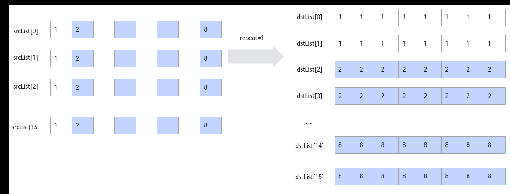
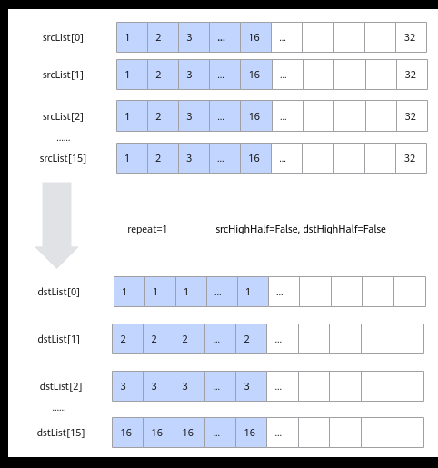
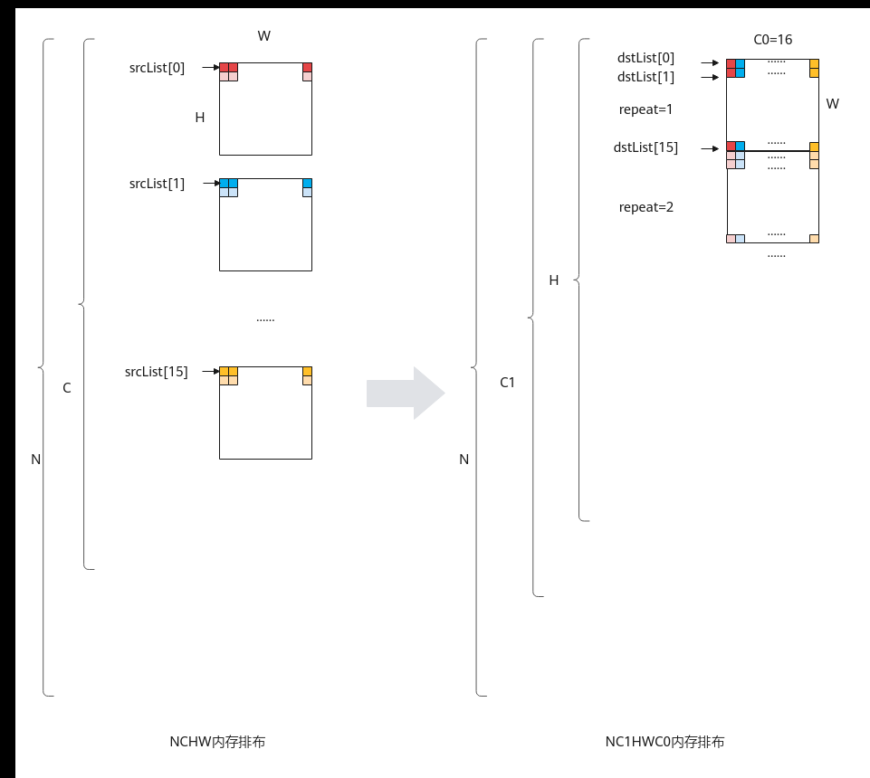

# TransDataTo5HD

> **Section**: 6.2.3.3.7.2  
> **PDF Pages**: 1437–1446  

---

<!-- page 1437 -->

```cpp
174. 175.] [176. 177. 178. 179. 180. 181. 182. 183. 184. 185. 186. 187. 188. 189.  190. 191.] [192. 193. 194. 195. 196. 197. 198. 199. 200. 201. 202. 203. 204. 205.  206. 207.] [208. 209. 210. 211. 212. 213. 214. 215. 216. 217. 218. 219. 220. 221.  222. 223.] [224. 225. 226. 227. 228. 229. 230. 231. 232. 233. 234. 235. 236. 237.  238. 239.] [240. 241. 242. 243. 244. 245. 246. 247. 248. 249. 250. 251. 252. 253.  254. 255.]]
```

输出数据dst_gm:[[  0.  16.  32.  48.  64.  80.  96. 112. 128. 144. 160. 176. 192. 208.  224. 240.] [  1.  17.  33.  49.  65.  81.  97. 113. 129. 145. 161. 177. 193. 209.  225. 241.] [  2.  18.  34.  50.  66.  82.  98. 114. 130. 146. 162. 178. 194. 210.  226. 242.] [  3.  19.  35.  51.  67.  83.  99. 115. 131. 147. 163. 179. 195. 211.  227. 243.] [  4.  20.  36.  52.  68.  84. 100. 116. 132. 148. 164. 180. 196. 212.  228. 244.] [  5.  21.  37.  53.  69.  85. 101. 117. 133. 149. 165. 181. 197. 213.  229. 245.] [  6.  22.  38.  54.  70.  86. 102. 118. 134. 150. 166. 182. 198. 214.  230. 246.] [  7.  23.  39.  55.  71.  87. 103. 119. 135. 151. 167. 183. 199. 215.  231. 247.] [  8.  24.  40.  56.  72.  88. 104. 120. 136. 152. 168. 184. 200. 216.  232. 248.] [  9.  25.  41.  57.  73.  89. 105. 121. 137. 153. 169. 185. 201. 217.  233. 249.] [ 10.  26.  42.  58.  74.  90. 106. 122. 138. 154. 170. 186. 202. 218.  234. 250.] [ 11.  27.  43.  59.  75.  91. 107. 123. 139. 155. 171. 187. 203. 219.  235. 251.] [ 12.  28.  44.  60.  76.  92. 108. 124. 140. 156. 172. 188. 204. 220.  236. 252.] [ 13.  29.  45.  61.  77.  93. 109. 125. 141. 157. 173. 189. 205. 221.  237. 253.] [ 14.  30.  46.  62.  78.  94. 110. 126. 142. 158. 174. 190. 206. 222.  238. 254.] [ 15.  31.  47.  63.  79.  95. 111. 127. 143. 159. 175. 191. 207. 223.  239. 255.]]

●增强接口调用示例片段，完成half类型的[N,C,H,W]->[N,H,W,C]转置。AscendC::TransposeParamsExt transposeParams;transposeParams.nSize = N; // N轴长度transposeParams.cSize = C; // C轴长度transposeParams.hSize = H; // H轴长度transposeParams.wSize = W; // W轴长度transposeParams.transposeType = transposeType; AscendC::Transpose(dstLocal, srcLocal, stackBuffer, transposeParams);

## 6.2.3.3.7.2 TransDataTo5HD

产品支持情况

产品是否支持

Atlas 350 加速卡√

Atlas A3 训练系列产品/Atlas A3 推理系列产品√

Atlas A2 训练系列产品/Atlas A2 推理系列产品√

<!-- page 1438 -->

产品是否支持

Atlas 200I/500 A2 推理产品√

Atlas 推理系列产品AI Core√

Atlas 推理系列产品Vector Corex

Atlas 训练系列产品√

功能说明

数据格式转换，一般用于将NCHW格式转换成NC1HWC0格式。特别的，也可以用于二维矩阵数据块的转置。完成转置功能时，相比于Transpose接口，Transpose仅支持16*16大小的矩阵转置；本接口单次repeat内可处理512Byte的数据（16个datablock），根据数据类型不同，支持不同shape的矩阵转置（比如数据类型为half时，单次repeat可完成16*16大小的矩阵转置），同时还可以支持多次repeat操作。

单次repeat内转换规则如下：

●当输入数据类型位宽为16位时，每个datablock中包含16个数，指令内部会循环16次，每次循环都会分别从指定的16个datablock中的对应位置取值，组成一个新的datablock单元放入目的地址中。如下图所示，图中的srcList[0]-srcList[15]代表源操作数的16个datablock。

图6-43输入数据类型位宽为16 位时的转换规则



<!-- page 1439 -->

●当数据类型位宽为32位时，每个datablock包含8个数，指令内部会循环8次，每次循环都会分别从指定的16个datablock中的对应位置取值，组成2个新的datablock放入目的地址中。如下图所示：

图6-44输入数据类型位宽为32 位时的转换规则



●当数据类型位宽为8位时，每个datablock包含32个数，指令内部会循环16次，每次循环都会分别从指定的16个datablock中的对应位置取值，组成半个datablock放入目的地址中，读取和存放是在datablock的高半部还是低半部由参数srcHighHalf和dstHighHalf决定。如下图所示：

<!-- page 1440 -->

图6-45输入数据类型位宽为8 位时的转换规则



基于以上的转换规则，使用该接口进行NC1HWC0格式转换或者矩阵转置。NC1HWC0格式转换相对复杂，这里给出其具体的转换方法：

NCHW格式转换成NC1HWC0格式时，如果是数据类型的位宽为32位或者16位，则C0=16；如果数据类型的位宽为8位，则C0=32。下图以C0=16为例进行介绍：

<!-- page 1441 -->



函数原型

●dstList与srcList类型为LocalTensor的数组。// NCHW_CONV_ADDR_LIST_SIZE值为16template <typename T>__aicore__ inline void TransDataTo5HD(const LocalTensor<T> (&dstList)[NCHW_CONV_ADDR_LIST_SIZE], const LocalTensor<T> (&srcList)[NCHW_CONV_ADDR_LIST_SIZE], const TransDataTo5HDParams& nchwconvParams)

●dstList与srcList类型为uint64_t的数组，数组元素对应LocalTensor的地址值，该接口性能更优。开发者可以通过LocalTensor的GetPhyAddr接口获取该地址值。// NCHW_CONV_ADDR_LIST_SIZE值为16template<typename T>__aicore__ inline void TransDataTo5HD(uint64_t dstList[NCHW_CONV_ADDR_LIST_SIZE], uint64_t srcList[NCHW_CONV_ADDR_LIST_SIZE], const TransDataTo5HDParams& nchwconvParams)

●dst与src类型为uint64_t的LocalTensor，连续存储对应LocalTensor的地址值。开发者可以通过LocalTensor的GetPhyAddr接口获取该地址值。template <typename T>__aicore__ inline void TransDataTo5HD(const LocalTensor<uint64_t>& dst, const LocalTensor<uint64_t>& src, const TransDataTo5HDParams& nchwconvParams)

<!-- page 1442 -->

参数说明

表6-408模板参数说明

参数名描述

T操作数数据类型。

Atlas 350 加速卡，支持的数据类型为：int8_t/uint8_t/int16_t/uint16_t/half/bfloat16_t/int32_t/uint32_t/float

Atlas A3 训练系列产品/Atlas A3 推理系列产品，支持的数据类型为：int8_t/uint8_t/int16_t/uint16_t/half/int32_t/uint32_t/float

Atlas A2 训练系列产品/Atlas A2 推理系列产品，支持的数据类型为：int8_t/uint8_t/int16_t/uint16_t/half/int32_t/uint32_t/float

Atlas 200I/500 A2 推理产品，支持的数据类型为：int8_t/uint8_t/int16_t/uint16_t/half/int32_t/uint32_t/float

Atlas 推理系列产品AI Core，支持的数据类型为：int8_t/uint8_t/int16_t/uint16_t/half/int32_t/uint32_t/float

Atlas 训练系列产品，支持的数据类型为：int8_t/uint8_t/int16_t/uint16_t/half

表6-409参数列表

参数名称输入/输出含义

dstList输出目的操作数地址序列。

类型为LocalTensor或者LocalTensor的地址值，LocalTensor支持的TPosition为VECIN/VECCALC/VECOUT。LocalTensor的起始地址需要32B对齐。支持的数据类型参考模板参数T说明。

srcList输入源操作数地址序列。

类型为LocalTensor或者LocalTensor的地址值，LocalTensor支持的TPosition为VECIN/VECCALC/VECOUT。LocalTensor的起始地址需要32B对齐。支持的数据类型参考模板参数T说明。

数据类型需要与dstList保持一致。

dst输出目的操作数。

类型为LocalTensor，连续存储对应LocalTensor的地址值。LocalTensor支持的TPosition为VECIN/VECCALC/VECOUT。LocalTensor的起始地址需要32B对齐。

src输入源操作数。

类型为LocalTensor，连续存储对应LocalTensor的地址值。LocalTensor支持的TPosition为VECIN/VECCALC/VECOUT。LocalTensor的起始地址需要32B对齐。

<!-- page 1443 -->

参数名称输入/输出含义

nchwconvParams

输入控制TransDataTo5HD的数据结构。结构体内包含：读取和写入位置的控制参数，迭代次数，相邻迭代间的地址步长等参数。

具体定义请参考${INSTALL_DIR}/include/ascendc/basic_api/interface/kernel_struct_transpose.h，${INSTALL_DIR}请替换为CANN软件安装后文件存储路径。

参数说明请参考表6-410。

表6-410 TransDataTo5HDParams 结构体内参数说明

参数名称类型说明

dstHighHalf

输入指定每个dstList地址中的数据存储到datablock的高半部还是低半部，该配置只支持int8_t/uint8_t的数据类型。

支持的数据类型为bool，有以下两种取值：

●True：表示存储于datablock的高半部

●False：表示存储于datablock的低半部

srcHighHalf

输入指定每个srcList地址中的数据从datablock的高半部还是低半部读取，该配置只支持int8_t/uint8_t的数据类型。

支持的数据类型为bool，有以下两种取值：

●True：表示从datablock的高半部读取

●False：表示从datablock的低半部读取

repeatTimes

输入重复迭代次数，repeatTimes∈[0,255]。

关于该参数的具体描述请参考2.5.2.2.2 高维切分API。

注意事项：

●当repeatTimes为1时，目的操作数/源操作数的有效起始位置为dstList/srcList序列输入的起始位置加上dstRepStride/srcRepStride；repeatTimes为1，如果要让目的操作数/源操作数的有效起始位置为dstList/srcList序列输入的起始位置，需要将dstRepStride/srcRepStride置为0。

●当repeatTimes大于1时，第一次repeat中目的操作数/源操作数的有效起始位置为dstList/srcList序列输入的起始位置，第二次需要加上dstRepStride/srcRepStride。以此类推。

<!-- page 1444 -->

参数名称类型说明

dstRepStride

输入相邻迭代间，目的操作数相同datablock地址stride，单位：datablock。

相邻迭代间相同datablock的地址步长参数的详细说明请参考repeatStride。

srcRepStride

输入相邻迭代间，源操作数相同datablock地址stride，单位：datablock。

相邻迭代间相同datablock的地址步长参数的详细说明请参考repeatStride。

约束说明

●操作数地址对齐要求请参见通用地址对齐约束。

●操作数地址重叠约束请参考通用地址重叠约束。

●进行NCHW格式到NC1HWC0格式的转换时，一般用法是将srcList/dstList中的每个元素配置为每个HW平面的起点。

●为了性能更优，数据类型位宽为8位时建议先固定dstHighHalf、srcHighHalf，在HW方向repeat后，再改变dstHighHalf、srcHighHalf。

●dst与src中的地址需要连续存放，详见调用示例。

返回值说明

无

调用示例

本样例中只展示Compute流程中的部分代码。

●入参类型是LocalTensor的调用方式AscendC::TransDataTo5HDParams transDataParams;transDataParams.dstHighHalf = true; // 只对int8_t/uint8_t的入参有效，从srcLocalList的高半位读取数据transDataParams.srcHighHalf = true; // 只对int8_t/uint8_t的入参有效，写入dstLocalList的高半位transDataParams.repeatTimes = 1; // 重复迭代次数，每次repeat处理16个DataBlocktransDataParams.dstRepStride = 0;transDataParams.srcRepStride = 0;AscendC::LocalTensor<int8_t> dstLocalList[16];int width = 32 / sizeof(int8_t); // 每个DataBlock存储的元素个数，此处为32个for (int i = 0; i < 16; i++) { // dstLocal为int8_t类型的LocalTensor    dstLocalList[i] = dstLocal[width * i];}AscendC::LocalTensor<int8_t> srcLocalList[16];for (int i = 0; i < 16; i++) { // srcLocal为int8_t类型的LocalTensor    srcLocalList[i] = srcLocal[width * i];}AscendC::TransDataTo5HD<int8_t>(dstLocalList, srcLocalList, transDataParams);

●入参类型是LocalTensor地址值的调用方式，推荐使用AscendC::TransDataTo5HDParams transDataParams;transDataParams.dstHighHalf = true; // 只对int8_t/uint8_t的入参有效，从srcLocalList的高半位读取数据transDataParams.srcHighHalf = true; // 只对int8_t/uint8_t的入参有效，写入dstLocalList的高半位transDataParams.repeatTimes = 1; // 重复迭代次数，每次repeat处理16个DataBlocktransDataParams.dstRepStride = 0;transDataParams.srcRepStride = 0;AscendC::LocalTensor<int8_t> dstLocalList[16];

<!-- page 1445 -->

int width = 32 / sizeof(int8_t); // 每个DataBlock存储的元素个数，此处为32个uint64_t dstLocalList[16];for (int i = 0; i < 16; i++) { // dstLocal为int8_t类型的LocalTensor    dstLocalList[i] = (uint64_t)(dstLocal[width * i].GetPhyAddr());}uint64_t srcLocalList[16];for (int i = 0; i < 16; i++) { // srcLocal为int8_t类型的LocalTensor    srcLocalList[i] = (uint64_t)(srcLocal[width * i].GetPhyAddr());}AscendC::TransDataTo5HD<int8_t>(dstLocalList, srcLocalList, transDataParams);

●入参类型是地址LocalTensor的调用方式AscendC::TransDataTo5HDParams transDataParams;transDataParams.dstHighHalf = true; // 只对int8_t/uint8_t的入参有效，从srcLocalList的高半位读取数据transDataParams.srcHighHalf = true; // 只对int8_t/uint8_t的入参有效，写入dstLocalList的高半位transDataParams.repeatTimes = 1; // 重复迭代次数，每次repeat处理16个DataBlocktransDataParams.dstRepStride = 0;transDataParams.srcRepStride = 0;AscendC::LocalTensor<int8_t> dstLocalList[16];int width = 32 / sizeof(int8_t); // 每个DataBlock存储的元素个数，此处为32个// 使用TQue分配uint64_t的地址LocalTensor，用于存储dstLocal与srcLocal的地址AscendC::LocalTensor<uint64_t> dst = workQueueSrc1.AllocTensor<uint64_t>();for (int i = 0; i < 16; i++) { // dstLocal为int8_t类型的LocalTensor    dst.SetValue(i, (uint64_t)(dstLocal[width * i].GetPhyAddr()));}AscendC::LocalTensor<uint64_t> src = workQueueSrc2.AllocTensor<uint64_t>();for (int i = 0; i < 16; i++) { // srcLocal为int8_t类型的LocalTensor    src.SetValue(i, (uint64_t)(srcLocal[width * i].GetPhyAddr()));}AscendC::TransDataTo5HD<int8_t>(dst, src, transDataParams);// 释放地址LocalTensorworkQueueSrc1.FreeTensor(dst);workQueueSrc2.FreeTensor(src);

当输入输出为int8_t类型时，结果示例如下：

输入数据(src)：[[  0   1   2   3   4   5   6   7   8   9  10  11  12  13  14  15  16  17   18  19  20  21  22  23  24  25  26  27  28  29  30  31] [ 32  33  34  35  36  37  38  39  40  41  42  43  44  45  46  47  48  49   50  51  52  53  54  55  56  57  58  59  60  61  62  63] [ 64  65  66  67  68  69  70  71  72  73  74  75  76  77  78  79  80  81   82  83  84  85  86  87  88  89  90  91  92  93  94  95] [ 96  97  98  99 100 101 102 103 104 105 106 107 108 109 110 111 112 113  114 115 116 117 118 119 120 121 122 123 124 125 126 127] [  0   1   2   3   4   5   6   7   8   9  10  11  12  13  14  15  16  17   18  19  20  21  22  23  24  25  26  27  28  29  30  31] [ 32  33  34  35  36  37  38  39  40  41  42  43  44  45  46  47  48  49   50  51  52  53  54  55  56  57  58  59  60  61  62  63] [ 64  65  66  67  68  69  70  71  72  73  74  75  76  77  78  79  80  81   82  83  84  85  86  87  88  89  90  91  92  93  94  95] [ 96  97  98  99 100 101 102 103 104 105 106 107 108 109 110 111 112 113  114 115 116 117 118 119 120 121 122 123 124 125 126 127] [  0   1   2   3   4   5   6   7   8   9  10  11  12  13  14  15  16  17   18  19  20  21  22  23  24  25  26  27  28  29  30  31] [ 32  33  34  35  36  37  38  39  40  41  42  43  44  45  46  47  48  49   50  51  52  53  54  55  56  57  58  59  60  61  62  63] [ 64  65  66  67  68  69  70  71  72  73  74  75  76  77  78  79  80  81   82  83  84  85  86  87  88  89  90  91  92  93  94  95] [ 96  97  98  99 100 101 102 103 104 105 106 107 108 109 110 111 112 113  114 115 116 117 118 119 120 121 122 123 124 125 126 127] [  0   1   2   3   4   5   6   7   8   9  10  11  12  13  14  15  16  17   18  19  20  21  22  23  24  25  26  27  28  29  30  31] [ 32  33  34  35  36  37  38  39  40  41  42  43  44  45  46  47  48  49   50  51  52  53  54  55  56  57  58  59  60  61  62  63] [ 64  65  66  67  68  69  70  71  72  73  74  75  76  77  78  79  80  81   82  83  84  85  86  87  88  89  90  91  92  93  94  95] [ 96  97  98  99 100 101 102 103 104 105 106 107 108 109 110 111 112 113  114 115 116 117 118 119 120 121 122 123 124 125 126 127]]输出数据(dstGm)：// 从输入数据的高半位读取数据，写入输出数据的高半位

<!-- page 1446 -->

[[0 0 0 0 0 0 0 0 0 0 0 0 0 0 0 0 16 48 80 112 16 48 80 112 16 48 80 112 16 48 80 112 ][0 0 0 0 0 0 0 0 0 0 0 0 0 0 0 0 17 49 81 113 17 49 81 113 17 49 81 113 17 49 81 113 ][0 0 0 0 0 0 0 0 0 0 0 0 0 0 0 0 18 50 82 114 18 50 82 114 18 50 82 114 18 50 82 114 ][0 0 0 0 0 0 0 0 0 0 0 0 0 0 0 0 19 51 83 115 19 51 83 115 19 51 83 115 19 51 83 115 ][0 0 0 0 0 0 0 0 0 0 0 0 0 0 0 0 20 52 84 116 20 52 84 116 20 52 84 116 20 52 84 116 ][0 0 0 0 0 0 0 0 0 0 0 0 0 0 0 0 21 53 85 117 21 53 85 117 21 53 85 117 21 53 85 117 ][0 0 0 0 0 0 0 0 0 0 0 0 0 0 0 0 22 54 86 118 22 54 86 118 22 54 86 118 22 54 86 118 ][0 0 0 0 0 0 0 0 0 0 0 0 0 0 0 0 23 55 87 119 23 55 87 119 23 55 87 119 23 55 87 119 ][0 0 0 0 0 0 0 0 0 0 0 0 0 0 0 0 24 56 88 120 24 56 88 120 24 56 88 120 24 56 88 120 ][0 0 0 0 0 0 0 0 0 0 0 0 0 0 0 0 25 57 89 121 25 57 89 121 25 57 89 121 25 57 89 121 ][0 0 0 0 0 0 0 0 0 0 0 0 0 0 0 0 26 58 90 122 26 58 90 122 26 58 90 122 26 58 90 122 ][0 0 0 0 0 0 0 0 0 0 0 0 0 0 0 0 27 59 91 123 27 59 91 123 27 59 91 123 27 59 91 123 ][0 0 0 0 0 0 0 0 0 0 0 0 0 0 0 0 28 60 92 124 28 60 92 124 28 60 92 124 28 60 92 124 ][0 0 0 0 0 0 0 0 0 0 0 0 0 0 0 0 29 61 93 125 29 61 93 125 29 61 93 125 29 61 93 125 ][0 0 0 0 0 0 0 0 0 0 0 0 0 0 0 0 30 62 94 126 30 62 94 126 30 62 94 126 30 62 94 126 ][0 0 0 0 0 0 0 0 0 0 0 0 0 0 0 0 31 63 95 127 31 63 95 127 31 63 95 127 31 63 95 127 ]]当输入输出为half类型时，结果示例如下：

输入数据(src):[[  0.   1.   2.   3.   4.   5.   6.   7.   8.   9.  10.  11.  12.  13.   14.  15.] [ 16.  17.  18.  19.  20.  21.  22.  23.  24.  25.  26.  27.  28.  29.   30.  31.] [ 32.  33.  34.  35.  36.  37.  38.  39.  40.  41.  42.  43.  44.  45.   46.  47.] [ 48.  49.  50.  51.  52.  53.  54.  55.  56.  57.  58.  59.  60.  61.   62.  63.] [ 64.  65.  66.  67.  68.  69.  70.  71.  72.  73.  74.  75.  76.  77.   78.  79.] [ 80.  81.  82.  83.  84.  85.  86.  87.  88.  89.  90.  91.  92.  93.   94.  95.] [ 96.  97.  98.  99. 100. 101. 102. 103. 104. 105. 106. 107. 108. 109.  110. 111.] [112. 113. 114. 115. 116. 117. 118. 119. 120. 121. 122. 123. 124. 125.  126. 127.] [128. 129. 130. 131. 132. 133. 134. 135. 136. 137. 138. 139. 140. 141.  142. 143.] [144. 145. 146. 147. 148. 149. 150. 151. 152. 153. 154. 155. 156. 157.  158. 159.] [160. 161. 162. 163. 164. 165. 166. 167. 168. 169. 170. 171. 172. 173.  174. 175.] [176. 177. 178. 179. 180. 181. 182. 183. 184. 185. 186. 187. 188. 189.  190. 191.] [192. 193. 194. 195. 196. 197. 198. 199. 200. 201. 202. 203. 204. 205.  206. 207.] [208. 209. 210. 211. 212. 213. 214. 215. 216. 217. 218. 219. 220. 221.  222. 223.] [224. 225. 226. 227. 228. 229. 230. 231. 232. 233. 234. 235. 236. 237.  238. 239.] [240. 241. 242. 243. 244. 245. 246. 247. 248. 249. 250. 251. 252. 253.  254. 255.]]

输出数据(dstGm):[[  0.  16.  32.  48.  64.  80.  96. 112. 128. 144. 160. 176. 192. 208.  224. 240.] [  1.  17.  33.  49.  65.  81.  97. 113. 129. 145. 161. 177. 193. 209.  225. 241.] [  2.  18.  34.  50.  66.  82.  98. 114. 130. 146. 162. 178. 194. 210.  226. 242.] [  3.  19.  35.  51.  67.  83.  99. 115. 131. 147. 163. 179. 195. 211.  227. 243.] [  4.  20.  36.  52.  68.  84. 100. 116. 132. 148. 164. 180. 196. 212.  228. 244.] [  5.  21.  37.  53.  69.  85. 101. 117. 133. 149. 165. 181. 197. 213.  229. 245.] [  6.  22.  38.  54.  70.  86. 102. 118. 134. 150. 166. 182. 198. 214.  230. 246.] [  7.  23.  39.  55.  71.  87. 103. 119. 135. 151. 167. 183. 199. 215.  231. 247.] [  8.  24.  40.  56.  72.  88. 104. 120. 136. 152. 168. 184. 200. 216.
