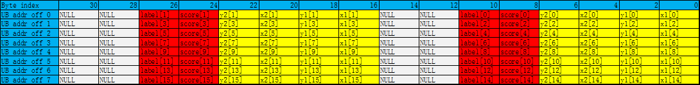
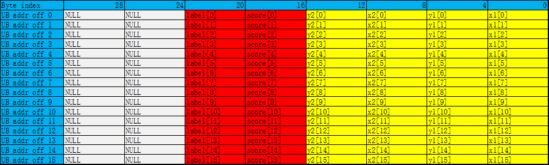

# ProposalConcat

> **Section**: 6.2.3.3.9.1  
> **PDF Pages**: 1460–1463  

---

<!-- page 1460 -->

约束说明

●操作数地址对齐要求请参见通用地址对齐约束。

●mask仅控制目的操作数中的哪些元素要写入，源操作数的读取与mask无关。

●count表示写入目的操作数中的元素总数，源操作数的读取与count无关。

调用示例

样例的srcLocal和dstLocal均为half类型。

更多样例可参考LINK。

●tensor高维切分计算样例-mask连续模式uint64_t mask = 256 / sizeof(half);uint8_t padMode = 0;bool padSide = false;// repeatTime = 4, 128 elements one repeat, 512 elements total// dstBlkStride, srcBlkStride = 1, no gap between blocks in one repeat// dstRepStride, srcRepStride = 8, no gap between repeatsAscendC::VectorPadding(dstLocal, srcLocal, padMode, padSide, mask, 4, { 1, 1, 8, 8 });

●tensor高维切分计算样例-mask逐bit模式uint64_t mask[2] = { UINT64_MAX, UINT64_MAX };uint8_t padMode = 0;bool padSide = false;// repeatTime = 4, 128 elements one repeat, 512 elements total// dstBlkStride, srcBlkStride = 1, no gap between blocks in one repeat// dstRepStride, srcRepStride = 8, no gap between repeatsAscendC::VectorPadding(dstLocal, srcLocal, padMode, padSide, mask, 4, { 1, 1, 8, 8 });

●tensor前n个数据计算样例uint8_t padMode = 0;bool padSide = false;AscendC::VectorPadding(dstLocal, srcLocal, padMode, padSide, 512);

结果示例如下：// 以srcLocal的一个datablock的值为例，有16个数输入数据(srcLocal): [6.938 -8.86 -0.2263 ... 1.971 1.778]输出数据(dstLocal): [6.938 6.938 6.938 ... 6.938 6.938]

## 6.2.3.3.9 排序组合（ISASI）

## 6.2.3.3.9.1 ProposalConcat

产品支持情况

产品是否支持

Atlas 350 加速卡x

Atlas A3 训练系列产品/Atlas A3 推理系列产品x

Atlas A2 训练系列产品/Atlas A2 推理系列产品x

Atlas 200I/500 A2 推理产品x

Atlas 推理系列产品AI Core√

Atlas 推理系列产品Vector Corex

<!-- page 1461 -->

产品是否支持

Atlas 训练系列产品√

功能说明

将连续元素合入Region Proposal内对应位置，每次迭代会将16个连续元素合入到16个Region Proposals的对应位置里。

**Region Proposal说明：**

目前仅支持两种数据类型：half、float。

每个Region Proposal占用连续8个half/float类型的元素，约定其格式：[x1, y1, x2, y2, score, label, reserved_0, reserved_1]

对于数据类型half，每一个Region Proposal占16Bytes，Byte[15:12]是无效数据，Byte[11:0]包含6个half类型的元素，其中Byte[11:10]定义为label，Byte[9:8]定义为score，Byte[7:6]定义为y2，Byte[5:4]定义为x2，Byte[3:2]定义为y1，Byte[1:0]定义为x1。

如下图所示，总共包含16个Region Proposals。



对于数据类型float，每一个Region Proposal占32Bytes，Byte[31:24]是无效数据，Byte[23:0]包含6个float类型的元素，其中Byte[23:20]定义为label，Byte[19:16]定义为score，Byte[15:12]定义为y2，Byte[11:8]定义为x2，Byte[7:4]定义为y1，Byte[3:0]定义为x1。

如下图所示，总共包含16个Region Proposals。



函数原型

```cpp
template <typename T>__aicore__ inline void ProposalConcat(const LocalTensor<T>& dst, const LocalTensor<T>& src, const int32_t repeatTime, const int32_t modeNumber)
```

<!-- page 1462 -->

参数说明

表6-420模板参数说明

参数名描述

T操作数数据类型。

Atlas 训练系列产品，支持的数据类型为：half

Atlas 推理系列产品AI Core，支持的数据类型为：half/float

表6-421参数说明

参数名称输入/输出

含义

dst输出目的操作数。

类型为LocalTensor，支持的TPosition为VECIN/VECCALC/VECOUT。

LocalTensor的起始地址需要32字节对齐。

src输入源操作数。

类型为LocalTensor，支持的TPosition为VECIN/VECCALC/VECOUT。

LocalTensor的起始地址需要32字节对齐。

源操作数的数据类型需要与目的操作数保持一致。

repeatTime

输入重复迭代次数，int32_t类型，每次迭代完成16个元素合入到16个Region Proposals里，下次迭代跳至相邻的下一组16个Region Proposals和下一组16个元素。取值范围：repeatTime∈[0,255]。

modeNumber

输入合入位置参数，取值范围：modeNumber∈[0, 5]，int32_t类型，仅限于以下配置：

●0 – 合入x1

●1 – 合入y1

●2 – 合入x2

●3 – 合入y2

●4 – 合入score

●5 – 合入label

返回值说明

无

<!-- page 1463 -->

约束说明

●用户需保证dst中存储的proposal数目大于等于实际所需数目，否则会存在tensor越界错误。

●用户需保证src中存储的元素大于等于实际所需数目，否则会存在tensor越界错误。

●操作数地址对齐要求请参见通用地址对齐约束。

调用示例

●接口使用样例// repeatTime = 2, modeNumber = 4, 把32个数合入到32个Region Proposal中的score域中AscendC::ProposalConcat(dstLocal, srcLocal, 2, 4);

示例结果输入数据(src_gm):[ 33.3    67.56   68.5   -11.914  25.19  -72.8    11.79  -49.47   49.44  84.4   -14.36   45.97   52.47   -5.387 -13.12  -88.9    54.    -51.62 -20.67   59.56   35.72   -6.12  -39.4   -11.46   -7.066  30.23  -11.18 -35.84  -40.88   60.9   -73.3    38.47 ]输出数据(dst_gm):因为moodel=4，第一个元素33.3的起始位置是4。每个Region Proposal占用连续8个half/float类型的元素。这里使用的类型是half。后续被插入的每个元素间隔8个元素。repeat为2，每次迭代完成16个元素，共计32个元素[ 0.      0.      0.      0.   33.3    0.      0.      0.      0.      0.      0.      0.  67.56   0.      0.      0.      0.      0.      0.      0.  68.5    0.      0.      0.      0.      0.      0.      0.  -11.914 0.      0.      0.      0.      0.      0.      0.  25.19   0.      0.      0.      0.      0.      0.      0.  -72.8   0.      0.      0.      0.      0.      0.      0.  11.79   0.      0.      0.      0.      0.      0.      0.  -49.47  0.      0.      0.      0.      0.      0.      0.  49.44   0.      0.      0.      0.      0.      0.      0.  84.4    0.      0.      0.      0.      0.      0.      0.  -14.36  0.      0.      0.      0.      0.      0.      0.  45.97   0.      0.      0.      0.      0.      0.      0.  52.47   0.      0.      0.      0.      0.      0.      0.  -5.387  0.      0.      0.      0.      0.      0.      0.  -13.12  0.      0.      0.      0.      0.      0.      0.  -88.9   0.      0.      0.      0.      0.      0.      0.  54.     0.      0.      0.      0.      0.      0.      0.  -51.62  0.      0.      0.      0.      0.      0.      0. -20.67   0.      0.      0.      0.      0.      0.      0. 59.56    0.      0.      0.      0.      0.      0.      0. 35.72    0.      0.      0.      0.      0.      0.      0. -6.12    0.      0.      0.      0.      0.      0.      0. -39.4    0.      0.      0.      0.      0.      0.      0. -11.46   0.      0.      0.      0.      0.      0.      0. -7.066   0.      0.      0.      0.      0.      0.      0. 30.23    0.      0.      0.      0.      0.      0.      0. -11.18   0.      0.      0.      0.      0.      0.      0. -35.84   0.      0.      0.      0.      0.      0.      0. -40.88   0.      0.      0.      0.      0.      0.      0. 60.9     0.      0.      0.      0.      0.      0.      0. -73.3    0.      0.      0.      0.      0.      0.      0. 38.47    0.      0.      0.  ]
