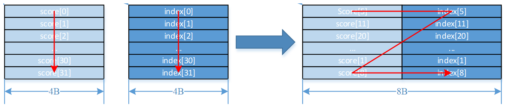
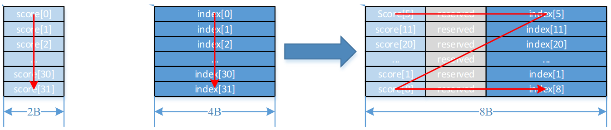

# Sort32

> **Section**: 6.2.3.3.9.5  
> **PDF Pages**: 1473–1474  

---

<!-- page 1473 -->

## 6.2.3.3.9.5 Sort32

产品支持情况

产品是否支持

Atlas 350 加速卡√

Atlas A3 训练系列产品/Atlas A3 推理系列产品√

Atlas A2 训练系列产品/Atlas A2 推理系列产品√

Atlas 200I/500 A2 推理产品√

Atlas 推理系列产品AI Corex

Atlas 推理系列产品Vector Corex

Atlas 训练系列产品x

功能说明

排序函数，一次迭代可以完成32个数的排序，数据需要按如下描述结构进行保存：

score和index分别存储在src0和src1中，按score进行排序（score大的排前面），排序好的score与其对应的index一起以（score, index）的结构存储在dst中。不论score为half还是float类型，dst中的（score, index）结构总是占据8Bytes空间。

如下所示：

●当score为float，index为uint32_t类型时，计算结果中index存储在高4Bytes，score存储在低4Bytes。



●当score为half，index为uint32_t类型时，计算结果中index存储在高4Bytes，score存储在低2Bytes，中间的2Bytes保留。



函数原型

```cpp
template <typename T>__aicore__ inline void Sort32(const LocalTensor<T>& dst, const LocalTensor<T>& src0, const LocalTensor<uint32_t>& src1, const int32_t repeatTime)
```

<!-- page 1474 -->

参数说明

表6-429模板参数说明

参数名描述

T操作数数据类型。

Atlas 350 加速卡，支持的数据类型为：half/float

Atlas A3 训练系列产品/Atlas A3 推理系列产品，支持的数据类型为：half/float

Atlas A2 训练系列产品/Atlas A2 推理系列产品，支持的数据类型为：half/float

Atlas 200I/500 A2 推理产品，支持的数据类型为：half/float

表6-430参数说明

参数名称输入/输出

含义

dst输出目的操作数。

类型为LocalTensor，支持的TPosition为VECIN/VECCALC/VECOUT。

LocalTensor的起始地址需要32字节对齐。

src0输入源操作数。

类型为LocalTensor，支持的TPosition为VECIN/VECCALC/VECOUT。

LocalTensor的起始地址需要32字节对齐。

此源操作数的数据类型需要与目的操作数保持一致。

src1输入源操作数。

类型为LocalTensor，支持的TPosition为VECIN/VECCALC/VECOUT。

LocalTensor的起始地址需要32字节对齐。

此源操作数固定为uint32_t数据类型。

repeatTime

输入重复迭代次数，int32_t类型，每次迭代完成32个元素的排序，下次迭代src0和src1各跳过32个elements，dst跳过32*8Byte空间。取值范围：repeatTime∈[0,255]。

返回值说明

无

约束说明

●当存在score[i]与score[j]相同时，如果i>j，则score[j]将首先被选出来，排在前面。
