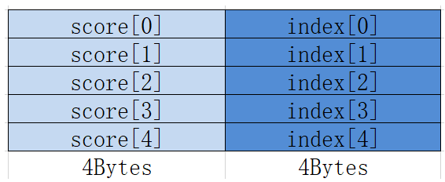
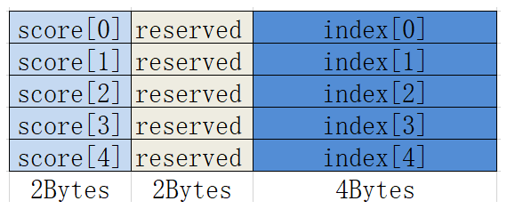

# MrgSort

> **Section**: 6.2.3.3.9.6  
> **PDF Pages**: 1475–1477  

---

<!-- page 1475 -->

●每次迭代内的数据会进行排序，不同迭代间的数据不会进行排序。

●操作数地址对齐要求请参见通用地址对齐约束。

调用示例

AscendC::LocalTensor<float> srcLocal0 = inQueueSrc0.DeQue<float>();AscendC::LocalTensor<uint32_t> srcLocal1 = inQueueSrc1.DeQue<uint32_t>();AscendC::LocalTensor<float> dstLocal = outQueueDst.AllocTensor<float>();// repeatTime = 4, 对128个数分成4组进行排序，每次完成1组32个数的排序AscendC::Sort32<float>(dstLocal, srcLocal0, srcLocal1, 4);outQueueDst.EnQue<float>(dstLocal);inQueueSrc0.FreeTensor(srcLocal0);inQueueSrc1.FreeTensor(srcLocal1);

## 6.2.3.3.9.6 MrgSort

产品支持情况

产品是否支持

Atlas 350 加速卡√

Atlas A3 训练系列产品/Atlas A3 推理系列产品√

Atlas A2 训练系列产品/Atlas A2 推理系列产品√

Atlas 200I/500 A2 推理产品√

Atlas 推理系列产品AI Corex

Atlas 推理系列产品Vector Corex

Atlas 训练系列产品x

功能说明

将已经排好序的最多4条队列，合并排列成1条队列，结果按照score域由大到小排序。

MrgSort指令处理的数据一般是经过Sort32指令处理后的数据，也就是Sort32指令的输出，队列的结构如下所示：

●数据类型为float，每个结构占据8Bytes。



<!-- page 1476 -->

●数据类型为half，每个结构也占据8Bytes，中间有2Bytes保留。



函数原型

```cpp
template <typename T>__aicore__ inline void MrgSort(const LocalTensor<T>& dst, const MrgSortSrcList<T>& src, const MrgSort4Info& params)
```

参数说明

表6-431模板参数说明

参数名描述

TAtlas 350 加速卡，支持的数据类型为：half/float

Atlas A3 训练系列产品/Atlas A3 推理系列产品，支持的数据类型为：half/float

Atlas A2 训练系列产品/Atlas A2 推理系列产品，支持的数据类型为：half/float

Atlas 200I/500 A2 推理产品，支持的数据类型为：half/float

表6-432接口参数说明

参数名称输入/输出

含义

dst输出目的操作数，存储经过排序后的数据。

类型为LocalTensor，支持的TPosition为VECIN/VECCALC/VECOUT。

LocalTensor的起始地址需要32字节对齐。

<!-- page 1477 -->

参数名称输入/输出

含义

src输入源操作数，4个队列，并且每个队列都已经排好序，类型为MrgSortSrcList结构体，定义如下：template <typename T> struct MrgSortSrcList {    __aicore__ MrgSortSrcList() {}    __aicore__ MrgSortSrcList(const LocalTensor<T>& src1In, const LocalTensor<T>& src2In, const LocalTensor<T>& src3In,        const LocalTensor<T>& src4In)    {        src1 = src1In[0];        src2 = src2In[0];        src3 = src3In[0];        src4 = src4In[0];    }    LocalTensor<T> src1; // 第一个已经排好序的队列    LocalTensor<T> src2; // 第二个已经排好序的队列    LocalTensor<T> src3; // 第三个已经排好序的队列    LocalTensor<T> src4; // 第四个已经排好序的队列};

源操作数的数据类型与目的操作数保持一致。src1、src2、src3、src4类型为LocalTensor，支持的TPosition为VECIN/VECCALC/VECOUT。LocalTensor的起始地址需要8字节对齐。

params输入排序所需参数，类型为MrgSort4Info结构体。

具体定义请参考${INSTALL_DIR}/include/ascendc/basic_api/interface/kernel_struct_proposal.h，${INSTALL_DIR}请替换为CANN软件安装后文件存储路径。

参数说明请参考表6-433。

表6-433 MrgSort4Info 参数说明

参数名称含义

elementLengths

四个源队列的长度（8Bytes结构的数目），类型为长度为4的uint16_t数据类型的数组，理论上每个元素取值范围[0, 4095]，但不能超出UB的存储空间。

ifExhaustedSuspension

某条队列耗尽后，指令是否需要停止，类型为bool，默认false。

validBit有效队列个数，取值如下：

●3：前两条队列有效

●7：前三条队列有效

●15：四条队列全部有效
