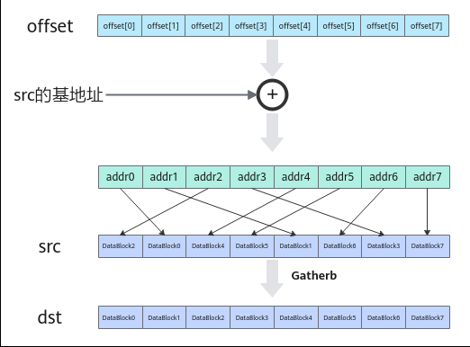

# Gatherb(ISASI)

> **Section**: 6.2.3.3.10.2  
> **PDF Pages**: 1485–1487  

---

<!-- page 1485 -->

●tensor高维切分计算样例-mask逐bit模式uint64_t mask[2] = { 0xFFFFFFFFFFFFFFFF, 0xFFFFFFFFFFFFFFFF };// repeatTime = 4, 128 elements one repeat, 512 elements total// srcLocal数据类型为half，srcOffsetLocal数据类型为uint32_t，dstLocal数据类型为half// srcBaseAddr = 0, srcLocal的起始基地址为0// dstRepStride = 8, no gap between repeats AscendC::Gather(dstLocal, srcLocal, srcOffsetLocal, (uint32_t)0, mask, 4, 8);

●tensor前n个数据计算样例uint32_t count = 512;    // 参与计算的元素个数// srcLocal数据类型为half，srcOffsetLocal数据类型为uint32_t，dstLocal数据类型为half// srcBaseAddr = 0, srcLocal的起始基地址为0AscendC::Gather(dstLocal, srcLocal, srcOffsetLocal, (uint32_t)0, count);

结果示例如下：

输入数据srcOffsetLocal:[254 252 250 ... 4 2 0]输入数据srcLocal（128个half类型数据）: [0 1 2 ... 125 126 127]输出数据(dstLocal)初始值:[0. 0. 0. 0. 0. 0. ... 0.]进行Gather计算后，输出数据(dstLocal):[127 126 125 ... 2 1 0]

## 6.2.3.3.10.2 Gatherb(ISASI)

产品支持情况

产品是否支持

Atlas 350 加速卡√

Atlas A3 训练系列产品/Atlas A3 推理系列产品√

Atlas A2 训练系列产品/Atlas A2 推理系列产品√

Atlas 200I/500 A2 推理产品√

Atlas 推理系列产品AI Corex

Atlas 推理系列产品Vector Corex

Atlas 训练系列产品x

功能说明

给定一个输入的张量和一个地址偏移张量，本接口根据偏移地址按照DataBlock的粒度将输入张量收集到结果张量中。

<!-- page 1486 -->



函数原型

```cpp
template <typename T>__aicore__ inline void Gatherb(const LocalTensor<T>& dst, const LocalTensor<T>& src0, const LocalTensor<uint32_t>& offset, const uint8_t repeatTime, const GatherRepeatParams& repeatParams)
```

参数说明

表6-437模板参数说明

参数名描述

T操作数数据类型。

Atlas 350 加速卡，支持的数据类型为：int8_t/uint8_t/int16_t/uint16_t/int32_t/uint32_t/half/float/bfloat16_t/uint64_t/int64_t

Atlas A3 训练系列产品/Atlas A3 推理系列产品，支持的数据类型为：uint16_t/uint32_t

Atlas A2 训练系列产品/Atlas A2 推理系列产品，支持的数据类型为：uint16_t/uint32_t

Atlas 200I/500 A2 推理产品，支持的数据类型为：int8_t/uint8_t/int16_t/uint16_t/half/float/int32_t/uint32_t/bfloat16_t/int64_t

<!-- page 1487 -->

表6-438参数说明

参数名称输入/输出

含义

dst输出目的操作数。

类型为LocalTensor，支持的TPosition为VECIN/VECCALC/VECOUT。

LocalTensor的起始地址需要32字节对齐。

src0输入源操作数。

类型为LocalTensor，支持的TPosition为VECIN/VECCALC/VECOUT。

LocalTensor的起始地址需要32字节对齐。

源操作数的数据类型需要与目的操作数保持一致。

offset输入每个datablock在源操作数中对应的地址偏移。

类型为LocalTensor，支持的TPosition为VECIN/VECCALC/VECOUT。

LocalTensor的起始地址需要32字节对齐。

该偏移量是相对于src0的基地址而言的。每个元素值要大于等于0，单位为字节；且需要保证偏移后的地址满足32字节对齐。

repeatTime

输入重复迭代次数，每次迭代完成8个datablock的数据收集，数据范围：repeatTime∈（0,255]。

repeatParams

输入用于控制指令迭代的相关参数。

类型为GatherRepeatParams，具体定义可参考${INSTALL_DIR}/include/ascendc/basic_api/interface/kernel_struct_gather.h。${INSTALL_DIR}请替换为CANN软件安装后文件存储路径。

其中dstBlkStride、dstRepStride支持用户配置，参数说明参考表6-439。

表6-439 GatherRepeatParams 结构体参数说明

参数名称含义

dstBlkStride

单次迭代内，矢量目的操作数不同datablock间的地址步长。

dstRepStride

相邻迭代间，矢量目的操作数相同datablock间的地址步长。

blockNumber

预留参数。为后续的功能做保留，开发者暂时无需关注，使用默认值即可。

src0BlkStride
