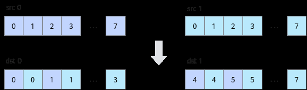

# Interleave

> **Section**: 6.2.3.3.13.1  
> **PDF Pages**: 1501–1501  

---

<!-- page 1501 -->

## 6.2.3.3.13.1 Interleave

产品支持情况

产品是否支持

Atlas 350 加速卡√

Atlas A3 训练系列产品/Atlas A3 推理系列产品x

Atlas A2 训练系列产品/Atlas A2 推理系列产品x

Atlas 200I/500 A2 推理产品x

Atlas 推理系列产品AI Corex

Atlas 推理系列产品Vector Corex

Atlas 训练系列产品x

功能说明

给定源操作数src0和src1，将src0和src1中的元素交织存入结果操作数dst0和dst1中。交织排列方式如下图所示，其中每个方格代表一个元素。



函数原型

```cpp
template <typename T>__aicore__ inline void Interleave(const LocalTensor<T>& dst0, const LocalTensor<T>& dst1, const LocalTensor<T>& src0, const LocalTensor<T>& src1, const int32_t count)
```

参数说明

表6-446模板参数说明

参数名描述

T操作数数据类型。
