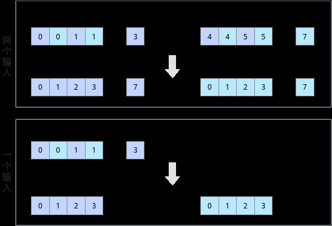

# DeInterleave

> **Section**: 6.2.3.3.13.2  
> **PDF Pages**: 1502–1504  

---

<!-- page 1502 -->

表6-447参数说明

参数名输入/输出描述

dst0/dst1输出目的操作数。

类型为LocalTensor，支持的TPosition为VECIN/VECCALC/VECOUT。

LocalTensor的起始地址需要32字节对齐。

Atlas 350 加速卡，支持的数据类型为：uint8_t/int8_t/uint16_t/int16_t/half/bfloat16_t/uint32_t/int32_t/float/uint64_t/int64_t

src0/src1输入源操作数。

类型为LocalTensor，支持的TPosition为VECIN/VECCALC/VECOUT。

LocalTensor的起始地址需要32字节对齐。

源操作数的数据类型需要与目的操作数保持一致。

Atlas 350 加速卡，支持的数据类型为：uint8_t/int8_t/uint16_t/int16_t/half/bfloat16_t/uint32_t/int32_t/float/uint64_t/int64_t

count输入输入/输出数据元素个数，dst0/dst1/src0/src1长度大小均为count。count必须为偶数。

返回值说明

无

约束说明

无

调用示例

本样例中只展示Compute流程中的部分代码。AscendC::Interleave(dst0Local, dst1Local, src0Local, src1Local, 512);

结果示例如下：

输入数据src0Local：[1 2 3 ... 512]输入数据src1Local：[513 514 515 ... 1024]输出数据dst0Local：[1 513 2 ... 768]输出数据dst1Local：[257 769 258 ... 1024]

## 6.2.3.3.13.2 DeInterleave

产品支持情况

产品是否支持

Atlas 350 加速卡√

<!-- page 1503 -->

产品是否支持

Atlas A3 训练系列产品/Atlas A3 推理系列产品x

Atlas A2 训练系列产品/Atlas A2 推理系列产品x

Atlas 200I/500 A2 推理产品x

Atlas 推理系列产品AI Corex

Atlas 推理系列产品Vector Corex

Atlas 训练系列产品x

功能说明

给定源操作数src0和src1，将src0和src1中的元素解交织存入结果操作数dst0和dst1中。解交织排列方式如下图所示，其中每个方格代表一个元素。

函数原型

●两个输入template <typename T>__aicore__ inline void DeInterleave(const LocalTensor<T>& dst0, const LocalTensor<T>& dst1, const LocalTensor<T>& src0, const LocalTensor<T>& src1, const int32_t count)

●一个输入template <typename T>__aicore__ inline void DeInterleave(const LocalTensor<T>& dst0, const LocalTensor<T>& dst1, const LocalTensor<T>& src, const int32_t srcCount)

<!-- page 1504 -->

参数说明

表6-448模板参数说明

参数名描述

T操作数数据类型。

表6-449参数说明

参数名输入/输出

描述

dst0/dst1输出目的操作数。

类型为LocalTensor，支持的TPosition为VECIN/VECCALC/VECOUT。

LocalTensor的起始地址需要32字节对齐。

Atlas 350 加速卡，支持的数据类型为：uint8_t/int8_t/uint16_t/int16_t/half/bfloat16_t/uint32_t/int32_t/float/uint64_t/int64_t

src/src0/src1

输入源操作数。

类型为LocalTensor，支持的TPosition为VECIN/VECCALC/VECOUT。

LocalTensor的起始地址需要32字节对齐。

源操作数的数据类型需要与目的操作数保持一致。

Atlas 350 加速卡，支持的数据类型为：uint8_t/int8_t/uint16_t/int16_t/half/bfloat16_t/uint32_t/int32_t/float/uint64_t/int64_t

count输入输入/输出数据元素个数，dst0/dst1/src0/src1长度大小为count。count必须为偶数。

srcCount输入输入数据元素个数，两个输出的大小都为输入的一半。srcCount必须为偶数。

返回值说明

无

约束说明

无

调用示例

本样例中只展示Compute流程中的部分代码。
