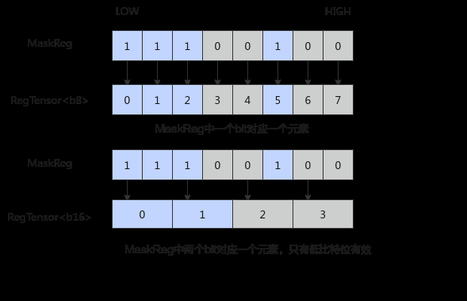

# MaskReg

> **Section**: 6.2.3.4.1.2  
> **PDF Pages**: 1506–1507  

---

<!-- page 1506 -->

模板参数regTrait

支持的数据类型宽度

RegTraitNumOne

Atlas 350 加速卡，支持的数据类型宽度为：b8/b16/b32/b64。

RegTraitNumTwo

Atlas 350 加速卡，支持的数据类型宽度为：b64/complex32。

支持的型号

Atlas 350 加速卡（VL=256B）

约束说明

无

调用示例

●示例一AscendC::Reg::RegTensor<uint32_t> reg;AscendC::Reg::MaskReg mask = AscendC::Reg::CreateMask<uint32_t>();AscendC::Reg::LoadAlign(reg, src, 0);AscendC::Reg::Adds(reg, reg, 1);AscendC::Reg::StoreAlign(dst, reg, 0, mask);

●示例二// 针对B64,可以传入RegTraitNumTwotemplate<typename T, const AscendC::Reg::RegTrait& Trait = AscendC::Reg::RegTraitNumOne>__simd_vf__ inline void AddVF(__ubuf__ T* dstAddr, __ubuf__ T* src0Addr, __ubuf__ T* src1Addr, uint32_t count, uint32_t oneRepeatSize, uint16_t repeatTimes){    AscendC::Reg::RegTensor<T,Trait> srcReg0;    AscendC::Reg::RegTensor<T,Trait> srcReg1;    AscendC::Reg::RegTensor<T,Trait> dstReg;    AscendC::Reg::MaskReg mask;    for (uint16_t i = 0; i < repeatTimes; i++) {        mask = AscendC::Reg::UpdateMask<T,Trait>(count);        AscendC::Reg::LoadAlign(srcReg0, src0Addr + i * oneRepeatSize);        AscendC::Reg::LoadAlign(srcReg1, src1Addr + i * oneRepeatSize);        AscendC::Reg::Add(dstReg, srcReg0, srcReg1, mask);        AscendC::Reg::StoreAlign(dstAddr + i * oneRepeatSize, dstReg, mask);    }}

## 6.2.3.4.1.2 MaskReg

功能说明

MaskReg用于指示在计算过程中哪些元素参与计算，宽度为RegTensor的八分之一（VL/8）。

<!-- page 1507 -->



函数原型

```cpp
template <typename T, MaskPattern mode = MaskPattern::ALL, const RegTrait& regTrait = RegTraitNumOne>__simd_callee__ inline MaskReg CreateMask();
template <typename T, const RegTrait& regTrait = RegTraitNumOne>__simd_callee__ inline MaskReg UpdateMask(uint32_t& scalarValue);
```

参数说明

表6-450参数说明

参数名输入/输出描述

T输入模板参数，支持的数据类型为b8/b16/b32/b64。

mode输入创建MaskReg的模式，enum class类型。enum class MaskPattern {    ALL,      // 所有元素设置为True    VL1,      // 最低1个元素    VL2,      // 最低2个元素    VL3,      // 最低3个元素    VL4,      // 最低4个元素    VL8,      // 最低8个元素    VL16,     // 最低16个元素    VL32,     // 最低32个元素    VL64,     // 最低64个元素    VL128,    // 最低128个元素    M3,       // 3的倍数    M4,       // 4的倍数    H,        // 最低一半元素    Q,        // 最低四分之一元素    ALLF = 15 // 所有元素设置为false};
