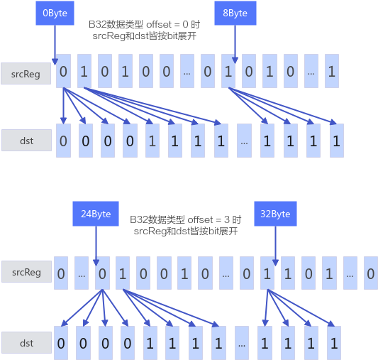

# MaskReg搬入

> **Section**: 6.2.3.4.3.7  
> **PDF Pages**: 1533–1537  

---

<!-- page 1533 -->

调用示例

// 连续非对齐搬出使用 uint32_t 存储偏移量场景template <typename T>__simd_vf__ inline void StoreUnAlignVF(__ubuf__ T* dstAddr, __ubuf__ T* srcAddr, uint32_t postUpdateStride, uint16_t repeatTimes){    AscendC::Reg::RegTensor<T> srcReg;    AscendC::Reg::UnalignRegForLoad ureg0;    AscendC::Reg::UnalignRegForStore ureg1;    for (uint16_t i = 0; i < repeatTimes; ++i) {        AscendC::Reg::LoadUnAlignPre(ureg0, srcAddr + i * postUpdateStride);        AscendC::Reg::LoadUnAlign(srcReg, ureg0, srcAddr + i * postUpdateStride);        AscendC::Reg::StoreUnAlign(dstAddr, srcReg, ureg1, postUpdateStride);    }    AscendC::Reg::StoreUnAlignPost(dstAddr, ureg1, 0);}

// 连续非对齐搬出使用 AddrReg 存储偏移量场景template <typename T>__simd_vf__ inline void StoreUnAlignVF(__ubuf__ T* dstAddr, __ubuf__ T* srcAddr, uint32_t oneRepeatSize, uint16_t repeatTimes){    AscendC::Reg::RegTensor<T> srcReg;        AscendC::Reg::UnalignRegForLoad ureg0;    AscendC::Reg::UnalignRegForStore ureg1;    AscendC::Reg::AddrReg aReg;    for (uint16_t i = 0; i < (uint16_t)repeatTimes; ++i) {        aReg = AscendC::Reg::CreateAddrReg<T>(i, oneRepeatSize);        AscendC::Reg::LoadUnAlignPre(ureg0, srcAddr, aReg);        AscendC::Reg::LoadUnAlign(srcReg, ureg0, srcAddr, aReg, 0);        AscendC::Reg::StoreUnAlign(dstAddr, srcReg, ureg1, aReg);    }    AscendC::Reg::StoreUnAlignPost(dstAddr, ureg1, aReg);}

// 配合Squeeze使用，连续非对齐搬出，SqueezeReg矢量计算API会存储有效元素的总字节数到AR寄存器，使用AR寄存器中效元素个数作为存储偏移量template <typename T>__aicore__ inline void SqueezeVF(__ubuf__ T* dstAddr, __ubuf__ T* srcAddr, uint32_t oneRepeatSize, uint16_t repeatTimes){    AscendC::Reg::RegTensor<T> srcReg0;    AscendC::Reg::RegTensor<T> srcReg1;    AscendC::Reg::UnalignRegForStore ureg;    AscendC::Reg::MaskReg mask = AscendC::Reg::CreateMask<T, AscendC::Reg::MaskPattern::H>();    for (uint16_t i = 0; i < repeatTimes; ++i) {        AscendC::Reg::LoadAlign<T, AscendC::Reg::PostLiteral::POST_MODE_UPDATE>(srcReg0, srcAddr, oneRepeatSize);        AscendC::Reg::Squeeze<T, AscendC::Reg::GatherMaskMode::STORE_REG>(srcReg1, srcReg0, mask);        AscendC::Reg::StoreUnAlign<T, AscendC::Reg::PostLiteral::POST_MODE_UPDATE>(dstAddr, srcReg1, ureg);     }     AscendC::Reg::StoreUnAlignPost(dstAddr, ureg);}

## 6.2.3.4.3.7 MaskReg 搬入

产品支持情况

产品是否支持

Atlas 350 加速卡√

Atlas A3 训练系列产品/Atlas A3 推理系列产品x

<!-- page 1534 -->

产品是否支持

Atlas A2 训练系列产品/Atlas A2 推理系列产品x

Atlas 200I/500 A2 推理产品x

Atlas 推理系列产品AI Corex

Atlas 推理系列产品Vector Corex

Atlas 训练系列产品x

功能说明

Reg矢量计算数据搬运接口，适用于从UB或RegTensor搬入MaskReg。

函数原型

// MaskReg搬入使用 AddrReg 存储偏移量template <typename T, MaskDist dist = MaskDist::DIST_NORM>__simd_callee__ inline void LoadAlign(MaskReg& mask, __ubuf__ T* srcAddr, AddrReg offset);// MaskReg搬入POST_MODE_NORMAL 场景template <typename T, MaskDist dist = MaskDist::DIST_NORM>__simd_callee__ inline void LoadAlign(MaskReg& mask, __ubuf__ T* srcAddr);// MaskReg搬入POST_MODE_UPDATE 场景template <typename T, PostLiteral postMode, MaskDist dist = MaskDist::DIST_NORM>__simd_callee__ inline void LoadAlign(MaskReg& mask, __ubuf__ T* &srcAddr, int32_t offset);// MaskReg从RegTensor搬入template <typename T = DefaultType, int16_t offset, typename U>__simd_callee__ inline void MaskGenWithRegTensor(MaskReg& dst, U& srcReg);

参数说明

表6-477 MaskReg 搬入使用AddrReg 存储偏移量参数说明

参数名输入/输出

描述

T输入操作数数据类型。支持的数据类型为b8/b16/b32。

dist输入搬运模式， MaskDist类型。取值如下：

●DIST_NORM，对齐约束为VL/8Byte，正常模式，搬运VL/8Byte数据。

●DIST_US，对齐约束为VL/16Byte，上采样模式，搬运VL/16Byte数据，每bit重复一次。

●DIST_DS，对齐约束为min(32, VL/4)Byte，下采样模式，搬运VL/4Byte数据，每间隔1bit被舍弃。

mask输出目的操作数，类型为MaskReg。

srcAddr输入/输出

源操作数在UB上的起始地址。

offset输入实际搬运UB起始地址为 srcAddr + offset。

<!-- page 1535 -->

表6-478 MaskReg 搬入POST_MODE_NORMAL 场景参数说明

参数名输入/输出

描述

T输入操作数数据类型。支持的数据类型为b8/b16/b32/b64。

dist输入搬运模式， MaskDist类型。取值如下：

●DIST_NORM，对齐约束为VL/8Byte，正常模式，搬运VL/8Byte数据。

●DIST_US，对齐约束为VL/16Byte，上采样模式，搬运VL/16Byte数据，每bit重复一次。

●DIST_DS，对齐约束为min(32, VL/4)Byte，下采样模式，搬运VL/4Byte数据，每间隔1bit被舍弃。

mask输出目的操作数，类型为MaskTensor。

srcAddr输入/输出

源操作数在UB上的起始地址。

表6-479 MaskReg 搬入POST_MODE_UPDATE 场景参数说明

参数名输入/输出

描述

T输入操作数数据类型。支持的数据类型为b8/b16/b32/b64。

dist输入搬运模式， MaskDist类型。取值如下：

●DIST_NORM，对齐约束为VL/8Byte，正常模式，搬运VL/8Byte数据。

●DIST_US，对齐约束为VL/16Byte，上采样模式，搬运VL/16Byte数据，每bit重复一次。

●DIST_DS，对齐约束为min(32, VL/4)Byte，下采样模式，搬运VL/4Byte数据，每间隔1bit被舍弃。

postMode

输入用于控制是否使能post update。

●POST_MODE_NORMAL，正常场景，UB操作数地址不更新。

●POST_MODE_UPDATE，POST_MODE_UPDATE场景使用，UB地址同时作为输入和输出，每次调用会更新。

mask输出目的操作数，类型为MaskTensor。

srcAddr输入/输出

源操作数在UB上的起始地址。

<!-- page 1536 -->

参数名输入/输出

描述

offset输入当offset为int32_t类型时，POST_MODE_NORMAL与POST_MODE_UPDATE含义不一致。

●POST_MODE_NORMAL 场景：实际搬运UB起始地址为srcAddr + offset。

●POST_MODE_UPDATE 场景：实际搬运UB起始地址为srcAddr，搬运后执行地址更新 srcAddr += offset。

表6-480 MaskReg 从RegTensor 搬入参数说明

参数名输入/输出

描述

T输入操作数数据类型。支持的数据类型为b16/b32。

U输入源操作数的RegTensor类型，例如RegTensor<half>，由编译器自动推导，用户不需要填写。

dst输出目的操作数，类型为MaskTensor。

srcReg输入源操作数，类型为RegTensor。

offset输入offset决定了srcReg中数据搬运的起始地址，当数据类型为T为b16时，计算公式为offset* 16，由于VL为256Byte，因此此时offset取值范围为0-15，同理，T为b32数据类型时，计算公式为offset* 8，offset的取值范围为0-31。

当数据类型为B16时，dst[i] = srcReg[offset*VL/16 + i/2]，按bit位进行计算。

当数据类型为B32时，dst[i] = srcReg[offset*VL/32 + i/4],，按bit位进行计算。

<!-- page 1537 -->

图6-46 Offset 功能示意图



返回值说明

无

约束说明

无

调用示例

```cpp
template <typename T>__simd_vf__ inline void LoadAlignVF(__ubuf__ T* dstAddr, __ubuf__ T* srcAddr, uint32_t count, uint32_t oneRepeatSize, uint16_t repeatTimes){    AscendC::Reg::MaskReg mask;;
    for (uint16_t i = 0;
 i < repeatTimes; ++i) {        mask = AscendC::Reg::UpdateMask<T>(count);
        AscendC::Reg::AddrReg offset = AscendC::Reg::CreateAddrReg<T>(i, oneRepeatSize);
        AscendC::Reg::LoadAlign(mask, srcAddr, offset);
        AscendC::Reg::StoreAlign(dstAddr, mask, offset);    }}
template <typename T, int16_t offset>
```
