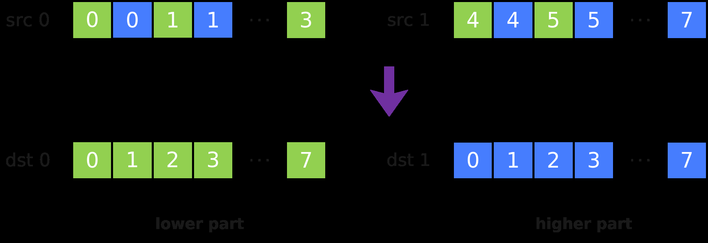

# DeInterleave

> **Section**: 6.2.3.4.4.3  
> **PDF Pages**: 1546–1547  

---

<!-- page 1546 -->

```cpp
AscendC::Reg::StoreAlign(dstAddr + i * oneRepeatSize, srcReg, mask);    }}
```

## 6.2.3.4.4.3 DeInterleave

产品支持情况

产品是否支持

Atlas 350 加速卡√

Atlas A3 训练系列产品/Atlas A3 推理系列产品x

Atlas A2 训练系列产品/Atlas A2 推理系列产品x

Atlas 200I/500 A2 推理产品x

Atlas 推理系列产品AI Corex

Atlas 推理系列产品Vector Corex

Atlas 训练系列产品x

功能说明

将源操作数src0和src1中的元素解交织存入目的操作数dst0和dst1中。解交织排列方式如下图所示，其中每个方格代表一个元素：



函数原型

```cpp
template <typename T>__simd_callee__ inline void DeInterleave(MaskReg& dst0, MaskReg& dst1, MaskReg& src0, MaskReg& src1)
```

<!-- page 1547 -->

参数说明

表6-490模板参数说明

参数名描述

TMaskReg所支持的数据类型，决定了解交织的位宽大小，例如对于uint32_t类型，解交织时以4bit为一组。

Atlas 350 加速卡支持的数据类型为：b8/b16/b32

表6-491参数说明

参数名描述

dst0目的操作数。

dst1目的操作数。

src0源操作数。

src1源操作数。

返回值说明

无

约束说明

无

调用示例

```cpp
template <typename T>__simd_vf__ inline void MaskInterleaveDeInterleaveVF(__ubuf__ T* dstAddr, __ubuf__ T* srcAddr, uint32_t count, uint32_t oneRepeatSize, uint16_t repeatTimes){    AscendC::Reg::RegTensor<T> srcReg;
    AscendC::Reg::MaskReg maskFull = AscendC::Reg::CreateMask<T, AscendC::Reg::MaskPattern::ALL>();
    AscendC::Reg::MaskReg maskM3 = AscendC::Reg::CreateMask<T, AscendC::Reg::MaskPattern::M3>();
    AscendC::Reg::MaskReg newMask0;
    AscendC::Reg::MaskReg newMask1;
    AscendC::Reg::Interleave<T>(newMask0, newMask1, maskFull, maskM3);
    AscendC::Reg::DeInterleave<T>(newMask0, newMask1, newMask0, newMask1);
    AscendC::Reg::MaskReg mask;
    for (uint16_t i = 0;
 i < repeatTimes; ++i) {        mask = AscendC::Reg::UpdateMask<T>(count);
        AscendC::Reg::LoadAlign(srcReg, srcAddr + i * oneRepeatSize);
        AscendC::Reg::Adds(srcReg, srcReg, 0, newMask0);
        AscendC::Reg::StoreAlign(dstAddr + i * oneRepeatSize, srcReg, mask);    }}
```
