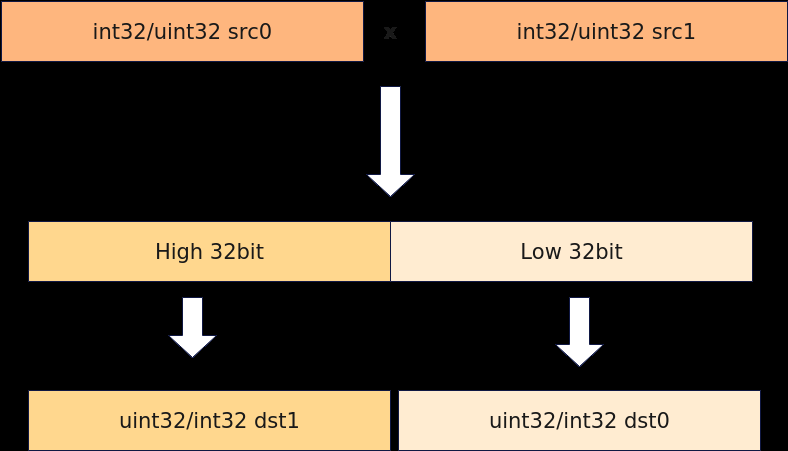

# Mull

> **Section**: 6.2.3.4.5.16  
> **PDF Pages**: 1587–1589  

---

<!-- page 1587 -->

参数名输入/输出

描述

srcReg0输入源操作数。

类型为RegTensor。

数据类型需要与目的操作数保持一致。

srcReg1输入源操作数。

类型为RegTensor。

数据类型需要与目的操作数保持一致。

mask输入源操作数元素操作的有效指示，详细说明请参考MaskReg。

返回值说明

无

约束说明

输入srcReg0为-0, srcReg1为+0的情况下，输出dstReg为-0。

调用示例

```cpp
template<typename T>__simd_vf__ inline void MinVF(__ubuf__ T* dstAddr, __ubuf__ T* src0Addr, __ubuf__ T* src1Addr, uint32_t count, uint32_t oneRepeatSize, uint16_t repeatTimes){    AscendC::Reg::RegTensor<T> srcReg0;
    AscendC::Reg::RegTensor<T> srcReg1;
    AscendC::Reg::RegTensor<T> dstReg;
    AscendC::Reg::MaskReg mask;
        for (uint16_t i = 0;
 i < repeatTimes;
 i++) {        mask = AscendC::Reg::UpdateMask<T>(count);
        AscendC::Reg::LoadAlign(srcReg0, src0Addr + i * oneRepeatSize);
        AscendC::Reg::LoadAlign(srcReg1, src1Addr + i * oneRepeatSize);
        AscendC::Reg::Min(dstReg, srcReg0, srcReg1, mask);
        AscendC::Reg::StoreAlign(dstAddr + i * oneRepeatSize, dstReg, mask);    }}
```

## 6.2.3.4.5.16 Mull

产品支持情况

产品是否支持

Atlas 350 加速卡√

Atlas A3 训练系列产品/Atlas A3 推理系列产品x

Atlas A2 训练系列产品/Atlas A2 推理系列产品x

<!-- page 1588 -->

产品是否支持

Atlas 200I/500 A2 推理产品x

Atlas 推理系列产品AI Corex

Atlas 推理系列产品Vector Corex

Atlas 训练系列产品x

功能说明

根据mask对输入数据srcReg0、srcReg1按元素相乘操作，将结果写入dstReg0，溢出部分写入dstReg1。



函数原型

```cpp
template <typename T = DefaultType, typename U>__simd_callee__ inline void Mull(U& dstReg0, U& dstReg1, U& srcReg0, U& srcReg1, MaskReg& mask)
```

参数说明

表6-529模板参数说明

参数名描述

T操作数数据类型。

Atlas 350 加速卡，支持的数据类型为：uint32_t/int32_t

U源操作数和目的操作数为RegTensor类型，例如RegTensor<uint32_t>，由编译器自动推导，用户不需要填写。

<!-- page 1589 -->

表6-530参数说明

参数名输入/输出

描述

dstReg0输出目的操作数。

类型为RegTensor。

dstReg1输出目的操作数。

类型为RegTensor。

srcReg0输入源操作数。

类型为RegTensor。

两个源操作数的数据类型需要与目的操作数保持一致。

srcReg1输入源操作数。

类型为RegTensor。

两个源操作数的数据类型需要与目的操作数保持一致。

mask输入源操作数元素操作的有效指示，详细说明请参考MaskReg。

返回值说明

无

约束说明

无

调用示例

```cpp
template<typename T>__simd_vf__ inline void MullVF(__ubuf__ T* dst0Addr, __ubuf__ T* dst1Addr, __ubuf__ T* src0Addr, __ubuf__ T* src1Addr, uint32_t count, uint32_t oneRepeatSize, uint16_t repeatTimes){    AscendC::Reg::RegTensor<T> srcReg0;
    AscendC::Reg::RegTensor<T> srcReg1;
    AscendC::Reg::RegTensor<T> dstReg0;
    AscendC::Reg::RegTensor<T> dstReg1;
    AscendC::Reg::MaskReg mask;
    for (uint16_t i = 0;
 i < repeatTimes;
 i++) {        mask = AscendC::Reg::UpdateMask<T>(count);
                AscendC::Reg::LoadAlign(srcReg0, src0Addr + i * oneRepeatSize);
        AscendC::Reg::LoadAlign(srcReg1, src1Addr + i * oneRepeatSize);
        AscendC::Reg::Mull(dstReg0, dstReg1, srcReg0, srcReg1, mask);
        AscendC::Reg::StoreAlign(dst0Addr + i * oneRepeatSize, dstReg0, mask);
        AscendC::Reg::StoreAlign(dst1Addr + i * oneRepeatSize, dstReg1, mask);    }}
```
