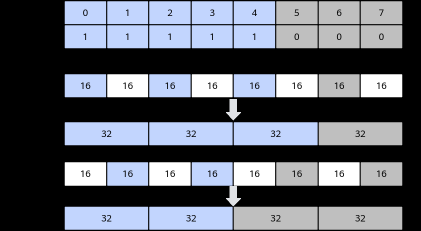

# ExpSub

> **Section**: 6.2.3.4.7.3  
> **PDF Pages**: 1629–1631  

---

<!-- page 1629 -->

参数名输入/输出

描述

srcReg0输入源操作数。

类型为RegTensor。

srcReg1输入源操作数。

类型为RegTensor。

mask输入源操作数元素操作的有效指示，详细说明请参考MaskReg。

返回值说明

无

约束说明

无

调用示例

```cpp
template<typename T>__simd_vf__ inline void AbsSubVF(__ubuf__ T* dstAddr, __ubuf__ T* src0Addr, __ubuf__ T* src1Addr, uint32_t count, uint32_t oneRepeatSize, uint16_t repeatTimes){    AscendC::Reg::RegTensor<T> srcReg0;
    AscendC::Reg::RegTensor<T> srcReg1;
    AscendC::Reg::RegTensor<T> dstReg;
    AscendC::Reg::MaskReg mask;
    for (uint16_t i = 0;
 i < repeatTimes;
 i++) {        mask = AscendC::Reg::UpdateMask<T>(count);
        AscendC::Reg::LoadAlign(srcReg0, src0Addr + i * oneRepeatSize);
        AscendC::Reg::LoadAlign(srcReg1, src1Addr + i * oneRepeatSize);
        AscendC::Reg::AbsSub(dstReg, srcReg0, srcReg1, mask);
        AscendC::Reg::StoreAlign(dstAddr + i * oneRepeatSize, dstReg, mask);    }}
```

## 6.2.3.4.7.3 ExpSub

产品支持情况

产品是否支持

Atlas 350 加速卡√

Atlas A3 训练系列产品/Atlas A3 推理系列产品x

Atlas A2 训练系列产品/Atlas A2 推理系列产品x

Atlas 200I/500 A2 推理产品x

Atlas 推理系列产品AI Corex

Atlas 推理系列产品Vector Corex

<!-- page 1630 -->

产品是否支持

Atlas 训练系列产品x

功能说明

srcReg0与srcReg1相减，差值作为e的指数计算，根据mask将计算结果写入dstReg。


srcReg为float类型时：

srcReg为half类型时：


函数原型

```cpp
template <typename T = DefaultType, typename U = DefaultType, RegLayout layout = RegLayout::ZERO, MaskMergeMode mode = MaskMergeMode::ZEROING, typename S, typename V>__simd_callee__ inline void ExpSub(S& dstReg, V& srcReg0, V& srcReg1, MaskReg& mask)
```

参数说明

表6-573模板参数说明

参数名描述

T目的操作数数据类型。

Atlas 350 加速卡，支持的数据类型为：float

U源操作数数据类型。

Atlas 350 加速卡，支持的数据类型为：half/float

layoutRegLayout枚举类型：enum class RegLayout {    UNKNOWN = -1,    ZERO,    ONE,    TWO,    THREE};

本接口只支持RegLayout::ZERO、RegLayout::ONE。src类型为half类型时使用，float时不生效，half类型时，RegLayout::ZERO表示从b16 RegTensor偶数位读取half元素转换成float，RegLayout::ONE表示从b16 RegTensor奇数位读取half元素转换成float。

mode选择MERGING模式或ZEROING模式。

●ZEROING，mask未筛选的元素在dst中置零。

●MERGING，当前不支持。

SdstReg RegTensor类型，例如RegTensor<half>，由编译器自动推导，用户不需要填写。

<!-- page 1631 -->

参数名描述

VsrcReg0/srcReg1 RegTensor类型，例如RegTensor<half>，由编译器自动推导，用户不需要填写。

表6-574参数说明

参数名输入/输出

描述

dstReg输出目的操作数。

类型为RegTensor。

srcReg0输入源操作数。

类型为RegTensor。

srcReg1输入源操作数。

类型为RegTensor。

mask输入源操作数元素操作的有效指示，详细说明请参考MaskReg。

返回值说明

无

约束说明

src为half类型时，Vector计算单元一次计算只处理最多VL/sizeof(float)个half元素，mask只有偶数位有效，参考下图：



