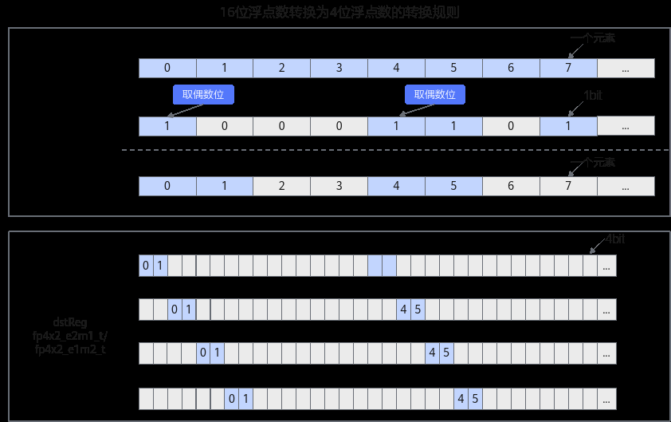

# Cast

> **Section**: 6.2.3.4.9.1  
> **PDF Pages**: 1645–1673  

---

<!-- page 1645 -->

参数名输入/输出

描述

mask输入mask用于控制每次迭代内参与计算的元素。

约束说明

当store取值为STORE_REG时，由于硬件约束，StoreUnAlign指令和Squeeze指令必须交替使用，例如：

```cpp
Squeeze(dstVreg, srcVreg, mask);StoreUnAlign(dstAddr, dstVreg, ureg);Squeeze(dstVreg, srcVreg, mask);StoreUnAlign(dstAddr, dstVreg, ureg);
```

调用示例

```cpp
template<typename T>__simd_vf__ inline void SqueezeVF(__ubuf__ T* dstAddr, __ubuf__ T* srcAddr, uint32_t oneRepeatSize, uint16_t repeatTimes){    AscendC::Reg::RegTensor<T> srcReg0;
    AscendC::Reg::RegTensor<T> srcReg1;
    AscendC::Reg::UnalignRegForStore ureg;
    AscendC::Reg::MaskReg sqzMask = AscendC::Reg::CreateMask<T, AscendC::Reg::MaskPattern::H>();
    for (uint16_t i = 0;
 i < repeatTimes; ++i) {        AscendC::Reg::LoadAlign<T, AscendC::Reg::PostLiteral::POST_MODE_UPDATE>(srcReg0, srcAddr, oneRepeatSize);
        AscendC::Reg::Squeeze<T, AscendC::Reg::GatherMaskMode::STORE_REG>(srcReg1, srcReg0, sqzMask);
        AscendC::Reg::StoreUnAlign<T, AscendC::Reg::PostLiteral::POST_MODE_UPDATE>(dstAddr, srcReg1, ureg);     }     AscendC::Reg::StoreUnAlignPost(dstAddr, ureg);}
```

## 6.2.3.4.9 类型转换

## 6.2.3.4.9.1 Cast

产品支持情况

产品是否支持

Atlas 350 加速卡√

Atlas A3 训练系列产品/Atlas A3 推理系列产品x

Atlas A2 训练系列产品/Atlas A2 推理系列产品x

Atlas 200I/500 A2 推理产品x

Atlas 推理系列产品AI Corex

Atlas 推理系列产品Vector Corex

Atlas 训练系列产品x

<!-- page 1646 -->

功能说明

数据类型精度转换，将U类型的源操作数根据指定的转换模式，转换成T类型的目的操作数类型。

函数原型

```cpp
template <typename T = DefaultType, typename U = DefaultType, const CastTrait& trait = castTrait, typename S, typename V>__simd_callee__ inline void Cast(S& dstReg, V& srcReg, MaskReg& mask)
```

参数说明

表6-589模板参数说明

参数名描述

T目的操作数数据类型。

U源操作数数据类型。

trait类型转换模式结构体。

包括RegLayout、SatMode、MaskMergeMode、RoundMode。

使能SatMode生效需与6.2.3.9.10 SetCtrlSpr(ISASI)配合使用。

SsrcReg类型，例如RegTensor<float>，由编译器自动推导，用户不需要填写。

VdstReg类型，例如RegTensor<int32_t>，由编译器自动推导，用户不需要填写。

表6-590参数说明

参数名输入/输出

描述

dstReg输出目的操作数。

类型为RegTensor。

Atlas 350 加速卡支持的数据类型参考表6-591、表6-592、表6-593、表6-594。

srcReg输入源操作数。

类型为RegTensor。

Atlas 350 加速卡支持的数据类型参考表6-591、表6-592、表6-593、表6-594。

mask输入源操作数元素操作的有效指示，详细说明请参考MaskReg。

注意：数据类型转换的mask会按照输入和输出类型中sizeof(dtype)较大的来筛选。

<!-- page 1647 -->

表6-591浮点转整数

**src dtypedst dtypemoderoundmode**

**sat modelayoutmode**

RoundMode::CAST_RINT,

RegLayout::ZERO,RegLayout::ONE,RegLayout::TWO,RegLayout::THREE

halfint4x2_tMaskMergeMode::ZEROING

SatMode::NO_SAT

SatMode::SAT

RoundMode::CAST_ROUND,

RoundMode::CAST_FLOOR,

floatint16_tRegLayout::ZERO

RoundMode::CAST_CEIL,

halfint8_t

RegLayout::ONE

halfuint8_t

RoundMode::CAST_TRUNC

floatint64_t

floatint32_tRegLayout::UNKNOWNhalfint16_t

halfint32_tSatMode::UNKNOWN

RegLayout::ZERO

RegLayout::ONE

表6-592浮点转浮点

**srcdtype**

**dstdtype**

**moderound modesat modelayoutmode**

halffloatMaskMergeMode::ZEROING

RoundMode::UNKNOWN

SatMode::UNKNOWN

RegLayout::ZERO

bfloat16_t

float

RegLayout::ONE

hifloat8_t

half

<!-- page 1648 -->

**srcdtype**

**dstdtype**

**moderound modesat modelayoutmode**

floatbfloat16_t

RoundMode::CAST_RINT,

SatMode::NO_SAT

RoundMode::CAST_ROUND,

SatMode::SAT

RoundMode::CAST_FLOOR,

RoundMode::CAST_CEIL,

RoundMode::CAST_TRUNC

floathalfRoundMode::CAST_ODD，

RoundMode::CAST_RINT,

RoundMode::CAST_ROUND,

RoundMode::CAST_FLOOR

RoundMode::CAST_CEIL,

RoundMode::CAST_TRUNC

halfhifloat8_t

RoundMode::CAST_ROUND,

floathifloat8_t

RegLayout::ZERO,RegLayout::ONE,RegLayout::TWO,RegLayout::THREE

RoundMode::CAST_HYBRID

floatfp8_e5m2_t

RoundMode::CAST_RINT

floatfp8_e4m3fn_t

hifloat8_t

floatRoundMode::UNKNOWN

SatMode::UNKNOWN

fp8_e4m3fn_t

float

fp8_e5m2_t

float

<!-- page 1649 -->

**srcdtype**

**dstdtype**

**moderound modesat modelayoutmode**

bfloat16_t

fp4x2_e2m1_t

RoundMode::CAST_RINT,

RegLayout::UNKNOWNbfloat16_t

RoundMode::CAST_ROUND,

fp4x2_e1m2_t

RoundMode::CAST_FLOOR,

RoundMode::CAST_CEIL,

RoundMode::CAST_TRUNC

fp4x2_e2m1_t

bfloat16_t

RoundMode::UNKNOWN

fp4x2_e1m2_t

bfloat16_t

bfloat16_t

halfRoundMode::CAST_RINT,

SatMode::NO_SAT

RoundMode::CAST_ROUND,

SatMode::SAT

halfbfloat16_t

SatMode::UNKNOWN

RoundMode::CAST_FLOOR,

RoundMode::CAST_CEIL,

RoundMode::CAST_TRUNC

bfloat16_t

fp8_e8m0_t

RoundMode::UNKNOWN

RegLayout::ZERO

RegLayout::ONEfp8_e8m0_t

bfloat16_t

<!-- page 1650 -->

表6-593整数转浮点

**src dtypedst dtypemoderound modelayout mode**

int4x2_thalfMaskMergeMode::ZEROING

RoundMode::UNKNOWN

RegLayout::ZERO,RegLayout::ONE,RegLayout::TWO,RegLayout::THREE

int4x2_tbfloat16_t

uint8_thalfRegLayout::ZERO

int8_thalf

RegLayout::ONE

int16_tfloat

int64_tfloatRoundMode::CAST_RINT,RoundMode::CAST_ROUND,RoundMode::CAST_FLOOR,RoundMode::CAST_CEIL,RoundMode::CAST_TRUNC

int16_thalfRegLayout::UNKNOWNint32_tfloat

表6-594整数转整数

**src dtypedst dtypemodesat modelayout mode**

uint32_tuint8_tMaskMergeMode::ZEROING

SatMode::NO_SAT

RegLayout::ZERO,RegLayout::ONE,RegLayout::TWO,RegLayout::THREE

int32_tuint8_t

SatMode::SAT

uint16_tuint8_tRegLayout::ZERO

int16_tuint8_t

RegLayout::ONE

uint32_tuint16_t

uint32_tint16_t

int32_tuint16_t

<!-- page 1651 -->

**src dtypedst dtypemodesat modelayout mode**

int32_tint16_t

uint8_tuint16_tRoundMode::UNKNOWNint8_tint16_t

uint16_tuint32_t

int16_tuint32_t

int16_tint32_t

int32_tint64_t

uint8_tuint32_tRegLayout::ZERO,RegLayout::ONE,RegLayout::TWO,RegLayout::THREE

int8_tint32_t

int16_tint4x2_t

int4x2_tint16_t

RegLayout::ZERO

int64_tint32_tSatMode::NO_SAT

SatMode::SAT

RegLayout::ONE

表6-595浮点转整数转换规则

转换模式转换规则介绍

CAST_RINT就近舍入，距离相同时向偶数进位。

举例：

输入3.3，输出3

输入5.9，输出6

输入5.5，输出6，因为6是偶数，5是奇数，所以向6舍入

输入4.5，输出4，4是偶数

输入-2.4，输出2

输入-3.6，输出-4

<!-- page 1652 -->

转换模式转换规则介绍

CAST_ROUND就近舍入，距离相同时向远离0的数值进位。

举例：

输入3.3，输出3

输入5.9，输出6

输入5.5，输出6，因为6相比5，距离0更远，所以向6舍入

输入-2.4，输出2

输入-3.6，输出-4

输入-6.5，输出-7，因为-7相比-6，距离0更远

CAST_FLOOR向负无穷方向舍入。

举例：

输入3.2，输出3

输入7.9，输出7

输入-4.6，输出-5

输入-3.1，输出-4

相比输入，输出更接近负无穷

CAST_CEIL向正无穷方向舍入。

举例：

输入3.2，输出4

输入7.9，输出8

输入-4.6，输出-4

输入-3.1，输出-3

相比输入，输出更接近正无穷

CAST_TRUNC向0方向舍入。

举例：

输入3.2，输出3

输入7.9，输出7

输入-4.6，输出-4

输入-3.1，输出-3

相比输入，输出更接近0

<!-- page 1653 -->

表6-596浮点转浮点转换规则

**src dtypedst dtype舍入规则**

floathalfCAST_ODD，向奇数方向舍入。

half有尾数位10bit，float有尾数位23bit，float转half舍弃精度13bit，float16最低位标记为黄色y，float舍弃精度标记为红色

float +/-a.xxxxxxxxx00000100000000，如果y bit位为0偶数，则进位，得到half a.xxxxxxxxx1

float +/-a.xxxxxxxxx11000100000000，如果y bit位为1奇数，则不进位，得到half a.xxxxxxxxx1

举例

输入float 123.23333，二进制为

sign:0, exponent:10000101,mantissa:11101100111011101110111

float_exponet = 0b10000101 = 133

half_exponet - 15 = 133 - 127

half_exponet = 21 = 0b10101

float_mantissa 第14位为1奇数，所以不进位，舍弃后面13位

11101100111011101110111

得到half_mantissa = 1110110011

所以half二进制为

sign:0, exponent:10101, mantissa:1110110011

half = 123.2

<!-- page 1654 -->

**src dtypedst dtype舍入规则**

floatbfloat16_tfloat 二进制规则为

sign:1bit,exponent:8bit mantissa:23bit

bfloat16_t二进制规则为

sign:1bit,exponent:8bit,mantissa:7bit

**CAST_RINT：就近舍入，距离相等时向偶数进位**

举例

1、float32_mantissa:00100000010000010000000

舍弃精度小于0b1000000000000000，等效于[0,0.5），则不进位

得到bfloat16_mantissa:0010000

2、float32_mantissa:00110001000000000000000

舍弃精度等于0b1000000000000000，bf16最低位为偶数时不进位

得到bfloat16_mantissa:0011000

3、float32_mantissa:00110011000000000000000

舍弃精度等于0b1000000000000000，bf16最低位为奇数时进位

得到bfloat16_mantissa:0011010

4、float32_mantissa:00100001010000010000000

舍弃精度大于0b1000000000000000，等效于(0.5,1），则进位

得到bfloat16_mantissa:0010001

**CAST_ROUND：就近舍入，距离相等时向远离0方向进位**

举例

1、float32_mantissa:00100000010000010000000

舍弃精度小于0b1000000000000000，等效于[0,0.5），则不进位

得到bfloat16_mantissa:0010000

2、float32_mantissa:00110001000000000000000

舍弃精度等于0b1000000000000000，进位后离0越远，所以进位

得到bfloat16_mantissa:0011001

3、float32_mantissa:00100001010000010000000

舍弃精度大于0b1000000000000000，等效于(0.5,1），则进位

得到bfloat16_mantissa:0010001

**CAST_FLOOR：向负无穷方向舍入**

1、float32_mantissa:00100000010000010000000，

<!-- page 1655 -->

**src dtypedst dtype舍入规则**

float32值正数时不进位，得到bfloat16_mantissa:0010000

2、float32_mantissa:00110001000000000000000

float32 值负数时进位，得到bfloat16_mantissa:0011001

**CAST_CEIL：向正无穷方向舍入**

1、float32_mantissa:00100000010000010000000，float32值正数时进位，得到bfloat16_mantissa:0010001

2、float32_mantissa:00110001000000000000000

float32 值负数时不进位，得到bfloat16_mantissa:0011000

**CAST_TRUNC：向0方向舍入**

1、float32_mantissa:00100000010000010000000，都不进位，直接舍弃红色精度，得到bfloat16_mantissa:001000

完整举例：输入float32 205.75，二进制为

sign:0, exponent:10000110,mantissa:10011011100000000000000

CAST_RINT模式

float32_mantissa =0b10011011100000000000000

舍弃精度大于0b1000000000000000，等效于(0.5,1），则进位

得到bfloat16_mantinssa = 0b1001110

所以bfloat16二进制为

sign:0, exponent:10000110, mantissa:1001110

bfloat16 = 206

<!-- page 1656 -->

**src dtypedst dtype舍入规则**

bfloat16_thalfbfloat16_t二进制规则为

sign:1bit,exponent:8bit,mantissa:7bit

float16二进制规则为

sign:1bit,exponent:5bit,mantissa:10bit

尾数位相差3位

当bfloat16_exponent = exponent-127 >= -14时

因为bfloat16精度低，float16精度高，所以bfloat16到float16精度不变

例1：bfloat16_mantissa = 0b1011000 ->

float16_maintissa = 0b1011000000, 二进制位不发生进位，只需要再低位补3个0

当bfloat16_exponent = exponent-127 < -14时

例2：当exponent = 108， bfloat16_exponent =exponent-127 = -19< -14时，因为float16_exponent = exponent - 14 最小为-14，无法表示，所以指数需要+5保持和float16_exponent相等，同时尾数位需要除以2的5次方，因为bf16计算公式 = s * (2^(e-127))*(man) =

s * (2^(e-127+5))*(man*2^(-5)),指数位乘以一个数，尾数位需要除以相同大小的数，保证最终值不变。假设bfloat16_mantissa = 0b1011011

bfloat16 mantissa计算公式为 1+ man/128, 用例二进制表示为

0b1.1011011，指数位乘以2的5次方时，尾数要除以2的5次，小数点向左移动5位，所以bfloat16_mantissa = 0b0.000011011011，尾数为12位，因为float16只有10bit尾数位，所以在以下CAST模式中需要舍弃最低2位，并根据舍入模式决定是否舍入，当前例子的舍弃精度中间值为0b10

**CAST_RINT：就近舍入，距离相等时向偶数进位**

当bfloat16_mantissa尾数小于等于10位时，不需要舍入；

当bfloat16_mantissa尾数大于10位时，类似例2的例子

1）被舍弃的精度小于舍弃精度中间值时，不进位，

例bfloat16_mantissa = 0b0.00001101100xxx

0xxx < 1000 输出float16_mantissa =0b0.0000110110

2）被舍弃的精度大于舍弃精度中间值时，进位

例bfloat16_mantissa = 0b0.00001101100xxx

1x1x > 1000 输出float16_mantissa =0b0.0000110111

<!-- page 1657 -->

**src dtypedst dtype舍入规则**

3) 被舍弃的精度等于舍弃精度中间值时，第10位为偶数时不进位

例bfloat16_mantissa = 0b0.00001101100xxx

0 % 2 == 0 输出float16_mantissa =0b0.0000110110

4) 被舍弃的精度等于舍弃精度中间值时，第10位为奇数时进位

例bfloat16_mantissa = 0b0.00001100010xxx

1 % 2 == 1 输出float16_mantissa =0b0.0000110001

**CAST_ROUND：就近舍入，距离相等时向远离0方向进位**

当bfloat16_mantissa尾数小于等于10位时，不需要进位；

当bfloat16_mantissa尾数大于10位时，类似例2的例子

1）被舍弃的精度小于舍弃精度中间值时，不进位，

例bfloat16_mantissa = 0b0.00001101100xxx

0xxx < 1000 输出float16_mantissa =0b0.0000110110

2）被舍弃的精度大于舍弃精度中间值时，进位

例bfloat16_mantissa = 0b0.00001101100xxx

1x1x > 1000 输出float16_mantissa =0b0.0000110111

3) 被舍弃的精度等于舍弃精度中间值时，进位远离0，所以进位

例bfloat16_mantissa = 0b0.00001101100xxx

输出float16_mantissa = 0b0.0000110111

**CAST_FLOOR：向负无穷方向舍入**

当bfloat16_mantissa尾数小于等于10位时，不需要进位；

当bfloat16_mantissa尾数大于10位时，类似例2的例子

1）符号位S为0，既正数时不舍入，

例bfloat16_mantissa = 0b0.00001101100xxx

输出float16_mantissa = 0b0.0000110110

2）符号位S为1，既负数时舍入

例bfloat16_mantissa = 0b0.00001101100xxx

输出float16_mantissa = 0b0.0000110111

**CAST_CEIL：向正无穷方向舍入**

当bfloat16_mantissa尾数小于等于10位时，不需要舍入；

<!-- page 1658 -->

**src dtypedst dtype舍入规则**

当bfloat16_mantissa尾数大于10位时，类似例2的例子

1）符号位S为0，既正数时舍入，

例bfloat16_mantissa = 0b0.00001101100xxx

输出float16_mantissa = 0b0.0000110111

2）符号位S为1，既负数时不舍入

例bfloat16_mantissa = 0b0.00001101100xxx

输出float16_mantissa = 0b0.0000110110

**CAST_TRUNC：向0方向舍入**

当bfloat16_mantissa尾数小于等于10位时，不需要舍入；

当bfloat16_mantissa尾数大于10位时，类似例2的例子

1）直接舍弃多余精度，不舍入

例bfloat16_mantissa = 0b0.00001101100xxx

输出float16_mantissa = 0b0.0000110110

完整举例：

输入bfloat16为2.90573e-06，二进制为

sign:0, exponent:01101100, mantissa:1000011

bfloat16_exponent = 108-127 = -19 < -14，float16_exponent最小为-14，所以bfloat16_exponent += 5，bfloat16_mantissa 小数点左移

5位，1.1000011 -> 0.000011000011

CAST_RINT模式

舍弃精度11大于舍弃精度中间值10，所以进位

bfloat16_mantissa = 0.0000110001

最终float16二进制为

sign:0, exponent: 00000, mantissa = 0000110001

按照计算公式十进制表示为

float16=0.00000293

<!-- page 1659 -->

**src dtypedst dtype舍入规则**

halfbfloat16_thalf二进制规则为

sign:1bit,exponent:5bit,mantissa:10bit

bfloat16_t二进制规则为

sign:1bit,exponent:8bit,mantissa:7bit

**CAST_RINT：就近舍入，距离相同时向偶数舍入**

1）当舍弃精度小于舍弃精度中间值100时，不舍入

例half_mantinssa = 0111010011

输出bfloat16_mantissa = 0111010

2）当舍弃精度大于舍弃精度中间值100时，舍入

例half_mantinssa = 0111010111

输出bfloat16_mantissa = 0111011

3）当舍入精度等于舍弃精度中间值100时，bfloat16最低位为偶数，不舍入

例half_mantinssa = 0111010100

输出bfloat16_mantissa = 0111010

4）当舍入精度等于舍弃精度中间值100时，bfloat16最低位为奇数，

舍入

例half_mantinssa = 0111010100

输出bfloat16_mantissa = 0111011

**CAST_ROUND：就近舍入，距离相同时远离0舍入**

1）当舍弃精度小于舍弃精度中间值100时，不舍入

例half_mantinssa = 0111010011

输出bfloat16_mantissa = 0111010

2）当舍弃精度大于舍弃精度中间值100时，舍入

例half_mantinssa = 0111010111

输出bfloat16_mantissa = 0111011

3）当舍入精度等于舍弃精度中间值100时，进位远离0，所以舍入

例half_mantinssa = 0111010100

输出bfloat16_mantissa = 0111011

**CAST_FLOOR：向负无穷方向舍入**

1）当输入值为正数时，不舍入

例half_mantinssa = 0111010011

输出bfloat16_mantissa = 0111010

2）当输入值为负数时，舍入

例half_mantinssa = 0111010011

输出bfloat16_mantissa = 0111011

**CAST_CEIL：向正无穷方向舍入**

<!-- page 1660 -->

**src dtypedst dtype舍入规则**

1）当输入值为正数时，舍入

例half_mantinssa = 0111010011

输出bfloat16_mantissa = 0111011

2）当输入值为负数时，不舍入

例half_mantinssa = 0111010011

输出bfloat16_mantissa = 0111010

**CAST_TRUNC：向0方向舍入**

直接舍弃多余精度

例half_mantinssa = 0111010011

输出bfloat16_mantissa = 0111010

完整举例：

输入half 0.131

二进制为sign:0, exponent:01100,mantissa:0000110001

half_exponent = 12-15 = bfloat16_exp - 127

bfloat16_exp = 124 = 0b1111100

CAST_ROUND模式下

half_mantissa = 0000110001

舍弃精度小于舍弃中间精度100，不进位，所以得到

bfloat16_mantissa = 0000110

所以bfloat16二进制为

sign:0, exponent:1111100, mantissa: 0000110

按照计算公式十进制表示为

bfloat16=0.130859

<!-- page 1661 -->

**src dtypedst dtype舍入规则**

floatfp8_e4m3fn_t

float 二进制规则为

sign:1bit,exponent:8bit mantissa:23bit

fp8_e4m3fn_t二进制规则为

sign:1bit,exponent:4bit,mantissa:3bit

需要舍弃20bit，舍弃精度中间值为0b10000000000000000000

**CAST_RINT：就近舍入，距离相同时向偶数舍入**

1）当舍弃精度小于舍弃精度中间值时，不舍入

例float_mantinssa = 01100100110000000000000

输出fp8_e4m3fn_t_mantissa = 011

2）当舍弃精度大于舍弃精度中间值时，舍入

例float_mantinssa= 01110100110000000000000

输出fp8_e4m3fn_t_mantissa = 100

3）当舍入精度等于舍弃精度中间值时，fp8_e4m3fn_t最低位为偶数，不舍入

例float_mantinssa= 01010000000000000000000

输出fp8_e4m3fn_t_mantissa = 010

4）当舍入精度等于舍弃精度中间值时，fp8_e4m3fn_t最低位为奇数，

舍入

例float_mantinssa= 01110000000000000000000

输出fp8_e4m3fn_t_mantissa = 100

完整例子：

输入float 1.233

二进制为

sign:0, exponent:01111111,mantissa:00111011101001011110010

float_exponent = 127-127 = fp8_e4m3fn_t_exp - 7

fp8_e4m3fn_t_exp = 7 = 0b0111

CAST_RINT模式下

float_mantissa = 00111011101001011110010

舍弃精度大于舍弃中间精度，进位，所以得到

fp8_e4m3fn_t_mantissa = 010

所以fp8_e4m3fn_t二进制为

sign:0, exponent:0111, mantissa: 010

按照计算公式十进制表示为

fp8_e4m3fn_t=1.25

<!-- page 1662 -->

**src dtypedst dtype舍入规则**

floatfp8_e5m2_t

float 二进制规则为

sign:1bit,exponent:8bit mantissa:23bit

fp8_e5m2_t二进制规则为

sign:1bit,exponent:5bit,mantissa:2bit

需要舍弃21bit，舍弃精度中间值为0b100000000000000000000

**CAST_RINT：就近舍入，距离相同时向偶数舍入**

1）当舍弃精度小于舍弃精度中间值时，不舍入

例float_mantinssa = 01000100110000000000000

输出fp8_e5m2_t_mantissa = 01

2）当舍弃精度大于舍弃精度中间值时，舍入

例float_mantinssa= 01101001100000000000000

输出fp8_e5m2_t_mantissa = 10

3）当舍入精度等于舍弃精度中间值时，fp8_e5m2_t最低位为偶数，不舍入

例float_mantinssa= 00100000000000000000000

输出fp8_e5m2_t_mantissa = 00

4）当舍入精度等于舍弃精度中间值时，fp8_e5m2_t最低位为奇数，

舍入

例float_mantinssa= 0110000000000000000000

输出fp8_e5m2_t_mantissa = 10

完整例子：

输入float32 1.233

二进制为

sign:0, exponent:01111111,mantissa:00111011101001011110010

float_exponent = 127-127 = fp8_e5m2_t_exp - 15

fp8_e5m2_t_exp = 15 = 0b01111

CAST_RINT模式下

float_mantissa = 00111011101001011110010

舍弃精度大于舍弃中间精度，进位，所以得到

fp8_e5m2_t_mantissa = 01

所以fp8_e5m2_t二进制为

sign:0, exponent:01111, mantissa: 01

按照计算公式十进制表示为

fp8_e5m2_t=1.25

<!-- page 1663 -->

**src dtypedst dtype舍入规则**

bfloat16_tfp4x2_e2m1_t

bfloat16二进制规则为

sign:1bit,exponent:8bit,mantissa:7bit

fp4x2_e2m1_t二进制规则为

sign:1bit,exponent:2bit,mantissa:1bit

尾数位相差6位

当bfloat16_exponent = exponent-127 < 0时

例1：当exponent = 124， bfloat16_exponent =exponent-127 = -3 < 0时，因为float4_e2m1_exponent = exponent - 1 最小为0，无法表示，所以指数需要+3保持和float4_e2m1_exponent相等，同时尾数位需要除以2的3次方，因为bf16计算公式 = s *(2^(e-127))*(man) =

s * (2^(e-127+3))*(man*2^(-3)),指数位乘以一个数，尾数位需要除以相同大小的数，保证最终值不变。假设bfloat16_mantissa = 0b1011011

bfloat16 mantissa计算公式为 1+ man/128, 用例二进制表示为

0b1.1011011，指数位乘以2的3次方时，尾数要除以2的3次，小数点向左移动3位，所以bfloat16_mantissa = 0b0.0011011011，因为float4_e2m1只有1bit尾数位，所以在以下CAST模式中需要舍弃最低9位，并根据舍入模式决定是否舍入，当前例子的舍弃精度中间值为0b100000000

**CAST_RINT：就近舍入，距离相等时向偶数进位**

1）被舍弃的精度小于舍弃精度中间值时，不进位，

例bfloat16_mantissa = 0b0.0000110xxx

000110xxx < 舍弃精度中间值输出float4_e2m1_mantissa = 0b0.0

2）被舍弃的精度大于舍弃精度中间值时，进位

例bfloat16_mantissa = 0b0.0100110xxx

100110xxx > 舍弃精度中间值输出float4_e2m1_mantissa = 0b0.1

3) 被舍弃的精度等于舍弃精度中间值时，第1位为偶数时不进位

例bfloat16_mantissa = 0b0.0100000xxx

0 % 2 == 0 输出float4_e2m1_mantissa = 0b0.0

4) 被舍弃的精度等于舍弃精度中间值时，第1位为奇数时进位

例bfloat16_mantissa = 0b0.1100000xxx

1 % 2 == 1 输出float4_e2m1_mantissa = 0b0.1

**CAST_ROUND：就近舍入，距离相等时向远离0方向进位**

<!-- page 1664 -->

**src dtypedst dtype舍入规则**

1）被舍弃的精度小于舍弃精度中间值时，不进位，

例bfloat16_mantissa = 0b0.0000110xxx

000110xxx < 舍弃精度中间值输出float4_e2m1_mantissa = 0b0.0

2）被舍弃的精度大于舍弃精度中间值时，进位

例bfloat16_mantissa = 0b0.0100110xxx

100110xxx > 舍弃精度中间值输出float4_e2m1_mantissa = 0b0.1

3) 被舍弃的精度等于舍弃精度中间值时，进位远离0，所以进位

例bfloat16_mantissa = 0b0.0100000xxx

输出float4_e2m1_mantissa = 0b0.1

**CAST_FLOOR：向负无穷方向舍入**

1）输入值正数时，不进位，

例bfloat16_mantissa = 0b0.0000110xxx

输出float4_e2m1_mantissa = 0b0.0

2）输入值负数时，进位

例bfloat16_mantissa = 0b0.0100110xxx

输出float4_e2m1_mantissa = 0b0.1

**CAST_CEIL：向正无穷方向舍入**

1）输入值正数时，进位，

例bfloat16_mantissa = 0b0.0000110xxx

输出float4_e2m1_mantissa = 0b0.1

2）输入值负数时，不进位

例bfloat16_mantissa = 0b0.0100110xxx

输出float4_e2m1_mantissa = 0b0.0

**CAST_TRUNC：向0方向舍入**

1）直接舍弃多余精度，不进位

例bfloat16_mantissa = 0b0.0100110xxx

输出float4_e2m1_mantissa = 0b0.0

完整举例：

输入bfloat16为0.761719，二进制为

sign:0, exponent:01111110, mantissa:1000011

bfloat16_exponent = 126-127 = -1 < 0，float16_exponent最小为0，所以bfloat16_exponent += 1，bfloat16_mantissa 小数点左移

1位，1.1000011 -> 0.11000011

CAST_RINT模式

<!-- page 1665 -->

**src dtypedst dtype舍入规则**

舍弃精度1000011大于舍弃精度中间值1000000，所以进位

float4_e2m1_mantissa = 0.1

最终float4_e2m1二进制为

sign:0, exponent: 00, mantissa = 1

按照计算公式十进制表示为

float4_e2m1=0.5

<!-- page 1666 -->

**src dtypedst dtype舍入规则**

bfloat16_tfp4x2_e1m2_t

bfloat16二进制规则为

sign:1bit,exponent:8bit,mantissa:7bit

fp4x2_e1m2_t二进制规则为

sign:1bit,exponent:1bit,mantissa:2bit

尾数位相差5位

当bfloat16_exponent = exponent-127 < 0时，bfloat16_mantissa需要发生位移

例1：当exponent = 124， bfloat16_exponent =exponent-127 = -3 < 0时，因为float4_e1m2_exponent = exponent - 1 最小为0，无法表示，所以指数需要+3保持和float4_e2m1_exponent相等，同时尾数位需要除以2的3次方，因为bf16计算公式 = s *(2^(e-127))*(man) =

s * (2^(e-127+3))*(man*2^(-3)),指数位乘以一个数，尾数位需要除以相同大小的数，保证最终值不变。假设bfloat16_mantissa = 0b1011011

bfloat16 mantissa计算公式为 1+ man/128, 用例二进制表示为

0b1.1011011，指数位乘以2的3次方时，尾数要除以2的3次，小数点向左移动3位，所以bfloat16_mantissa = 0b0.0011011011，因为float4_e2m1只有2bit尾数位，所以在以下CAST模式中需要舍弃最低8位，并根据舍入模式决定是否舍入，当前例子的舍弃精度中间值为0b10000000

**CAST_RINT：就近舍入，距离相等时向偶数进位**

1）被舍弃的精度小于舍弃精度中间值时，不进位，

例bfloat16_mantissa = 0b0.0000011xxx

00011xxx < 舍弃精度中间值输出float4_e1m2_mantissa = 0b0.00

2）被舍弃的精度大于舍弃精度中间值时，进位

例bfloat16_mantissa = 0b0.0010011xxx

10011xxx > 舍弃精度中间值输出float4_e1m2_mantissa = 0b0.01

3) 被舍弃的精度等于舍弃精度中间值时，第2位为偶数时不进位

例bfloat16_mantissa = 0b0.0010000xxx

0 % 2 == 0 输出float4_e1m2_mantissa = 0b0.00

4) 被舍弃的精度等于舍弃精度中间值时，第2位为奇数时进位

例bfloat16_mantissa = 0b0.0110000xxx

1 % 2 == 1 输出float4_e1m2_mantissa = 0b0.10

<!-- page 1667 -->

**src dtypedst dtype舍入规则**

**CAST_ROUND：就近舍入，距离相等时向远离0方向进位**

1）被舍弃的精度小于舍弃精度中间值时，不进位，

例bfloat16_mantissa = 0b0.0000110xxx

00110xxx < 舍弃精度中间值输出float4_e1m2_mantissa = 0b0.00

2）被舍弃的精度大于舍弃精度中间值时，进位

例bfloat16_mantissa = 0b0.0010110xxx

10110xxx > 舍弃精度中间值输出float4_e1m2_mantissa = 0b0.01

3) 被舍弃的精度等于舍弃精度中间值时，进位远离0，所以进位

例bfloat16_mantissa = 0b0.0010000xxx

输出float4_e1m2_mantissa = 0b0.01

**CAST_FLOOR：向负无穷方向舍入**

1）输入值正数时，不进位，

例bfloat16_mantissa = 0b0.0000110xxx

输出float4_e1m2_mantissa = 0b0.00

2）输入值负数时，进位

例bfloat16_mantissa = 0b0.00100110xxx

输出float4_e1m2_mantissa = 0b0.01

**CAST_CEIL：向正无穷方向舍入**

1）输入值正数时，进位，

例bfloat16_mantissa = 0b0.0000110xxx

输出float4_e1m2_mantissa = 0b0.01

2）输入值负数时，不进位

例bfloat16_mantissa = 0b0.0010110xxx

输出float4_e1m2_mantissa = 0b0.00

**CAST_TRUNC：向0方向舍入**

1）直接舍弃多余精度，不进位

例bfloat16_mantissa = 0b0.0010110xxx

输出float4_e1m2_mantissa = 0b0.00

完整举例：

输入bfloat16为0.761719，二进制为

sign:0, exponent:01111110, mantissa:1000011

bfloat16_exponent = 126-127 = -1 < 0，float16_exponent最小为0，所以bfloat16_exponent += 1，bfloat16_mantissa 小数点左移

1位，1.1000011 -> 0.11000011

<!-- page 1668 -->

**src dtypedst dtype舍入规则**

CAST_RINT模式

舍弃精度000011小于舍弃精度中间值100000，所以不进位

float4_e2m1_mantissa = 0.11

最终float4_e2m1二进制为

sign:0, exponent: 0, mantissa = 11

按照计算公式十进制表示为

float4_e2m1=0.75

floathifloat8_t参考表6-597。

<!-- page 1669 -->

表6-597 float to hifloat8_t 类型转换规则

**VCVTFF:F322HiF8**

tmp2[31 : 0] = f32_src_data[i][31 : 0];

Ev = tmp2[30 : 23] - 8'b01111111, thr = tmp2[13 : 0];

if (Ev == 128 && tmp2[22 : 0] != 23'b0) then

tmp3[7 : 0] = HiF8NAN(8'b10000000);

else if ((Ev == 128 && tmp2[22 : 0] == 23'b0) || (Ev > 15)) then

tmp3[7 : 0] = (tmp2[31] == 1'b0) ? HiF8+INF (8'b01101111) : HiF8-INF(8'b11101111);

else if (Ev < -23) then

tmp3[7 : 0] = HiF8ZERO (8'b00000000);

else if (Ev == -23) then

if ((Half To Away Round) || (Hybrid Round && {1’b1, tmp2[22 : 10]} >= thr))then

tmp3[7 : 0] = (tmp2[31] == 1'b0) ? 8'b00000001 : 8'b10000001; // minsubnormal

else

tmp3[7 : 0] = HiF8ZERO (8'b00000000);

end if

else

if (Ev == 0) then

M = tmp2[22 : 20], T A_bit = tmp2[19], frac = tmp2[19 : 6];

else if (Ev == ±1) then

M = tmp2[22 : 20], T A_bit = tmp2[19], frac = tmp2[19 : 6];

else if (Ev == ±[2, 3]) then

M = tmp2[22 : 20], T A_bit = tmp2[19], frac = tmp2[19:6];

else if (Ev == ±[4, 7]) then

M = tmp2[22 : 21], T A_bit = tmp2[20], frac = tmp2[20 : 7];

else if (Ev == ±[8, 15]) then

M = tmp2[22], T A_bit = tmp2[21], frac = tmp2[21 : 8];

else if (Ev == [-16, -22]) then

M = Ev + 23, T A_bit = tmp2[22], frac = tmp2[22 : 9]; // subnormal

end if

if (Ev == ±[0, 3]) then

if (T A_bit == 1’b1) then

M_tmp = M + 1, Ev = Ev + carry of M_tmp, M = (carry of M_tmp) ? 0 : M_tmp;

end if

else if (Ev == ±[4, 15]) then

<!-- page 1670 -->

**VCVTFF:F322HiF8**

if (HALF To Away Round && T A_bit == 1’b1) || (Hybrid Round && frac >= thr)then

M_tmp = M + 1, Ev = Ev + carry of M_tmp, M = (carry of M_tmp) ? 0 : M_tmp;

end if

else if (Ev == [-16, -22]) then

if ((Half To Away Round) && T A_bit == 1'b1) || ((Hybrid Round && frac >= thr)then

M_tmp = Ev + 23, Ev = Ev + 1, M = (Ev == -15) ? 0 : M_tmp;

end if

end if

encode {tmp3[31], Ev, M} to tmp3[7 : 0] following HiF encoding rule;

end if

result[i][7 : 0] = saturation(tmp3[7 : 0]) according to control bit;

<!-- page 1671 -->

表6-598 half to hifloat8_t 类型转换规则

**VCVTFF: F162HiF8**

tmp2[15 : 0] = f16_src_data[i][15 : 0];

Ev = tmp2[14 : 10] - 5'b01111, thr = {tmp2[0], 1’b1};

if (Ev == 16 && tmp2[9 : 0] != 10'b0) then

tmp3[7 : 0] = HiF8NAN(8'b10000000);

else if (Ev == 16 && tmp2[9:0] == 10'b0) && (Ev > 15) then

tmp3[7 : 0] = (tmp2[31] == 1'b0) ? HiF8+INF(8'b01101111) : HiF8-

INF(8'b11101111);

else if (Ev < -23) then

tmp3[7 : 0] = HiF8ZERO(8'b00000000);

else if (Ev == -23) then

if ((Half To Away Round) || (Hybrid Round && {1’b1, tmp2[9]} >= thr)) then

tmp3[7 : 0] = (tmp2[31] == 1'b0) ? 8'b00000001 : 8'b10000001; // minsubnormal

else

tmp3[7 : 0] = HiF8ZERO(8'b00000000);

end if

else

if (Ev == 0) then

M = tmp2[9 : 7], T A_bit = tmp2[6], frac = tmp2[6 : 5];

else if (Ev == ±1) then

M = tmp2[9 : 7], T A_bit = tmp2[6], frac = tmp2[6 : 5];

else if (Ev == ±[2, 3]) then

M = tmp2[9 : 7], T A_bit = tmp2[6], frac = tmp2[6 : 5];

else if (Ev == ±[4, 7]) then

M = tmp2[9 : 8], T A_bit = tmp2[7], frac = tmp2[7 : 6];

else if (Ev == ±[8, 15]) then

M = tmp2[9], T A_bit = tmp2[8], frac = tmp2[8 : 7];

else if (Ev == [-16, -22]) then

M = Ev + 23, T A_bit = tmp2[9], frac = tmp2[9 : 8]; // subnormal

end if

if (Ev == ±[0, 3]) then

if (T A_bit == 1’b1) then

M_tmp = M + 1, Ev = Ev + carry of M_tmp, M = (carry of M_tmp) ? 0 : M_tmp;

end if

else if (Ev == ±[4, 15]) then

<!-- page 1672 -->

**VCVTFF: F162HiF8**

if (HALF To Away Round && T A_bit == 1’b1) || (Hybrid Round && frac >= thr)then

M_tmp = M + 1, Ev = Ev + carry of M_tmp, M = (carry of M_tmp) ? 0 : M_tmp;

end if

else if (Ev == [-16, -22]) then

if ((Half To Away Round) && T A_bit == 1'b1) || ((Hybrid Round && frac >= thr)then

M_tmp = Ev + 23, Ev = Ev + 1, M = (Ev == -15) ? 0 : M_tmp;

end if

end if

encode {tmp3[31], Ev, M} to tmp3[7 : 0] following HiF encoding rule;

end if

result[i][7 : 0] = saturation(tmp3[7 : 0]) according to control bit;

返回值说明

无

约束说明

●该指令需配合6.2.3.9.10 SetCtrlSpr(ISASI)指令使用，通过设置寄存器的值控制Cast的饱和和非饱和模式。

●浮点数转整数：

–非饱和模式：输入数据超过输出类型最值时，结果被截断为目标格式的数据宽度，例如输入half值为257, 输出uint8_t值为1，输入为+/-inf，则返回输出类型的对应最值，输入nan时，返回0。

–饱和模式：输入数据超过输出类型最值时，返回输出类型的对应最值，例如输入half值为257, 输出uint8值为255，输入half值为-inf，输出uint8_t值为0，输入nan时，返回0。

●浮点数转浮点数：

–当前浮点数转浮点数支持饱和模式和非饱和模式，非饱和模式下，输入数据为nan时，输出为nan，输入+/-inf时，输出为+/-inf；饱和模式下，输入为nan时，输出为0，输入数据超过输出类型最值时，返回输出类型的对应最值。

–当输出类型float32时，只支持不饱和模式。

–当输出类型为fp8_e4m3fn_t时，由于fp8_e4m3fn_t没有inf表示格式，所以输出为nan。

–当输出类型为fp8_e5m2_t/fp8_e4m3fn_t时，输入nan，默认输出为0。

–对于bfloat16 to float4类型，输入bfloat16 inf或超出fp4x2_e2m1_t/fp4x2_e1m2_t数据最值范围时，会返回对应符号的fp4x2_e2m1_t/fp4x2_e1m2_t最值；输入nan时，fp4x2_e2m1_t/fp4x2_e1m2_t输出0。

<!-- page 1673 -->

–对于bfloat16_t到fp4x2_e2m1_t/fp4x2_e1m2_t数据类型的转换，指令会以每2个元素为一对进行读写，mask有效位以偶数位为准，例如 10 00 00 00 1010 00 10 等效于11 11 00 00 10 10 00 11。



–对于fp8_e8m0_t类型：

输入bfloat16_t +/-inf或绝对值超出fp8_e8m0_t类型最值，则返回fp8_e8m0_t最大值0b11111110；

输入bfloat16_t nan 输出fp8_e8m0_t nan = 0b11111111。

●整数转整数

不饱和模式：输入数据会截断为目标数据格式，例如，输入int32_t值为256, 输出uint8_t值为0

饱和模式：输入数据超出目标数据范围，会饱和为目标数据最值

对于窄数据类型例如int16_t(2Byte)转宽数据类型uint32_t(4Byte),只支持饱和模式，输入负数会被饱和成0

调用示例

__simd_vf__ inline void CastVF(__ubuf__ int16_t* dstAddr, __ubuf__ float* srcAddr, uint32_t count, uint32_t srcRepeatSize, uint32_t dstRepeatSize, uint16_t repeatTimes){    // castTrait 类变量时需要加static    static constexpr AscendC::Reg::CastTrait castTrait =     {AscendC::Reg::RegLayout::ZERO, AscendC::Reg::SatMode::NO_SAT,AscendC::Reg::MaskMergeMode::ZEROING,AscendC::RoundMode::CAST_RINT};    AscendC::Reg::RegTensor<float> srcReg;    AscendC::Reg::RegTensor<int16_t> dstReg;    AscendC::Reg::MaskReg mask;    for (uint16_t i = 0; i < repeatTimes; i++) {        AscendC::Reg::LoadAlign(srcReg, srcAddr + i * srcRepeatSize);        mask = AscendC::Reg::UpdateMask<float>(count);        AscendC::Reg::Cast<int16_t, float, castTrait>(dstReg, srcReg, mask);        AscendC::Reg::StoreAlign(dstAddr + i * dstRepeatSize, dstReg, mask);    }}
