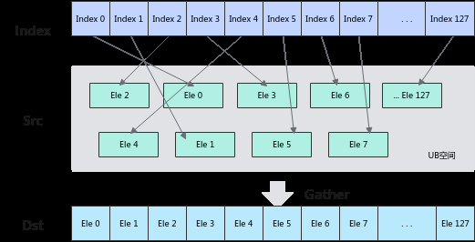
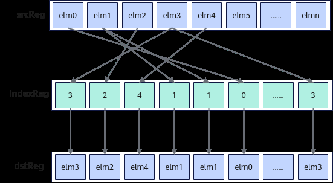

# Gather

> **Section**: 6.2.3.4.12.1  
> **PDF Pages**: 1685–1690  

---

<!-- page 1685 -->

```cpp
}}
```

●示例二template<typename T>__simd_vf__ inline void DuplicateVF(__ubuf__ T* dstAddr, T scalarValue, uint32_t count, uint32_t oneRepeatSize, uint16_t repeatTimes){    AscendC::Reg::RegTensor<T> dstReg;    AscendC::Reg::MaskReg mask;        for (uint16_t i = 0; i < repeatTimes; i++) {        mask = AscendC::Reg::UpdateMask<T>(count);        AscendC::Reg::LoadAlign(srcReg, src0Addr + i * oneRepeatSize);        AscendC::Reg::Duplicate(dstReg, scalarValue, mask);        AscendC::Reg::StoreAlign(dstAddr + i * oneRepeatSize, dstReg, mask);    }}

●示例三template<typename T>__simd_vf__ inline void DuplicateVF(__ubuf__ T* dstAddr, __ubuf__ T* srcAddr, uint32_t count, uint32_t oneRepeatSize, uint16_t repeatTimes){    AscendC::Reg::RegTensor<T> srcReg;    AscendC::Reg::RegTensor<T> dstReg;    AscendC::Reg::MaskReg mask;    for (uint16_t i = 0; i < repeatTimes; i++) {        mask = AscendC::Reg::UpdateMask<T>(count);        AscendC::Reg::LoadAlign(srcReg, src0Addr + i * oneRepeatSize);        AscendC::Reg::Duplicate(dstReg, srcReg, mask);        AscendC::Reg::StoreAlign(dstAddr + i * oneRepeatSize, dstReg, mask);    }}

## 6.2.3.4.12 离散与聚合

## 6.2.3.4.12.1 Gather

产品支持情况

产品是否支持

Atlas 350 加速卡√

Atlas A3 训练系列产品/Atlas A3 推理系列产品x

Atlas A2 训练系列产品/Atlas A2 推理系列产品x

Atlas 200I/500 A2 推理产品x

Atlas 推理系列产品AI Corex

Atlas 推理系列产品Vector Corex

Atlas 训练系列产品x

功能说明

●收集UB中的元素

给定源操作数在UB中的基地址和索引，Gather指令根据索引位置将源操作数按元素收集到结果寄存器张量中。收集过程如下图所示：

<!-- page 1686 -->



●收集RegTensor中的元素

根据索引位置indexReg将源操作数srcReg按元素收集到结果dstReg中。收集过程如下图所示：



定义原型

●收集UB中的元素template <typename T0 = DefaultType, typename T1, typename T2 = DefaultType, typename T3, typename T4>__simd_callee__ inline void Gather(T3& dstReg, __ubuf__ T1* baseAddr, T4& index, MaskReg& mask)

●收集RegTensor中的元素template <typename T = DefaultType, typename U = DefaultType, typename S, typename V>__simd_callee__ inline void Gather(S& dstReg, S& srcReg, V& indexReg)

参数说明

●收集UB中的元素

<!-- page 1687 -->

表6-610模板参数说明

参数名描述

T0目的操作数的数据类型。

T1源操作数的数据类型。

T2索引值的数据类型。

T3目的操作数的RegTensor类型，例如RegTensor<half>，由编译器自动推导，用户不需要填写。

T4索引值的RegTensor类型，例如RegTensor<uint16_t>，由编译器自动推导，用户不需要填写。

表6-611函数参数说明

参数名输入/输出

描述

dstReg输出目的操作数。

类型为RegTensor。

T0数据类型需要与T1和T2数据类型配套使用。类型配套对应表详见约束说明。

支持的数据类型详见表6-614。

baseAddr输入源操作数在UB中的基地址。

类型为UB指针。

T1数据类型需要与T0和T2数据类型配套使用。类型配套对应表详见约束说明。

支持的数据类型详见表6-614。

index输入dstReg中的每个元素在UB中相对于baseAddr的索引位置。地址偏移量要大于等于0。

类型为RegTensor。

T2数据类型需要与T0和T1数据类型配套使用。类型配套对应表详见约束说明。

支持的数据类型详见表6-614。

mask输入src element操作有效指示，详细说明请参考MaskReg。

●收集RegTensor中的元素

<!-- page 1688 -->

表6-612模板参数说明

参数名描述

T目的操作数和源操作数的数据类型。

Atlas 350 加速卡，支持的数据类型为：b8/b16/b32

U索引值的数据类型。

Atlas 350 加速卡，支持的数据类型为：uint8_t/uint16_t/uint32_t

S目的操作数的RegTensor类型，例如RegTensor<half>，由编译器自动推导，用户不需要填写。

V索引值的RegTensor类型，例如RegTensor<uint16_t>，由编译器自动推导，用户不需要填写。

表6-613函数参数说明

参数名输入/输出

描述

dstReg输出目的操作数。

类型为RegTensor。

srcReg输入源操作数。

类型为RegTensor。

数据类型需要与目的操作数保持一致。

indexReg输入数据索引。

类型为RegTensor。

数据类型的位宽需要与目的操作数的位宽保持一致。

srcReg为RegTensor类型，位宽是固定的VL，存储的元素个数固定。如果indexReg中索引值超出当前RegTensor中能存储的最大数据元素个数时，按照如下方式处理：设定当前RegTensor所能存储的最大数据元素个数为vlLength，indexReg中索引值为i，索引值更新为i % vlLength。

约束说明

●收集UB中的元素

–T0，T1和T2数据类型需要配套使用。配套关系如下表：

表6-614 Gather 操作数数据类型对应表

**T0数据类型T1数据类型T2数据类型**

int16_tint8_tuint16_t

<!-- page 1689 -->

**T0数据类型T1数据类型T2数据类型**

uint16_tuint8_t

int16_tint16_t

uint16_tuint16_t

halfhalf

bfloat16_tbfloat16_t

int32_tint32_tuint32_t

uint32_tuint32_t

floatfloat

uint64_tuint64_tuint32_t

int64_tint64_t

uint64_tuint64_tuint64_t

int64_tint64_t

–当T1为B8数据类型时，T0为B16类型，这种情况下目的操作数的低8位与源操作数相同，高8位自动补0。例如T1为int8数据类型：

40=0b00101000 -> 0b0000000000101000，扩充至16位后等于40；

-40=0b11011000 -> 0b0000000011011000，扩充至16位后等于216。

–当T1为B64数据类型时，T0，T1，T2，T4, T3数据类型只支持以下组合:

**T0数据类型**

**T1数据类型**

**T2数据类型**

**T4数据类型T3数据类型备注**

B64B64uint32_t

RegTensor<uint32_t>

RegTensor<uint64_t,RegTraitNumOne>

index的前32个数有效

RegTensor<int64_t,RegTraitNumOne>

RegTensor<uint64_t,RegTraitNumTwo>

-

RegTensor<int64_t,RegTraitNumTwo>

B64B64uint64_t

RegTensor<uint64_t,RegTraitNumOne>

RegTensor<uint64_t,RegTraitNumOne>

-

RegTensor<int64_t,RegTraitNumOne>

<!-- page 1690 -->

**T1数据类型**

**T2数据类型**

**T4数据类型T3数据类型备注**

**T0数据类型**

RegTensor<uint64_t,RegTraitNumOne>

RegTensor<uint64_t,RegTraitNumTwo>

index的前32个数有效

RegTensor<int64_t,RegTraitNumOne>

RegTensor<uint64_t,RegTraitNumTwo>

-

RegTensor<int64_t,RegTraitNumTwo>

●收集RegTensor中的元素

无约束

调用示例

●收集UB中的元素template <typename T, typename U>__simd_vf__ inline void GatherVF(__ubuf__ T* dstAddr, __ubuf__ T* src0Addr, __ubuf__ U* src1Addr, uint32_t count, uint32_t oneRepeatSize, uint16_t repeatTimes){    AscendC::Reg::RegTensor<U> srcReg;    AscendC::Reg::RegTensor<T> dstReg;    AscendC::Reg::MaskReg mask;        for (uint16_t i = 0; i < repeatTimes; i++) {        mask = AscendC::Reg::UpdateMask<T>(count);        AscendC::Reg::LoadAlign(srcReg, src1Addr + i * oneRepeatSize);        AscendC::Reg::Gather(dstReg, src0Addr, srcReg, mask);        AscendC::Reg::StoreAlign(dstAddr + i * oneRepeatSize, dstReg, mask);    }}

●收集RegTensor中的元素template <typename T, typename U>__simd_vf__ inline void GatherVF(__ubuf__ T* dstAddr, __ubuf__ T* src0Addr, __ubuf__ U* src1Addr, uint32_t count, uint32_t oneRepeatSize, uint16_t repeatTimes){    AscendC::Reg::RegTensor<T> srcReg0, dstReg;    AscendC::Reg::RegTensor<U> srcReg1;    AscendC::Reg::MaskReg mask;    AscendC::Reg::LoadAlign(srcReg1, src1Addr);    for (uint16_t i = 0; i < repeatTimes; i++) {        mask = AscendC::Reg::UpdateMask<T>(count);        AscendC::Reg::LoadAlign(srcReg0, src0Addr + i * oneRepeatSize);        AscendC::Reg::Gather(dstReg, srcReg0, srcReg1);        AscendC::Reg::StoreAlign(dstAddr + i * oneRepeatSize, dstReg, mask);    }}
