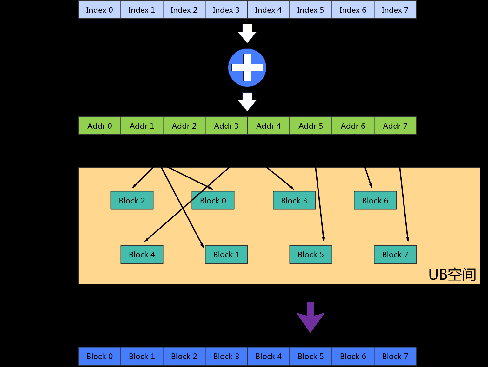

# GatherB

> **Section**: 6.2.3.4.12.3  
> **PDF Pages**: 1693–1695  

---

<!-- page 1693 -->

```cpp
AscendC::Reg::RegTensor<U> srcReg1;
    AscendC::Reg::MaskReg mask;
    AscendC::Reg::LoadAlign(srcReg1, src1Addr);
    for (uint16_t i = 0;
 i < repeatTimes;
 i++) {        mask = AscendC::Reg::UpdateMask<T>(count);
        AscendC::Reg::LoadAlign(srcReg0, src0Addr + i * oneRepeatSize);
        AscendC::Reg::Gather(dstReg, srcReg0, srcReg1);
        AscendC::Reg::StoreAlign(dstAddr + i * oneRepeatSize, dstReg, mask);    }}
```

## 6.2.3.4.12.3 GatherB

产品支持情况

产品是否支持

Atlas 350 加速卡√

Atlas A3 训练系列产品/Atlas A3 推理系列产品x

Atlas A2 训练系列产品/Atlas A2 推理系列产品x

Atlas 200I/500 A2 推理产品x

Atlas 推理系列产品AI Corex

Atlas 推理系列产品Vector Corex

Atlas 训练系列产品x

功能说明

给定源操作数在UB中的基地址和索引，GatherB指令根据索引位置将源操作数按DataBlock收集到结果寄存器张量中。每个DataBlock长度为32Byte。收集过程如下图所示：

<!-- page 1694 -->



定义原型

```cpp
template <typename T = DefaultType, typename U, typename S>__simd_callee__ inline void GatherB(U& dstReg, __ubuf__ T* baseAddr, S& index, MaskReg& mask)
```

参数说明

表6-617模板参数说明

参数名描述

T目的操作数和源操作数的数据类型

U目的操作数的RegTensor类型，例如RegTensor<half>，由编译器自动推导，用户不需要填写

S索引值的RegTensor类型，例如RegTensor<uint32_t>，由编译器自动推导，用户不需要填写

<!-- page 1695 -->

表6-618函数参数说明

参数名输入/输出

描述

dstReg输出目的操作数。

类型为RegTensor

Atlas 350 加速卡，dstReg/baseAddr支持的数据类型为：uint8_t/int8_t/uint16_t/int16_t/uint32_t/int32_t/half/float/bfloat16_t/uint64_t/int64_t

baseAddr输入源操作数在UB中的基地址。需要32B对齐。

类型为UB指针。

Atlas 350 加速卡，支持的数据类型为：uint8_t/int8_t/uint16_t/int16_t/uint32_t/int32_t/half/float/bfloat16_t/uint64_t/int64_t

index输入dstReg中的每个DataBlock在UB中相对于baseAddr的索引位置。索引位置要大于等于0且32B对齐。

类型为RegTensor

Atlas 350 加速卡，支持的数据类型为：uint32_t

mask输入src element操作有效指示，详细说明请参考 MaskReg

约束说明

●目的操作数与源操作数的数据类型相同。

●源操作数在UB中的基地址需要32B对齐。

●索引位置要大于等于0且32B对齐。

●索引寄存器中可以存在相同的值，即可以多次读取源操作数中同一个DataBlock的数据。

调用示例

```cpp
template<typename T, typename U>__simd_vf__ inline void GatherBVF(__ubuf__ T* dstAddr, __ubuf__ T* src0Addr, __ubuf__ U* src1Addr, uint32_t count, uint32_t oneRepeatSize, uint16_t repeatTimes){    AscendC::Reg::RegTensor<U> srcReg;
    AscendC::Reg::RegTensor<T> dstReg;
    AscendC::Reg::MaskReg mask;
        for (uint16_t i = 0;
 i < repeatTimes;
 i++) {        mask = AscendC::Reg::UpdateMask<T>(count);
        AscendC::Reg::LoadAlign(srcReg, src1Addr + i * oneRepeatSize);
        AscendC::Reg::GatherB(dstReg, src0Addr, srcReg, mask);
        AscendC::Reg::StoreAlign(dstAddr + i * oneRepeatSize, dstReg, mask);    }}
```
