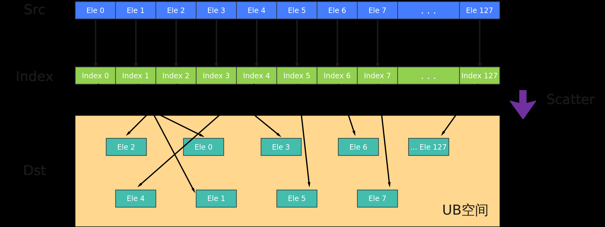

# Scatter

> **Section**: 6.2.3.4.12.4  
> **PDF Pages**: 1696–1698  

---

<!-- page 1696 -->

## 6.2.3.4.12.4 Scatter

产品支持情况

产品是否支持

Atlas 350 加速卡√

Atlas A3 训练系列产品/Atlas A3 推理系列产品x

Atlas A2 训练系列产品/Atlas A2 推理系列产品x

Atlas 200I/500 A2 推理产品x

Atlas 推理系列产品AI Corex

Atlas 推理系列产品Vector Corex

Atlas 训练系列产品x

功能说明

给定源操作数的寄存器张量和索引张量，以及结果操作数在UB中的基地址，Scatter指令将源操作数按元素根据索引位置分散到UB中。分散过程如下图所示：



定义原型

```cpp
template <typename T = DefaultType, typename U = DefaultType, typename S, typename V>__simd_callee__ inline void Scatter(__ubuf__ T* baseAddr, S& srcReg, V& index, MaskReg& mask)
```

参数说明

表6-619模板参数说明

参数名描述

T目的操作数和源操作数的数据类型。

U索引的数据类型。

<!-- page 1697 -->

参数名描述

S源操作数的RegTensor类型，例如RegTensor<half>，由编译器自动推导，用户不需要填写。

V索引值的RegTensor类型，例如RegTensor<uint16_t>，由编译器自动推导，用户不需要填写。

表6-620函数参数说明

参数名输入/输出

描述

baseAddr输出目的操作数在UB中的基地址。

类型为UB指针。

Atlas 350 加速卡，支持的数据类型详见表6-621。

srcReg输入源操作数。

类型为RegTensor。

Atlas 350 加速卡，支持的数据类型详见表6-621。

index输入srcReg中的每个元素在UB中相对于baseAddr的索引位置。索引值要大于等于0。

类型为RegTensor。

IndexT数据类型需要与目的操作数和源操作数的数据类型T配套使用。类型配套对应表详见约束说明。

Atlas 350 加速卡，支持的数据类型详见表6-621。

mask输入src element操作有效指示，详细说明请参考 MaskReg。

约束说明

●目的操作数和源操作数的数据类型T和U数据类型需要配套使用。类型配套对应表如下：

表6-621 Scatter 操作数数据类型对应表

**T数据类型U数据类型**

int8_tuint16_t

uint8_t

int16_t

uint16_t

half

<!-- page 1698 -->

**T数据类型U数据类型**

bfloat16_t

int32_tuint32_t

uint32_t

float

uint64_tuint32_t

int64_t

uint64_tuint64_t

int64_t

●当T为b64数据类型时，T，U，V数据类型只支持以下组合：

**IndexT数据类型**

**RegT数据类型RegIndexT数据类型备注**

**T数据类型**

b64uint32_t

RegTensor<uint64_t,RegTraitNumOne>

RegTensor<uint32_t>index前32个数有效RegTensor<int64_t,RegTraitNumOne>

RegTensor<uint64_t,RegTraitNumTwo>

RegTensor<uint32_t>-

RegTensor<int64_t,RegTraitNumTwo>

b64uint64_t

RegTensor<uint64_t,RegTraitNumOne>

RegTensor<uint64_t,RegTraitNumOne>

-

RegTensor<int64_t,RegTraitNumOne>

RegTensor<uint64_t,RegTraitNumOne>

RegTensor<uint64_t,RegTraitNumTwo>

index前32个数有效RegTensor<int64_t,RegTraitNumOne>

RegTensor<uint64_t,RegTraitNumTwo>

RegTensor<uint64_t,RegTraitNumTwo>

-

RegTensor<int64_t,RegTraitNumTwo>

●当T为int8或者uint8数据类型时，源操作数Tensor中仅偶数位Byte有效。最终存入UB结果地址的数据仅为源操作数Tensor偶数位Byte，即srcReg中的第0，2，4，...， 252，254位置数据会被分散存储到目的操作数中。
