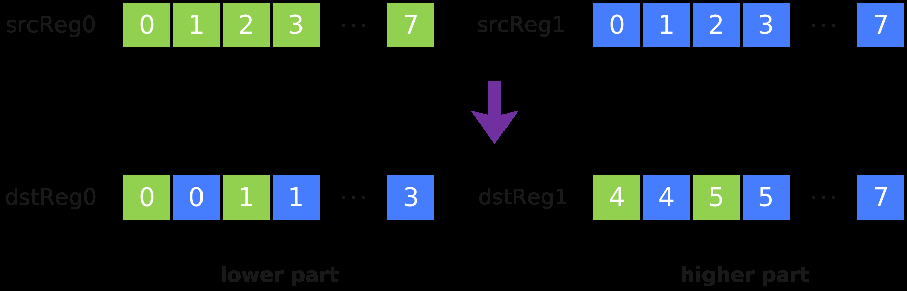

# Interleave

> **Section**: 6.2.3.4.13.1  
> **PDF Pages**: 1699–1700  

---

<!-- page 1699 -->

●index中不能有相同的值。若有2个或者2个以上的index中的数据相同，则只有其中一个值对应的数据是有效的，具体哪一个数据可能是未知的。

●索引位置需要按照dtype_size（单个元素的Byte数）对齐，否则可能会造成数据分散结果错乱。

调用示例

```cpp
template<typename T, typename U> __simd_vf__ inline void ScatterVF(__ubuf__ T* dstAddr, __ubuf__ T* src0Addr, __ubuf__ U* src1Addr, uint32_t count, uint32_t oneRepeatSize, uint16_t repeatTimes){    AscendC::Reg::RegTensor<T> srcReg0;
    AscendC::Reg::RegTensor<U> srcReg1;
    AscendC::Reg::MaskReg mask;
    for (uint16_t i = 0;
 i < repeatTimes;
 i++) {        mask = AscendC::Reg::UpdateMask<T>(count);
        AscendC::Reg::LoadAlign(srcReg0, src0Addr + i * oneRepeatSize);
        AscendC::Reg::LoadAlign(srcReg1, src1Addr + i * oneRepeatSize);
        AscendC::Reg::Scatter(dstAddr, srcReg0, srcReg1, mask);    }}
```

## 6.2.3.4.13 数据重排

## 6.2.3.4.13.1 Interleave

产品支持情况

产品是否支持

Atlas 350 加速卡√

Atlas A3 训练系列产品/Atlas A3 推理系列产品x

Atlas A2 训练系列产品/Atlas A2 推理系列产品x

Atlas 200I/500 A2 推理产品x

Atlas 推理系列产品AI Corex

Atlas 推理系列产品Vector Corex

Atlas 训练系列产品x

功能说明

给定源操作数寄存器张量srcReg0和srcReg1，将srcReg0和srcReg1中的元素交织存入结果操作数dstReg0和dstReg1中。交织排列方式如下图所示，其中每个方格代表一个元素：

<!-- page 1700 -->



定义原型

```cpp
template <typename T = DefaultType, typename U>__simd_callee__ inline void Interleave(U& dstReg0, U& dstReg1, U& srcReg0, U& srcReg1)
```

参数说明

表6-622模板参数说明

参数名描述

T目的操作数和源的数据类型。

Atlas 350 加速卡，支持的数据类型为：bool/uint8_t/int8_t/uint16_t/int16_t/uint32_t/int32_t/uint64_t/int64_t/half/float/bfloat16_t

U源操作数和目的操作数的RegTensor类型，例如RegTensor<half>，由编译器自动推导，用户不需要填写。

表6-623函数参数说明

参数名输入/输出

描述

dstReg0、dstReg1

输出目的操作数。

类型为RegTensor。

srcReg0、srcReg1

输入源操作数。

类型为RegTensor。

源操作数的数据类型需要与目的操作数保持一致。

约束说明

●srcReg0，srcReg1，dstReg0，dstReg1的数据类型需要保持一致。

●srcReg0和srcReg1可以为同一个RegTensor。

●dstReg0和dstReg1不能为同一个RegTensor。

●允许源操作数和目的操作数为同一个RegTensor，例如Interleave(srcReg0,srcReg1, srcReg0, srcReg1)。
