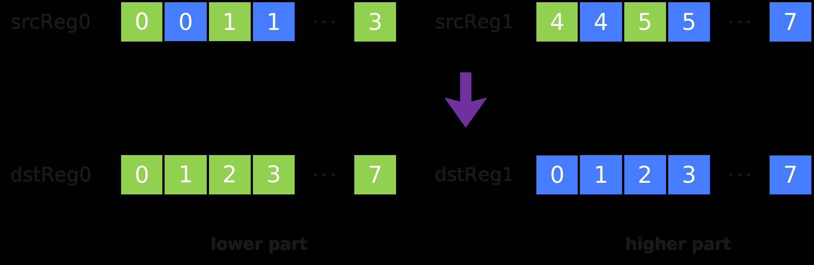

# DeInterleave

> **Section**: 6.2.3.4.13.2  
> **PDF Pages**: 1701–1702  

---

<!-- page 1701 -->

●b64数据类型下仅支持RegTraitNumTwo。

调用示例

```cpp
template<typename T>__simd_vf__ inline void InterleaveVF(__ubuf__ T* dst0Addr, __ubuf__ T* dst1Addr, __ubuf__ T* src0Addr, __ubuf__ T* src1Addr, uint32_t oneRepeatSize, uint16_t repeatTimes){    AscendC::Reg::RegTensor<T> srcReg0;
    AscendC::Reg::RegTensor<T> srcReg1;
    AscendC::Reg::RegTensor<T> dstReg0;
    AscendC::Reg::RegTensor<T> dstReg1;
    AscendC::Reg::MaskReg mask = AscendC::Reg::CreateMask<T, AscendC::Reg::MaskPattern::ALL>();
                   for (uint16_t i = 0;
 i < repeatTimes;
 i++) {        AscendC::Reg::LoadAlign(srcReg0, src0Addr + i * oneRepeatSize);
        AscendC::Reg::LoadAlign(srcReg1, src1Addr + i * oneRepeatSize);
        AscendC::Reg::Interleave(dstReg0, dstReg1, srcReg0, srcReg1);
        AscendC::Reg::StoreAlign(dst0Addr + i * oneRepeatSize, dstReg0, mask);
        AscendC::Reg::StoreAlign(dst1Addr + i * oneRepeatSize, dstReg1, mask);    }}
```

## 6.2.3.4.13.2 DeInterleave

产品支持情况

产品是否支持

Atlas 350 加速卡√

Atlas A3 训练系列产品/Atlas A3 推理系列产品x

Atlas A2 训练系列产品/Atlas A2 推理系列产品x

Atlas 200I/500 A2 推理产品x

Atlas 推理系列产品AI Corex

Atlas 推理系列产品Vector Corex

Atlas 训练系列产品x

功能说明

给定源操作数寄存器张量srcReg0和srcReg1，将srcReg0和srcReg1中的元素解交织存入结果操作数dstReg0和dstReg1中。解交织排列方式如下图所示，其中每个方格代表一个元素：



<!-- page 1702 -->

定义原型

```cpp
template <typename T = DefaultType, typename U>__simd_callee__ inline void DeInterleave(U& dstReg0, U& dstReg1, U& srcReg0, U& srcReg1)
```

参数说明

表6-624模板参数说明

参数名描述

T目的操作数和源的数据类型。

Atlas 350 加速卡，支持的数据类型为：bool/uint8_t/int8_t/uint16_t/int16_t/uint32_t/int32_t/uint64_t/int64_t/half/float/bfloat16_t

U源操作数和目的操作数的RegTensor类型，例如RegTensor<half>，由编译器自动推导，用户不需要填写。

表6-625函数参数说明

参数名输入/输出

描述

dstReg0、dstReg1

输出目的操作数。

类型为RegTensor。

srcReg0、srcReg1

输入源操作数。

类型为RegTensor。

源操作数的数据类型需要与目的操作数保持一致。

约束说明

●b64数据类型下仅支持RegTraitNumTwo。

调用示例

```cpp
template<typename T>__simd_vf__ inline void DeInterLeaveVF(__ubuf__ T* dst0Addr, __ubuf__ T* dst1Addr, __ubuf__ T* src0Addr, __ubuf__ T* src1Addr, uint32_t oneRepeatSize, uint16_t repeatTimes){    AscendC::Reg::RegTensor<T> srcReg0;
    AscendC::Reg::RegTensor<T> srcReg1;
    AscendC::Reg::RegTensor<T> dstReg0;
    AscendC::Reg::RegTensor<T> dstReg1;
    AscendC::Reg::MaskReg mask = AscendC::Reg::CreateMask<T, AscendC::Reg::MaskPattern::ALL>();
    for (uint16_t i = 0;
 i < repeatTimes;
 i++) {        AscendC::Reg::LoadAlign(srcReg0, src0Addr + i * oneRepeatSize);
        AscendC::Reg::LoadAlign(srcReg1, src1Addr + i * oneRepeatSize);
        AscendC::Reg::DeInterleave(dstReg0, dstReg1, srcReg0, srcReg1);
        AscendC::Reg::StoreAlign(dst0Addr + i * oneRepeatSize, dstReg0, mask);
        AscendC::Reg::StoreAlign(dst1Addr + i * oneRepeatSize, dstReg1, mask);    }}
```
