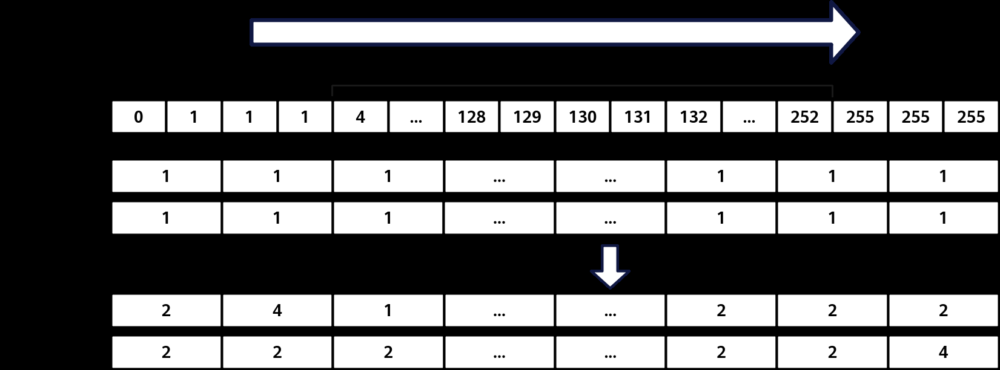
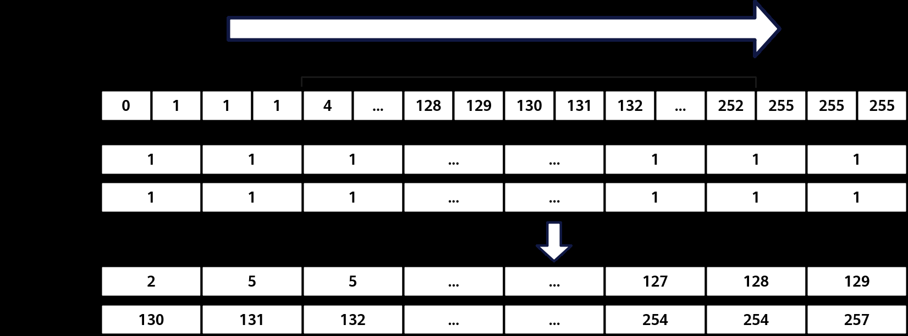

# Histograms

> **Section**: 6.2.3.4.15.1  
> **PDF Pages**: 1708–1710  

---

<!-- page 1708 -->

表6-633源操作数和目的操作数的数据类型对应表

**T数据类型U数据类型**

int16_tint8_t

uint16_tuint8_t

int32_tint16_t

uint32_tuint16_t

uint64_tuint32_t

int64_tint32_t

返回值说明

无

约束说明

无

调用示例

```cpp
template<typename T, typename U, int32_t mode>__simd_vf__ inline void UnPackVF(__ubuf__ T* dstAddr, __ubuf__ U* srcAddr, uint32_t oneDstRepSize, uint16_t repeatTimes, uint32_t oneSrcRepSize){    AscendC::Reg::RegTensor<U> srcReg;
    AscendC::Reg::RegTensor<T> dstReg;
    AscendC::Reg::MaskReg mask = AscendC::Reg::CreateMask<T, AscendC::Reg::MaskPattern::ALL>();
    for (uint16_t i = 0;
 i < repeatTimes;
 i++) {        AscendC::Reg::LoadAlign(srcReg, srcAddr + i * oneSrcRepSize);
        if constexpr (mode == 0) {            AscendC::Reg::UnPack<T, U, AscendC::Reg::HighLowPart::LOWEST>(dstReg, srcReg);        } else if constexpr (mode == 1) {            AscendC::Reg::UnPack<T, U, AscendC::Reg::HighLowPart::HIGHEST>(dstReg, srcReg);        }        AscendC::Reg::StoreAlign(dstAddr + i * oneDstRepSize, dstReg, mask);    }}
```

## 6.2.3.4.15 直方图计算

## 6.2.3.4.15.1 Histograms

产品支持情况

产品是否支持

Atlas 350 加速卡√

Atlas A3 训练系列产品/Atlas A3 推理系列产品x

Atlas A2 训练系列产品/Atlas A2 推理系列产品x

<!-- page 1709 -->

产品是否支持

Atlas 200I/500 A2 推理产品x

Atlas 推理系列产品AI Corex

Atlas 推理系列产品Vector Corex

Atlas 训练系列产品x

功能说明

对直方图数据进行统计，在目的操作数dstReg的基础数据上加上源操作数srcReg数据的统计结果，包括数据的频率统计和累计统计。

●频率统计如下图所示，在低位模式下，dstReg（即 dst0）用于统计srcReg中[0-127]范围内（前半部分）各个值的出现频率；而在高位模式下，dstReg（即dst1）则统计[128-255]范围内（后半部分）的频率。dst0和dst1中的第n位（bit）表示srcReg中数值n的出现次数，并在原始dstReg数据的基础上进行累加。

图6-48频率统计



●累计统计如下图所示，在低位模式下，目的寄存器dstReg（即dst0）会统计源寄存器srcReg中值落在低位区间[0-127]的数据分布情况；在高位模式下，目的寄存器dstReg（即dst1）则会统计srcReg中值落在高位区间[128-255]的数据分布情况。在dst0 和dst1中，第n位的数据表示srcReg中从0到n的所有数值在对应区间中出现的总频率。最终，统计结果会在目的寄存器原始数据的基础上进行累加。

图6-49累计统计



<!-- page 1710 -->

函数原型

```cpp
template <typename T = DefaultType, typename U = DefaultType, HistogramsBinType mode, HistogramsType type, typename S, typename V>__simd_callee__ inline void Histograms(V& dstReg, S& srcReg, MaskReg& mask)
```

参数说明

表6-634模板参数说明

参数名描述

T源操作数的数据类型。

Atlas 350 加速卡，支持的数据类型为：uint8_t

U目的操作数的数据类型。

Atlas 350 加速卡，支持的数据类型为：uint16_t

modeHistogramsBinType枚举类型，用于控制统计src的低位区间[0-127]（前半部分）或高位区间[128-255]（后半部分）的数据。VL长度为256Byte，dst数据类型为uint16_t，一个dst可以存储128个数据，因此需要两个dst。

●BIN0表示低位模式，统计src中[0-127]范围内的数据写入dst0。

●BIN1表示高位模式，统计src中[128-255]范围内的数据写入dst1。

typeHistogramsType 枚举类型，表示统计模式。

●FREQUENCY：频率统计模式，统计src中[0, 255]每个数的数量。每个dst有128个元素，其中dst0中每个元素对应src中[0, 127]每个元素的累加个数，dst1中每个元素对应src中[128,255]每个元素的累加个数。

●ACCUMULATE：累计统计模式，统计src中x<=0、x<=1、x<=2、x<=3......x<=254、x<=255每个区间的元素个数。每个dst有128个元素，其中dst0中每个元素对应src中[0, 127]每个元素区间累加个数，dst1中每个元素对应src中[128，255]每个元素区间累加个数。

S目的操作数RegTensor类型，由编译器自动推导，用户不需要填写。

V源操作数RegTensor类型，由编译器自动推导，用户不需要填写。

表6-635参数说明

参数名输入/输出

描述

dstReg输出目的操作数。

类型为RegTensor。

srcReg输入源操作数。

类型为RegTensor。
