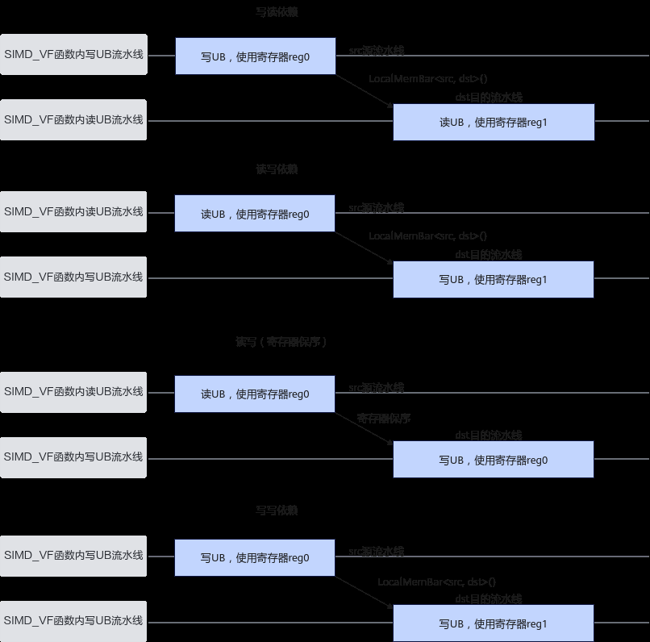

# LocalMemBar

> **Section**: 6.2.3.4.17.1  
> **PDF Pages**: 1713–1715  

---

<!-- page 1713 -->

```cpp
for (uint16_t i = 0;
 i < repeatTimes;
 i++) {        AscendC::Reg::Arange(dstReg, scalarValue);
        AscendC::Reg::StoreAlign(dstAddr + i * oneRepeatSize, dstReg, mask);    }}
```

## 6.2.3.4.17 同步控制

## 6.2.3.4.17.1 LocalMemBar

产品支持情况

产品是否支持

Atlas 350 加速卡√

Atlas A3 训练系列产品/Atlas A3 推理系列产品x

Atlas A2 训练系列产品/Atlas A2 推理系列产品x

Atlas 200I/500 A2 推理产品x

Atlas 推理系列产品AI Corex

Atlas 推理系列产品Vector Corex

Atlas 训练系列产品x

功能说明

Reg矢量计算宏函数内不同流水线之间的同步指令。该同步指令指定src源流水线和dst目的流水线，如下图所示，目的流水线将等待源流水线上所有指令完成才进行执行。读写场景下，当读指令使用的寄存器和写指令使用的寄存器相同时，可以触发寄存器保序，指令将会按照代码顺序执行，不需要插入同步指令，而当使用的寄存器不同时，如果要确保读写指令顺序执行，则需要插入同步指令，写写场景同理。

<!-- page 1714 -->

图6-50流水线等待示意图



函数原型

```cpp
template <MemType src, MemType dst> __simd_callee__ inline void LocalMemBar()
```

参数说明

表6-638模板参数说明

参数名描述

src源流水线，类型为MemType，具体参见表2 MemType取值说明。

dst目的流水线，类型为MemType，具体参见表2 MemType取值说明。

<!-- page 1715 -->

表6-639 MemType 取值说明

**MemType取值**

含义

VEC_STORESIMD_VF函数内矢量写UB流水线。

对应寄存器到UB的搬运指令，如StoreAlign、StoreUnAlign、Store。

VEC_LOADSIMD_VF函数内矢量读UB流水线。

对应UB到寄存器的搬运指令，如LoadAlign、LoadUnAlign、Load。

SCALAR_STORE

SIMD_VF函数内标量写UB流水线。

对应标量写入UB的指令，如Duplicate。

SCALAR_LOAD

SIMD_VF函数内标量读UB流水线。

对应UB读取标量的指令，如GetValue。

VEC_ALLSIMD_VF函数内所有矢量读写UB流水线。

SCALAR_ALLSIMD_VF函数内所有标量读写UB流水线。

表6-640 src 和dst 组合取值说明

**srcdst**

VEC_STOREVEC_LOAD

VEC_LOADVEC_STORE

VEC_STOREVEC_STORE

VEC_STORESCALAR_LOAD

VEC_STORESCALAR_STORE

VEC_LOADSCALAR_STORE

SCALAR_STOREVEC_LOAD

SCALAR_STOREVEC_STORE

SCALAR_LOADVEC_STORE

VEC_ALLVEC_ALL

VEC_ALLSCALAR_ALL

SCALAR_ALLVEC_ALL

返回值说明

无
