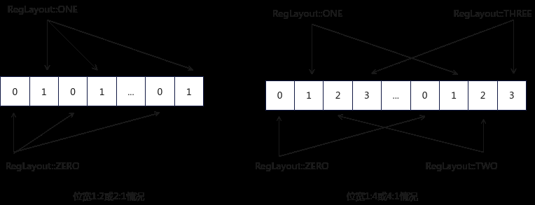

# PostLiteral

> **Section**: 6.2.3.4.19.1  
> **PDF Pages**: 1719–1719  

---

<!-- page 1719 -->

## 6.2.3.4.19.1 PostLiteral

enum class PostLiteral {    POST_MODE_NORMAL, // 正常场景，UB操作数地址不更新。LoadUnAlign针对连续非对齐搬入不支持POST_MODE_NORMAL模式。    POST_MODE_UPDATE  // POST_MODE_UPDATE场景使用，UB地址同时作为输入和输出，每次调用会更新。};

## 6.2.3.4.19.2 RegLayout

源操作数与目的操作数类型位宽不同时，可以分为两种情况：

1.源操作数与目的操作数位宽比为1:2或2:1。

2.源操作数与目的操作数位宽比为1:4或4:1。

该数据结构是为了在两种情况中决定读或写的位置，在情景1下，可以将一个256B大小的RegTensor分为两部分，对于每一字节，其索引为下标i%2；在情景2下，可以将一个256B大小的RegTensor分为四部分，对于每一字节，其索引为下标i%4。RegLayout的取值如下：

●RegLayout::ZERO，写入索引0的位置

●RegLayout::ONE，写入索引1的位置

●RegLayout::TWO，写入索引2的位置

●RegLayout::THREE，写入索引3的位置

```cpp
enum class RegLayout {    UNKNOWN = -1,    ZERO,    ONE,    TWO,    THREE};
```



如图所示，RegLayout::ZERO/RegLayout::ONE这2种模式仅在位宽比值1:2或2:1的情况下可以使用，例如float32转int16, 位宽比为2比1。例如，对于位宽为2:1的数据类型转换，可以通过RegLayout选定写入数据的位置。当选择RegLayout::ZERO时，数据写入索引为0的位置，当选择RegLayout::ONE时，数据写入索引为1的位置。

RegLayout::ZERO/RegLayout::ONE/RegLayout::TWO/RegLayout::THREE这4种模式仅在位宽比值1比4或4比1的情况下可以使用，例如float32转int8,位宽比为4比1。例如，对于位宽为4:1的数据类型转换，当选择RegLayout::ZERO时，数据写入索引为0的位置；当选择RegLayout::ONE时，数据写入索引为1的位置；当选择RegLayout::TWO时，数据写入索引为2的位置；当选择RegLayout::THREE时，数据写入索引为3的位置。
